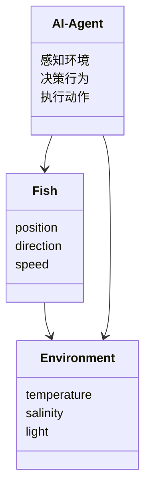
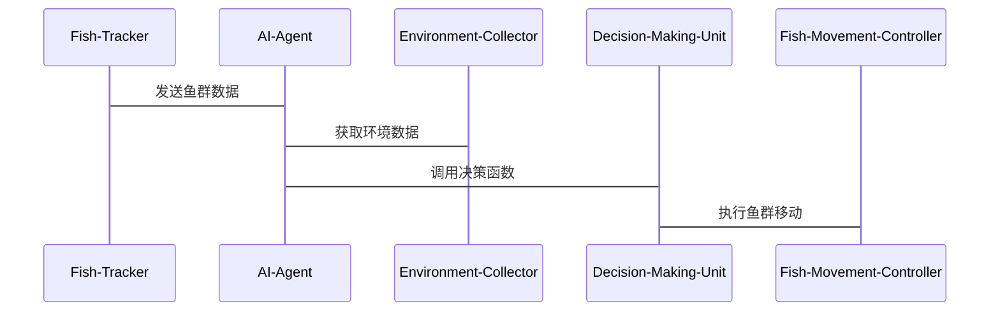

                 


# AI Agent在智能海洋生态系统模拟中的实践

> 关键词：AI Agent，智能海洋生态系统，机器学习，强化学习，知识图谱，系统架构设计，项目实战

> 摘要：本文探讨AI Agent在智能海洋生态系统中的应用，详细讲解AI Agent的核心原理、算法实现、系统架构设计、项目实战等内容，分析其在海洋生态监测、资源管理中的实际应用价值。

---

## 第1章: AI Agent与智能海洋生态系统概述

### 1.1 智能海洋生态系统背景介绍

#### 1.1.1 海洋生态系统的定义与结构

海洋生态系统是由海洋生物群落及其非生物环境组成的复杂系统，包括海洋生物（如鱼类、海洋哺乳动物、海洋植物等）和物理环境（如温度、盐度、光照等）。

#### 1.1.2 智能海洋生态系统的核心概念

智能海洋生态系统是指通过人工智能技术对海洋生态系统进行实时监测、预测和管理，以实现资源优化配置和生态平衡维护。

#### 1.1.3 AI Agent在海洋生态系统模拟中的作用

AI Agent能够模拟海洋生物的行为，分析环境变化，优化资源分配，帮助人类更好地理解并保护海洋生态系统。

### 1.2 AI Agent的基本概念与分类

#### 1.2.1 AI Agent的定义与特征

AI Agent是一种智能实体，能够感知环境、自主决策、执行任务并适应变化。其核心特征包括自主性、反应性、目标导向性和学习能力。

#### 1.2.2 基于AI Agent的分类

根据功能和应用场景的不同，AI Agent可以分为简单反射型、基于模型的反应型、目标驱动型和实用驱动型。

#### 1.2.3 AI Agent与传统AI的区别

AI Agent具有自主性和目标导向性，能够主动与环境交互，而传统AI通常是在特定任务下被动执行指令。

### 1.3 本章小结

---

## 第2章: AI Agent的核心原理与算法

### 2.1 AI Agent的决策机制

#### 2.1.1 基于强化学习的决策过程

强化学习是一种通过试错机制来优化决策策略的方法，AI Agent通过与环境交互，学习最优动作序列以最大化累积奖励。

#### 2.1.2 基于协作过滤的决策模型

协作过滤是一种基于用户行为相似性推荐决策的方法，AI Agent通过分析历史数据，预测未来行为。

#### 2.1.3 决策树与随机森林在AI Agent中的应用

决策树是一种基于规则的分类回归树，随机森林是多个决策树的集成方法，用于提高模型的泛化能力。

### 2.2 AI Agent的感知与学习能力

#### 2.2.1 多模态感知模型的构建

AI Agent需要整合多种传感器数据，如图像、声呐、温度等，构建多模态感知模型。

#### 2.2.2 知识图谱与语义理解

知识图谱是一种结构化的知识表示方法，AI Agent通过语义理解技术，构建海洋生态系统的知识网络。

#### 2.2.3 连续学习与自适应优化

连续学习使AI Agent能够在线更新模型参数，适应环境变化，保持高性能。

### 2.3 AI Agent的推理与规划能力

#### 2.3.1 基于逻辑推理的规划算法

逻辑推理是一种基于逻辑规则进行推理的方法，AI Agent通过逻辑推理生成合理的行为规划。

#### 2.3.2 基于概率推理的规划模型

概率推理是一种基于概率论进行推理的方法，AI Agent通过概率建模，预测未来可能的状态。

#### 2.3.3 分层规划与任务分解

分层规划是一种将复杂任务分解为子任务的规划方法，AI Agent通过层次化规划，提高任务执行效率。

### 2.4 本章小结

---

## 第3章: AI Agent的核心算法原理

### 3.1 强化学习算法

#### 3.1.1 Q-Learning算法的实现原理

Q-Learning是一种经典的强化学习算法，通过更新Q值表，学习最优策略。

#### 3.1.2 Deep Q-Networks（DQN）算法的流程图

DQN算法通过深度神经网络近似Q值函数，解决高维状态空间的强化学习问题。

#### 3.1.3 算法实现的Python代码示例

```python
import numpy as np
class QLAgent:
    def __init__(self, state_space, action_space):
        self.q_table = np.zeros((state_space, action_space))
    
    def choose_action(self, state, epsilon=0.1):
        if np.random.random() < epsilon:
            return np.random.randint(action_space)
        return np.argmax(self.q_table[state])
```

### 3.2 协作过滤算法

#### 3.2.1 协作过滤的基本原理

协作过滤通过寻找用户相似性，推荐用户感兴趣的内容。

#### 3.2.2 基于矩阵分解的推荐算法

矩阵分解是一种将用户-物品评分矩阵分解为用户特征和物品特征的方法，用于推荐系统。

#### 3.2.3 算法实现的Python代码示例

```python
from sklearn.decomposition import NMF
model = NMF(n_components=2)
```

### 3.3 知识图谱构建与推理算法

#### 3.3.1 知识图谱的构建流程

知识图谱的构建包括数据抽取、实体识别、关系抽取和知识融合等步骤。

#### 3.3.2 基于规则的推理算法

基于规则的推理算法通过预定义规则，进行逻辑推理。

#### 3.3.3 基于神经网络的推理模型

基于神经网络的推理模型通过深度学习技术，学习知识图谱中的语义关系。

### 3.4 本章小结

---

## 第4章: AI Agent在智能海洋生态系统中的应用

### 4.1 项目背景介绍

本项目旨在利用AI Agent技术，模拟海洋生态系统中鱼类的行为，优化捕捞策略。

### 4.2 系统功能设计

#### 4.2.1 领域模型设计



#### 4.2.2 系统架构设计


#### 4.2.3 系统接口设计

系统接口包括数据采集接口、决策控制接口和用户交互接口。

#### 4.2.4 交互流程设计



### 4.3 系统核心代码实现

#### 4.3.1 鱼群行为模拟代码

```python
import random

class Fish:
    def __init__(self, position):
        self.position = position
        self.direction = random.uniform(0, 2 * np.pi)
        self.speed = 1
    
    def move(self):
        self.position = (
            self.position[0] + np.cos(self.direction),
            self.position[1] + np.sin(self.direction)
        )
```

#### 4.3.2 环境感知代码

```python
import numpy as np

class Environment:
    def __init__(self, temperature, salinity, light):
        self.temperature = temperature
        self.salinity = salinity
        self.light = light
    
    def update(self, new_temperature, new_salinity, new_light):
        self.temperature = new_temperature
        self.salinity = new_salinity
        self.light = new_light
```

### 4.4 实际案例分析

以鱼群躲避捕食者为例，AI Agent通过强化学习，学习最优逃跑策略。

### 4.5 项目小结

---

## 第5章: 系统优化与未来展望

### 5.1 系统性能优化

通过多线程优化、分布式计算等技术，提升系统运行效率。

### 5.2 系统可扩展性设计

引入模块化设计，方便系统功能扩展和维护。

### 5.3 未来研究方向

探索更先进的AI技术，如生成式AI和大语言模型，提升AI Agent的智能水平。

### 5.4 小结

---

## 第6章: 最佳实践与注意事项

### 6.1 小结

总结文章的主要内容，强调AI Agent在智能海洋生态系统中的重要性。

### 6.2 注意事项

在实际应用中，需注意数据质量问题、模型泛化能力不足等问题。

### 6.3 拓展阅读

推荐阅读相关领域的最新研究，如强化学习在生态学中的应用。

---

## 作者信息

作者：AI天才研究院/AI Genius Institute & 禅与计算机程序设计艺术 /Zen And The Art of Computer Programming

