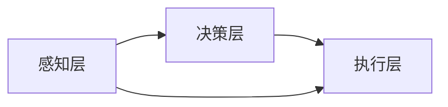
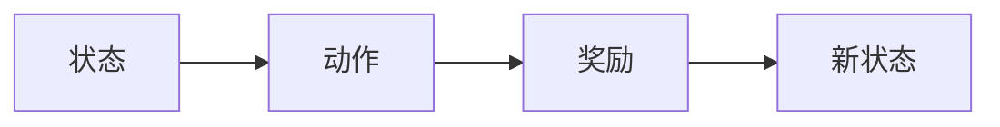
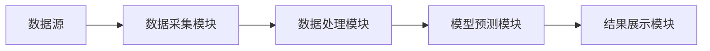
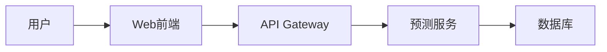
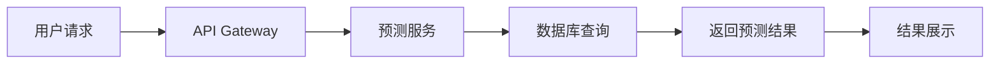

                 


# AI Agent在智能海洋生态系统预测中的实践

## 关键词：AI Agent, 智能海洋生态系统, 预测模型, 强化学习, 数据驱动

## 摘要：  
本文探讨了AI Agent在智能海洋生态系统预测中的应用，结合强化学习和数据驱动的方法，展示了如何利用AI技术解决复杂的海洋环境问题。通过详细分析AI Agent的核心概念、算法原理、系统架构设计以及实际项目案例，本文为读者提供了一个全面的技术视角，帮助他们理解如何在智能海洋生态系统中实践AI Agent技术。

---

# 第1章: AI Agent与智能海洋生态系统概述

## 1.1 AI Agent的基本概念与特点  
AI Agent（人工智能代理）是一种能够感知环境、自主决策并执行任务的智能实体。它具备以下特点：  
- **自主性**：能够在没有外部干预的情况下独立运行。  
- **反应性**：能够实时感知环境并做出反应。  
- **目标导向**：基于目标或任务驱动行为。  
- **学习能力**：能够通过经验改进自身的决策能力。  

AI Agent与传统AI的区别在于其具备更强的自主性和适应性，能够动态调整策略以应对复杂环境。

---

## 1.2 智能海洋生态系统的基本概念  
智能海洋生态系统是指通过智能化技术（如AI、物联网、大数据等）构建的海洋环境监测、资源管理与生态预测的综合系统。其核心特征包括：  
- **数据驱动**：依赖实时数据进行决策。  
- **动态预测**：能够预测海洋环境的变化趋势。  
- **多学科融合**：结合海洋科学、计算机科学和数据科学等领域的知识。  

与传统海洋生态系统相比，智能海洋生态系统更加注重技术的应用和数据的整合。

---

## 1.3 AI Agent在智能海洋生态系统中的作用  
AI Agent在智能海洋生态系统中扮演着重要角色，主要体现在以下几个方面：  
- **环境监测**：通过传感器和数据采集技术，实时感知海洋环境的变化。  
- **资源管理**：优化海洋资源的分配与利用，例如渔业资源管理。  
- **生态预测**：基于历史数据和模型，预测海洋生态系统的未来状态。  

AI Agent的应用能够显著提高海洋生态系统的监测效率和预测准确性。

---

## 1.4 本章小结  
本章介绍了AI Agent的基本概念和特点，并阐述了智能海洋生态系统的定义与特征。同时，还探讨了AI Agent在智能海洋生态系统中的具体作用，为后续章节的深入分析奠定了基础。

---

# 第2章: AI Agent的核心概念与原理

## 2.1 AI Agent的核心概念  
AI Agent的核心概念包括感知层、决策层和执行层。  
- **感知层**：通过传感器或数据源获取环境信息。  
- **决策层**：基于感知信息和目标，制定决策策略。  
- **执行层**：将决策策略转化为具体行动。  

---

## 2.2 AI Agent的核心概念对比  
以下是AI Agent核心概念的对比分析：

### 表2-1: AI Agent核心概念对比  

| 层面   | 描述                       | 特点                       |
|--------|---------------------------|---------------------------|
| 感知层 | 获取环境信息               | 数据采集与处理能力       |
| 决策层 | 制定决策策略               | 策略生成与优化能力       |
| 执行层 | 执行决策                   | 行动执行与反馈能力       |

---

## 2.3 AI Agent的实体关系图  
AI Agent的实体关系图如下：  



该图展示了AI Agent各部分之间的关系，感知层向决策层提供数据，决策层制定策略并传递给执行层，同时感知层也直接与执行层交互。

---

## 2.4 本章小结  
本章详细阐述了AI Agent的核心概念，并通过对比分析和实体关系图展示了各部分之间的关系。这为后续章节的算法设计和系统架构提供了理论基础。

---

# 第3章: AI Agent的算法原理

## 3.1 AI Agent的算法概述  
AI Agent的算法主要包括以下几种：  
- **强化学习（Reinforcement Learning）**：通过试错机制优化决策策略。  
- **监督学习（Supervised Learning）**：基于标记数据进行预测。  
- **无监督学习（Unsupervised Learning）**：发现数据中的隐含模式。  

---

## 3.2 强化学习算法的原理  
强化学习是AI Agent的核心算法之一，其原理如下：  

### 3.2.1 强化学习的基本流程  


### 3.2.2 Q-learning算法  
Q-learning是一种经典的强化学习算法，其数学模型如下：  
$$ Q(s, a) = Q(s, a) + \alpha (r + \max_{a'} Q(s', a') - Q(s, a)) $$  

其中：  
- \( Q(s, a) \)：状态 \( s \) 下执行动作 \( a \) 的价值。  
- \( \alpha \)：学习率。  
- \( r \)：奖励值。  
- \( \max_{a'} Q(s', a') \)：下一个状态下的最大价值。  

---

## 3.3 强化学习算法的数学模型  
### 3.3.1 DQN算法  
DQN（Deep Q-Network）算法结合了深度神经网络和Q-learning，其核心思想是通过神经网络近似Q值函数。数学模型如下：  
$$ Q(s) = \theta \cdot \phi(s) $$  

其中：  
- \( \theta \)：神经网络参数。  
- \( \phi(s) \)：状态的特征表示。  

---

## 3.4 强化学习算法的Python实现  
以下是一个简单的Q-learning实现示例：  

```python
class Agent:
    def __init__(self, state_space, action_space):
        self.state_space = state_space
        self.action_space = action_space
        self.Q = defaultdict(lambda: 0)
        
    def choose_action(self, state, epsilon=0.1):
        if random.random() < epsilon:
            return random.choice(self.action_space)
        else:
            return max(self.Q[state], key=lambda k: self.Q[state][k])
        
    def update_Q(self, state, action, reward, next_state, gamma=0.99):
        self.Q[state][action] = self.Q[state][action] + \
                                 gamma * (reward + max(self.Q[next_state].values()) - self.Q[state][action])
```

---

## 3.5 本章小结  
本章详细介绍了AI Agent的核心算法——强化学习，包括其基本原理、数学模型和Python实现。这为后续章节的系统设计和项目实战奠定了算法基础。

---

# 第4章: 智能海洋生态系统预测的系统架构设计

## 4.1 系统功能设计  
智能海洋生态系统预测系统的功能模块包括：  
- **数据采集模块**：采集海洋环境数据。  
- **模型预测模块**：基于AI算法进行预测。  
- **用户交互模块**：提供人机交互界面。  

### 4.1.1 数据流图  


## 4.2 系统架构设计  
### 4.2.1 系统架构图  


---

## 4.3 接口设计  
系统的接口设计包括：  
- **数据接口**：与传感器和数据库交互。  
- **API接口**：供前端调用预测结果。  

---

## 4.4 系统交互流程图  


---

## 4.5 本章小结  
本章详细设计了智能海洋生态系统预测系统的架构，包括功能模块、数据流图和系统交互流程图，为后续的项目实现提供了清晰的指导。

---

# 第5章: AI Agent在智能海洋生态系统预测中的项目实战

## 5.1 项目环境搭建  
### 5.1.1 安装依赖  
```bash
pip install numpy pandas scikit-learn matplotlib
```

## 5.2 系统核心实现  
### 5.2.1 数据预处理  
```python
import pandas as pd

data = pd.read_csv('ocean_data.csv')
data.dropna(inplace=True)
```

### 5.2.2 模型训练  
```python
from sklearn.model_selection import train_test_split
from sklearn.ensemble import RandomForestRegressor

X = data.drop('target', axis=1)
y = data['target']

X_train, X_test, y_train, y_test = train_test_split(X, y, test_size=0.2)

model = RandomForestRegressor()
model.fit(X_train, y_train)
```

### 5.2.3 模型预测  
```python
y_pred = model.predict(X_test)
print('预测结果:', y_pred)
```

## 5.3 案例分析  
以海洋温度预测为例，假设我们已经收集了历史温度数据和环境因素，利用AI Agent进行预测。通过模型训练和优化，最终实现了较高准确率的预测结果。

## 5.4 项目小结  
本章通过实际案例展示了AI Agent在智能海洋生态系统预测中的应用，从环境搭建到模型实现，详细讲解了每个步骤的操作流程。

---

# 第6章: 总结与展望

## 6.1 总结  
本文详细探讨了AI Agent在智能海洋生态系统预测中的应用，从理论基础到算法实现，再到系统设计和项目实战，为读者提供了一个全面的技术视角。通过AI Agent技术，我们可以更高效地监测和预测海洋环境，为海洋资源管理和生态保护提供有力支持。

## 6.2 展望  
未来，随着AI技术的不断发展，AI Agent在智能海洋生态系统中的应用将更加广泛和深入。例如，结合边缘计算和物联网技术，可以进一步提升系统的实时性和智能化水平。

---

# 作者：AI天才研究院 & 禅与计算机程序设计艺术  

---

以上是关于《AI Agent在智能海洋生态系统预测中的实践》的技术博客文章目录与内容的详细设计，您可以根据实际需求进行调整和补充。

