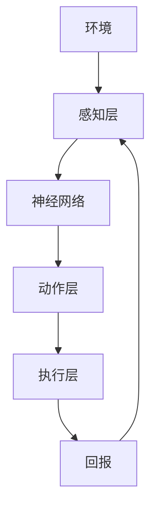
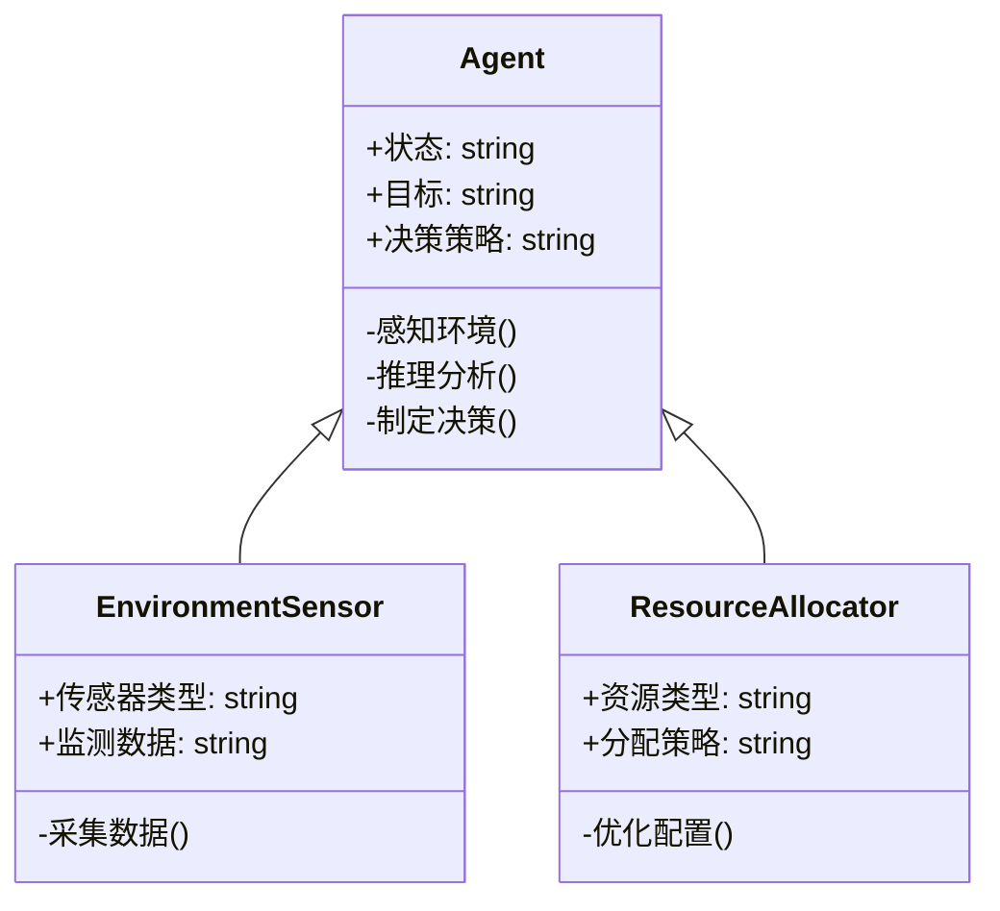
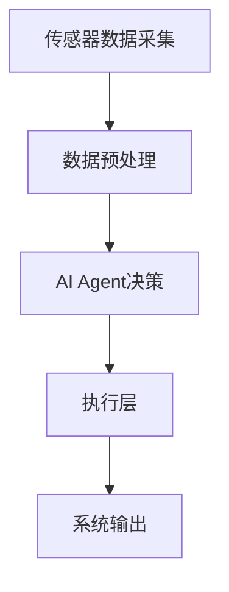

                 


# AI Agent在智能海洋资源管理中的应用

> 关键词：AI Agent，海洋资源管理，强化学习，多智能体协作，智能系统设计

> 摘要：本文深入探讨AI Agent在智能海洋资源管理中的应用，从核心概念到算法原理，再到系统架构和项目实战，全面解析如何利用AI Agent技术优化海洋资源的监测、保护和配置。通过详细的技术分析和实际案例，本文为读者提供了一套系统化的方法论，以应对复杂的海洋资源管理挑战。

---

## 第一部分: AI Agent在智能海洋资源管理中的应用概述

### 第1章: AI Agent与智能海洋资源管理概述

#### 1.1 AI Agent的基本概念与特点

AI Agent（人工智能代理）是一种能够感知环境、自主决策并执行任务的智能实体。其核心特征包括：

- **自主性**：能够在没有外部干预的情况下独立运作。
- **反应性**：能够根据环境变化实时调整行为。
- **目标导向**：通过设定目标来优化决策过程。
- **协作性**：能够与其他智能体或系统协同工作。

#### 1.2 智能海洋资源管理的背景与挑战

海洋资源管理涉及渔业、矿产资源、海洋能等多个领域，传统管理方式面临以下挑战：

- **数据复杂性**：海洋环境数据种类繁多，且实时性要求高。
- **决策复杂性**：资源分配和环境保护需要综合考虑多方面因素。
- **动态变化**：海洋环境具有高度动态性，传统静态模型难以应对。

AI Agent通过实时感知和动态决策，能够有效应对这些挑战。

#### 1.3 AI Agent在海洋资源管理中的应用价值

AI Agent在海洋资源管理中的应用主要体现在以下几个方面：

- **环境监测**：实时监控海洋环境参数，如温度、盐度、溶解氧等。
- **资源优化**：通过智能决策算法优化资源分配和利用效率。
- **生态保护**：预测和防范生态破坏，保护海洋生物多样性。

---

### 第2章: AI Agent的核心概念与原理

#### 2.1 AI Agent的核心原理

AI Agent的核心原理包括：

- **感知与推理**：通过传感器获取环境数据，并利用推理算法进行分析。
- **决策与执行**：基于推理结果制定决策，并通过执行器实现目标。
- **学习与优化**：通过强化学习等算法不断优化决策策略。

#### 2.2 AI Agent在海洋资源管理中的应用场景

AI Agent在海洋资源管理中的应用场景包括：

- **海洋环境监测**：部署AI Agent实时监测海洋环境参数。
- **资源优化配置**：通过智能算法优化渔业资源分配。
- **生态保护与修复**：预测生态变化，制定保护策略。

#### 2.3 核心概念对比与ER实体关系图

##### 核心概念对比表

| 概念       | 描述                                         |
|------------|----------------------------------------------|
| AI Agent   | 具备自主决策能力的智能实体                   |
| 海洋资源   | 海洋中的可利用资源，包括渔业、矿产等         |
| 环境监测    | 实时采集海洋环境数据                         |
| 资源分配    | 合理配置海洋资源利用                         |
| 生态保护    | 保护海洋生态系统，防止生态破坏               |

##### ER实体关系图

```mermaid
erd
  MarineResource
  Entity:海洋资源
  Attributes:类型、储量、分布区域
  Agent
  Entity:AI Agent
  Attributes:状态、目标、决策策略
  EnvironmentSensor
  Entity:环境传感器
  Attributes:传感器类型、监测数据
  Action
  Entity:操作
  Attributes:类型、时间、结果
  link: MarineResource --> Agent
  link: Agent --> EnvironmentSensor
  link: EnvironmentSensor --> Action
```

---

### 第3章: AI Agent的算法原理与数学模型

#### 3.1 强化学习算法

##### 3.1.1 Q-Learning算法

Q-Learning是一种经典的强化学习算法，适用于离散动作空间。其核心公式为：

$$ Q(s, a) = Q(s, a) + \alpha \left[ r + \gamma \max Q(s', a') - Q(s, a) \right] $$

其中：
- \( Q(s, a) \)：当前状态下采取动作 \( a \) 的期望回报。
- \( \alpha \)：学习率。
- \( r \)：立即回报。
- \( \gamma \)：折扣因子。
- \( s' \)：下一个状态。

##### 3.1.2 Deep Q-Networks (DQN)算法

DQN通过深度神经网络近似Q值函数，适用于高维状态空间。其流程图如下：



##### 3.1.3 应用场景

以海洋环境监测为例，AI Agent可以通过DQN算法优化传感器部署策略，以最小化监测成本的同时最大化数据采集效率。

#### 3.2 多智能体协作算法

##### 3.2.1 多智能体强化学习

多智能体强化学习通过多个智能体协作完成复杂任务。其核心机制包括：

- **联合推理**：多个智能体共同分析环境状态。
- **协作决策**：基于联合推理结果制定协作策略。

##### 3.2.2 应用场景

在海洋资源保护中，多个AI Agent可以协同工作，分别负责监测、数据处理和决策制定。

---

### 第4章: 系统分析与架构设计

#### 4.1 项目场景介绍

假设我们开发一个海洋环境监测与资源管理AI Agent系统，用于实时监测海洋环境参数并优化资源分配。

#### 4.2 系统功能设计

##### 领域模型



#### 4.3 系统架构设计

##### 系统架构图



#### 4.4 系统接口设计

系统主要接口包括：
- 数据采集接口：与环境传感器连接，获取实时数据。
- 决策接口：接收决策指令并执行相应操作。
- 通信接口：与其他系统或智能体进行数据交互。

---

### 第5章: 项目实战

#### 5.1 环境安装

安装Python环境，包括以下库：
- `numpy`
- `pandas`
- `tensorflow`
- `keras`

#### 5.2 核心代码实现

##### 5.2.1 强化学习代码示例

```python
import numpy as np
import gym

env = gym.make('CartPole-v0')
observation_space = env.observation_space.shape[0]
action_space = env.action_space.n

# 初始化参数
hidden_layer = 24
learning_rate = 0.01
gamma = 0.99

# 创建神经网络模型
model = Sequential()
model.add(Dense(hidden_layer, input_dim=observation_space, activation='relu'))
model.add(Dense(action_space, activation='softmax'))
model.compile(loss='sparse_categorical_crossentropy', optimizer=Adam(learning_rate=learning_rate))

# 定义Q-learning算法
def QLearning(state, action, reward, next_state):
    target = reward + gamma * np.max(model.predict(next_state))
    target = target.reshape(-1, 1)
    model.fit(state, target, epochs=1, verbose=0)

# 训练过程
for episode in range(1000):
    state = env.reset()
    while True:
        # 选择动作
        prediction = model.predict(state)
        action = np.argmax(prediction)
        
        # 执行动作
        next_state, reward, done, _ = env.step(action)
        
        # 更新Q值
        QLearning(state, action, reward, next_state)
        
        if done:
            break
```

##### 5.2.2 应用案例分析

以海洋环境监测为例，AI Agent通过强化学习优化传感器部署策略，实现了在有限传感器数量下的最优覆盖。

---

### 第6章: 最佳实践与小结

#### 6.1 最佳实践

- **数据质量管理**：确保输入数据的准确性和完整性。
- **系统稳定性**：设计容错机制，保证系统的稳定运行。
- **隐私保护**：在数据处理和传输过程中，确保数据隐私。

#### 6.2 小结

本文详细探讨了AI Agent在智能海洋资源管理中的应用，从理论到实践，全面解析了如何利用AI Agent技术优化海洋资源的监测、保护和配置。通过实际案例和代码示例，为读者提供了一套系统化的方法论。

---

作者：AI天才研究院 & 禅与计算机程序设计艺术

