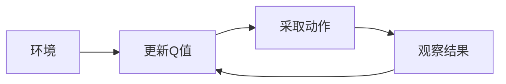
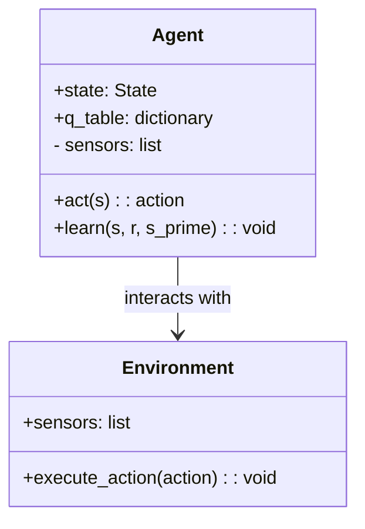
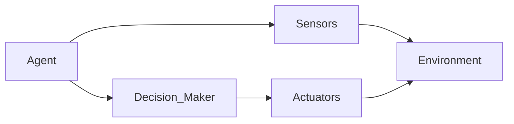

                 


# AI Agent在智能滑雪板中的技巧改进指导

> 关键词：AI Agent, 智能滑雪板, 强化学习, 传感器数据, 滑雪技巧, 技术实现

> 摘要：本文深入探讨了AI Agent在智能滑雪板中的应用，重点分析了AI Agent如何通过感知、决策和执行三个层面来改进滑雪技巧。文章从背景介绍、核心概念、算法原理、系统架构到项目实战，全面解析了AI Agent在智能滑雪板中的技术实现与优化策略。

---

# 第1章: AI Agent与滑雪运动概述

## 1.1 AI Agent的基本概念

### 1.1.1 AI Agent的定义
AI Agent（人工智能代理）是一种能够感知环境、自主决策并执行任务的智能实体。它通过传感器获取信息，利用算法进行分析，最终做出最优决策以实现目标。

### 1.1.2 AI Agent的核心特征
- **自主性**：能够在没有外部干预的情况下自主运行。
- **反应性**：能够实时感知环境变化并做出反应。
- **学习能力**：通过数据和经验不断优化自身的决策能力。
- **目标导向**：所有行为都围绕特定目标展开。

### 1.1.3 AI Agent与传统算法的区别
| 特性 | AI Agent | 传统算法 |
|------|-----------|-----------|
| 决策方式 | 基于实时数据动态调整 | 预先设定固定逻辑 |
| 学习能力 | 具备自适应学习能力 | 无法自适应 |
| 环境适应性 | 高度灵活，适应复杂环境 | 适应性有限 |

## 1.2 智能滑雪板的背景与现状

### 1.2.1 滑雪运动的历史与发展
滑雪是一项古老的冬季运动，起源于北欧，如今已成为全球性的运动项目。随着科技的进步，滑雪装备和技术也在不断升级。

### 1.2.2 智能滑雪板的技术基础
现代智能滑雪板集成了多种传感器（如加速度计、陀螺仪、GPS）和无线通信模块，能够实时采集滑雪者的运动数据，并通过AI算法优化滑雪技巧。

### 1.2.3 当前滑雪技巧改进的痛点
- **传统教学依赖经验**：滑雪教练的水平参差不齐，难以提供个性化的指导。
- **数据采集有限**：传统滑雪板无法实时采集和分析运动数据。
- **反馈延迟**：滑雪者无法在第一时间获得改进的反馈。

## 1.3 AI Agent在滑雪技巧改进中的应用前景

### 1.3.1 AI Agent在滑雪技巧改进中的优势
- **实时反馈**：AI Agent能够实时分析滑雪者的动作数据，并提供即时反馈。
- **个性化指导**：通过分析个体差异，AI Agent可以制定个性化的训练计划。
- **持续优化**：AI Agent能够通过不断学习，优化滑雪技巧。

### 1.3.2 当前市场上的智能滑雪设备
- **智能滑雪板**：内置传感器和AI芯片，能够实时分析滑雪者的动作。
- **智能滑雪杖**：通过震动反馈指导滑雪者的手臂动作。
- **穿戴设备**：如智能滑雪靴，能够监测足部压力分布。

### 1.3.3 未来发展趋势
- **更智能化**：AI Agent将更加智能化，能够预测滑雪者的动作并提前做出优化建议。
- **多设备协同**：智能滑雪设备将实现多设备协同，形成一个完整的滑雪指导系统。
- **虚拟现实结合**：通过VR技术，AI Agent可以在虚拟环境中模拟滑雪场景，帮助滑雪者进行训练。

## 1.4 本章小结
本章介绍了AI Agent的基本概念，分析了智能滑雪板的发展现状，指出了当前滑雪技巧改进的痛点，并展望了AI Agent在滑雪技巧改进中的应用前景。

---

# 第2章: AI Agent的核心概念与原理

## 2.1 AI Agent的核心概念

### 2.1.1 感知层
AI Agent通过多种传感器（如加速度计、陀螺仪、GPS）感知滑雪者的动作数据和环境信息。

### 2.1.2 决策层
AI Agent根据感知到的数据，结合预设的规则和学习到的模型，做出最优决策。

### 2.1.3 执行层
AI Agent通过控制滑雪板的执行机构（如调整板面角度）来实现决策。

## 2.2 AI Agent的关键技术

### 2.2.1 传感器数据处理
AI Agent需要对传感器数据进行预处理（如滤波、归一化）和特征提取（如动作幅度、速度变化）。

### 2.2.2 数据分析与特征提取
通过对历史数据的分析，AI Agent可以提取出影响滑雪技巧的关键特征（如重心转移速度、板刃角度）。

### 2.2.3 智能决策算法
AI Agent使用强化学习、决策树等算法，根据当前状态和历史数据做出决策。

## 2.3 AI Agent的实现流程

### 2.3.1 数据采集
AI Agent通过传感器实时采集滑雪者的动作数据。

### 2.3.2 数据处理
对采集到的数据进行预处理和特征提取，为后续的决策提供支持。

### 2.3.3 决策生成
基于处理后的数据，AI Agent使用算法生成最优决策。

### 2.3.4 执行反馈
AI Agent通过滑雪板的执行机构执行决策，并根据反馈调整后续的决策。

## 2.4 本章小结
本章详细介绍了AI Agent的核心概念和实现流程，强调了传感器数据处理和智能决策算法的重要性。

---

# 第3章: AI Agent的算法原理与数学模型

## 3.1 强化学习算法简介

### 3.1.1 强化学习的基本概念
强化学习是一种通过试错机制来学习最优策略的算法。AI Agent通过与环境的交互，不断优化自身的策略。

### 3.1.2 Q-learning算法原理
Q-learning是一种经典的强化学习算法，通过更新Q值表来学习最优动作。

### 3.1.3 算法流程图


## 3.2 算法的数学模型

### 3.2.1 Q-learning的数学公式
$$ Q(s, a) = Q(s, a) + \alpha [r + \gamma \max Q(s', a') - Q(s, a)] $$
其中：
- \( Q(s, a) \)：状态s下动作a的Q值
- \( \alpha \)：学习率
- \( r \)：奖励
- \( \gamma \)：折扣因子
- \( s' \)：下一个状态
- \( a' \)：下一个动作

### 3.2.2 算法实现的伪代码
```python
def Q_learning():
    initialize Q(s, a) = 0 for all s, a
    while True:
        s = get_current_state()
        a = choose_action(s)
        r = get_reward(s, a)
        s_prime = get_next_state(s, a)
        Q(s, a) = Q(s, a) + alpha * (r + gamma * max(Q(s_prime, a_prime)) - Q(s, a))
    return Q
```

## 3.3 本章小结
本章详细介绍了强化学习算法的基本原理和数学模型，重点讲解了Q-learning算法及其在滑雪技巧改进中的应用。

---

# 第4章: AI Agent的系统分析与架构设计

## 4.1 系统分析

### 4.1.1 问题场景介绍
滑雪者在滑雪过程中，通过智能滑雪板实时获取动作数据，并通过AI Agent得到优化建议。

### 4.1.2 项目介绍
本项目旨在通过AI Agent优化滑雪者的技巧，提升滑雪体验。

## 4.2 系统功能设计

### 4.2.1 领域模型（类图）


### 4.2.2 系统架构设计


### 4.2.3 系统接口设计
- **输入接口**：传感器数据
- **输出接口**：优化建议
- **反馈接口**：执行结果

## 4.3 本章小结
本章通过系统分析和架构设计，明确了AI Agent在智能滑雪板中的角色和功能。

---

# 第5章: AI Agent的项目实战

## 5.1 环境搭建

### 5.1.1 安装Python
```bash
python --version
pip install numpy scikit-learn
```

## 5.2 系统核心实现

### 5.2.1 传感器数据处理
```python
import numpy as np
from sklearn import preprocessing

# 假设data是传感器数据
data = np.array([[1.5, 2.3, 0.8], [2.4, 1.8, 1.2]])
data_normalized = preprocessing.normalize(data)
print(data_normalized)
```

### 5.2.2 强化学习算法实现
```python
import numpy as np

class QAgent:
    def __init__(self, state_space, action_space):
        self.state_space = state_space
        self.action_space = action_space
        self.Q = np.zeros((state_space, action_space))
    
    def choose_action(self, state):
        return np.argmax(self.Q[state])
    
    def update_Q(self, state, action, reward, next_state):
        self.Q[state, action] += 0.1 * (reward + 0.9 * np.max(self.Q[next_state]) - self.Q[state, action])

# 初始化
state_space = 5
action_space = 3
agent = QAgent(state_space, action_space)

# 训练
for _ in range(100):
    state = 0
    action = agent.choose_action(state)
    reward = 1  # 假设奖励为1
    next_state = 1
    agent.update_Q(state, action, reward, next_state)
```

## 5.3 实际案例分析

### 5.3.1 案例背景
假设滑雪者在转弯时动作不标准，AI Agent通过传感器数据分析，提出优化建议。

### 5.3.2 分析与优化
AI Agent通过强化学习算法，优化滑雪者的转弯动作，提升技巧。

## 5.4 本章小结
本章通过项目实战，展示了AI Agent在智能滑雪板中的具体实现和优化效果。

---

# 第6章: 最佳实践与总结

## 6.1 最佳实践

### 6.1.1 数据质量的重要性
确保传感器数据的准确性和完整性，是AI Agent正常运行的基础。

### 6.1.2 算法选择的注意事项
根据具体场景选择合适的算法，避免过度复杂化。

### 6.1.3 系统优化建议
定期更新模型参数，优化算法性能。

## 6.2 小结

## 6.3 注意事项
- **数据隐私**：确保滑雪者数据的安全性。
- **系统稳定性**：保证AI Agent在复杂环境下的稳定性。

## 6.4 拓展阅读
- 《强化学习入门》
- 《智能系统设计》

---

# 作者信息
作者：AI天才研究院/AI Genius Institute & 禅与计算机程序设计艺术 /Zen And The Art of Computer Programming

---

**注**：由于篇幅限制，以上内容为文章的框架和部分内容的示例，实际文章需根据上述结构进一步扩展和详细阐述。

