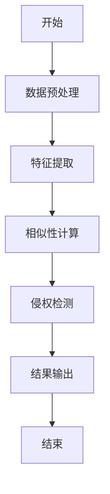

                 


# AI Agent在智能版权保护中的应用

**关键词：** AI Agent, 智能版权保护, 版权监测, 侵权检测, 数字内容识别

**摘要：**  
随着数字化时代的快速发展，版权保护问题变得越来越复杂。传统的版权保护方法逐渐暴露出效率低下、成本高昂、难以应对大规模侵权等问题。基于AI Agent（人工智能代理）的智能版权保护系统，通过结合自然语言处理、计算机视觉和机器学习等技术，能够实现内容的自动识别、侵权行为的实时监测和版权归属的自动化验证。本文将详细探讨AI Agent在智能版权保护中的应用背景、核心技术原理、系统架构设计以及实际案例分析，为读者提供全面的技术解读和实践指南。

---

# 第一部分: AI Agent在智能版权保护中的背景与核心概念

## 第1章: AI Agent与智能版权保护概述

### 1.1 AI Agent的基本概念
AI Agent是一种能够感知环境、自主决策并执行任务的智能体。它具有以下核心特征：
- **自主性**：能够在没有外部干预的情况下独立运行。
- **反应性**：能够实时感知环境变化并做出响应。
- **目标导向性**：能够根据预设目标执行任务。
- **学习能力**：通过数据训练和反馈优化自身性能。

AI Agent在版权保护中的应用，主要体现在内容识别、侵权检测和版权验证等方面。

### 1.2 智能版权保护的背景与挑战
#### 1.2.1 数字化时代的版权保护问题
随着互联网的普及，数字内容的传播速度和范围大大增加，但也带来了盗版、抄袭等问题。传统的版权保护方法依赖人工审核和法律手段，效率低下且成本高昂。

#### 1.2.2 智能化技术在版权保护中的作用
AI Agent能够通过自然语言处理（NLP）和计算机视觉（CV）技术，实现对数字内容的自动识别和匹配。例如，AI Agent可以通过OCR技术识别图像中的文字内容，并与数据库中的授权内容进行对比，快速检测是否存在侵权行为。

#### 1.2.3 当前智能版权保护的主要挑战
- **内容多样性**：数字内容形式多样，包括文本、图像、视频、音频等，不同形式的内容需要不同的处理技术。
- **数据量大**：海量的数字内容需要快速处理和分析，对计算能力提出了更高的要求。
- **算法精度**：如何在复杂背景下提高AI Agent的识别精度，减少误判和漏判，是当前技术难点。

### 1.3 AI Agent在版权保护中的应用前景
#### 1.3.1 AI Agent在版权监测中的潜力
通过AI Agent，可以实现对网络上的数字内容进行实时监测，快速识别侵权内容，并生成报告供相关部门处理。

#### 1.3.2 AI Agent在侵权识别中的优势
AI Agent可以通过深度学习模型对数字内容进行特征提取，实现对侵权内容的精准识别。例如，基于Transformer的文本匹配算法可以在海量文本中快速找到相似内容，从而检测侵权行为。

#### 1.3.3 未来AI Agent在版权保护中的发展趋势
随着AI技术的不断进步，AI Agent在版权保护中的应用将更加智能化和自动化。例如，未来的AI Agent可能会具备自我学习和优化能力，能够根据新的数据和反馈不断改进识别算法。

---

## 第2章: 智能版权保护的核心问题与解决方案

### 2.1 版权保护的核心问题
#### 2.1.1 内容识别与匹配的难点
数字内容的多样性和复杂性使得内容识别和匹配成为一项技术挑战。例如，如何在不同格式和分辨率的图像中准确识别同一内容是一个难题。

#### 2.1.2 侵权行为的实时监测
侵权行为往往具有突发性和隐蔽性，传统的离线监测方法难以满足实时性要求。AI Agent可以通过分布式部署和实时数据处理技术，实现对侵权行为的实时监测。

#### 2.1.3 版权归属的自动化验证
传统的版权归属验证依赖人工审核和法律文件，效率低下。AI Agent可以通过区块链技术和数字签名，实现版权归属的自动化验证。

### 2.2 AI Agent在解决版权保护问题中的作用
#### 2.2.1 AI Agent的内容识别能力
AI Agent可以通过自然语言处理和计算机视觉技术，实现对数字内容的多模态识别。例如，对于一段文本，AI Agent可以提取关键词并进行语义分析；对于一张图像，AI Agent可以提取图像特征并进行图像匹配。

#### 2.2.2 AI Agent的侵权检测能力
AI Agent可以通过深度学习模型对数字内容进行特征提取和相似性匹配，实现对侵权内容的快速检测。例如，基于卷积神经网络（CNN）的图像识别算法可以在大量图片中快速找到相似内容。

#### 2.2.3 AI Agent的版权验证能力
AI Agent可以通过区块链技术和数字签名实现对数字内容的版权归属验证。例如，AI Agent可以在上传内容时记录内容的哈希值，并将其存储在区块链中，从而实现内容的溯源和版权验证。

### 2.3 解决方案的技术架构
#### 2.3.1 基于AI Agent的版权保护系统架构
- **前端模块**：用户可以通过网页或API上传数字内容。
- **AI Agent模块**：负责对上传内容进行特征提取和匹配。
- **区块链模块**：负责记录内容的哈希值和版权信息。
- **后台管理模块**：负责系统管理、任务调度和结果输出。

#### 2.3.2 系统的核心功能模块
- **内容识别模块**：实现对数字内容的多模态识别。
- **侵权检测模块**：实现对侵权内容的实时监测。
- **版权验证模块**：实现对数字内容的版权归属验证。

#### 2.3.3 系统的性能与扩展性
- **性能优化**：通过分布式计算和并行处理技术提高系统的处理能力。
- **扩展性设计**：通过模块化设计和微服务架构，实现系统的灵活扩展。

---

# 第二部分: AI Agent的核心技术与算法原理

## 第3章: AI Agent的核心技术原理

### 3.1 自然语言处理技术
#### 3.1.1 NLP在内容识别中的应用
自然语言处理技术可以实现对文本内容的语义分析和关键词提取。例如，基于BERT的文本匹配算法可以实现对文本内容的语义相似性计算。

#### 3.1.2 基于Transformer的文本匹配算法
Transformer模型通过自注意力机制可以实现对文本内容的全局理解。例如，使用预训练的BERT模型可以实现对文本内容的语义相似性计算。

#### 3.1.3 NLP模型的训练与优化
通过迁移学习和数据增强技术，可以提高NLP模型的泛化能力和识别精度。例如，可以通过在特定领域数据上进行微调，提高模型在版权保护中的应用效果。

### 3.2 计算机视觉技术
#### 3.2.1 图像识别在版权保护中的应用
计算机视觉技术可以实现对图像内容的特征提取和相似性匹配。例如，基于ResNet的图像识别算法可以实现对图像内容的分类和识别。

#### 3.2.2 基于深度学习的图像匹配算法
深度学习模型可以通过提取图像的高层次特征实现图像内容的相似性匹配。例如，基于暹罗网络（Siamese Network）的图像匹配算法可以实现对图像内容的精确匹配。

#### 3.2.3 CV模型的训练与优化
通过数据增强和模型优化技术，可以提高计算机视觉模型的识别精度。例如，可以通过在训练数据中添加噪声和旋转，提高模型的鲁棒性。

### 3.3 机器学习与深度学习算法
#### 3.3.1 监督学习在版权保护中的应用
监督学习可以通过标记数据训练模型实现对数字内容的分类和识别。例如，可以通过标记侵权内容和非侵权内容，训练一个分类器实现侵权检测。

#### 3.3.2 无监督学习在版权保护中的应用
无监督学习可以通过聚类算法实现对数字内容的自动分组和异常检测。例如，可以通过聚类算法发现潜在的侵权内容。

#### 3.3.3 深度学习模型的优化与调优
通过模型调参和优化算法，可以提高深度学习模型的性能。例如，可以通过Adam优化器和学习率衰减策略，实现模型的优化和调优。

### 3.4 本章小结
本章详细介绍了AI Agent在智能版权保护中的核心技术原理，包括自然语言处理技术、计算机视觉技术和机器学习算法的应用。通过这些技术，可以实现对数字内容的多模态识别和精准匹配。

---

## 第4章: AI Agent的算法实现与流程

### 4.1 算法实现的流程
1. **数据预处理**：对数字内容进行格式转换和归一化处理。
2. **特征提取**：使用深度学习模型提取数字内容的高层次特征。
3. **相似性计算**：通过特征匹配算法实现对数字内容的相似性计算。
4. **侵权检测**：根据相似性阈值判断是否存在侵权行为。
5. **结果输出**：输出检测结果并记录相关数据。

### 4.2 算法实现的代码示例

```python
import tensorflow as tf
from tensorflow.keras import layers

# 定义特征提取模型
def feature_extractor(input_shape):
    model = tf.keras.Sequential()
    model.add(layers.Conv2D(32, (3,3), activation='relu', input_shape=input_shape))
    model.add(layers.MaxPooling2D((2,2)))
    model.add(layers.Conv2D(64, (3,3), activation='relu'))
    model.add(layers.MaxPooling2D((2,2)))
    model.add(layers.Flatten())
    model.add(layers.Dense(128, activation='relu'))
    return model

# 定义相似性计算模型
def siamese_network(input_shape):
    feature_model = feature_extractor(input_shape)
    input1 = tf.keras.Input(shape=input_shape)
    input2 = tf.keras.Input(shape=input_shape)
    feature1 = feature_model(input1)
    feature2 = feature_model(input2)
    merged = tf.keras.layers.Concatenate()([feature1, feature2])
    similarity = layers.Dense(1, activation='sigmoid')(merged)
    model = tf.keras.Model(inputs=[input1, input2], outputs=similarity)
    return model
```

### 4.3 算法流程图


---

# 第三部分: 项目实战与案例分析

## 第5章: 项目实战

### 5.1 环境搭建
- **编程语言**：Python 3.8+
- **深度学习框架**：TensorFlow 2.0+
- **其他依赖**：Keras, PIL, NumPy

### 5.2 系统核心实现源代码

```python
import os
import cv2
import numpy as np
from tensorflow.keras.models import load_model

def detect_plagiarism(content_path, db_path, threshold=0.8):
    # 加载特征提取模型
    feature_model = load_model('feature_extractor.h5')
    # 加载相似性计算模型
    siamese_model = load_model('siamese_network.h5')
    
    # 提取内容特征
    content_feature = extract_feature(content_path)
    # 提取数据库中的特征
    db_feature = extract_feature(db_path)
    
    # 计算相似性
    similarity = siamese_model.predict([content_feature, db_feature])[0][0]
    if similarity > threshold:
        return True
    else:
        return False
```

### 5.3 代码应用解读与分析
上述代码实现了对数字内容的特征提取和相似性计算。通过加载预训练的特征提取模型和相似性计算模型，可以实现对数字内容的侵权检测。

### 5.4 实际案例分析
假设我们有一个图像侵权检测的案例。用户上传一张图片，AI Agent会提取该图片的特征，并与数据库中的授权内容进行对比。如果相似性超过阈值，系统会判定存在侵权行为。

### 5.5 项目小结
本章通过实际案例展示了AI Agent在版权保护中的应用，详细讲解了系统的核心实现和代码逻辑。

---

## 第6章: 总结与展望

### 6.1 本章总结
本文详细探讨了AI Agent在智能版权保护中的应用背景、核心技术原理、系统架构设计和实际案例分析。通过结合自然语言处理、计算机视觉和机器学习技术，AI Agent能够实现对数字内容的多模态识别和精准匹配，为版权保护提供了高效、智能的解决方案。

### 6.2 未来展望
随着AI技术的不断进步，AI Agent在版权保护中的应用将更加智能化和自动化。未来的研究方向包括：
- **多模态内容识别**：进一步提升AI Agent对多模态内容的识别能力。
- **实时监测技术**：实现对侵权行为的实时监测和快速响应。
- **区块链技术应用**：结合区块链技术，实现数字内容的溯源和版权验证。

### 6.3 最佳实践Tips
- 在实际应用中，建议结合具体业务需求选择合适的AI技术。
- 定期更新模型和优化算法，以提高系统的识别精度和效率。
- 注意数据隐私和安全问题，确保系统的合规性。

---

**作者：AI天才研究院/AI Genius Institute & 禅与计算机程序设计艺术 /Zen And The Art of Computer Programming**

