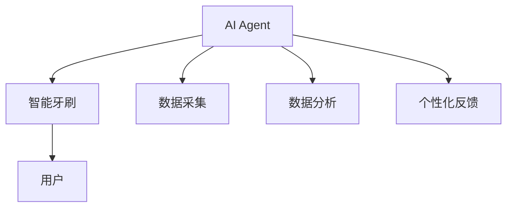
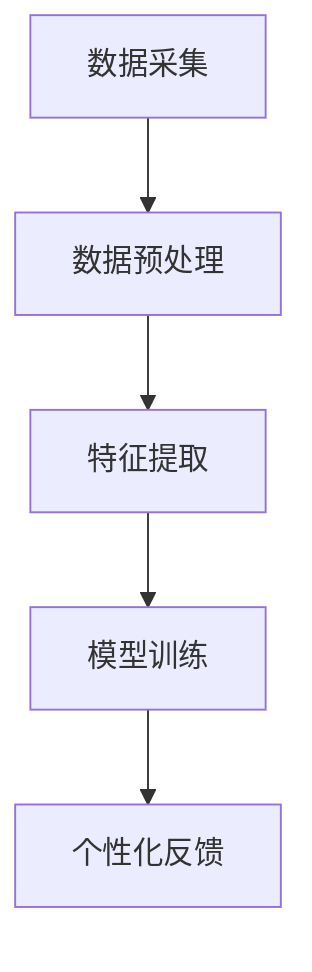
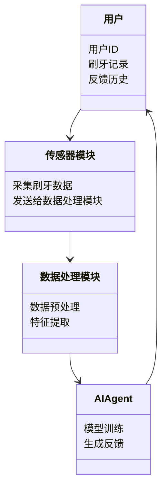

                 


# AI Agent在智能牙刷中的刷牙效果分析

> 关键词：AI Agent, 智能牙刷, 刷牙效果, 数据分析, 机器学习, 用户反馈

> 摘要：本文将探讨AI Agent在智能牙刷中的应用，分析其如何通过数据采集、处理和反馈优化用户的刷牙效果。从背景介绍到系统架构设计，再到项目实战，深入解析AI Agent在智能牙刷中的核心作用和实现过程。

---

## 第一部分: AI Agent与智能牙刷的背景与概念

### 第1章: 问题背景与描述

#### 1.1 问题背景
- **刷牙效果的重要性**：良好的刷牙习惯是维护口腔健康的关键，但传统牙刷无法提供实时反馈，难以确保刷牙的全面性和效果。
- **传统牙刷的局限性**：无法记录刷牙时长、力度、覆盖范围等关键数据，也无法根据个人口腔状况提供个性化建议。
- **AI技术在口腔健康领域的应用潜力**：通过AI技术，智能牙刷可以实时分析用户的刷牙行为，并提供针对性的反馈，帮助用户改善刷牙习惯。

#### 1.2 问题描述
- **智能牙刷的功能需求**：实时采集刷牙数据（如时间、力度、频率）、分析数据并提供反馈、个性化建议。
- **AI Agent在刷牙效果分析中的作用**：通过机器学习算法，AI Agent能够识别用户的刷牙模式，预测潜在的口腔问题，并提供建议。
- **用户刷牙行为的多样性与复杂性**：不同用户的刷牙习惯差异较大，AI Agent需要能够适应各种复杂的刷牙模式。

#### 1.3 问题解决思路
- **AI Agent的核心功能**：数据采集与处理、模式识别、个性化反馈。
- **数据采集与分析的关键步骤**：通过传感器采集刷牙数据，利用算法分析数据，生成反馈。
- **用户反馈的处理机制**：根据AI Agent的分析结果，生成个性化建议，并通过用户友好的界面呈现。

### 第2章: 核心概念与联系

#### 2.1 AI Agent的定义与原理
- **AI Agent的基本概念**：AI Agent是一种能够感知环境、自主决策并执行任务的智能实体。
- **AI Agent的核心功能模块**：感知模块、决策模块、执行模块。
- **AI Agent与智能牙刷的结合方式**：AI Agent嵌入智能牙刷中，通过传感器采集数据，分析用户刷牙行为，并提供反馈。

#### 2.2 智能牙刷的系统构成
- **传感器模块**：用于采集刷牙时长、力度、频率等数据。
- **数据处理模块**：对采集的数据进行预处理和分析。
- **用户交互界面**：用于显示AI Agent的分析结果和个性化建议。

#### 2.3 核心概念对比分析
| **对比维度**       | **AI Agent**           | **智能牙刷**             |
|--------------------|------------------------|--------------------------|
| 核心功能           | 数据分析与决策        | 数据采集与用户交互      |
| 技术基础           | 机器学习、深度学习    | 传感器技术、数据处理    |
| 应用场景           | 提供个性化建议         | 改善用户刷牙习惯         |

#### 2.4 实体关系图



---

## 第二部分: 算法原理与实现

### 第3章: 算法原理讲解

#### 3.1 算法概述
- **AI Agent的核心算法**：基于机器学习的刷牙效果分析算法。
- **数据流分析**：传感器数据 → 数据预处理 → 特征提取 → 模型训练 → 反馈生成。

#### 3.2 算法实现步骤



#### 3.3 核心算法实现
- **数据预处理**：去除噪声，归一化处理。
- **特征提取**：提取刷牙时长、力度、频率等特征。
- **模型训练**：使用随机森林或支持向量机（SVM）进行分类或回归训练。

#### 3.4 数学模型

**线性回归模型**：
$$ y = \beta_0 + \beta_1x + \epsilon $$
其中，$y$ 是目标变量（如刷牙效果评分），$x$ 是自变量（如刷牙时长）。

**决策树模型**：
$$ y = \text{决策树模型预测结果} $$

---

### 第4章: 系统分析与架构设计

#### 4.1 问题场景介绍
- **用户刷牙行为分析**：通过传感器数据，分析用户的刷牙习惯。
- **数据流分析**：传感器数据 → 数据处理模块 → AI Agent → 用户反馈。

#### 4.2 系统功能设计



#### 4.3 系统架构设计


---

### 第5章: 项目实战

#### 5.1 环境安装
- **安装Python**：`python --version`
- **安装依赖库**：`pip install numpy pandas scikit-learn`

#### 5.2 核心代码实现

```python
import numpy as np
from sklearn.model import SVC
from sklearn.preprocessing import StandardScaler

# 数据预处理
def preprocess_data(data):
    # 去除噪声
    filtered_data = data.dropna()
    # 标准化处理
    scaler = StandardScaler()
    processed_data = scaler.fit_transform(filtered_data)
    return processed_data

# 特征提取
def extract_features(processed_data):
    # 提取刷牙时长、力度、频率等特征
    features = processed_data[:, :3]
    return features

# 模型训练
def train_model(features, labels):
    model = SVC()
    model.fit(features, labels)
    return model

# 个性化反馈
def generate_feedback(model, new_data):
    # 预测结果
    prediction = model.predict(new_data)
    # 返回反馈
    return prediction
```

#### 5.3 案例分析
- **案例背景**：用户A刷牙时长为2分钟，力度适中，但覆盖范围不足。
- **模型分析**：AI Agent预测用户的牙龈出血风险较高。
- **个性化反馈**：建议用户增加横向刷牙次数，覆盖更多牙龈区域。

---

## 第三部分: 总结与展望

### 第6章: 总结与最佳实践

#### 6.1 总结
- **AI Agent的核心作用**：通过数据分析和个性化反馈，显著提升用户的刷牙效果。
- **系统的优势**：实时数据采集、精准分析、个性化建议。

#### 6.2 最佳实践
- **数据隐私保护**：确保用户数据的安全性。
- **模型可解释性**：优化模型的可解释性，方便用户理解反馈建议。
- **持续优化**：定期更新模型，提升分析精度。

#### 6.3 注意事项
- **数据采集的合法性**：遵守相关法律法规，确保数据采集合法。
- **用户反馈的及时性**：提供实时反馈，增强用户体验。
- **系统的稳定性**：确保系统在各种情况下都能稳定运行。

#### 6.4 拓展阅读
- **推荐书籍**：《机器学习实战》、《深度学习入门》。
- **推荐论文**：搜索“AI在口腔健康中的应用”。

---

## 作者：AI天才研究院 & 禅与计算机程序设计艺术

---

通过本文的详细分析，我们探讨了AI Agent在智能牙刷中的应用，从背景到实现，从理论到实践，全面解析了AI Agent如何优化用户的刷牙效果。希望本文能够为相关领域的研究者和开发者提供有价值的参考。

