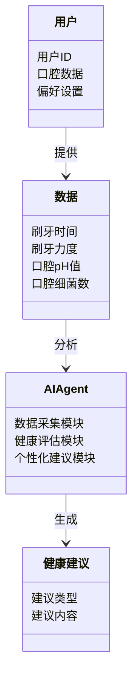
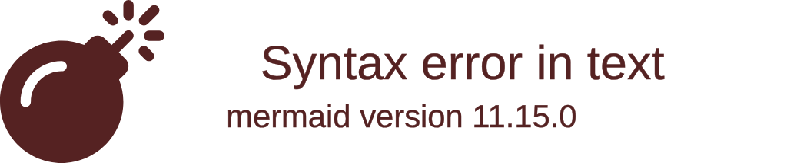
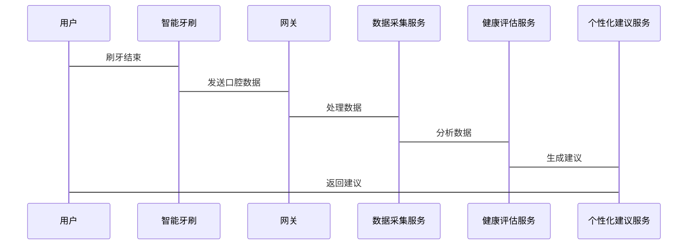

                 


# AI Agent在智能牙刷中的口腔健康分析

## 关键词：AI Agent, 智能牙刷, 口腔健康, 数据分析, 机器学习, 系统架构

## 摘要：本文深入探讨了AI Agent在智能牙刷中的应用，分析了其在口腔健康评估和个性化建议中的作用。通过数据预处理、特征提取、分类算法、系统架构设计以及项目实战，全面阐述了AI Agent如何助力智能牙刷提升用户体验。

---

## 第4章: 分类算法与模型训练

### 4.1 分类算法选择

#### 4.1.1 支持向量机(SVM)
支持向量机是一种强大的监督学习算法，常用于分类和回归问题。在口腔健康分析中，SVM可以用于将用户的口腔数据分类到不同的健康状态，例如“健康”、“轻微问题”或“严重问题”。其数学模型如下：

$$ \text{目标函数: } \min_{w, b, \xi} \frac{1}{2}||w||^2 + C \sum_{i=1}^n \xi_i $$
$$ \text{约束条件: } y_i (w \cdot x_i + b) \geq 1 - \xi_i $$
$$ \xi_i \geq 0 $$

其中，$w$ 是权重向量，$b$ 是偏置，$C$ 是惩罚参数，$\xi_i$ 是松弛变量。

#### 4.1.2 随机森林
随机森林是一种基于树的集成学习方法，具有良好的抗过拟合能力。在口腔健康分析中，随机森林可以用于处理多分类问题，例如区分不同的口腔疾病类型。其核心思想是通过构建多个决策树并进行投票或平均来提高模型的准确性和鲁棒性。

#### 4.1.3 K-近邻算法(KNN)
K-近邻算法是一种简单有效的分类算法，特别适用于小规模数据集。在口腔健康分析中，KNN可以用于基于用户的口腔数据特征，预测其口腔健康状态。

### 4.2 分类算法实现流程

#### 4.2.1 数据预处理
在分类算法实现之前，需要对数据进行预处理，包括数据清洗、标准化和特征选择。

#### 4.2.2 模型训练与验证
使用训练数据训练分类模型，并通过交叉验证评估模型的性能，调整超参数以优化模型效果。

#### 4.2.3 模型部署
将训练好的模型部署到智能牙刷中，实时处理用户的口腔数据，生成健康评估和个性化建议。

---

## 第5章: 系统分析与架构设计

### 5.1 问题场景介绍

智能牙刷系统需要实时采集用户的口腔数据，包括刷牙力度、时间、频率和口腔环境等。通过AI Agent对这些数据进行分析，生成健康评估报告和个性化建议，帮助用户维护口腔健康。

### 5.2 系统功能设计

#### 5.2.1 领域模型


#### 5.2.2 系统架构设计


#### 5.2.3 接口设计
- 数据采集接口：用于获取用户的口腔数据。
- 健康评估接口：用于调用AI Agent进行健康评估。
- 个性化建议接口：用于获取个性化健康建议。

#### 5.2.4 交互流程图


---

## 第6章: 项目实战

### 6.1 环境搭建

#### 6.1.1 安装依赖
安装必要的Python库：
```bash
pip install numpy scikit-learn matplotlib mermaid
```

### 6.2 系统核心实现源代码

#### 6.2.1 数据预处理
```python
import numpy as np
import pandas as pd

# 加载数据
data = pd.read_csv('oral_health.csv')

# 数据清洗
data.dropna(inplace=True)

# 标准化处理
from sklearn.preprocessing import StandardScaler
scaler = StandardScaler()
scaled_data = scaler.fit_transform(data.drop('label', axis=1))
```

#### 6.2.2 模型训练
```python
from sklearn.svm import SVC
from sklearn.model_selection import train_test_split

# 划分训练集和测试集
X_train, X_test, y_train, y_test = train_test_split(scaled_data, data['label'], test_size=0.2)

# 训练SVM模型
model = SVC()
model.fit(X_train, y_train)

# 模型评估
print("Accuracy:", model.score(X_test, y_test))
```

#### 6.2.3 个性化建议生成
```python
from sklearn.ensemble import RandomForestClassifier

# 训练随机森林模型
rf_model = RandomForestClassifier()
rf_model.fit(X_train, y_train)

# 预测用户健康状态
user_data = np.array([scaled_input])
prediction = rf_model.predict(user_data)
print("Health Status:", prediction[0])
```

### 6.3 实际案例分析

假设用户A的口腔数据为：
- 刷牙时间: 2分钟
- 刷牙力度: 中等
- 口腔pH值: 6.5
- 口腔细菌数: 200

AI Agent分析后，给出健康评估为“良好”，并建议继续保持良好的刷牙习惯。

---

## 第7章: 总结与展望

### 7.1 小结

本文详细探讨了AI Agent在智能牙刷中的应用，从数据预处理、算法选择到系统架构设计，全面分析了其在口腔健康评估中的潜力。通过项目实战，展示了AI Agent的实际应用效果。

### 7.2 注意事项

- 数据隐私保护：用户数据需加密处理，防止泄露。
- 模型优化：需要不断优化算法，提高分类准确率。
- 用户体验：个性化建议需简洁明了，便于用户理解。

### 7.3 最佳实践 tips

- 定期更新模型：根据新数据优化模型性能。
- 提供多语言支持：扩大用户群体。
- 结合其他传感器：如温度、湿度等，提高分析精度。

### 7.4 拓展阅读

- 《机器学习实战》
- 《深入浅出人工智能》
- 《智能系统架构设计》

---

## 作者：AI天才研究院 & 禅与计算机程序设计艺术

---

通过本文的详细分析，读者可以全面了解AI Agent在智能牙刷中的应用，从理论到实践，逐步掌握其核心原理和实现方法。希望本文能为智能牙刷的设计与优化提供有价值的参考。

