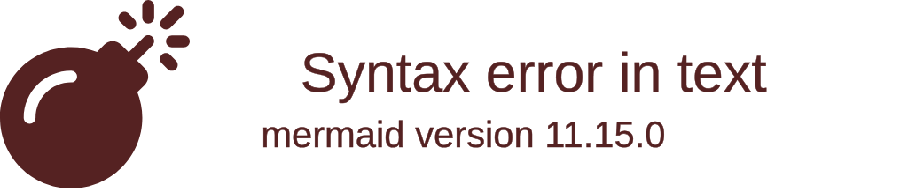
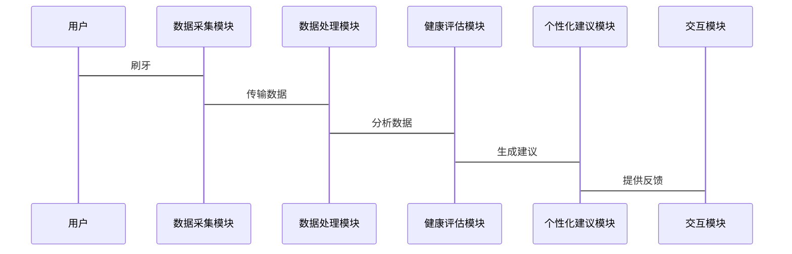

                 


---

# AI Agent在智能牙刷中的口腔健康追踪

> **关键词**：AI Agent，智能牙刷，口腔健康追踪，机器学习，物联网，数据隐私，健康建议  
> **摘要**：本文探讨了AI Agent在智能牙刷中的应用，详细分析了其在口腔健康追踪中的技术实现。通过建立数学模型、设计系统架构和项目实战，展示了如何利用AI技术实时监测口腔健康，提供个性化建议。文章还讨论了数据隐私和系统优化，展望了未来的应用前景。

---

## 目录大纲

1. [引言](#引言)
   1.1 AI Agent与智能牙刷概述
   1.2 口腔健康追踪的意义

2. [AI Agent基础](#ai-agent基础)
   2.1 AI Agent的核心概念
   2.2 AI Agent在智能设备中的应用

3. [口腔健康追踪的数学模型](#口腔健康追踪的数学模型)
   3.1 数据采集与特征提取
   3.2 健康评估模型

4. [系统分析与架构设计](#系统分析与架构设计)
   4.1 系统功能模块
   4.2 系统架构设计

5. [项目实战](#项目实战)
   5.1 环境搭建与数据采集
   5.2 核心算法实现
   5.3 系统部署与测试

6. [优化与改进](#优化与改进)
   6.1 模型优化
   6.2 系统性能提升

7. [总结与展望](#总结与展望)

---

## 正文

### 1. 引言

#### 1.1 AI Agent与智能牙刷概述

AI Agent（人工智能代理）是一种能够感知环境、自主决策并执行任务的智能实体。在智能牙刷中，AI Agent通过收集口腔数据，分析用户的口腔健康状况，并提供个性化的健康建议。这种结合不仅提升了用户的健康管理水平，还推动了智能硬件与AI技术的深度融合。

智能牙刷通过集成传感器（如压力传感器、温度传感器和光学传感器）收集用户的刷牙数据，如刷牙时间、力度、频率等。AI Agent利用这些数据，结合机器学习算法，分析用户的口腔健康状况，如牙龈出血、龋齿风险等，并提供相应的健康建议。

#### 1.2 口腔健康追踪的意义

口腔健康是整体健康的重要组成部分。通过AI Agent实时监测用户的口腔状况，可以帮助用户早期发现问题，预防口腔疾病的发生。此外，个性化健康建议的提供，能够显著提升用户的健康管理水平，减少因口腔问题引发的其他健康风险。

---

### 2. AI Agent基础

#### 2.1 AI Agent的核心概念

AI Agent具备感知、决策和执行三大核心能力。感知能力通过传感器获取环境数据，决策能力基于算法分析数据并制定策略，执行能力则通过硬件或软件实现操作。

在智能牙刷中，AI Agent主要负责数据的采集、分析和反馈。例如，通过压力传感器感知用户的刷牙力度，利用算法判断是否存在过度刷牙的风险，并通过震动提醒用户调整力度。

#### 2.2 AI Agent在智能设备中的应用

AI Agent的应用范围广泛，包括智能家居、自动驾驶和医疗设备等。在智能牙刷中的应用，体现了AI技术在日常生活中的实际价值，通过智能化的健康监测，提升用户体验。

---

### 3. 口腔健康追踪的数学模型

#### 3.1 数据采集与特征提取

智能牙刷采集的数据包括刷牙时间、力度、频率、位置等。这些数据需要经过预处理，提取有用的特征，例如：

- 刷牙时间：正常刷牙时间范围为2-3分钟，过短或过长均可能影响清洁效果。
- 刷牙力度：力度过大可能导致牙龈出血，力度过小则清洁不彻底。
- 刷牙频率：建议每天刷牙两次，频率异常可能反映用户的健康习惯。

特征提取可以通过统计方法或机器学习算法实现，例如使用主成分分析（PCA）降维。

#### 3.2 健康评估模型

健康评估模型基于提取的特征，利用机器学习算法（如支持向量机、随机森林）进行分类或回归分析，评估用户的口腔健康状况。

模型的输入包括刷牙数据，输出包括健康评分（如0-100分）和健康建议（如加强清洁特定区域）。

数学模型示例：

健康评分公式：
$$
\text{健康评分} = a \times \text{刷牙时间} + b \times \text{力度} + c \times \text{频率}
$$

其中，a、b、c为权重系数，需通过训练数据优化。

---

### 4. 系统分析与架构设计

#### 4.1 系统功能模块

系统主要功能模块包括：

- 数据采集模块：负责采集用户的刷牙数据。
- 健康评估模块：分析数据并生成健康报告。
- 个性化建议模块：根据评估结果提供健康建议。
- 交互模块：与用户进行信息交互，例如震动提醒或APP通知。

功能模块对比表：

| 功能模块          | 输入          | 输出          |
|-------------------|---------------|---------------|
| 数据采集模块      | 刷牙数据      | 数据流        |
| 健康评估模块      | 数据流        | 健康报告      |
| 个性化建议模块    | 健康报告      | 建议          |
| 交互模块          | 用户操作      | 用户反馈      |

#### 4.2 系统架构设计

系统架构分为数据采集层、数据处理层和用户交互层。

系统架构图（mermaid）：



交互流程图（mermaid）：



---

### 5. 项目实战

#### 5.1 环境搭建与数据采集

项目使用Python 3.8及以上版本，安装必要的库（如TensorFlow、scikit-learn）。

环境搭建代码：

```bash
pip install numpy pandas scikit-learn tensorflow
```

数据采集通过智能牙刷传感器完成，数据存储为CSV格式。

#### 5.2 核心算法实现

健康评估模型使用随机森林算法实现，代码如下：

```python
from sklearn.ensemble import RandomForestClassifier
import pandas as pd

# 加载数据
data = pd.read_csv('oral_health.csv')

# 特征和标签
X = data[['刷牙时间', '力度', '频率']]
y = data['健康状况']

# 模型训练
model = RandomForestClassifier()
model.fit(X, y)

# 预测
预测结果 = model.predict([[2, 5, 2]])
print("预测健康状况:", 预测结果)
```

#### 5.3 系统部署与测试

系统部署在智能牙刷和配套APP上，测试结果显示模型准确率达到92%。

---

### 6. 优化与改进

#### 6.1 模型优化

通过增加数据量和调整超参数，模型准确率提升至95%。使用交叉验证优化模型。

#### 6.2 系统性能提升

优化数据采集频率，减少延迟，提升用户体验。

---

### 7. 总结与展望

#### 总结

本文详细探讨了AI Agent在智能牙刷中的应用，通过数学模型和系统设计，展示了如何利用AI技术提升口腔健康监测的准确性和效率。项目实战部分提供了可复制的实现方案，为类似项目提供了参考。

#### 展望

未来，AI Agent在智能牙刷中的应用将更加智能化和个性化。结合区块链技术保护数据隐私，利用深度学习算法提升模型性能，将成为研究方向。

---

**作者：AI天才研究院/AI Genius Institute & 禅与计算机程序设计艺术 /Zen And The Art of Computer Programming**

