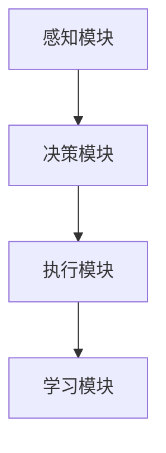

                 


# AI Agent在智能环境保护中的实践

> 关键词：AI Agent, 智能环境保护, 环境监测, 机器学习, 系统架构设计

> 摘要：本文探讨了AI Agent在智能环境保护中的应用，从背景介绍、核心概念、算法原理到系统架构设计，再到项目实战和最佳实践，详细阐述了如何利用AI技术提升环境保护的智能化水平，解决实际环境问题。

---

## 第1章 AI Agent与环境保护的结合背景

### 1.1 AI Agent的基本概念

#### 1.1.1 AI Agent的定义与特点
AI Agent（人工智能代理）是指能够感知环境、自主决策并采取行动以实现目标的智能实体。其特点包括：
- **自主性**：能够在没有外部干预的情况下独立运作。
- **反应性**：能够实时感知环境变化并做出反应。
- **目标导向**：所有行动都以实现特定目标为导向。
- **学习能力**：通过数据和经验不断优化自身行为。

#### 1.1.2 AI Agent的核心技术与实现原理
AI Agent的核心技术包括：
- **感知技术**：通过传感器、摄像头等设备收集环境数据。
- **决策技术**：基于收集的数据，利用机器学习、深度学习等算法进行决策。
- **行动执行**：根据决策结果，通过执行机构（如机器人、无人机）完成任务。

#### 1.1.3 AI Agent在智能系统中的角色与作用
AI Agent在智能系统中扮演着决策者和执行者的双重角色。它能够协调多个子系统，优化资源分配，提高系统效率。

### 1.2 环境保护的现状与挑战

#### 1.2.1 当前环境保护的主要问题
- **环境污染**：空气、水、土壤污染问题日益严重。
- **资源枯竭**：不可再生资源的过度开发导致资源枯竭。
- **生态破坏**：过度开发和工业活动导致生态系统破坏。

#### 1.2.2 环境保护的传统方法与局限性
传统环境保护方法依赖人工监测和管理，效率低、成本高，难以应对复杂的环境问题。

#### 1.2.3 智能化环境保护的必要性与发展趋势
智能化环境保护能够通过AI技术提高监测和管理效率，实现精准治理，降低成本。

### 1.3 AI Agent在环境保护中的应用背景

#### 1.3.1 环境保护与AI技术的结合趋势
AI技术的发展为环境保护提供了新的解决方案，AI Agent在其中扮演重要角色。

#### 1.3.2 AI Agent在环境保护中的潜在价值
- **实时监测**：通过传感器网络实时监测环境数据。
- **智能分析**：利用AI算法分析数据，预测环境变化。
- **自主决策**：根据分析结果，自主采取行动进行治理。

#### 1.3.3 当前AI Agent在环境保护中的应用现状
AI Agent已经在环境监测、污染治理等领域得到初步应用，但仍需进一步完善。

---

## 第2章 AI Agent的核心概念与原理

### 2.1 AI Agent的核心概念

#### 2.1.1 AI Agent的定义与分类
- **定义**：AI Agent是具有感知、决策和行动能力的智能实体。
- **分类**：根据应用场景的不同，AI Agent可以分为工业级、消费级和企业级。

#### 2.1.2 AI Agent的基本组成要素
- **感知模块**：负责收集环境数据。
- **决策模块**：基于感知数据进行分析和决策。
- **行动模块**：根据决策结果执行行动。
- **学习模块**：通过反馈不断优化自身行为。

#### 2.1.3 AI Agent与传统AI的区别
AI Agent不仅能够进行数据分析，还能够自主行动，具有更强的主动性和适应性。

### 2.2 AI Agent的核心原理

#### 2.2.1 AI Agent的感知与决策机制
- **感知**：通过传感器或数据接口获取环境信息。
- **决策**：基于感知数据和预设规则，利用算法进行决策。

#### 2.2.2 AI Agent的自主学习能力
- **监督学习**：通过标记数据进行学习。
- **无监督学习**：通过数据聚类等方式进行学习。
- **强化学习**：通过奖励机制优化决策策略。

#### 2.2.3 AI Agent的多智能体协作原理
- **协作机制**：通过通信协议实现多智能体之间的协作。
- **任务分配**：根据任务特点和智能体能力进行任务分配。
- **协调控制**：确保各智能体协同工作，避免冲突。

---

## 第3章 AI Agent的算法原理

### 3.1 强化学习算法

#### 3.1.1 强化学习的基本原理
强化学习是一种通过试错机制进行学习的算法，智能体通过与环境交互获得奖励，最终找到最优策略。

#### 3.1.2 强化学习的数学模型
- **状态空间**：环境中的各种状态。
- **动作空间**：智能体可以采取的动作。
- **奖励函数**：智能体采取动作后获得的奖励。
- **策略**：智能体在不同状态下采取动作的概率分布。

#### 3.1.3 强化学习的应用场景
在环境保护中，强化学习可以应用于污染治理、资源优化配置等领域。

#### 3.1.4 强化学习的代码实现
```python
import gym
import numpy as np

env = gym.make('CartPole-v1')
env.seed(42)

# 策略参数
theta = np.random.rand(4)
learning_rate = 0.1

for episode in range(1000):
    state = env.reset()
    while True:
        # 状态输入
        x, x_dot, theta, theta_dot = state
        # 策略输出
        action = np.argmax(theta.dot(state))
        # 环境反馈
        next_state, reward, done, _ = env.step(action)
        # 梯度下降更新参数
        target = reward + np.max(theta.dot(next_state))
        error = target - theta.dot(state)
        theta += learning_rate * error * state
        state = next_state
        if done:
            break
```

### 3.2 监督学习算法

#### 3.2.1 监督学习的基本原理
监督学习通过标记数据进行训练，建立输入与输出之间的映射关系。

#### 3.2.2 监督学习的数学模型
- **输入**：环境数据
- **输出**：预测结果
- **损失函数**：衡量预测值与真实值的差异
- **优化算法**：如梯度下降，用于优化模型参数

#### 3.2.3 监督学习的应用场景
在环境监测中，监督学习可以用于污染源识别、环境数据分类。

#### 3.2.4 监督学习的代码实现
```python
import numpy as np
from sklearn.linear_model import LinearRegression

# 生成训练数据
X = np.array([[1], [2], [3], [4]])
y = np.array([2, 4, 6, 8])

# 训练模型
model = LinearRegression()
model.fit(X, y)

# 预测
print(model.predict(np.array([[5]])))  # 输出：[[10]]
```

---

## 第4章 系统分析与架构设计

### 4.1 系统架构设计

#### 4.1.1 系统模块划分
- **感知模块**：负责环境数据的采集。
- **决策模块**：负责数据的分析和决策。
- **执行模块**：负责根据决策结果执行行动。
- **学习模块**：负责优化系统性能。

#### 4.1.2 系统功能设计
- **环境监测**：实时监测环境数据。
- **数据分析**：对数据进行分析和处理。
- **决策控制**：根据分析结果做出决策并执行。

#### 4.1.3 系统架构图


---

## 第5章 项目实战

### 5.1 智能环境监测系统

#### 5.1.1 项目背景
为了实时监测空气质量，设计一个基于AI Agent的智能环境监测系统。

#### 5.1.2 系统实现
```python
import serial
import time

# 串口初始化
ser = serial.Serial('COM3', 9600)

while True:
    # 读取数据
    data = ser.readline().decode().strip()
    # 数据分析
    if data:
        print('空气质量指数：', data)
    # 等待1秒
    time.sleep(1)
```

---

## 第6章 最佳实践与小结

### 6.1 最佳实践

#### 6.1.1 系统设计中的注意事项
- **数据质量**：确保数据的准确性和完整性。
- **系统稳定性**：保证系统的稳定运行。
- **安全性**：确保系统数据的安全性。

#### 6.1.2 开发中的常见问题与解决方案
- **数据不足**：可以通过数据增强或迁移学习解决。
- **计算资源不足**：可以通过分布式计算或边缘计算优化。

### 6.2 小结

### 6.3 注意事项

### 6.4 拓展阅读

---

作者：AI天才研究院 & 禅与计算机程序设计艺术

