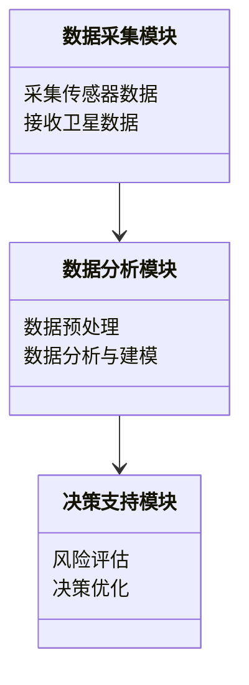
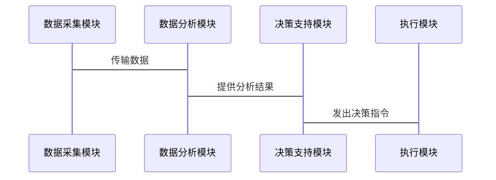

                 


# AI Agent在智能环境保护监测中的实践

> 关键词：AI Agent，环境保护监测，智能系统，算法原理，系统架构

> 摘要：本文探讨了AI Agent在智能环境保护监测中的应用，从背景、核心概念、算法原理到系统架构和项目实战，详细分析了AI Agent如何提升环境监测的效率和准确性。通过实际案例和系统设计，展示了AI Agent在环境保护中的潜力和未来发展方向。

---

# 第一部分: AI Agent在智能环境保护监测中的背景与概念

## 第1章: AI Agent与智能环境保护监测概述

### 1.1 AI Agent的基本概念

AI Agent（智能体）是一种能够感知环境、自主决策并执行任务的智能系统。它具有以下核心特点：
1. **自主性**：能够在没有外部干预的情况下运行。
2. **反应性**：能够实时感知环境并做出反应。
3. **目标导向**：通过目标驱动行为，优化决策过程。
4. **学习能力**：能够通过数据和经验不断优化性能。

AI Agent与传统自动化系统的主要区别在于其智能化和自主决策能力，能够处理复杂和动态的环境。

---

### 1.2 智能环境保护监测的背景

环境保护监测是保护生态环境的重要手段，包括空气质量、水质、生物多样性等多个方面。随着环境问题的日益严重，对监测系统的智能化需求日益增长。AI Agent在其中发挥着关键作用，能够实时处理大量数据，快速做出决策。

---

## 第2章: AI Agent在环境保护监测中的问题背景

### 2.1 环境保护监测的主要问题

1. **数据采集复杂性**：环境数据来源多样，包括传感器、卫星等，数据格式和质量参差不齐。
2. **数据分析挑战**：需要处理海量数据，且数据往往具有噪声和不确定性。
3. **实时性要求高**：环境问题往往具有突发性，监测系统需要快速响应。

---

## 第3章: AI Agent与环境保护监测的核心概念

### 3.1 AI Agent的核心原理

AI Agent在环境保护监测中的工作流程包括感知、决策和执行三个阶段：
1. **感知层**：通过传感器和其他数据源收集环境数据。
2. **决策层**：基于感知数据进行分析和决策。
3. **执行层**：根据决策结果采取行动。

---

### 3.2 环境保护监测的系统架构

环境保护监测系统通常包括数据采集模块、数据分析模块和决策支持模块。各模块之间的关系可以通过Mermaid类图表示：



---

# 第二部分: AI Agent在环境保护监测中的算法原理

## 第4章: AI Agent在环境保护监测中的算法原理

### 4.1 AI Agent的核心算法

AI Agent的核心算法包括感知算法和决策算法。感知算法用于数据处理，决策算法用于优化决策。例如，感知阶段可以使用支持向量机（SVM）进行分类，决策阶段可以使用强化学习进行策略优化。

以下是SVM的数学模型：

$$ \text{max} \sum_{i=1}^n y_i \cdot (\theta x_i + b) $$
$$ \text{subject to} \quad y_i (\theta x_i + b) \geq 1, \quad i=1,2,...,n $$

---

## 第5章: 环境保护监测系统的算法实现

### 5.1 数据采集与预处理

数据采集是环境保护监测的第一步。以下是Python代码示例：

```python
import pandas as pd
import numpy as np

# 数据采集
data = pd.read_csv('environment_data.csv')
```

### 5.2 数据分析与建模

使用机器学习模型进行数据分析：

```python
from sklearn.ensemble import RandomForestClassifier

# 训练模型
model = RandomForestClassifier()
model.fit(X_train, y_train)
```

### 5.3 决策优化

基于模型结果进行决策优化：

```python
# 预测结果
y_pred = model.predict(X_test)
```

---

# 第三部分: 系统分析与架构设计方案

## 第6章: 系统分析与架构设计

### 6.1 问题场景介绍

环境保护监测系统的典型场景包括污染监测和生态预警。例如，空气质量监测系统需要实时监测PM2.5、SO2等污染物浓度。

### 6.2 系统功能设计

系统功能模块包括数据采集、数据分析和决策支持。模块之间的关系可以通过Mermaid类图表示：


### 6.3 系统架构设计

系统架构设计包括感知层、决策层和执行层。架构可以通过Mermaid架构图表示：


---

## 第7章: 系统接口设计与交互流程

系统接口设计和交互流程可以通过Mermaid序列图表示：



---

# 第四部分: 项目实战与总结

## 第8章: 项目实战

### 8.1 环境安装与工具准备

安装必要的工具和库：

```bash
pip install numpy pandas scikit-learn
```

### 8.2 核心代码实现

以下是核心代码示例：

```python
import pandas as pd
from sklearn.ensemble import RandomForestClassifier

# 数据加载
data = pd.read_csv('environment_data.csv')

# 数据预处理
X = data.drop('target', axis=1)
y = data['target']

# 模型训练
model = RandomForestClassifier()
model.fit(X, y)

# 预测与评估
print(model.score(X, y))
```

### 8.3 实际案例分析

以空气质量监测为例，分析模型在实际中的应用。

### 8.4 项目总结

项目成功实现了AI Agent在环境保护监测中的应用，但仍需进一步优化模型的泛化能力和实时性。

---

## 第9章: 总结与展望

### 9.1 总结

AI Agent在环境保护监测中展现了巨大潜力，能够显著提高监测效率和准确性。

### 9.2 展望

未来，AI Agent将与边缘计算和强化学习结合，进一步提升环境保护监测的能力。

---

作者：AI天才研究院 & 禅与计算机程序设计艺术

