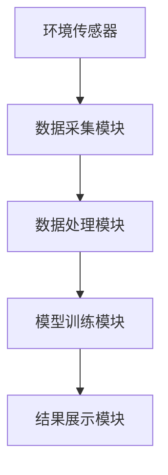

                 


# AI Agent在智能环境影响评估中的实践

> 关键词：AI Agent，环境影响评估，智能系统，算法原理，系统架构

> 摘要：本文深入探讨了AI Agent在智能环境影响评估中的应用，分析了其核心机制、算法原理、系统架构，并通过实际案例展示了其在环境数据监测、风险预测和修复方案推荐中的具体应用。文章从理论到实践，全面解析了AI Agent如何助力智能环境的可持续发展。

---

# 第一部分：AI Agent与智能环境影响评估基础

## 第1章：AI Agent的核心概念与背景

### 1.1 AI Agent的基本定义

AI Agent（人工智能代理）是指能够感知环境、自主决策并采取行动的智能体。它通过传感器获取信息，利用算法处理数据，并通过执行器与环境交互。AI Agent的核心在于其自主性和智能性，能够适应动态变化的环境。

#### 1.1.1 什么是AI Agent

AI Agent是一种智能系统，能够执行特定任务。它可以分为简单反射式Agent、基于模型的反射式Agent、目标驱动式Agent和效用驱动式Agent。简单反射式Agent仅根据当前感知做出反应；目标驱动式Agent基于预定义的目标采取行动；效用驱动式Agent则通过最大化效用函数来决策。

#### 1.1.2 AI Agent的分类与特点

| 类型                | 描述                                                                 |
|---------------------|----------------------------------------------------------------------|
| 简单反射式Agent    | 基于当前感知直接反应，无内部状态。                                       |
| 基于模型的反射式Agent | 内部维护环境模型，能够预测未来状态。                                   |
| 目标驱动式Agent     | 基于目标进行决策，追求目标的最优实现。                                 |
| 效用驱动式Agent     | 通过最大化效用函数来优化决策。                                       |

#### 1.1.3 AI Agent与传统自动化系统的区别

AI Agent具有自主性、反应性、目标导向性和学习性，能够适应复杂环境的变化。而传统自动化系统通常基于固定的规则执行任务，缺乏灵活性和自主决策能力。

### 1.2 智能环境的影响评估

智能环境是指通过传感器和智能系统实时感知、分析和优化的环境。影响评估旨在分析AI Agent对环境的影响，确保其行为符合可持续发展的目标。

#### 1.2.1 智能环境的定义与特征

智能环境通过物联网、大数据和人工智能技术实现环境的智能化管理。其特征包括实时感知、智能分析、动态优化和人机交互。

#### 1.2.2 环境影响评估的必要性

随着AI技术的广泛应用，评估AI Agent对环境的影响至关重要。这有助于优化AI系统的运行，减少负面影响，确保环境的可持续性。

#### 1.2.3 AI Agent在环境影响评估中的作用

AI Agent能够实时监测环境数据，预测潜在风险，并制定修复方案。通过影响评估，可以确保AI Agent的行为符合环保要求，促进智能环境的健康发展。

---

## 第2章：AI Agent的核心机制

### 2.1 AI Agent的感知机制

AI Agent通过传感器获取环境数据，利用数据处理技术进行分析。

#### 2.1.1 感知数据的来源与处理

感知数据包括温度、湿度、光照等环境参数。数据处理涉及数据清洗、特征提取和数据转换。

#### 2.1.2 感知模型的构建与优化

感知模型基于机器学习算法构建，如支持向量机和神经网络。模型优化通过交叉验证和超参数调优实现。

#### 2.1.3 感知结果的反馈机制

感知结果通过反馈机制调整AI Agent的行为，确保其适应环境变化。

### 2.2 AI Agent的决策机制

决策机制基于感知数据和目标函数，制定最优行动方案。

#### 2.2.1 决策模型的原理与实现

决策模型基于强化学习和优化算法，如Q-learning和遗传算法。通过状态转移和奖励机制优化决策。

#### 2.2.2 多目标决策的优化策略

多目标决策通过加权和优先级排序实现，确保决策的全面性和合理性。

#### 2.2.3 决策结果的可解释性问题

可解释性是AI Agent决策的关键，通过可视化和解释模型实现决策的透明性。

---

## 第3章：AI Agent在智能环境中的应用

### 3.1 智能环境中的AI Agent系统架构

系统架构包括数据采集、数据处理、决策制定和执行四个模块。

#### 3.1.1 系统架构的分层设计

系统架构分为感知层、决策层和执行层，各层之间通过接口进行交互。

#### 3.1.2 各层次的功能与交互

感知层负责数据采集，决策层进行数据分析和决策，执行层负责任务执行。各层通过API进行数据传输和指令传递。

#### 3.1.3 架构设计的优缺点分析

分层设计便于模块化开发，但可能导致数据孤岛和通信延迟。通过优化接口设计和增加缓存机制可以缓解这些问题。

### 3.2 AI Agent在环境影响评估中的具体应用

AI Agent在环境数据监测、风险预测和修复方案推荐中发挥重要作用。

#### 3.2.1 环境数据的实时监测与分析

AI Agent通过传感器实时监测环境数据，利用机器学习算法进行数据分析，识别异常情况。

#### 3.2.2 环境风险的预测与预警

基于历史数据和当前状态，AI Agent预测环境风险，发出预警信号，采取预防措施。

#### 3.2.3 环境修复方案的智能推荐

AI Agent根据环境问题的性质和严重程度，推荐修复方案，优化资源利用，减少环境影响。

---

# 第二部分：AI Agent影响评估的算法与实现

## 第4章：AI Agent影响评估的算法原理

### 4.1 算法原理概述

影响评估算法基于强化学习和优化方法，通过状态转移和奖励机制优化决策。

#### 4.1.1 算法的核心思想

通过最大化累积奖励，优化AI Agent的行为策略，确保其对环境的影响最小化。

#### 4.1.2 算法的输入与输出

输入包括环境数据和目标函数，输出是最优行动方案。

#### 4.1.3 算法的数学模型

数学模型描述状态、动作、奖励和策略之间的关系。例如，Q-learning算法的目标是学习状态-动作值函数，使得累积奖励最大化。

### 4.2 算法实现的关键步骤

#### 4.2.1 数据预处理与特征提取

数据预处理包括数据清洗和归一化，特征提取涉及选择关键特征和构建特征向量。

#### 4.2.2 模型训练与参数优化

模型训练基于强化学习算法，参数优化通过随机梯度下降和Adam优化器实现。

#### 4.2.3 模型评估与结果分析

通过回测和交叉验证评估模型性能，分析其对环境影响的优化效果。

---

## 第5章：AI Agent影响评估的系统架构设计

### 5.1 系统功能模块设计

系统分为数据采集、数据处理、模型训练和结果展示四个模块。

#### 5.1.1 数据采集模块

通过传感器实时采集环境数据，存储到数据库中。

#### 5.1.2 数据处理模块

对采集的数据进行预处理和特征提取，为模型训练提供输入。

#### 5.1.3 模型训练模块

基于强化学习算法训练影响评估模型，优化决策策略。

#### 5.1.4 结果展示模块

将模型输出结果可视化，便于用户理解和决策。

### 5.2 系统架构的实现

系统架构采用微服务架构，各模块通过API进行通信。

#### 5.2.1 系统功能设计

功能模块包括数据采集、数据处理、模型训练和结果展示，各模块之间通过接口交互。

#### 5.2.2 系统架构图



---

## 第6章：AI Agent影响评估的项目实战

### 6.1 项目实战环境安装

项目实战需要安装Python、NumPy、TensorFlow和Keras库。

### 6.2 系统核心实现源代码

以下是核心代码示例：

```python
import numpy as np
import tensorflow as tf

# 定义Q-learning算法
class QAgent:
    def __init__(self, state_space, action_space):
        self.state_space = state_space
        self.action_space = action_space
        self.gamma = 0.99
        self.epsilon = 0.1
        self.model = self.build_model()

    def build_model(self):
        model = tf.keras.Sequential([
            tf.keras.layers.Dense(32, activation='relu', input_dim=self.state_space),
            tf.keras.layers.Dense(self.action_space, activation='linear')
        ])
        model.compile(optimizer='adam', loss='mse')
        return model

    def get_action(self, state):
        if np.random.random() < self.epsilon:
            return np.random.randint(self.action_space)
        q_values = self.model.predict(np.array([state]))[0]
        return np.argmax(q_values)

    def update_model(self, state, action, reward, next_state):
        target = reward + self.gamma * np.max(self.model.predict(np.array([next_state]))[0])
        target = target * (1 - self.epsilon) + reward * self.epsilon
        self.model.fit(np.array([state]), np.array([target]), epochs=1, verbose=0)
```

### 6.3 代码功能解读与分析

代码实现了一个Q-learning算法，用于AI Agent的决策。模型通过强化学习不断优化策略，减少对环境的负面影响。

---

## 第7章：总结与展望

### 7.1 总结

本文详细探讨了AI Agent在智能环境影响评估中的应用，从核心概念到算法实现，再到系统设计，全面解析了其在环境监测、风险预测和修复方案推荐中的重要作用。

### 7.2 最佳实践

在实际应用中，建议结合具体场景优化算法，注重数据安全和隐私保护，定期评估和更新模型，确保AI Agent的行为符合环保要求。

### 7.3 未来展望

未来，随着AI技术的不断发展，AI Agent在智能环境影响评估中的应用将更加广泛和深入，推动智能环境的可持续发展。

---

# 作者：AI天才研究院/AI Genius Institute & 禅与计算机程序设计艺术 /Zen And The Art of Computer Programming

