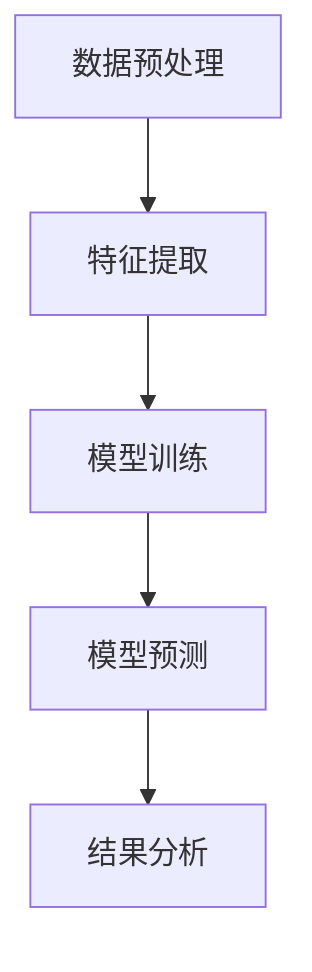
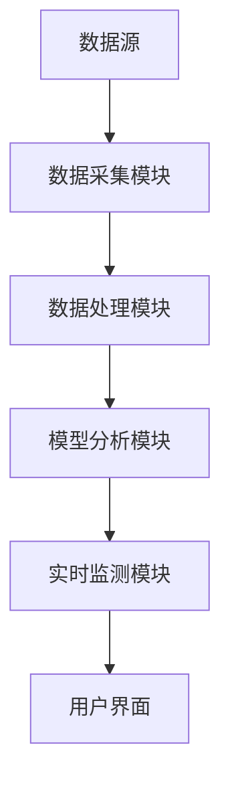

                 


# AI Agent在智能环境污染溯源中的实践

## 关键词
AI Agent, 智能环境污染, 污染溯源, 机器学习, 深度学习, 实时监测

## 摘要
本文探讨AI Agent在智能环境污染溯源中的应用，从背景、原理到系统设计和实际案例，全面分析如何利用AI技术解决环境监测难题，提供高效的污染源识别和实时监测解决方案。

---

# 目录大纲：《AI Agent在智能环境污染溯源中的实践》

## 第一部分：环境问题与AI Agent概述

### 第1章：环境问题与AI Agent的背景

#### 1.1 环境问题的严重性
- 1.1.1 环境污染的现状与挑战
  - 当前全球面临的空气和水污染问题
  - 污染对人类健康和生态系统的影响
- 1.1.2 传统环境监测方法的局限性
  - 依赖人工监测和固定传感器的不足
- 1.1.3 AI技术在环境监测中的潜力
  - AI技术如何提高监测效率和准确性

#### 1.2 AI Agent的基本概念
- 1.2.1 什么是AI Agent
  - AI Agent的定义与特征
  - AI Agent与传统软件的区别
- 1.2.2 AI Agent的类型与特点
  - 单一Agent与多Agent系统
  - 反应式与基于模型的Agent
- 1.2.3 AI Agent在环境监测中的应用
  - AI Agent如何辅助污染溯源

## 第二部分：AI Agent的核心原理

### 第2章：AI Agent的核心概念与原理

#### 2.1 AI Agent的核心概念
- 2.1.1 知识表示与推理
  - 知识表示方法：符号逻辑、语义网络
  - 推理机制：演绎推理、归纳推理
- 2.1.2 问题求解与规划
  - 问题求解算法：深度优先搜索、广度优先搜索
  - 规划算法：A*、AO*算法
- 2.1.3 多智能体协作
  - 多Agent系统中的通信与协调

#### 2.2 AI Agent在环境污染溯源中的应用
- 2.2.1 数据采集与处理
  - 数据来源：传感器、卫星、公开数据集
  - 数据预处理：清洗、特征提取
- 2.2.2 污染源识别与追踪
  - 使用机器学习模型识别污染源
  - 基于AI Agent的污染路径追踪
- 2.2.3 实时监测与预警
  - 实时数据处理与反馈
  - 预警系统的设计与实现

## 第三部分：AI Agent的算法原理

### 第3章：AI Agent的核心算法

#### 3.1 机器学习算法
- 3.1.1 线性回归与分类
  - 线性回归：预测污染物浓度
  - 分类算法：识别污染类型
- 3.1.2 支持向量机（SVM）
  - SVM在模式识别中的应用
- 3.1.3 神经网络与深度学习
  - 卷积神经网络（CNN）在图像识别中的应用
  - 循环神经网络（RNN）在时间序列预测中的应用

#### 3.2 算法流程图


#### 3.3 代码实现
```python
import pandas as pd
from sklearn.model_selection import train_test_split
from sklearn.linear_model import LinearRegression

# 数据加载与预处理
data = pd.read_csv('environmental_data.csv')
X = data[['temperature', 'humidity', 'wind_speed']]
y = data['pollution_level']

# 数据分割
X_train, X_test, y_train, y_test = train_test_split(X, y, test_size=0.2)

# 模型训练
model = LinearRegression()
model.fit(X_train, y_train)

# 模型预测
y_pred = model.predict(X_test)
```

#### 3.4 数学公式
- 线性回归模型：
  $$ y = \beta_0 + \beta_1 x_1 + \beta_2 x_2 + ... + \beta_n x_n + \epsilon $$
- 支持向量机的目标函数：
  $$ \text{minimize} \frac{1}{2} ||\beta||^2 $$
  $$ \text{subject to} \quad y_i (\beta \cdot x_i + \beta_0) \geq 1, \forall i $$

## 第四部分：系统分析与架构设计

### 第4章：系统架构设计方案

#### 4.1 系统功能设计
- 数据采集模块
  - 从传感器、数据库获取实时环境数据
- 数据处理模块
  - 数据清洗、特征提取
- 模型分析模块
  - 使用机器学习模型进行污染源识别
- 实时监测模块
  - 提供实时预警和可视化界面

#### 4.2 系统架构设计


#### 4.3 系统接口设计
- 数据接口：与传感器和数据库的连接
- API接口：提供实时数据和分析结果
- 用户接口：可视化界面展示监测结果

## 第五部分：项目实战

### 第5章：环境数据监测系统开发

#### 5.1 项目背景
- 某城市空气质量监测系统开发

#### 5.2 系统核心实现
- 数据采集：使用传感器获取空气质量数据
- 数据预处理：清洗和特征提取
- 模型训练：使用随机森林算法进行污染源识别
- 实时监测：部署Web界面展示实时数据

#### 5.3 代码实现
```python
import pandas as pd
from sklearn.ensemble import RandomForestRegressor

# 数据加载与预处理
data = pd.read_csv('air_quality.csv')
X = data[['PM2.5', 'PM10', 'NO2']]
y = data['pollution_level']

# 数据分割
X_train, X_test, y_train, y_test = train_test_split(X, y, test_size=0.2)

# 模型训练
model = RandomForestRegressor(n_estimators=100)
model.fit(X_train, y_train)

# 模型预测
y_pred = model.predict(X_test)
```

#### 5.4 案例分析
- 数据采集：从传感器获取实时空气质量数据
- 数据预处理：处理缺失值和异常值
- 模型训练：使用随机森林算法训练污染源识别模型
- 实时监测：部署Web界面，展示实时空气质量数据和预测结果

## 第六部分：总结与展望

### 第6章：总结与展望

#### 6.1 总结
- 本文介绍了AI Agent在智能环境污染溯源中的应用
- 详细讲解了核心算法和系统架构设计
- 通过实际案例展示了AI技术在环境监测中的潜力

#### 6.2 展望
- 结合物联网技术，进一步提高监测精度
- 开发更智能的预警系统，实现主动式污染控制
- 探索AI Agent在更多环境问题中的应用

## 作者信息

作者：AI天才研究院/AI Genius Institute  
联系邮箱：contact@ai-genius.org  
网址：https://www.ai-genius.org

---

**本文由AI天才研究院撰写，转载请注明出处。**

