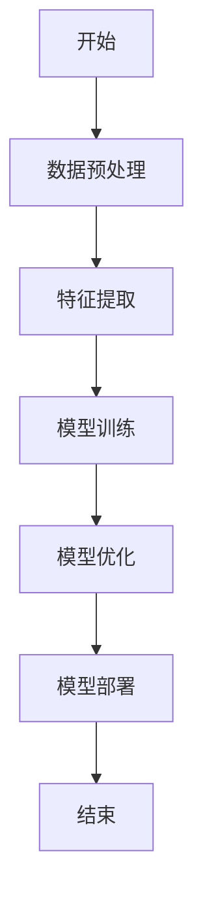
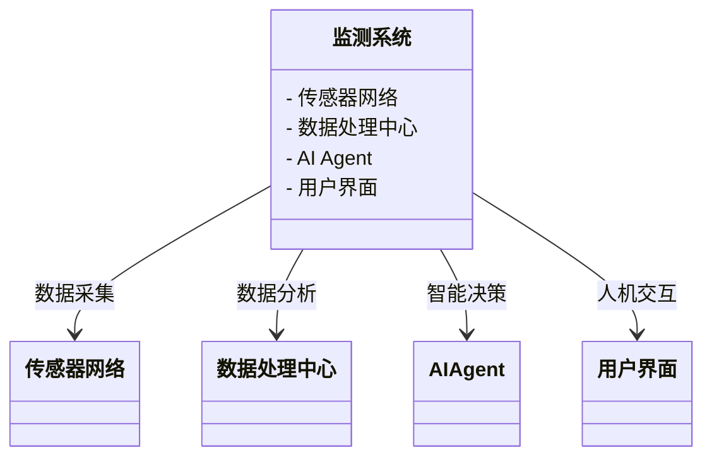
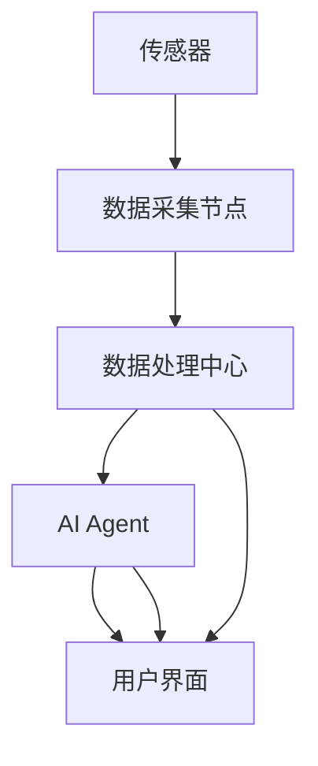

                 


# AI Agent在智能环境污染监测中的实践

> 关键词：AI Agent, 智能环境污染监测, 机器学习, 深度学习, 环境保护技术

> 摘要：本文系统地探讨了AI Agent在智能环境污染监测中的应用，从背景、核心概念、算法原理、系统架构到项目实战，详细阐述了AI Agent如何通过机器学习、深度学习和强化学习等技术手段，实现对环境污染的智能监测与预警。通过实际案例分析，本文展示了AI Agent在环境监测中的巨大潜力和实际应用价值。

---

# 第一部分: AI Agent在智能环境污染监测中的背景与概念

## 第1章: 智能环境污染监测的背景与挑战

### 1.1 环境污染监测的背景
- 1.1.1 当前环境污染的主要问题：工业排放、交通尾气、农业污染等对环境的严重影响。
- 1.1.2 环境污染监测的重要性：及时发现和预警环境污染，保护生态系统和人类健康。
- 1.1.3 AI技术在环境监测中的应用潜力：通过数据驱动和智能分析，提高监测效率和准确性。

### 1.2 AI Agent的基本概念
- 1.2.1 AI Agent的定义：具有感知环境、自主决策和执行任务的智能实体。
- 1.2.2 AI Agent的核心特点：自主性、反应性、目标导向和协作性。
- 1.2.3 AI Agent与传统监测技术的区别：传统监测依赖固定传感器，AI Agent具备智能决策和自适应能力。

### 1.3 AI Agent在环境污染监测中的应用前景
- 1.3.1 AI Agent在环境监测中的潜在应用领域：实时数据分析、污染源追踪、预测预警等。
- 1.3.2 企业采用AI Agent的优势：提高监测效率、降低运营成本、增强决策能力。
- 1.3.3 AI Agent应用的挑战与机遇：数据隐私、计算资源需求、技术成熟度等问题，以及技术创新带来的市场机会。

### 1.4 本章小结
本章通过分析环境污染监测的背景和挑战，阐述了AI Agent的核心概念及其在环境监测中的应用潜力，为后续章节奠定了基础。

---

## 第2章: AI Agent与环境污染监测的核心概念

### 2.1 核心概念与原理
- 2.1.1 AI Agent的基本原理：通过感知环境数据，结合内部模型和规则，生成决策并执行。
- 2.1.2 环境污染监测的基本原理：通过传感器采集环境数据，结合数据分析技术进行污染评估。
- 2.1.3 AI Agent在环境污染监测中的工作流程：数据采集、特征提取、模型训练、决策生成和结果输出。

### 2.2 核心概念对比分析
| 对比维度 | AI Agent | 传统传感器 | 数据驱动监测 | 规则驱动监测 |
|----------|-----------|------------|--------------|--------------|
| 数据来源 | 多源数据融合 | 单一传感器数据 | 大数据分析 | 基于规则的数据 |
| 决策方式 | 自主学习和优化 | 固定规则 | 数据驱动 | 基于规则 |

### 2.3 环境污染监测的实体关系图
```mermaid
er
  actor: 监测系统
  agent: AI Agent
  environment: 环境
  sensor: 传感器
  data: 数据
  rules: 规则库
  actor --> sensor: 部署传感器
  sensor --> data: 采集数据
  data --> agent: 输入数据
  agent --> rules: 参考规则
  agent --> environment: 输出监测结果
```

### 2.4 本章小结
本章通过核心概念和对比分析，深入探讨了AI Agent在环境污染监测中的工作原理及其与其他技术的区别，为后续算法实现和系统设计提供了理论基础。

---

# 第二部分: AI Agent的算法原理与实现

## 第3章: AI Agent的算法原理与实现

### 3.1 AI Agent的核心算法
- 3.1.1 机器学习算法在AI Agent中的应用：监督学习、无监督学习和半监督学习。
- 3.1.2 深度学习算法在AI Agent中的应用：神经网络、卷积神经网络和循环神经网络。
- 3.1.3 强化学习算法在AI Agent中的应用：Q-learning、策略梯度和Actor-Critic方法。

### 3.2 算法实现流程


### 3.3 算法实现代码示例
```python
import numpy as np
from sklearn import datasets
from sklearn.model_selection import train_test_split
from sklearn.linear_model import LinearRegression

# 生成数据
X, y = datasets.make_regression(n_samples=100, n_features=1, noise=0.5)

# 划分训练集和测试集
X_train, X_test, y_train, y_test = train_test_split(X, y, test_size=0.2)

# 训练线性回归模型
model = LinearRegression()
model.fit(X_train, y_train)

# 预测和评估
y_pred = model.predict(X_test)
print("预测值:", y_pred)
print("真实值:", y_test)
```

### 3.4 数学模型与公式
- 线性回归模型：$$ y = \beta_0 + \beta_1 x + \epsilon $$
- 误差平方损失函数：$$ L = \frac{1}{2n} \sum_{i=1}^{n} (y_i - \hat{y}_i)^2 $$
- 最小二乘法求解：$$ \hat{\beta} = (X^T X)^{-1} X^T y $$

### 3.5 本章小结
本章详细介绍了AI Agent的核心算法及其实现流程，通过代码示例和数学公式，深入讲解了算法原理和应用场景。

---

## 第4章: 环境污染监测的数学模型与公式

### 4.1 环境污染监测的基本模型
- 空气质量指数模型：$$ AQI = a \cdot PM_2.5 + b \cdot NO_2 + c \cdot CO $$
- 水质监测模型：$$ WQI = d \cdot pH + e \cdot COD + f \cdot BOD $$

### 4.2 神经网络模型在环境污染监测中的应用
- 网络结构：输入层、隐藏层和输出层。
- 激活函数：$$ sigmoid(x) = \frac{1}{1 + e^{-x}} $$
- 损失函数：$$ loss = \frac{1}{2} \sum (y_i - \hat{y}_i)^2 $$

### 4.3 强化学习在环境污染监测中的应用
- 状态空间：环境参数、传感器数据。
- 行动空间：传感器部署位置、监测频率。
- 奖励函数：$$ R = r \cdot \text{监测精度} + s \cdot \text{资源消耗} $$

### 4.4 本章小结
本章通过数学模型和公式，详细探讨了AI Agent在环境污染监测中的实现方法，为后续系统设计提供了理论支持。

---

# 第三部分: 系统分析与架构设计方案

## 第5章: 系统分析与架构设计

### 5.1 项目场景介绍
- 系统目标：实现对空气质量和水质的实时监测与预警。
- 项目范围：覆盖城市区域，支持多种传感器和数据源。

### 5.2 系统功能设计


### 5.3 系统架构设计


### 5.4 系统接口设计
- 传感器接口：API接口，接收传感器数据。
- 用户界面接口：HTTP接口，提供监测结果和预警信息。

### 5.5 本章小结
本章通过系统分析与架构设计，明确了AI Agent在环境污染监测中的系统结构和功能模块，为后续实现奠定了基础。

---

## 第6章: 项目实战与实现

### 6.1 环境安装
- 安装Python、TensorFlow、Keras等工具。
- 配置传感器和数据采集设备。

### 6.2 系统核心实现
```python
import numpy as np
import tensorflow as tf

# 定义神经网络模型
model = tf.keras.Sequential([
    tf.keras.layers.Dense(64, activation='relu'),
    tf.keras.layers.Dense(1, activation='linear')
])

# 编译模型
model.compile(optimizer='adam', loss='mean_squared_error')

# 训练模型
model.fit(X_train, y_train, epochs=100, batch_size=32)
```

### 6.3 案例分析与详细解读
- 数据采集：通过传感器获取PM2.5、NO2等数据。
- 数据处理：清洗、归一化和特征提取。
- 模型训练：使用神经网络模型进行训练，评估模型性能。
- 预警系统：基于AI Agent的预测结果，触发预警机制。

### 6.4 本章小结
本章通过项目实战，详细讲解了AI Agent在环境污染监测中的实现过程，从环境安装到系统部署，为读者提供了实践指导。

---

# 第四部分: 总结与展望

## 第7章: 总结与展望

### 7.1 最佳实践 tips
- 数据质量：确保数据的准确性和完整性。
- 模型优化：定期更新模型，提高预测精度。
- 系统维护：定期检查传感器和数据处理设备，确保系统稳定运行。

### 7.2 小结
本文系统地探讨了AI Agent在智能环境污染监测中的应用，从理论到实践，详细阐述了AI Agent的核心概念、算法实现和系统设计。

### 7.3 注意事项
- 数据隐私：确保监测数据的安全性。
- 技术局限：AI Agent目前仍面临数据依赖性和计算资源需求高的问题。
- 技术发展：随着AI技术的进步，AI Agent在环境监测中的应用将更加广泛。

### 7.4 拓展阅读
- 推荐阅读《深度学习实战》和《机器学习应用开发》等书籍。
- 关注最新的AI与环境监测技术动态。

### 7.5 本章小结
本章总结了全文的主要内容，并提出了未来的研究方向和技术发展趋势，为读者进一步学习和实践提供了方向。

---

# 作者：AI天才研究院/AI Genius Institute & 禅与计算机程序设计艺术 /Zen And The Art of Computer Programming

---

通过以上目录结构，我们可以看到《AI Agent在智能环境污染监测中的实践》这本书将系统地从背景、概念、算法、系统设计到项目实现，全面探讨AI Agent在环境污染监测中的应用。每章内容详实，结构清晰，旨在为读者提供从理论到实践的完整指导。

