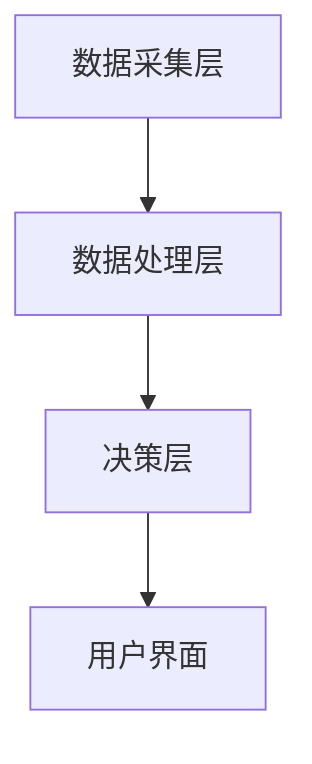

                 

# AI Agent在智能环境监测中的应用

## 关键词：AI Agent, 环境监测, 人工智能, 强化学习, 系统架构

## 摘要

随着人工智能技术的快速发展，AI Agent（人工智能代理）在智能环境监测中的应用变得越来越广泛。本文系统地介绍了AI Agent的基本概念、核心原理及其在环境监测中的应用场景。通过详细讲解算法原理、系统架构设计和实际项目案例，本文旨在帮助读者深入理解AI Agent在智能环境监测中的技术细节和实际应用价值。文章还提供了最佳实践建议，帮助读者更好地将AI Agent技术应用于实际环境监测系统中。

---

# 第1章 AI Agent与智能环境监测概述

## 1.1 AI Agent的基本概念

### 1.1.1 AI Agent的定义与特点

AI Agent（人工智能代理）是一种智能系统，能够感知环境、自主决策并执行任务。它具有以下特点：
- **自主性**：能够在没有外部干预的情况下自主运行。
- **反应性**：能够实时感知环境变化并做出响应。
- **目标导向**：具有明确的目标，能够优化决策以实现目标。
- **学习能力**：通过学习和经验提升自身的性能。

### 1.1.2 AI Agent的核心功能与作用

AI Agent的核心功能包括：
- **感知环境**：通过传感器或其他数据源获取环境信息。
- **数据处理**：对获取的数据进行分析和处理。
- **决策制定**：基于分析结果做出最优决策。
- **执行操作**：根据决策执行相应的操作。

### 1.1.3 AI Agent与传统自动化系统的区别

AI Agent与传统自动化系统的区别在于其智能化和自主性。传统自动化系统基于固定的规则运行，而AI Agent能够学习和适应环境变化，具有更强的灵活性和适应性。

## 1.2 智能环境监测的背景与意义

### 1.2.1 环境监测的基本概念与重要性

环境监测是指对环境中的各种因素（如温度、湿度、空气质量等）进行实时监控和分析的过程。随着环境污染问题的日益严重，环境监测变得尤为重要。

### 1.2.2 智能环境监测的发展历程

环境监测技术经历了从人工监测到半自动化监测，再到智能化监测的演变过程。AI Agent的引入标志着环境监测技术进入了一个新的发展阶段。

### 1.2.3 AI Agent在环境监测中的优势

AI Agent在环境监测中的优势包括：
- **高精度**：能够准确感知环境信息。
- **实时性**：能够实时处理数据并做出响应。
- **适应性**：能够根据环境变化调整自身行为。

## 1.3 AI Agent在环境监测中的应用场景

### 1.3.1 环境数据采集与处理

AI Agent能够通过多种传感器采集环境数据，并对数据进行预处理和分析。

### 1.3.2 环境异常检测与预警

AI Agent能够实时检测环境异常情况，并通过预警系统通知相关人员。

### 1.3.3 环境优化与决策支持

AI Agent能够基于环境数据提供优化建议，帮助决策者做出更明智的决策。

## 1.4 本章小结

本章介绍了AI Agent的基本概念、核心功能及其在环境监测中的应用场景。通过分析AI Agent与传统自动化系统的区别，读者可以更好地理解AI Agent在环境监测中的独特优势。

---

# 第2章 AI Agent的核心概念与原理

## 2.1 AI Agent的定义与分类

### 2.1.1 AI Agent的定义

AI Agent是一种能够感知环境、自主决策并执行任务的智能系统。

### 2.1.2 AI Agent的分类

AI Agent可以根据其智能水平和应用场景分为以下几类：
- **反应式AI Agent**：基于当前感知做出反应，适用于实时环境监测。
- **认知式AI Agent**：具有复杂推理和规划能力，适用于复杂环境监测任务。

### 2.1.3 AI Agent与智能体的区别

AI Agent是一种智能体，但智能体还包括其他类型，如软件智能体和物理智能体。

## 2.2 AI Agent的基本原理

### 2.2.1 状态感知与环境建模

AI Agent通过传感器获取环境信息，并构建环境模型以理解环境状态。

### 2.2.2 行为决策与执行

AI Agent基于环境模型和目标函数做出决策，并通过执行器执行相应的操作。

### 2.2.3 学习与优化

AI Agent通过机器学习算法不断优化自身的决策模型，提升性能。

## 2.3 AI Agent的核心算法

### 2.3.1 强化学习

强化学习是一种通过奖励机制优化决策的算法。其基本原理如下：

1. **状态空间**：环境中的各种状态。
2. **动作空间**：AI Agent可以执行的动作。
3. **奖励函数**：根据动作的结果给予奖励或惩罚。
4. **策略优化**：通过不断试验优化策略，使奖励最大化。

### 2.3.2 监督学习

监督学习是一种基于标注数据进行模型训练的算法。其流程如下：

1. **数据采集**：收集带标注的数据。
2. **特征提取**：提取数据的特征。
3. **模型训练**：使用训练数据训练模型。
4. **模型预测**：使用训练好的模型进行预测。

### 2.3.3 无监督学习

无监督学习是一种基于未标注数据进行模式识别的算法。其流程如下：

1. **数据采集**：收集未标注的数据。
2. **数据预处理**：对数据进行清洗和预处理。
3. **聚类分析**：将数据分成不同的类别。
4. **结果分析**：分析聚类结果，发现潜在的模式。

## 2.4 本章小结

本章详细讲解了AI Agent的核心概念和基本原理，包括其分类、状态感知、行为决策以及核心算法。通过分析强化学习、监督学习和无监督学习的原理和流程，读者可以更好地理解AI Agent在环境监测中的技术基础。

---

# 第3章 AI Agent在环境监测中的算法原理

## 3.1 环境监测中的强化学习应用

### 3.1.1 强化学习在环境监测中的应用场景

强化学习适用于需要实时决策和优化的环境监测任务，如动态调整监测参数和优化监测路径。

### 3.1.2 强化学习算法流程

1. **环境建模**：构建环境模型，定义状态、动作和奖励。
2. **策略选择**：选择初始策略。
3. **动作执行**：根据当前状态执行动作。
4. **奖励反馈**：根据动作结果获得奖励。
5. **策略更新**：根据奖励更新策略，优化模型。

### 3.1.3 强化学习的数学模型

强化学习的核心数学模型是Q-learning算法，其更新公式如下：

$$ Q(s, a) = Q(s, a) + \alpha (r + \gamma \max Q(s', a') - Q(s, a)) $$

其中：
- \( Q(s, a) \) 表示状态 \( s \) 下执行动作 \( a \) 的价值。
- \( \alpha \) 表示学习率。
- \( r \) 表示奖励。
- \( \gamma \) 表示折扣因子。
- \( s' \) 表示下一个状态。

## 3.2 监督学习在环境监测中的应用

### 3.2.1 监督学习的应用场景

监督学习适用于基于历史数据进行环境预测和分类的任务，如空气质量预测和污染源分类。

### 3.2.2 监督学习算法流程

1. **数据采集**：收集带标注的环境数据。
2. **特征提取**：提取数据的特征，如温度、湿度等。
3. **模型训练**：使用训练数据训练模型。
4. **模型预测**：使用训练好的模型进行预测。

### 3.2.3 监督学习的数学模型

监督学习的数学模型以线性回归为例，其目标函数为：

$$ \min_{\theta} \sum_{i=1}^{n} (y_i - \theta x_i)^2 $$

其中：
- \( y_i \) 表示真实值。
- \( \theta \) 表示模型参数。
- \( x_i \) 表示输入特征。

## 3.3 无监督学习在环境监测中的应用

### 3.3.1 无监督学习的应用场景

无监督学习适用于需要发现潜在模式和结构的任务，如异常检测和数据聚类。

### 3.3.2 无监督学习算法流程

1. **数据采集**：收集未标注的环境数据。
2. **数据预处理**：对数据进行清洗和标准化。
3. **聚类分析**：使用聚类算法将数据分成不同的类别。
4. **结果分析**：分析聚类结果，发现潜在的模式。

### 3.3.3 无监督学习的数学模型

以K-means聚类算法为例，其目标函数为：

$$ \min_{K} \sum_{i=1}^{n} \min_{k=1}^{K} \|x_i - c_k\|^2 $$

其中：
- \( K \) 表示聚类的数量。
- \( c_k \) 表示第 \( k \) 个聚类的中心。
- \( x_i \) 表示第 \( i \) 个数据点。

## 3.4 本章小结

本章详细讲解了AI Agent在环境监测中的算法原理，包括强化学习、监督学习和无监督学习的应用场景和流程。通过数学公式和算法流程图的展示，读者可以更好地理解这些算法在环境监测中的具体应用。

---

# 第4章 系统分析与架构设计

## 4.1 系统应用场景介绍

### 4.1.1 环境监测系统的需求分析

环境监测系统需要满足实时性、准确性和可靠性的需求。

### 4.1.2 系统功能需求

系统需要实现数据采集、数据处理、异常检测和预警等功能。

## 4.2 系统功能模块设计

### 4.2.1 数据采集模块

数据采集模块负责通过传感器采集环境数据。

### 4.2.2 数据处理模块

数据处理模块对采集到的数据进行预处理和分析。

### 4.2.3 异常检测模块

异常检测模块实时检测环境中的异常情况，并触发预警。

### 4.2.4 决策支持模块

决策支持模块基于分析结果提供优化建议和决策支持。

## 4.3 系统架构设计

### 4.3.1 系统架构概述

系统架构包括数据采集层、数据处理层和决策层。

### 4.3.2 系统架构图

### 4.3.3 接口设计

系统需要设计数据采集接口、数据处理接口和用户界面接口。

### 4.3.4 系统交互流程

系统交互流程如下：
1. 数据采集层采集环境数据。
2. 数据处理层对数据进行处理和分析。
3. 决策层基于分析结果做出决策。
4. 用户界面展示结果和预警信息。

## 4.4 本章小结

本章详细讲解了环境监测系统的应用场景、功能模块设计和系统架构设计。通过系统架构图和交互流程图的展示，读者可以更好地理解系统的整体结构和工作流程。

---

# 第5章 项目实战：空气质量监测系统

## 5.1 项目背景与目标

### 5.1.1 项目背景

空气质量监测是环境监测的重要组成部分，对保护人类健康和环境安全具有重要意义。

### 5.1.2 项目目标

本项目旨在开发一个基于AI Agent的空气质量监测系统，实现对空气质量的实时监测和异常预警。

## 5.2 项目环境与工具

### 5.2.1 开发环境

项目开发环境包括Python编程语言、Jupyter Notebook和相关库（如TensorFlow、Keras）。

### 5.2.2 数据来源

数据来源包括气象传感器、空气质量传感器和公开数据集。

## 5.3 项目核心实现

### 5.3.1 数据采集与预处理

1. **数据采集**：通过传感器采集空气质量数据，包括PM2.5、PM10、SO2等。
2. **数据清洗**：去除异常值和缺失值。
3. **数据标准化**：对数据进行标准化处理，使其适合模型训练。

### 5.3.2 模型训练与优化

1. **特征提取**：提取空气质量数据的特征。
2. **模型选择**：选择合适的机器学习模型，如随机森林或支持向量机。
3. **模型训练**：使用训练数据训练模型。
4. **模型优化**：通过交叉验证优化模型参数。

### 5.3.3 系统集成与测试

1. **系统集成**：将数据采集模块、数据处理模块和决策支持模块集成到一个系统中。
2. **系统测试**：对系统进行功能测试和性能测试，确保系统正常运行。

## 5.4 项目结果与分析

### 5.4.1 系统运行结果

系统能够实时监测空气质量，并在异常情况下触发预警。

### 5.4.2 系统性能分析

系统具有较高的准确性和实时性，能够满足环境监测的需求。

## 5.5 本章小结

本章通过一个具体的空气质量监测项目，详细讲解了AI Agent在环境监测中的实际应用。通过项目实战，读者可以更好地理解AI Agent在环境监测中的技术实现和实际价值。

---

# 第6章 最佳实践与未来展望

## 6.1 最佳实践

### 6.1.1 选择合适的AI Agent技术

根据具体需求选择合适的AI Agent技术，如强化学习或监督学习。

### 6.1.2 系统优化与维护

定期对系统进行优化和维护，确保系统的稳定性和高性能。

### 6.1.3 数据安全与隐私保护

重视数据安全和隐私保护，确保系统数据的安全性和合法性。

## 6.2 未来展望

### 6.2.1 AI Agent技术的未来发展

AI Agent技术将在环境监测中发挥更重要的作用，推动环境监测技术的智能化和自动化。

### 6.2.2 多智能体协作与边缘计算

未来的环境监测系统将更加注重多智能体协作和边缘计算的应用，提升系统的整体性能。

## 6.3 本章小结

本章总结了AI Agent在环境监测中的最佳实践，并展望了未来的发展趋势。通过这些实践和展望，读者可以更好地理解和应用AI Agent技术。

---

# 作者：AI天才研究院 & 禅与计算机程序设计艺术

---

通过以上目录结构，本文详细介绍了AI Agent在智能环境监测中的应用，从理论到实践，为读者提供了全面的知识和实用的指导。

