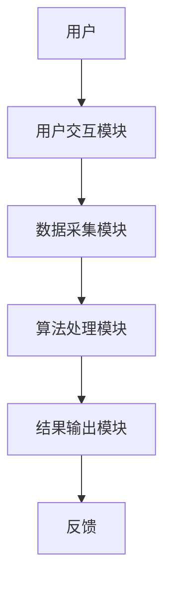
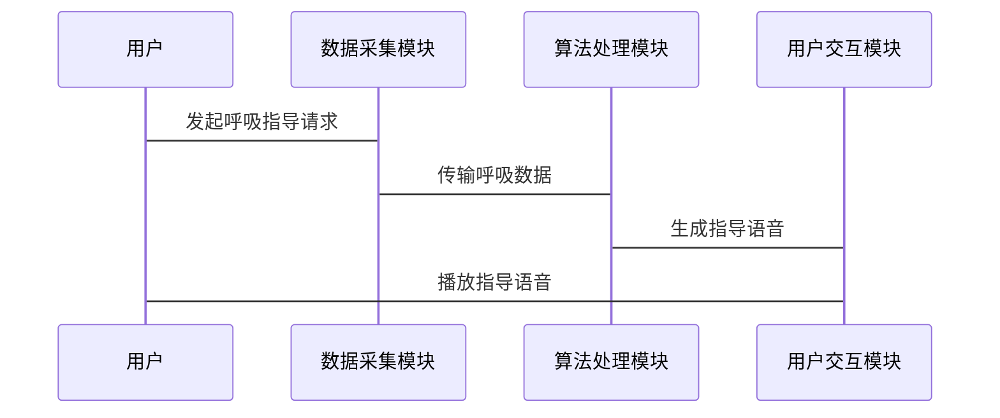

                 


# AI Agent在智能瑜伽垫中的呼吸指导

## 关键词：AI Agent、智能瑜伽垫、呼吸指导、自然语言处理、语音识别、机器学习

## 摘要：
本文详细探讨了AI Agent在智能瑜伽垫中的呼吸指导应用。首先介绍了AI Agent和智能瑜伽垫的基本概念，接着分析了呼吸指导的重要性及其在传统瑜伽垫中的局限性。随后，深入讲解了AI Agent的核心技术，包括自然语言处理、语音识别与合成，以及呼吸监测技术。通过数学模型和算法设计，详细阐述了AI Agent在呼吸指导中的实现过程。最后，通过系统架构设计和项目实战，展示了如何将AI Agent技术应用于智能瑜伽垫，实现高效的呼吸指导。本文还总结了最佳实践和未来研究方向，为读者提供了全面的技术指导。

---

# 第1章: AI Agent与智能瑜伽垫的背景介绍

## 1.1 问题背景与描述
### 1.1.1 呼吸指导在瑜伽中的重要性
呼吸是瑜伽练习的核心要素之一。正确的呼吸技巧可以帮助用户放松身心、提高专注力，并增强身体的灵活性和耐力。传统的瑜伽垫无法提供实时反馈，用户难以准确掌握呼吸节奏和深度，这限制了瑜伽练习的效果。

### 1.1.2 传统瑜伽垫的局限性
传统瑜伽垫不具备智能功能，无法与用户互动或提供实时指导。用户需要依赖教练或自身体验来调整呼吸，这种方式效率低下且难以量化。

### 1.1.3 AI技术在健康领域的应用趋势
随着AI技术的快速发展，越来越多的健康设备开始集成智能功能。AI Agent（人工智能代理）能够通过传感器数据和用户反馈，实时调整指导策略，为用户提供个性化的健康解决方案。

## 1.2 AI Agent的核心概念
### 1.2.1 AI Agent的定义与特点
AI Agent是一种能够感知环境、执行任务并做出决策的智能系统。它具备自主性、反应性、目标导向性和社会性等特点，能够在复杂环境中为用户提供智能化服务。

### 1.2.2 智能瑜伽垫的功能需求
智能瑜伽垫需要具备以下功能：实时监测用户的呼吸数据、通过AI算法提供个性化的呼吸指导、与用户进行语音交互、记录用户的呼吸数据并提供反馈。

### 1.2.3 用户呼吸指导的边界与外延
呼吸指导的边界包括呼吸频率、深度和节奏。外延则涉及用户的心理状态、运动强度和环境因素，这些都会影响呼吸指导的策略。

## 1.3 本章小结
本章介绍了AI Agent和智能瑜伽垫的基本概念，分析了传统瑜伽垫的局限性，并提出了AI技术在健康领域的应用潜力。

---

# 第2章: AI Agent的核心原理与技术

## 2.1 自然语言处理技术
### 2.1.1 NLP在呼吸指导中的应用
自然语言处理（NLP）用于解析用户的反馈，例如用户报告的呼吸感受或提出的问题。通过NLP技术，AI Agent可以理解用户的意图并提供相应的指导。

### 2.1.2 常见的NLP算法与模型
常用的NLP算法包括词袋模型、TF-IDF和基于深度学习的模型（如BERT）。这些算法可以帮助AI Agent理解用户的语言输入。

## 2.2 语音识别与合成技术
### 2.2.1 语音识别的基本原理
语音识别技术用于捕捉用户的呼吸声音，例如通过麦克风采集声音信号并将其转化为数字数据。

### 2.2.2 TTS技术在呼吸指导中的应用
文本到语音（TTS）技术用于生成指导语音，例如AI Agent会通过语音提示用户调整呼吸节奏。

## 2.3 呼吸监测与分析技术
### 2.3.1 呼吸监测的传感器原理
呼吸监测通常使用压力传感器或加速度传感器。这些传感器可以检测用户的呼吸频率和深度。

### 2.3.2 呼吸数据的特征提取与分析
通过分析呼吸数据，AI Agent可以识别用户的呼吸模式，例如浅快呼吸或深慢呼吸，并提供相应的指导。

## 2.4 AI Agent的决策机制
### 2.4.1 基于规则的决策系统
基于规则的决策系统通过预定义的规则提供指导，例如“如果呼吸频率过快，则提示用户放慢呼吸”。

### 2.4.2 基于机器学习的决策模型
基于机器学习的模型能够根据用户的历史数据和当前状态，预测最佳的呼吸指导策略。

## 2.5 本章小结
本章详细介绍了AI Agent的核心技术，包括NLP、语音识别与合成、呼吸监测和决策机制。

---

# 第3章: AI Agent在呼吸指导中的算法设计

## 3.1 呼吸监测数据的预处理
### 3.1.1 数据采集与清洗
传感器数据可能包含噪声，需要进行滤波和归一化处理。

### 3.1.2 数据特征提取与选择
提取呼吸频率、深度和节奏等特征，并选择对呼吸指导最重要的特征。

## 3.2 呼吸指导算法的设计与实现
### 3.2.1 基于时间序列的呼吸分析
时间序列分析用于识别呼吸模式的变化趋势。

### 3.2.2 基于反馈机制的呼吸指导算法
算法根据用户的反馈调整指导策略，例如通过语音提示用户调整呼吸节奏。

## 3.3 算法的数学模型与公式
### 3.3.1 时间序列模型的数学表达
使用ARIMA模型进行时间序列预测：
$$ ARIMA(p, d, q) $$

### 3.3.2 反馈机制的数学公式
反馈机制可以通过以下公式表示：
$$ f(t) = \alpha \cdot f(t-1) + \beta \cdot x(t) $$

## 3.4 算法实现的代码示例
### 3.4.1 数据预处理代码
```python
import numpy as np
from sklearn.preprocessing import StandardScaler

# 数据归一化
scaler = StandardScaler()
data_normalized = scaler.fit_transform(data)
```

### 3.4.2 算法实现代码
```python
from statsmodels.tsa.arima_model import ARIMA

# 训练ARIMA模型
model = ARIMA(train_data, order=(5,1,0))
model_fit = model.fit()
```

## 3.5 本章小结
本章详细介绍了呼吸指导算法的设计与实现，包括数据预处理、模型选择和代码实现。

---

# 第4章: 智能瑜伽垫的系统架构设计

## 4.1 系统功能模块划分
### 4.1.1 用户交互模块
用户通过语音或文本与AI Agent互动。

### 4.1.2 数据采集模块
传感器采集用户的呼吸数据。

### 4.1.3 算法处理模块
AI Agent分析数据并生成指导策略。

### 4.1.4 结果输出模块
通过语音或显示输出指导信息。

## 4.2 系统架构设计
### 4.2.1 模块之间的关系
模块之间通过数据接口进行交互。

### 4.2.2 系统架构的mermaid图


## 4.3 系统接口设计
### 4.3.1 数据接口
传感器数据接口和用户反馈接口。

### 4.3.2 用户接口
语音交互和显示界面。

### 4.3.3 输出接口
语音输出和显示输出。

## 4.4 系统交互流程
### 4.4.1 交互流程的mermaid序列图


## 4.5 本章小结
本章详细描述了智能瑜伽垫的系统架构设计，包括功能模块划分和交互流程。

---

# 第5章: 项目实战与实现

## 5.1 环境搭建与工具安装
### 5.1.1 开发环境的选择
推荐使用Python和相关AI框架（如TensorFlow）进行开发。

### 5.1.2 相关工具的安装与配置
安装必要的库，例如：
- `pip install numpy`
- `pip install scikit-learn`

## 5.2 系统核心功能的实现
### 5.2.1 数据采集与处理
使用传感器采集呼吸数据并进行预处理。

### 5.2.2 算法实现与优化
优化ARIMA模型以提高预测准确性。

### 5.2.3 系统集成与测试
将各模块集成并进行功能测试。

## 5.3 代码实现与解读
### 5.3.1 数据预处理代码
```python
import numpy as np
from sklearn.preprocessing import StandardScaler

# 数据归一化
scaler = StandardScaler()
data_normalized = scaler.fit_transform(data)
```

### 5.3.2 算法实现代码
```python
from statsmodels.tsa.arima_model import ARIMA

# 训练ARIMA模型
model = ARIMA(train_data, order=(5,1,0))
model_fit = model.fit()
```

## 5.4 实际案例分析
### 5.4.1 案例背景
假设用户在进行瑜伽练习时，呼吸频率过快。

### 5.4.2 案例实现过程
AI Agent检测到呼吸频率异常，通过语音提示用户调整呼吸节奏。

### 5.4.3 案例结果与分析
用户的呼吸频率恢复正常，瑜伽练习效果显著提升。

## 5.5 本章小结
本章通过项目实战展示了AI Agent在智能瑜伽垫中的具体实现过程和实际效果。

---

# 第6章: 最佳实践与注意事项

## 6.1 最佳实践
### 6.1.1 数据预处理的重要性
确保数据的准确性和完整性。

### 6.1.2 算法选择与优化
根据实际需求选择合适的算法，并不断优化模型性能。

## 6.2 小结
本文详细介绍了AI Agent在智能瑜伽垫中的呼吸指导应用，从技术原理到系统实现，为读者提供了全面的指导。

## 6.3 注意事项
在实际应用中，需注意数据隐私保护和用户体验优化。

## 6.4 拓展阅读
推荐相关领域的文献，供读者深入研究。

---

作者：AI天才研究院/AI Genius Institute & 禅与计算机程序设计艺术 /Zen And The Art of Computer Programming

