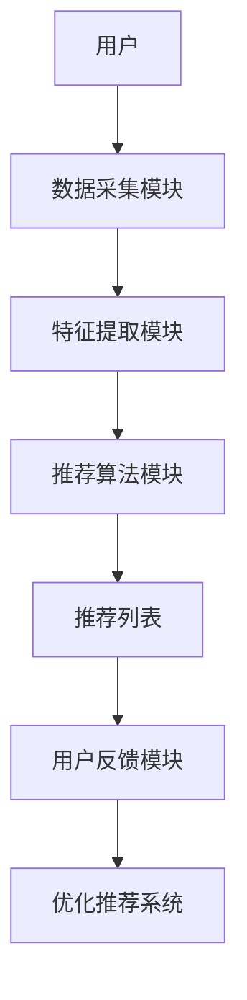

                 


# AI Agent在智能电影推荐中的应用

## 关键词：AI Agent, 电影推荐, 智能推荐系统, 深度学习, 协同过滤, 系统架构

## 摘要：  
本文探讨了AI Agent在智能电影推荐中的应用，分析了传统推荐系统与AI Agent的结合，详细讲解了基于协同过滤和深度学习的推荐算法，设计了系统架构，并通过项目实战展示了AI Agent在电影推荐中的具体实现。文章还总结了AI Agent的优势，并展望了未来的发展趋势。

---

## 第1章 AI Agent概述

### 1.1 AI Agent的基本概念
AI Agent（智能代理）是能够感知环境、自主决策并采取行动以实现目标的智能实体。它广泛应用于推荐系统、自动驾驶等领域。

### 1.2 AI Agent的核心特点
- **自主性**：无需外部干预，自主决策。
- **反应性**：实时感知环境变化并调整行动。
- **学习能力**：通过数据和反馈不断优化行为。

### 1.3 AI Agent与电影推荐的结合
AI Agent通过分析用户行为和偏好，提供个性化电影推荐，提升用户体验。

---

## 第2章 智能电影推荐系统的发展

### 2.1 传统推荐系统的局限性
- **协同过滤**：依赖用户相似性，存在数据稀疏性问题。
- **基于内容的推荐**：依赖电影描述，缺乏上下文信息。

### 2.2 基于机器学习的推荐系统
利用监督学习和无监督学习技术，提升推荐准确性。

### 2.3 AI Agent在推荐系统中的作用
通过实时分析用户行为和环境信息，优化推荐结果。

---

## 第3章 AI Agent与电影推荐的结合

### 3.1 AI Agent在推荐系统中的核心作用
- **实时分析**：动态调整推荐策略。
- **个性化推荐**：基于用户偏好和行为。
- **多模态数据处理**：整合文本、图像等多种数据源。

### 3.2 AI Agent的推荐流程
1. 数据收集：获取用户行为和电影数据。
2. 特征提取：分析用户偏好和电影属性。
3. 推荐生成：基于AI Agent算法生成推荐列表。
4. 反馈优化：根据用户反馈调整推荐策略。

---

## 第4章 推荐算法原理

### 4.1 协同过滤算法
#### 4.1.1 基于用户的协同过滤
计算用户相似度，推荐相似用户的电影评分。

#### 4.1.2 基于物品的协同过滤
计算电影相似度，推荐用户可能感兴趣的电影。

#### 4.1.3 协同过滤的数学模型
$$相似度 = \frac{\sum (r_{u,i} - \bar{r_u})(r_{u,j} - \bar{r_u})}{\sqrt{\sum (r_{u,i} - \bar{r_u})^2} \cdot \sqrt{\sum (r_{u,j} - \bar{r_u})^2}}$$

### 4.2 深度学习推荐算法
#### 4.2.1 基于神经网络的推荐系统
利用神经网络处理非结构化数据，如文本和图像。

#### 4.2.2 基于嵌入的推荐系统
使用矩阵分解技术，将用户和电影映射到低维空间。

#### 4.2.3 深度学习模型
$$p(r_{u,i}) = \sigma(w_u^T \cdot w_i + b)$$

---

## 第5章 系统架构设计

### 5.1 系统功能设计
- **数据采集模块**：收集用户行为和电影数据。
- **特征提取模块**：分析用户偏好和电影属性。
- **推荐算法模块**：基于AI Agent生成推荐列表。
- **用户反馈模块**：收集用户反馈，优化推荐系统。

### 5.2 系统架构图


### 5.3 接口设计与交互流程
- 接口设计：API提供推荐服务。
- 交互流程：用户请求推荐，系统返回推荐列表。

---

## 第6章 项目实战

### 6.1 环境安装
安装必要的Python库，如`numpy`, `pandas`, `scikit-learn`。

### 6.2 核心代码实现
```python
def collaborative_filtering(users, movies, ratings):
    # 计算用户相似度
    similarity = {}
    for u in users:
        for v in users:
            if u != v:
                similarity[(u, v)] = calculate_similarity(users[u], users[v])
    # 基于相似度生成推荐
    recommendations = {}
    for u in users:
        for v in users:
            if u != v:
                recommendations[u] += similarity[(u, v)] * ratings[v]
    return recommendations
```

### 6.3 案例分析
分析一个用户的观看历史，生成个性化推荐，并解释推荐结果。

---

## 第7章 总结与展望

### 7.1 总结
AI Agent通过实时分析用户行为和环境信息，显著提升了电影推荐的准确性和个性化程度。

### 7.2 未来展望
- **实时推荐**：根据实时行为调整推荐。
- **多模态推荐**：整合更多数据源，提升推荐效果。
- **强化学习**：通过强化学习优化推荐策略。

---

## 作者：AI天才研究院  
通过本文，我们详细探讨了AI Agent在智能电影推荐中的应用，从算法原理到系统架构，再到项目实战，帮助读者全面理解并实际应用这一技术。希望未来能有更多创新，推动推荐系统的发展。

