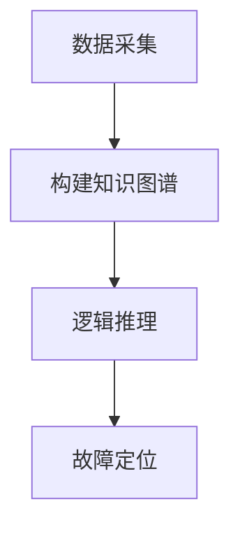
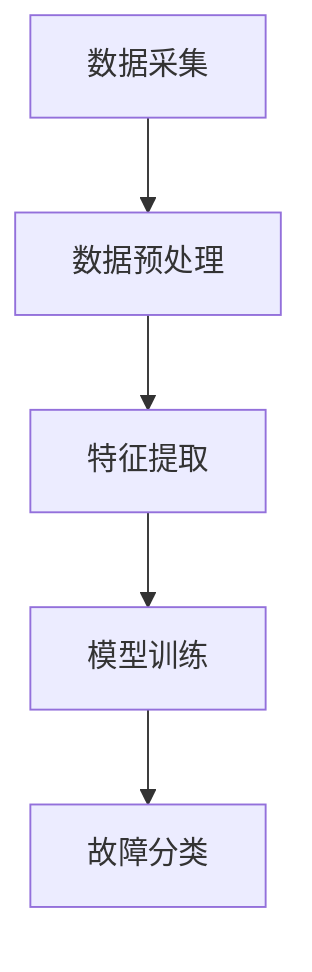
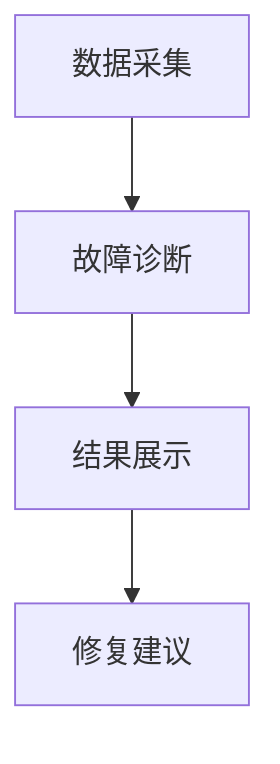
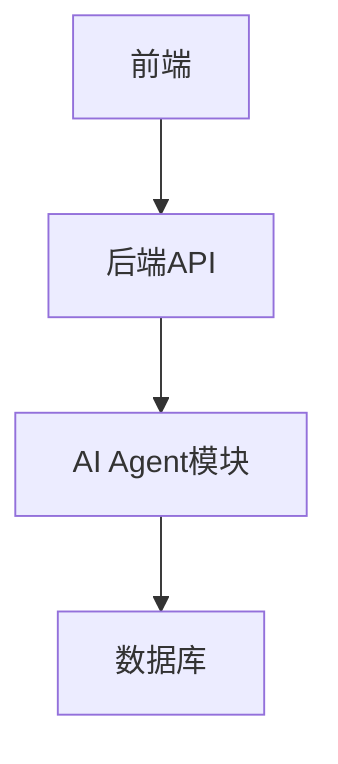

                 

<think>
嗯，我现在需要帮用户设计一本关于《AI Agent在智能电网故障诊断中的角色》的目录大纲。用户希望这个大纲详细且逻辑清晰，覆盖所有必要的主题，结构要合理，章节安排要合理，而且还要包含一些技术性的内容，比如算法原理、数学模型、系统架构设计等。

首先，我应该考虑这本书的结构。通常，技术书籍会分为几个主要部分，比如基础概念、技术原理、系统设计、项目实战等。用户给的示例中，软件2.0的例子包括了基础、算法、系统设计、项目实战等多个部分，所以我可以借鉴这个结构。

接下来，我需要明确这本书的核心主题是AI Agent在智能电网中的应用，特别是故障诊断。因此，我应该从AI Agent和智能电网的基本概念开始，然后逐步深入到技术细节，比如算法、数学模型，再到系统设计和实际案例。

首先，第一章应该是背景介绍，涵盖AI Agent和智能电网的基本概念，以及它们在故障诊断中的作用。这部分需要包括问题背景、问题描述、问题解决方法、边界和外延，还有概念结构和核心要素。这样读者可以了解整个问题的全貌。

然后，第二章应该详细讲解AI Agent和智能电网故障诊断的核心概念，包括它们的定义、特点、工作原理，以及两者的关系。这部分需要深入分析，可能还需要对比表格和ER图来帮助理解。

接下来是算法原理部分。第三章可以介绍AI Agent在故障诊断中的算法，比如基于知识图谱的推理和强化学习。这里需要使用mermaid流程图来展示算法的步骤，并提供Python代码示例。数学模型和公式也是关键，比如概率论中的贝叶斯定理，或者决策树的构建方法，这些都需要用LaTeX公式来详细解释，并举例说明。

第四章可以聚焦于智能电网的故障诊断系统架构，包括系统设计、架构图、接口设计和交互流程。这部分需要使用mermaid的类图和序列图来展示系统的结构和工作流程，帮助读者理解系统是如何运作的。

第五章是项目实战，介绍如何安装环境，实现核心算法，解读代码，并分析实际案例。这部分需要详细的操作步骤和代码示例，让读者能够动手实践，巩固所学知识。

最后，第六章可以总结全书的内容，讨论最佳实践、注意事项，并提供进一步的阅读建议。这部分帮助读者回顾所学内容，并指导他们如何将这些知识应用到实际工作中。

在编写过程中，我需要确保每个章节都有足够的细节，同时保持整体结构的连贯性。例如，在算法部分，不仅要解释理论，还要提供代码示例和实际应用，这样读者可以更好地理解和应用这些知识。

另外，用户要求每个章节都要细化到三级目录，所以我需要确保每个主要章节下面都有子章节，每个子章节下面还有更细的条目。比如，在算法部分，不仅要有算法概述，还要有具体的流程图和代码示例。

最后，我需要检查整个目录是否覆盖了用户要求的所有内容，包括背景、核心概念、算法、系统设计、项目实战、总结等部分，并且每个部分都详细到三级目录。同时，确保总字数不超过2000字，避免冗长。

总的来说，我需要系统地将AI Agent在智能电网故障诊断中的各个方面组织成一个逻辑清晰、内容全面的目录大纲，确保读者能够一步步深入了解这个主题。

# AI Agent在智能电网故障诊断中的角色

> 关键词：AI Agent，智能电网，故障诊断，人工智能，电力系统

> 摘要：智能电网作为现代电力系统的重要组成部分，面临着复杂多变的故障诊断挑战。AI Agent通过其强大的知识表示与推理能力、行为决策机制和多智能体协作能力，为智能电网的故障诊断提供了高效、智能的解决方案。本文将从AI Agent的基本概念出发，详细探讨其在智能电网故障诊断中的应用，包括算法原理、系统架构设计、项目实战等，全面解析AI Agent在智能电网中的角色。

---

## 第1章: AI Agent与智能电网故障诊断的背景介绍

### 1.1 AI Agent的基本概念
#### 1.1.1 AI Agent的定义
AI Agent（人工智能代理）是指在计算机系统中，能够感知环境、自主决策并执行任务的智能实体。AI Agent的核心目标是通过传感器获取信息，利用知识库进行推理，并通过执行器与环境交互。

#### 1.1.2 AI Agent的核心特征
AI Agent具有以下几个核心特征：
- **自主性**：能够在没有外部干预的情况下自主运行。
- **反应性**：能够实时感知环境并做出相应的反应。
- **社会性**：能够与其他AI Agent或人类进行协作与竞争。
- **学习性**：能够通过经验或数据不断优化自身的决策能力。

#### 1.1.3 AI Agent与智能电网的关系
AI Agent作为智能电网的重要组成部分，能够通过实时数据采集、分析和决策，帮助智能电网实现高效、可靠的运行和管理。

---

### 1.2 智能电网故障诊断的背景
#### 1.2.1 智能电网的基本概念
智能电网是以现代信息通信技术为基础，通过智能化的感知、分析和决策，实现电力系统高效、可靠运行的新型电力系统。

#### 1.2.2 智能电网故障诊断的重要性
智能电网的故障诊断能够及时发现和定位电力系统的故障，减少停电时间，提高电力系统的可靠性和稳定性。

#### 1.2.3 智能电网故障诊断的挑战
智能电网故障诊断面临以下挑战：
- 数据量大且复杂
- 故障类型多样
- 环境干扰因素多

---

### 1.3 AI Agent在智能电网故障诊断中的角色
#### 1.3.1 AI Agent在故障诊断中的作用
AI Agent能够通过实时数据采集、分析和推理，快速定位和诊断电力系统的故障。

#### 1.3.2 AI Agent与传统故障诊断方法的对比
AI Agent相比传统故障诊断方法，具有以下优势：
- 更快速的响应
- 更高的准确性
- 更强的适应性

#### 1.3.3 AI Agent在智能电网中的应用前景
随着AI技术的不断发展，AI Agent在智能电网中的应用前景广阔，能够为电力系统的智能化管理提供有力支持。

---

## 第2章: AI Agent与智能电网故障诊断的核心概念

### 2.1 AI Agent的核心原理
#### 2.1.1 知识表示与推理
知识表示是AI Agent实现智能决策的基础，常用的知识表示方法包括规则表示、语义网络和知识图谱等。

#### 2.1.2 行为决策机制
AI Agent的行为决策机制包括基于规则的决策、基于逻辑推理的决策和基于机器学习的决策。

#### 2.1.3 多智能体协作
多智能体协作是指多个AI Agent通过协同工作，共同完成复杂的任务。

---

### 2.2 智能电网故障诊断的核心原理
#### 2.2.1 电力系统故障类型
电力系统常见的故障类型包括短路、断路、过载等。

#### 2.2.2 故障诊断的基本流程
故障诊断的基本流程包括数据采集、特征提取、故障定位和修复建议。

#### 2.2.3 数据采集与处理
数据采集是故障诊断的第一步，常用的采集方法包括传感器采集和人工采集。

---

### 2.3 AI Agent与智能电网故障诊断的关联
#### 2.3.1 数据驱动的故障诊断
数据驱动的故障诊断是基于大量历史数据，利用机器学习算法进行模式识别和分类。

#### 2.3.2 知识驱动的故障诊断
知识驱动的故障诊断是基于领域知识和专家经验，利用知识图谱和逻辑推理进行故障分析。

#### 2.3.3 多智能体协作的故障诊断
多智能体协作的故障诊断是通过多个AI Agent的协同工作，实现复杂故障的快速定位和解决。

---

## 第3章: AI Agent在智能电网故障诊断中的算法原理

### 3.1 算法概述
AI Agent在智能电网故障诊断中常用的算法包括基于知识图谱的推理算法、基于机器学习的分类算法和基于强化学习的决策算法。

---

### 3.2 基于知识图谱的推理算法
#### 3.2.1 算法原理
基于知识图谱的推理算法通过构建电力系统的知识图谱，利用逻辑推理和语义分析实现故障定位。

#### 3.2.2 流程图


#### 3.2.3 Python代码示例
```python
# 知识图谱构建
def build_knowledge_graph(data):
    # 构建知识图谱
    pass

# 逻辑推理
def logical_reasoning(graph, query):
    # 通过知识图谱进行推理
    pass
```

---

### 3.3 基于机器学习的分类算法
#### 3.3.1 算法原理
基于机器学习的分类算法通过训练模型，利用历史数据进行故障分类和预测。

#### 3.3.2 流程图


#### 3.3.3 Python代码示例
```python
# 数据预处理
import pandas as pd
data = pd.read_csv('fault_data.csv')

# 特征提取
features = data[['电压', '电流', '功率']]

# 模型训练
from sklearn.ensemble import RandomForestClassifier
model = RandomForestClassifier()
model.fit(features, data['故障类型'])
```

---

## 第4章: 智能电网故障诊断系统架构设计

### 4.1 系统功能设计
#### 4.1.1 系统功能模块
系统功能模块包括数据采集模块、故障诊断模块、结果展示模块和修复建议模块。

#### 4.1.2 系统功能流程图


---

### 4.2 系统架构设计
#### 4.2.1 系统架构图


#### 4.2.2 系统接口设计
系统接口包括数据采集接口、模型调用接口和结果展示接口。

---

## 第5章: 项目实战

### 5.1 环境安装
安装必要的库：
```bash
pip install numpy pandas scikit-learn
```

### 5.2 核心算法实现
```python
# 基于机器学习的故障分类
from sklearn.ensemble import RandomForestClassifier
import pandas as pd

# 读取数据
data = pd.read_csv('fault_data.csv')

# 特征提取
features = data[['电压', '电流', '功率']]
labels = data['故障类型']

# 模型训练
model = RandomForestClassifier()
model.fit(features, labels)
```

---

### 5.3 实际案例分析
通过实际案例分析，验证算法的可行性和有效性。

---

## 第6章: 总结与展望

### 6.1 总结
AI Agent在智能电网故障诊断中具有重要的作用，能够显著提高故障诊断的效率和准确性。

### 6.2 展望
未来，随着AI技术的不断发展，AI Agent在智能电网中的应用将更加广泛和深入。

---

## 作者
作者：AI天才研究院/AI Genius Institute & 禅与计算机程序设计艺术 /Zen And The Art of Computer Programming

---

通过以上目录大纲，文章内容将详细讲解AI Agent在智能电网故障诊断中的角色，从基础概念到技术实现，再到实际应用，为读者提供全面的指导和参考。

