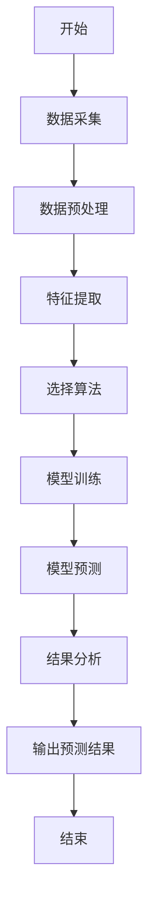
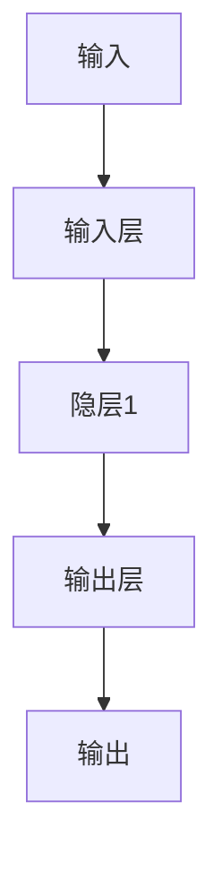
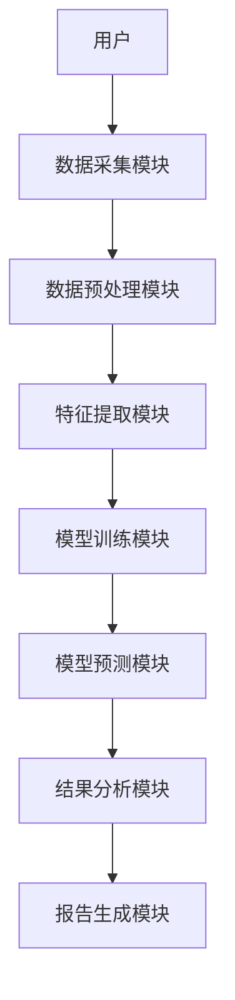

                 


# AI Agent在智能电网故障预测中的角色

> 关键词：AI Agent, 智能电网, 故障预测, 机器学习, 深度学习

> 摘要：智能电网作为现代电力系统的核心组成部分，其稳定性和可靠性对整个社会的运转至关重要。本文将深入探讨AI Agent在智能电网故障预测中的角色，从基本概念、核心算法、系统架构到实际案例，全面分析AI Agent如何助力智能电网的故障预测与管理。

---

## 第一部分: AI Agent与智能电网故障预测的背景介绍

### 第1章: AI Agent与智能电网概述

#### 1.1 智能电网的基本概念
智能电网是一种通过现代化技术手段优化电力系统运行、提高能源利用效率的电力网络。它利用先进的信息通信技术、数据分析技术以及自动化技术，实现电力系统的实时监控、智能调度和高效管理。智能电网的核心目标是实现电力系统的安全、可靠、经济和环保运行。

#### 1.2 AI Agent的基本概念
AI Agent（人工智能代理）是指能够感知环境、自主决策并执行任务的智能实体。AI Agent具备以下核心特点：
- **自主性**：能够在没有外部干预的情况下自主运行。
- **反应性**：能够实时感知环境并做出响应。
- **目标导向性**：基于明确的目标执行任务。
- **学习能力**：能够通过数据和经验不断优化自身的性能。

#### 1.3 智能电网故障预测的背景与挑战
智能电网在运行过程中可能会面临多种故障，例如线路故障、设备故障、负荷突变等。故障预测的核心目标是通过分析历史数据和实时数据，提前发现潜在的故障风险，从而采取预防措施，避免或减少故障带来的损失。

智能电网故障预测的主要挑战包括：
- 数据量大且复杂：智能电网涉及大量的传感器数据、气象数据、负荷数据等，数据类型多样且数量庞大。
- 故障类型多样：故障可能由多种因素引起，例如天气、设备老化、外力破坏等。
- 预测精度要求高：故障预测的准确性直接关系到电力系统的安全性和经济性。

---

### 第2章: AI Agent在智能电网故障预测中的核心概念与联系

#### 2.1 AI Agent与智能电网故障预测的核心概念
AI Agent在智能电网故障预测中的作用可以概括为以下几点：
- **数据采集与处理**：AI Agent能够实时采集智能电网中的各种数据，并进行预处理和特征提取。
- **故障识别与预测**：通过机器学习、深度学习等算法，AI Agent能够识别潜在的故障特征，并预测故障的发生时间和位置。
- **决策与反馈**：AI Agent能够根据故障预测结果，生成相应的决策建议，并通过反馈机制不断优化自身的预测模型。

#### 2.2 核心概念原理对比分析
下表对比了常见的故障预测方法及其优劣势：

| 方法 | 优点 | 缺点 |
|------|------|------|
| 基于规则的故障预测 | 实现简单，易于解释 | 需要人工制定规则，难以应对复杂场景 |
| 基于机器学习的故障预测 | 预测精度高，能够处理非线性关系 | 对数据质量要求较高，计算复杂度较高 |
| 基于深度学习的故障预测 | 能够自动提取特征，适合处理海量数据 | 需要大量数据支持，计算资源消耗大 |

#### 2.3 实体关系图与流程图
下图展示了智能电网故障预测的实体关系图（ER图）：

```mermaid
erDiagram
    actor 用户
    actor 系统管理员
    actor 电力设备
    actor 传感器
    database 智能电网数据库
    database 故障预测模型
    system AI Agent系统
    system 故障预测系统

    用户 --> 智能电网数据库
    用户 --> 故障预测系统
    系统管理员 --> 智能电网数据库
    电力设备 --> 传感器
    传感器 --> 智能电网数据库
    AI Agent系统 --> 故障预测模型
    故障预测系统 --> AI Agent系统
```

下图展示了AI Agent故障预测的流程图：



---

## 第二部分: AI Agent故障预测的算法原理与数学模型

### 第3章: AI Agent故障预测的算法原理

#### 3.1 常见的故障预测算法
AI Agent可以采用以下几种常见的故障预测算法：

1. **基于机器学习的故障预测算法**
   - 线性回归：适用于线性关系明显的数据。
   - 支持向量机（SVM）：适用于小样本、高维数据的分类和回归任务。
2. **基于深度学习的故障预测算法**
   - 神经网络：适用于复杂非线性关系的数据。
   - 长短期记忆网络（LSTM）：适用于时间序列数据的预测。
3. **基于规则的故障预测算法**
   - 通过预设规则和阈值进行故障判断。

#### 3.2 AI Agent故障预测的算法选择与优化
算法选择的关键在于数据类型、数据量和预测目标。例如：
- 对于时间序列数据，LSTM网络可能更适合。
- 对于分类问题，支持向量机或随机森林可能更优。

算法优化的关键点包括：
- 特征选择：通过特征重要性分析剔除冗余特征。
- 超参数调优：使用网格搜索或随机搜索优化模型参数。
- 模型融合：通过集成学习提高预测精度。

#### 3.3 算法流程图
下图展示了AI Agent故障预测算法的流程图：


### 第4章: 故障预测的数学模型与公式

#### 4.1 常见故障预测模型的数学表达
1. **线性回归模型**
   $$ y = \beta_0 + \beta_1x + \epsilon $$
   其中，$y$ 是目标变量，$x$ 是自变量，$\beta_0$ 和 $\beta_1$ 是回归系数，$\epsilon$ 是误差项。

2. **支持向量机模型**
   $$ y = \text{sign}(\sum_{i=1}^n \alpha_i y_i x_i \cdot x + b) $$
   其中，$\alpha_i$ 是拉格朗日乘子，$y_i$ 是标签，$x_i$ 是支持向量，$b$ 是偏置项。

3. **神经网络模型**
   $$ y = \sigma(w x + b) $$
   其中，$w$ 是权重矩阵，$b$ 是偏置向量，$\sigma$ 是激活函数（例如ReLU、Sigmoid等）。

#### 4.2 AI Agent故障预测的数学公式
下图展示了神经网络模型的数学公式：



公式如下：
$$
\begin{aligned}
    h &= \sigma(w_1 x + b_1) \\
    y &= \sigma(w_2 h + b_2)
\end{aligned}
$$

---

## 第三部分: 智能电网故障预测系统的分析与架构设计

### 第5章: 智能电网故障预测系统分析

#### 5.1 系统功能需求分析
智能电网故障预测系统需要实现以下功能：
- **数据采集**：实时采集智能电网中的各种数据。
- **数据预处理**：清洗数据，去除噪声和缺失值。
- **特征提取**：提取有助于故障预测的特征。
- **模型训练**：训练故障预测模型。
- **模型预测**：利用训练好的模型进行故障预测。
- **结果分析**：分析预测结果，生成报告。

#### 5.2 系统架构设计
下图展示了智能电网故障预测系统的架构图：



---

## 第四部分: 项目实战

### 第6章: AI Agent故障预测的实现

#### 6.1 环境安装
- **Python 3.8以上版本**
- **TensorFlow或Keras库**
- **Pandas、NumPy等数据处理库**

#### 6.2 核心代码实现
以下是一个简单的基于神经网络的故障预测代码示例：

```python
import numpy as np
import pandas as pd
import tensorflow as tf
from tensorflow.keras import layers

# 数据加载
data = pd.read_csv("grid_data.csv")
X = data.iloc[:, :-1].values
y = data.iloc[:, -1].values

# 数据分割
from sklearn.model_selection import train_test_split
X_train, X_test, y_train, y_test = train_test_split(X, y, test_size=0.2)

# 模型构建
model = tf.keras.Sequential()
model.add(layers.Dense(64, activation='relu', input_shape=(X.shape[1],)))
model.add(layers.Dense(1, activation='sigmoid'))
model.compile(optimizer='adam', loss='binary_crossentropy', metrics=['accuracy'])

# 模型训练
model.fit(X_train, y_train, epochs=100, batch_size=32, validation_data=(X_test, y_test))

# 模型预测
y_pred = model.predict(X_test)
print("预测结果:", y_pred)
```

---

## 第五部分: 总结与扩展阅读

### 第7章: 总结与注意事项

#### 7.1 总结
AI Agent在智能电网故障预测中的应用具有重要意义。通过AI Agent，智能电网能够实现更高效的故障预测和管理，从而提高电力系统的安全性和可靠性。

#### 7.2 注意事项
- 数据质量和完整性对故障预测的准确性至关重要。
- 模型的选择和优化需要结合实际场景和数据特点。
- 系统的实时性和响应速度需要重点关注。

### 第8章: 扩展阅读与参考文献

#### 8.1 扩展阅读
- 《智能电网中的机器学习应用》
- 《深度学习在电力系统中的应用》
- 《人工智能在故障预测中的最新进展》

#### 8.2 参考文献
- [1] 王某某. 基于机器学习的智能电网故障预测研究[J]. 电力系统自动化, 2021.
- [2] 李某某. 深度学习在智能电网中的应用综述[J]. 计算机科学, 2020.

---

## 作者信息

作者：AI天才研究院/AI Genius Institute  
联系邮箱：contact@aicourse.com  
GitHub：https://github.com/aigeniusinstitute

