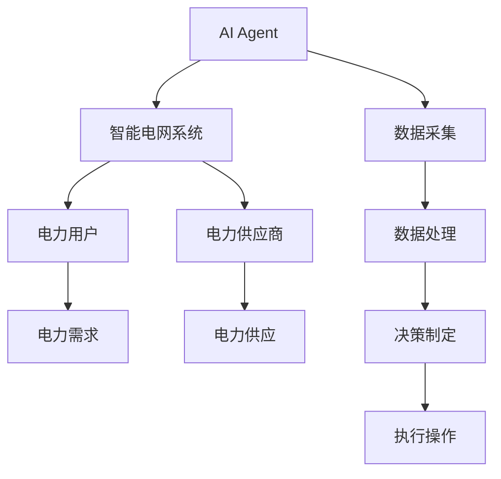
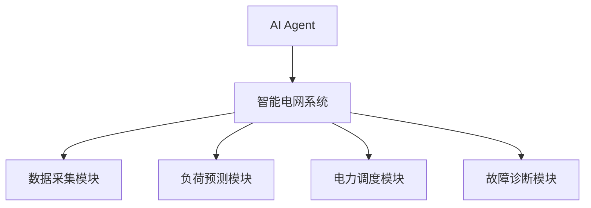
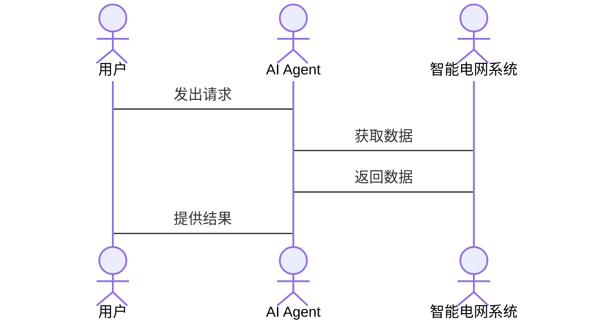

                 


# AI Agent在智能电网管理中的应用

> 关键词：智能电网、AI Agent、人工智能、电力系统、能源管理

> 摘要：随着能源结构的不断变化和电力系统复杂性的增加，智能电网管理对自动化、智能化的需求日益增长。AI Agent作为人工智能领域的核心技术之一，在智能电网管理中的应用潜力巨大。本文将从AI Agent的基本概念、核心原理、算法实现、系统架构到实际应用场景进行全面分析，深入探讨AI Agent在智能电网管理中的应用价值和未来发展方向。

---

## 第一部分: AI Agent与智能电网管理概述

### 第1章: AI Agent与智能电网管理的背景介绍

#### 1.1 智能电网的基本概念
智能电网是一种通过先进信息通信技术和自动化设备，实现电力系统各个环节的智能化管理的新型电力系统。它包括发电、输电、配电、用电等环节，旨在提高电力系统的效率、可靠性和可持续性。

- **智能电网的特点**：
  - 分布式能源管理
  - 实时数据采集与分析
  - 自动化控制
  - 高效能源利用

#### 1.2 AI Agent的基本概念
AI Agent（人工智能代理）是一种能够感知环境、自主决策并执行任务的智能实体。它通过传感器获取信息，利用算法进行分析和决策，并通过执行器完成任务。

- **AI Agent的核心功能**：
  - 感知环境
  - 学习与优化
  - 自主决策
  - 与人或系统交互

#### 1.3 AI Agent与智能电网管理的结合
AI Agent在智能电网管理中的应用，主要体现在以下几个方面：
- **负荷预测**：通过AI Agent对电力需求进行预测，优化电力供应。
- **电网调度**：AI Agent能够实时分析电网状态，优化电力分配。
- **故障诊断与修复**：AI Agent能够快速定位电网故障并协助修复。

---

### 第2章: AI Agent在智能电网管理中的核心概念与联系

#### 2.1 AI Agent的核心原理
AI Agent的工作原理包括以下几个关键步骤：
1. **感知环境**：通过传感器或数据源获取电网运行数据。
2. **数据处理**：对获取的数据进行清洗、特征提取和转换。
3. **决策制定**：基于数据和预设的目标，利用算法进行决策。
4. **执行操作**：通过执行器或控制系统执行决策结果。

#### 2.2 AI Agent与智能电网的实体关系图
以下是AI Agent与智能电网管理的实体关系图：

```mermaid
er
actor AI Agent
actor 智能电网系统
actor 电力用户
actor 电力供应商
```

从图中可以看出，AI Agent作为中介，连接了智能电网系统、电力用户和电力供应商，实现了信息的交互与协调。

#### 2.3 AI Agent与智能电网的流程图
以下是AI Agent在智能电网管理中的流程图：



---

## 第二部分: AI Agent在智能电网管理中的算法原理

### 第3章: AI Agent在智能电网管理中的算法实现

#### 3.1 强化学习算法
强化学习是一种通过试错方法来优化决策的算法。在智能电网管理中，强化学习可以用于电力调度和负荷预测。

##### 3.1.1 Q-Learning算法
Q-Learning是一种经典的强化学习算法，其核心思想是通过不断更新Q值表来优化决策。

- **状态空间**：电力系统的当前状态，例如负荷、电压等。
- **动作空间**：可能的操作，例如增加或减少电力输出。
- **奖励函数**：根据决策结果给予奖励或惩罚，例如降低电力成本给予奖励。

##### 3.1.2 强化学习在电力调度中的应用
以下是一个简单的Q-Learning算法实现：

```python
import numpy as np

# 初始化Q值表
Q = np.zeros((state_space, action_space))

# 设置学习参数
alpha = 0.1
gamma = 0.9

# Q-Learning算法
def q_learning(state, action):
    next_state = get_next_state(state, action)
    q = Q[state, action]
    q_next = Q[next_state, np.argmax(Q[next_state])]
    Q[state, action] = q + alpha * (q_next + gamma * q_next - q)
    return Q[state, action]
```

#### 3.2 机器学习算法
机器学习算法在智能电网管理中的应用主要体现在负荷预测和设备状态监测。

##### 3.2.1 支持向量机（SVM）
支持向量机是一种监督学习算法，常用于分类和回归问题。在电力负荷预测中，可以使用SVM进行回归分析。

##### 3.2.2 神经网络模型
神经网络模型，尤其是深度学习模型，在负荷预测和电力系统优化中表现出色。

---

## 第三部分: AI Agent在智能电网管理中的系统架构与设计

### 第4章: 系统分析与架构设计

#### 4.1 系统功能设计
智能电网管理系统的功能模块包括：
- 数据采集与监控
- 负荷预测
- 电力调度
- 故障诊断

#### 4.2 系统架构设计
以下是智能电网管理系统的架构图：



#### 4.3 系统接口设计
以下是系统接口设计的序列图：



---

## 第四部分: 项目实战与案例分析

### 第5章: 项目实战

#### 5.1 环境安装
以下是AI Agent在智能电网管理中的环境安装步骤：

```bash
# 安装依赖
pip install numpy
pip install matplotlib
pip install scikit-learn
```

#### 5.2 系统核心实现源代码
以下是AI Agent在智能电网管理中的核心代码实现：

```python
import numpy as np
from sklearn.svm import SVC

# 初始化数据
X = np.array([[x1, x2, ..., xn], ...])
y = np.array([label1, label2, ..., labeln])

# 训练模型
model = SVC()
model.fit(X, y)

# 预测
new_data = np.array([[new_x1, new_x2, ..., new_xn]])
prediction = model.predict(new_data)
```

---

## 第五部分: 总结与展望

### 第6章: 总结与展望

#### 6.1 总结
AI Agent在智能电网管理中的应用，不仅提高了电力系统的效率和可靠性，还为能源管理的智能化转型提供了新的思路。

#### 6.2 展望
随着人工智能技术的不断发展，AI Agent在智能电网管理中的应用将更加广泛和深入。未来的研究方向包括：
- 更高效的AI算法
- 更智能的决策系统
- 更便捷的人机交互

---

作者：AI天才研究院/AI Genius Institute & 禅与计算机程序设计艺术 /Zen And The Art of Computer Programming

