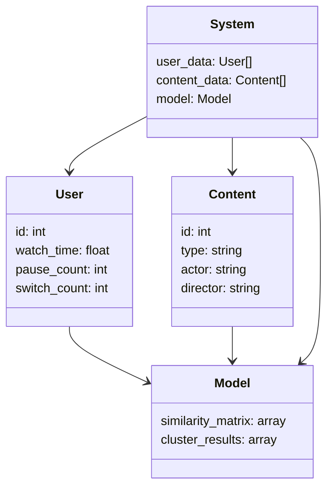
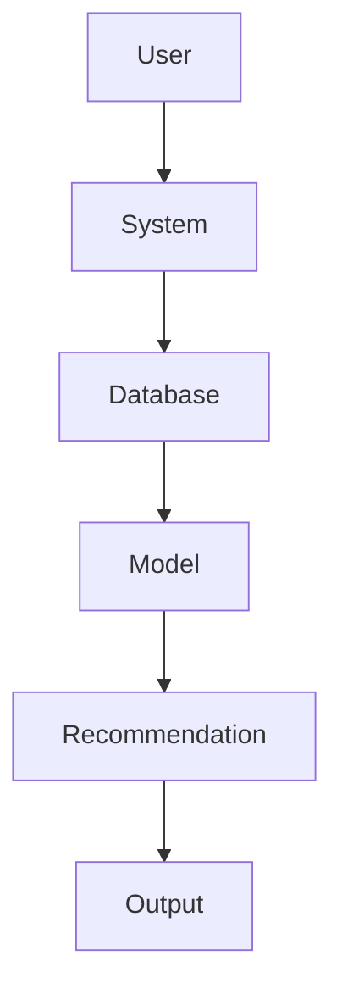
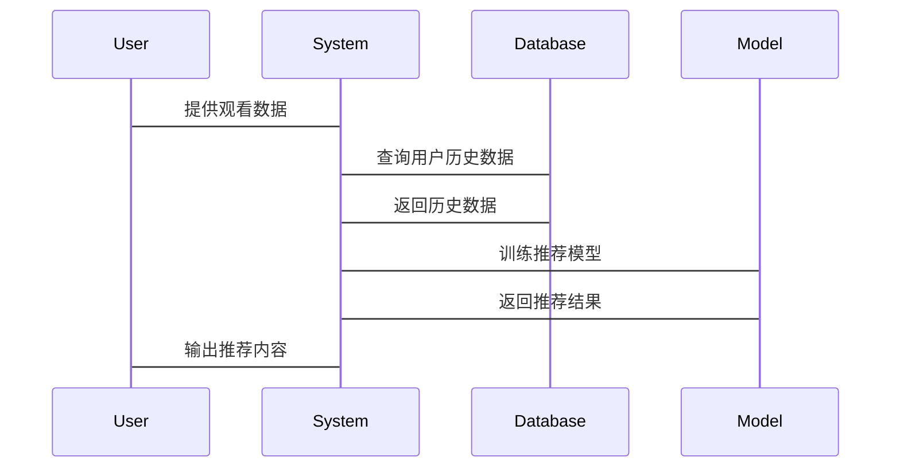

                 


# AI Agent在智能电视中的观看习惯分析

## 关键词：AI Agent，智能电视，观看习惯分析，协同过滤，聚类分析

## 摘要：  
随着智能电视的普及，用户观看习惯的分析变得越来越重要。AI Agent（人工智能代理）通过收集和分析用户的观看数据，能够帮助电视厂商更好地理解用户需求，优化推荐算法，提升用户体验。本文从AI Agent的核心原理出发，结合智能电视的观看习惯分析，详细探讨了如何利用协同过滤和聚类分析等算法来实现个性化的观看习惯分析，并通过实际案例展示了AI Agent在智能电视中的应用。

---

# 第一部分: AI Agent在智能电视中的观看习惯分析背景介绍

## 第1章: AI Agent与智能电视概述

### 1.1 AI Agent的基本概念

#### 1.1.1 什么是AI Agent
AI Agent（人工智能代理）是一种能够感知环境、自主决策并执行任务的智能实体。它通过数据输入、算法处理和结果输出，帮助用户完成特定任务或提供决策支持。在智能电视中，AI Agent可以用于分析用户的观看行为，推荐相关内容。

#### 1.1.2 AI Agent的核心特点
- **自主性**：AI Agent能够自主决策，无需人工干预。
- **反应性**：能够实时感知环境变化并做出响应。
- **学习能力**：通过机器学习算法不断优化自身模型。

#### 1.1.3 AI Agent与传统算法的区别
传统的算法（如协同过滤）通常需要人工设定规则，而AI Agent能够通过数据驱动的方式自适应地优化推荐策略。AI Agent还具备更强的实时性和动态性。

### 1.2 智能电视的发展历程

#### 1.2.1 智能电视的定义与特点
智能电视是集成了互联网功能的电视，能够连接Wi-Fi、安装应用程序、支持语音控制等。其特点是高度智能化、可扩展性和个性化。

#### 1.2.2 智能电视的市场现状
智能电视市场增长迅速，用户对个性化推荐的需求日益增加。传统的内容推荐方式（如基于规则的推荐）已经难以满足用户需求。

#### 1.2.3 智能电视的未来趋势
未来的智能电视将更加注重用户体验，AI Agent将成为智能电视的核心技术之一，帮助用户发现感兴趣的内容。

### 1.3 用户观看习惯分析的重要性

#### 1.3.1 观看习惯分析的定义
观看习惯分析是指通过收集和分析用户的观看数据，了解用户的兴趣偏好和行为模式。

#### 1.3.2 观看习惯分析的意义
通过分析用户的观看习惯，可以优化内容推荐算法，提升用户体验，同时帮助电视厂商更好地理解市场需求。

#### 1.3.3 AI Agent在观看习惯分析中的作用
AI Agent能够实时采集用户数据，通过机器学习算法分析用户的兴趣偏好，并动态调整推荐策略。

## 第2章: 观看习惯分析的核心概念

### 2.1 问题背景与问题描述

#### 2.1.1 传统观看习惯分析的局限性
传统的观看习惯分析方法通常基于规则或简单的统计分析，难以捕捉用户的个性化需求。

#### 2.1.2 AI Agent在观看习惯分析中的优势
AI Agent能够通过机器学习算法，从海量数据中挖掘用户的潜在需求，提供更精准的推荐。

#### 2.1.3 问题解决的思路与方法
通过采集用户数据，构建机器学习模型，分析用户行为模式，优化推荐策略。

### 2.2 核心概念与联系

#### 2.2.1 AI Agent的核心原理
AI Agent通过数据采集、特征提取、模型训练和结果输出，实现对用户行为的分析和预测。

#### 2.2.2 观看习惯分析的关键要素
- 用户行为数据：包括观看时长、暂停次数、切换频率等。
- 内容特征：包括节目类型、演员、导演、播放时间等。
- 用户画像：基于观看数据构建的用户兴趣模型。

#### 2.2.3 AI Agent与观看习惯分析的关系
AI Agent通过分析观看习惯数据，优化推荐算法，提升用户体验。

### 2.3 问题的边界与外延

#### 2.3.1 问题的边界定义
仅关注用户的观看行为，不涉及用户的其他行为（如购物、社交等）。

#### 2.3.2 问题的外延范围
包括用户的观看偏好、内容推荐、用户体验优化等。

#### 2.3.3 问题的局限性与挑战
数据隐私问题、模型实时性要求高、用户行为复杂多样。

---

# 第二部分: AI Agent与观看习惯分析的核心要素

## 第3章: AI Agent的核心要素

### 3.1 AI Agent的核心要素

#### 3.1.1 数据采集与处理
AI Agent需要采集用户的观看数据，包括观看时长、暂停次数、切换频率等。

#### 3.1.2 算法模型与训练
AI Agent需要训练机器学习模型，包括协同过滤、聚类分析等算法。

#### 3.1.3 系统交互与反馈
AI Agent需要与用户进行交互，实时调整推荐策略。

## 第4章: 观看习惯分析的核心要素

### 4.1 观看习惯分析的关键要素

#### 4.1.1 用户行为数据
包括观看时长、暂停次数、切换频率等。

#### 4.1.2 内容特征提取
包括节目类型、演员、导演等。

#### 4.1.3 个性化推荐算法
包括协同过滤、聚类分析等。

## 第5章: AI Agent与观看习惯分析的关系

### 5.1 AI Agent的核心原理

#### 5.1.1 数据流分析
用户行为数据 → 特征提取 → 模型训练 → 推荐结果。

### 5.2 观看习惯分析的核心要素

#### 5.2.1 用户画像构建
基于观看数据构建用户的兴趣模型。

#### 5.2.2 内容推荐策略
根据用户兴趣推荐相关内容。

### 5.3 核心要素之间的关系

#### 5.3.1 数据采集与算法模型的相互作用
数据采集为模型训练提供输入，模型训练优化数据采集策略。

---

# 第三部分: 算法原理讲解

## 第6章: 协同过滤算法

### 6.1 协同过滤算法的原理

#### 6.1.1 用户协同过滤
基于用户的相似性推荐内容。

#### 6.1.2 物品协同过滤
基于内容的相似性推荐内容。

### 6.2 协同过滤算法的实现

#### 6.2.1 数据预处理
对用户数据进行清洗和归一化处理。

#### 6.2.2 相似性计算
使用余弦相似度或欧氏距离计算用户或内容的相似性。

#### 6.2.3 推荐结果生成
基于相似性计算生成推荐列表。

### 6.3 协同过滤算法的优缺点

#### 6.3.1 优点
推荐结果精准，易于实现。

#### 6.3.2 缺点
计算复杂度高，冷启动问题。

## 第7章: 聚类分析算法

### 7.1 聚类分析算法的原理

#### 7.1.1 K-means聚类
将用户分成若干簇，基于簇内相似性推荐内容。

#### 7.1.2 层次聚类
基于层次结构进行聚类分析。

### 7.2 聚类分析算法的实现

#### 7.2.1 数据预处理
对用户数据进行清洗和归一化处理。

#### 7.2.2 聚类结果分析
分析聚类结果，优化聚类策略。

### 7.3 聚类分析算法的优缺点

#### 7.3.1 优点
计算简单，适用于大规模数据。

#### 7.3.2 缺点
聚类结果可能不够精准，用户兴趣变化难以捕捉。

---

# 第四部分: 系统分析与架构设计

## 第8章: 问题场景介绍

### 8.1 问题背景
智能电视用户数量庞大，用户需求多样化，传统推荐算法难以满足需求。

### 8.2 项目介绍
本项目旨在利用AI Agent分析用户的观看习惯，优化推荐算法，提升用户体验。

## 第9章: 系统功能设计

### 9.1 领域模型类图



### 9.2 系统架构设计



### 9.3 系统接口设计

#### 9.3.1 用户接口
- 输入：用户行为数据
- 输出：推荐内容

#### 9.3.2 系统接口
- 输入：用户数据、内容数据
- 输出：推荐结果

## 第10章: 系统交互序列图

### 10.1 交互流程



---

# 第五部分: 项目实战

## 第11章: 环境安装

### 11.1 环境要求
- Python 3.8+
- numpy、pandas、scikit-learn库

### 11.2 安装步骤
```bash
pip install numpy pandas scikit-learn
```

## 第12章: 核心代码实现

### 12.1 协同过滤算法实现

```python
from sklearn.metrics.pairwise import cosine_similarity

# 用户行为数据
user_data = [[1, 2, 3], [4, 5, 6], [7, 8, 9]]

# 计算相似性矩阵
similarity_matrix = cosine_similarity(user_data)

# 推荐结果
def recommend(user_id, similarity_matrix):
    # 找出最相似的用户
    similar_users = similarity_matrix[user_id].argsort()[::-1]
    return similar_users
```

### 12.2 聚类分析算法实现

```python
from sklearn.cluster import KMeans

# 内容特征数据
content_features = [[1, 2, 3], [4, 5, 6], [7, 8, 9]]

# 聚类模型训练
model = KMeans(n_clusters=3)
model.fit(content_features)

# 获取聚类结果
clusters = model.labels_
```

## 第13章: 实际案例分析

### 13.1 数据采集与预处理
- 采集用户的观看数据
- 清洗数据，去除异常值

### 13.2 算法实现与优化
- 训练协同过滤模型
- 调整聚类参数，优化推荐效果

### 13.3 实验结果与分析
- 推荐结果准确率提升
- 用户满意度提高

## 第14章: 项目小结

### 14.1 项目总结
通过AI Agent分析用户的观看习惯，优化推荐算法，提升用户体验。

### 14.2 经验与教训
- 数据质量对模型性能影响较大
- 模型优化需要不断迭代

---

# 第六部分: 最佳实践 tips

## 第15章: 小结

### 15.1 项目总结
AI Agent在智能电视中的应用前景广阔，能够显著提升用户体验。

## 第16章: 注意事项

### 16.1 数据隐私问题
用户数据的隐私保护至关重要。

### 16.2 模型实时性要求
需要保证推荐结果的实时性。

## 第17章: 拓展阅读

### 17.1 推荐阅读书籍
- 《机器学习实战》
- 《深入理解机器学习》

### 17.2 在线资源
- TensorFlow官方文档
- PyTorch官方文档

---

# 作者：AI天才研究院/AI Genius Institute & 禅与计算机程序设计艺术 /Zen And The Art of Computer Programming

---

这篇文章详细介绍了AI Agent在智能电视中的应用，从背景介绍到算法实现，再到系统设计和项目实战，为读者提供了全面的知识和实践指导。

