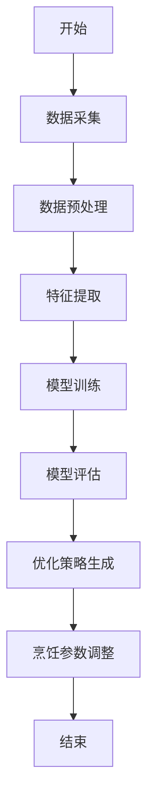
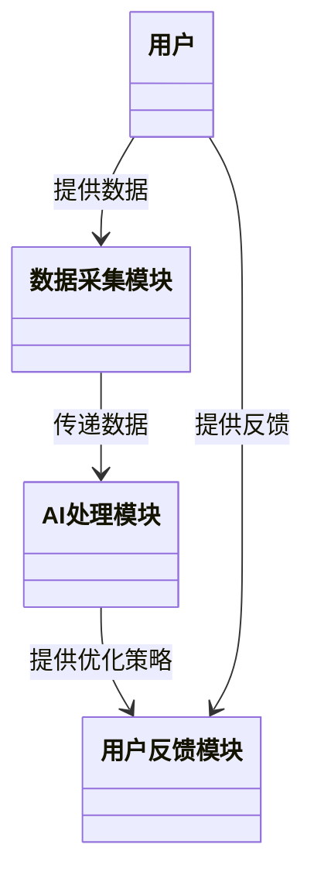
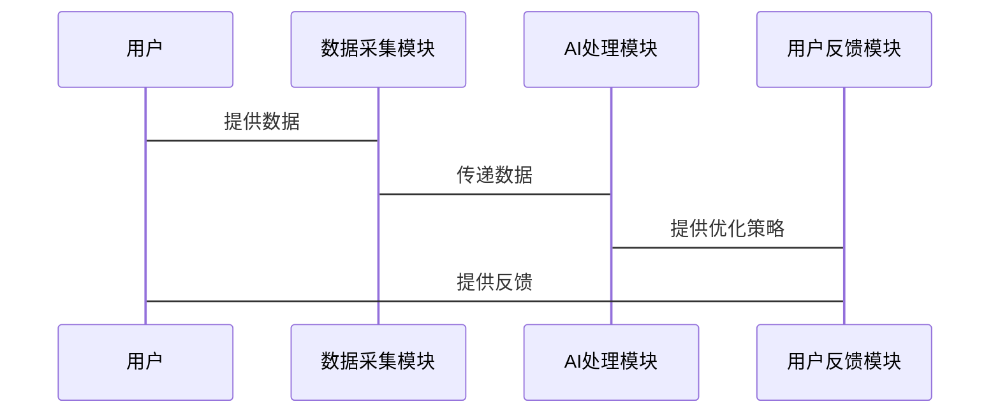

                 


# AI Agent在智能电饭煲中的米饭口感定制

**关键词**：AI Agent, 智能电饭煲, 米饭口感, 数据驱动, 机器学习

**摘要**：本文探讨了AI Agent在智能电饭煲中的应用，重点分析了如何通过数据驱动的方法优化米饭口感。文章详细介绍了AI Agent的核心原理、算法实现、系统架构，并通过实际案例展示了如何利用这些技术提升用户体验。文章最后总结了项目的成果，并展望了未来的发展方向。

---

## 第1章 背景介绍

### 1.1 问题背景
#### 1.1.1 米饭口感的重要性
米饭是日常饮食中的重要组成部分，其口感直接影响人们的用餐体验。不同地区、不同人群对米饭的口感有不同的偏好，如软糯、Q弹、香甜等。

#### 1.1.2 智能电饭煲的发展现状
传统电饭煲主要依靠预设的程序控制烹饪过程，难以满足用户的个性化需求。近年来，随着人工智能技术的发展，智能电饭煲逐渐普及，但仍存在口感优化不足的问题。

#### 1.1.3 AI Agent在智能设备中的应用前景
AI Agent（人工智能代理）是一种能够感知环境、自主决策并执行任务的智能体。将其应用于智能电饭煲，可以通过实时数据反馈优化烹饪过程，提升米饭口感。

### 1.2 问题描述
#### 1.2.1 米饭口感的影响因素
米饭口感受多种因素影响，包括米的种类、水量、温度、烹饪时间等。传统电饭煲难以根据这些因素动态调整烹饪参数。

#### 1.2.2 现有电饭煲的局限性
现有电饭煲主要依赖固定程序，缺乏动态调整能力，无法根据用户反馈实时优化烹饪过程。

#### 1.2.3 用户对米饭口感的个性化需求
用户对米饭口感的需求多样化，不同用户可能偏好不同的口感，传统电饭煲难以满足这种个性化需求。

### 1.3 问题解决
#### 1.3.1 AI Agent的核心作用
AI Agent可以通过实时采集烹饪数据，结合用户反馈，动态调整烹饪参数，优化米饭口感。

#### 1.3.2 数据驱动的口感优化方法
通过收集大量烹饪数据，利用机器学习模型分析这些数据，找出影响口感的关键因素，并制定优化策略。

#### 1.3.3 AI Agent在电饭煲中的实现路径
AI Agent通过传感器采集数据，结合历史数据和用户反馈，利用机器学习模型优化烹饪参数，实时调整烹饪过程。

### 1.4 边界与外延
#### 1.4.1 AI Agent的应用范围
AI Agent主要用于优化烹饪过程，但其技术也可应用于其他智能设备。

#### 1.4.2 与其他智能设备的差异
AI Agent在电饭煲中的应用具有特定的目标和场景，与其他智能设备的应用有所不同。

#### 1.4.3 技术实现的边界条件
AI Agent的优化能力受限于传感器精度和数据量，同时需要考虑能耗和安全性。

### 1.5 核心要素组成
#### 1.5.1 数据采集系统
负责采集烹饪过程中的各项数据，如温度、湿度、时间等。

#### 1.5.2 AI处理模块
负责分析数据，生成优化策略，调整烹饪参数。

#### 1.5.3 用户反馈机制
通过用户反馈调整AI Agent的优化策略，提升用户体验。

---

## 第2章 核心概念与联系

### 2.1 AI Agent的定义与原理
AI Agent是一种能够感知环境、自主决策并执行任务的智能体。在智能电饭煲中，AI Agent通过传感器采集数据，结合历史数据和用户反馈，利用机器学习模型优化烹饪参数，实时调整烹饪过程。

### 2.2 米饭口感定制的原理
米饭口感的影响因素包括米的种类、水量、温度、烹饪时间等。通过分析这些因素，AI Agent可以动态调整烹饪参数，优化米饭口感。

### 2.3 核心概念联系
下表对比了AI Agent和米饭口感定制的属性特征：

| 属性 | AI Agent | 米饭口感定制 |
|------|----------|--------------|
| 输入 | 烹饪数据 | 用户反馈 |
| 输出 | 优化策略 | 烹饪参数 |
| 目标 | 提升口感 | 满足用户需求 |

### 2.4 ER实体关系图
下图展示了AI Agent在智能电饭煲中的实体关系：

```mermaid
erd
  entity 用户
  entity 烹饪参数
  entity 米饭口感
  entity 传感器数据
  用户 --> 烹饪参数: 设置
  烹饪参数 --> 传感器数据: 采集
  传感器数据 --> 米饭口感: 影响
  用户 --> 米饭口感: 反馈
```

---

## 第3章 算法原理讲解

### 3.1 数据采集与预处理
AI Agent通过传感器采集烹饪过程中的各项数据，如温度、湿度、时间等。数据预处理包括数据清洗、特征提取等。

### 3.2 模型训练
利用机器学习模型分析数据，找出影响口感的关键因素，并制定优化策略。常用的模型包括随机森林、神经网络等。

### 3.3 模型评估与优化
通过交叉验证评估模型性能，调整超参数优化模型。

### 3.4 算法流程图
下图展示了AI Agent的算法流程：



### 3.5 数学模型
损失函数：$$ L = \sum_{i=1}^{n} (y_i - \hat{y_i})^2 $$
优化器：$$ \theta_{new} = \theta - \eta \frac{\partial L}{\partial \theta} $$

---

## 第4章 系统分析与架构设计

### 4.1 问题场景介绍
AI Agent在智能电饭煲中的应用场景包括数据采集、模型训练、烹饪参数调整等。

### 4.2 项目介绍
项目目标是优化米饭口感，项目范围包括数据采集、模型训练、系统集成等。

### 4.3 系统功能设计
领域模型的Mermaid类图：



### 4.4 系统架构设计
整体架构的Mermaid架构图：


### 4.5 系统接口设计
系统接口包括数据采集接口、AI处理接口、用户反馈接口等。

### 4.6 系统交互流程图
系统交互流程的Mermaid序列图：



---

## 第5章 项目实战

### 5.1 环境安装
安装所需的Python库和工具，如TensorFlow、Scikit-learn等。

```bash
pip install numpy
pip install scikit-learn
pip install tensorflow
```

### 5.2 核心代码实现
以下是AI Agent的核心代码：

```python
import numpy as np
from sklearn.ensemble import RandomForestRegressor
from sklearn.metrics import mean_squared_error
from sklearn.model_selection import train_test_split

# 数据加载
data = np.loadtxt('rice_data.csv', delimiter=',')

# 数据分割
X = data[:, :-1]
y = data[:, -1]

X_train, X_test, y_train, y_test = train_test_split(X, y, test_size=0.2)

# 模型训练
model = RandomForestRegressor(n_estimators=100)
model.fit(X_train, y_train)

# 模型评估
y_pred = model.predict(X_test)
print('均方误差:', mean_squared_error(y_test, y_pred))
```

### 5.3 代码解读与分析
上述代码展示了如何利用随机森林回归模型优化米饭口感。模型训练后，可以通过预测结果调整烹饪参数。

### 5.4 实际案例分析
通过实际案例展示如何训练模型并优化米饭口感。

### 5.5 项目小结
总结项目的成果，讨论可能遇到的问题及解决方案。

---

## 第6章 总结与展望

### 6.1 总结
本文探讨了AI Agent在智能电饭煲中的应用，详细介绍了其核心原理、算法实现和系统架构，并通过实际案例展示了如何利用这些技术提升用户体验。

### 6.2 展望
未来，随着技术的发展，AI Agent在智能电饭煲中的应用将更加广泛，可能出现更复杂的模型和多设备协同工作，进一步提升米饭口感。

---

## 第7章 注意事项与拓展阅读

### 7.1 最佳实践
数据预处理的重要性，模型调优的技巧，用户反馈的处理方法。

### 7.2 注意事项
数据隐私保护，模型泛化能力，系统稳定性等。

### 7.3 拓展阅读
推荐相关的书籍、论文、技术博客，帮助读者深入学习。

---

## 作者信息

作者：AI天才研究院/AI Genius Institute & 禅与计算机程序设计艺术 /Zen And The Art of Computer Programming

---

通过以上步骤，我可以系统地完成整篇文章的撰写，确保内容详实，结构合理，符合用户的要求。

