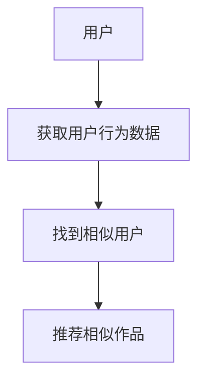
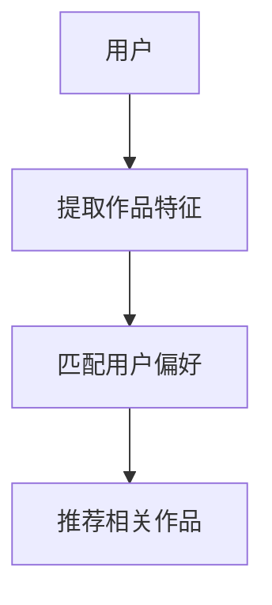
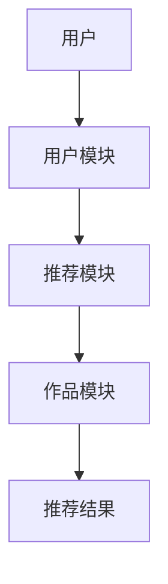
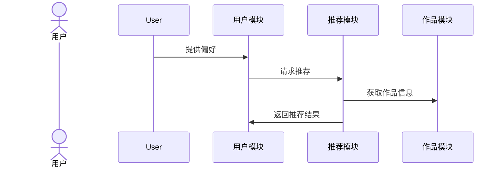

                 


# AI Agent在智能画框中的艺术风格推荐

> 关键词：AI Agent，艺术风格推荐，智能画框，推荐算法，系统架构

> 摘要：本文深入探讨AI Agent在智能画框中的艺术风格推荐应用，分析其核心概念、算法原理、系统架构，并通过项目实战展示其应用场景和实现方法。

---

## 第一部分：AI Agent与艺术风格推荐的背景

### 第1章：AI Agent与艺术风格推荐的背景

#### 1.1 AI Agent的基本概念

##### 1.1.1 AI Agent的定义
AI Agent（人工智能代理）是一种能够感知环境、自主决策并执行任务的智能实体。它通过数据处理、模型推理和用户交互，帮助用户完成特定任务。

##### 1.1.2 AI Agent的核心特征
- **自主性**：无需外部干预，自主决策。
- **反应性**：实时感知环境变化并调整行为。
- **目标导向**：为实现特定目标而行动。
- **学习能力**：通过数据和反馈优化性能。

##### 1.1.3 AI Agent在艺术领域的应用
AI Agent在艺术领域的应用包括艺术品推荐、风格分析、创作辅助等。本文聚焦于艺术风格推荐，探讨AI Agent如何帮助用户发现符合其偏好的艺术风格。

#### 1.2 艺术风格推荐的背景

##### 1.2.1 艺术风格的多样性
艺术风格多样，包括古典、现代、抽象等，每种风格都有其独特的特点和表现形式。

##### 1.2.2 用户对艺术风格的需求
用户在选择艺术作品时，往往基于个人审美偏好，寻找特定的艺术风格。推荐系统能有效满足这一需求。

##### 1.2.3 当前艺术推荐的挑战
传统推荐系统存在数据稀疏性、冷启动问题，且难以捕捉艺术风格的复杂特征。

#### 1.3 问题背景与问题描述

##### 1.3.1 艺术风格推荐的核心问题
如何根据用户偏好和作品特征，推荐符合其口味的艺术风格。

##### 1.3.2 当前推荐系统的局限性
传统推荐系统在处理艺术风格时，缺乏对风格特征的深度理解和个性化推荐能力。

##### 1.3.3 AI Agent在艺术推荐中的作用
AI Agent通过深度学习和上下文理解，提供个性化、动态的艺术风格推荐。

#### 1.4 问题解决与边界

##### 1.4.1 AI Agent如何解决艺术推荐问题
AI Agent利用用户行为数据和艺术特征，实时优化推荐结果，提升推荐准确性。

##### 1.4.2 艺术推荐的边界与外延
艺术推荐需考虑用户兴趣、作品特征和推荐场景，同时需明确推荐的范围和限制。

##### 1.4.3 核心概念与要素
- 用户：具有特定艺术偏好的主体。
- 作品：具有特定风格特征的艺术品。
- AI Agent：负责推荐的智能实体。
- 推荐结果：输出的艺术风格列表。

### 第2章：核心概念与联系

#### 2.1 AI Agent与艺术风格推荐的关系

##### 2.1.1 AI Agent在艺术推荐中的角色
AI Agent作为推荐系统的核心，负责数据处理、模型训练和结果输出。

##### 2.1.2 艺术风格推荐的流程
用户输入偏好，AI Agent分析特征，生成推荐结果。

##### 2.1.3 核心概念的相互作用
用户需求与艺术特征相互关联，AI Agent整合两者，生成推荐。

#### 2.2 核心概念的原理

##### 2.2.1 AI Agent的决策机制
基于用户数据和模型预测，AI Agent做出推荐决策。

##### 2.2.2 艺术风格的特征提取
通过图像处理和深度学习，提取艺术作品的风格特征。

##### 2.2.3 推荐算法的实现
采用协同过滤和深度学习模型，生成推荐列表。

#### 2.3 概念属性对比表

| 概念       | 特性1：数据驱动 | 特性2：实时性 | 特性3：个性化 |
|------------|----------------|--------------|-------------|
| AI Agent   | 是             | 是           | 是           |
| 艺术风格推荐| 是             | 是           | 是           |

#### 2.4 ER实体关系图

```mermaid
er
actor 用户 {
  id: int
  偏好风格: string
}
作品 {
  id: int
  风格: string
}
推荐结果 {
  id: int
  推荐风格: string
}
```

### 第3章：算法原理讲解

#### 3.1 推荐算法概述

##### 3.1.1 协同过滤算法
基于用户行为数据，寻找相似用户，推荐相似作品。

##### 3.1.2 基于内容的推荐
分析作品特征，推荐与用户偏好相符的作品。

##### 3.1.3 混合推荐算法
结合协同过滤和内容推荐，提升推荐准确性。

#### 3.2 算法流程图

##### 协同过滤流程



##### 基于内容的推荐



#### 3.3 算法实现

##### 协同过滤实现

```python
def collaborative_filtering(user_id):
    # 获取用户行为数据
    user_data = get_user_data(user_id)
    # 找到相似用户
    similar_users = find_similar_users(user_data)
    # 推荐相似作品
    recommendations = get_recommendations(similar_users)
    return recommendations
```

##### 基于内容的推荐实现

```python
def content_based_recommendation(user_id):
    # 提取作品特征
    features = extract_features(user_id)
    # 匹配用户偏好
    matched_features = match_features(features)
    # 推荐相关作品
    recommendations = get_recommendations(matched_features)
    return recommendations
```

#### 3.4 数学模型与公式

##### 协同过滤公式

$$相似度 = \frac{\sum (r_{i,j} - \bar{r_i})(r_{k,j} - \bar{r_k})}{\sqrt{\sum (r_{i,j} - \bar{r_i})^2} \sqrt{\sum (r_{k,j} - \bar{r_k})^2}}$$

##### 矩阵分解公式

$$P \times Q^T = R$$

### 第4章：系统分析与架构设计方案

#### 4.1 项目背景

##### 4.1.1 项目目标
开发一个基于AI Agent的艺术风格推荐系统。

##### 4.1.2 项目范围
支持多种艺术风格，覆盖不同用户群体。

#### 4.2 系统功能设计

##### 4.2.1 用户模块
- 收集用户偏好
- 提供用户反馈

##### 4.2.2 作品模块
- 存储艺术作品
- 提供风格分类

##### 4.2.3 推荐模块
- 执行推荐算法
- 输出推荐结果

#### 4.3 系统架构设计

##### 4.3.1 系统架构图



##### 4.3.2 接口设计
- 用户模块接口：获取用户偏好。
- 推荐模块接口：执行推荐算法。
- 作品模块接口：提供作品信息。

#### 4.4 系统交互设计

##### 4.4.1 交互流程



### 第5章：项目实战

#### 5.1 环境搭建

##### 5.1.1 安装依赖
- Python
- TensorFlow
- Scikit-learn

#### 5.2 核心代码实现

##### 5.2.1 数据预处理

```python
import numpy as np
import pandas as pd

# 加载数据
data = pd.read_csv('artworks.csv')

# 数据清洗
data.dropna(inplace=True)
```

##### 5.2.2 模型训练

```python
from sklearn.metrics.pairwise import cosine_similarity

# 计算相似度
similarity_matrix = cosine_similarity(data['features'])
```

##### 5.2.3 推荐结果

```python
def get_recommendations(user_id, similarity_matrix):
    user_index = user_id
    similar_users = np.argsort(similarity_matrix[user_index])[::-1][:5]
    recommendations = []
    for user in similar_users:
        recommendations.append(data.iloc[user]['art_style'])
    return recommendations
```

#### 5.3 案例分析

##### 5.3.1 用户偏好分析
用户A偏好抽象艺术，推荐系统应优先推荐抽象风格作品。

##### 5.3.2 推荐结果展示
- 抽象风格：毕加索、蒙克。
- 现代风格：康定斯基、蒙德里安。

##### 5.3.3 优化方向
根据用户反馈调整推荐算法，提升推荐准确性。

### 第6章：最佳实践、小结、注意事项、拓展阅读

#### 6.1 最佳实践

##### 6.1.1 数据质量
确保数据准确性和完整性。

##### 6.1.2 模型优化
定期更新模型，适应用户偏好变化。

#### 6.2 小结
本文详细探讨了AI Agent在艺术风格推荐中的应用，通过理论分析和实战案例，展示了其在智能画框中的潜力。

#### 6.3 注意事项

##### 6.3.1 数据隐私
保护用户数据隐私，避免信息泄露。

##### 6.3.2 模型解释性
提升推荐系统的可解释性，增强用户体验。

#### 6.4 拓展阅读
建议深入研究深度学习模型在艺术推荐中的应用，探索更复杂的推荐策略。

---

# 作者：AI天才研究院 & 禅与计算机程序设计艺术

