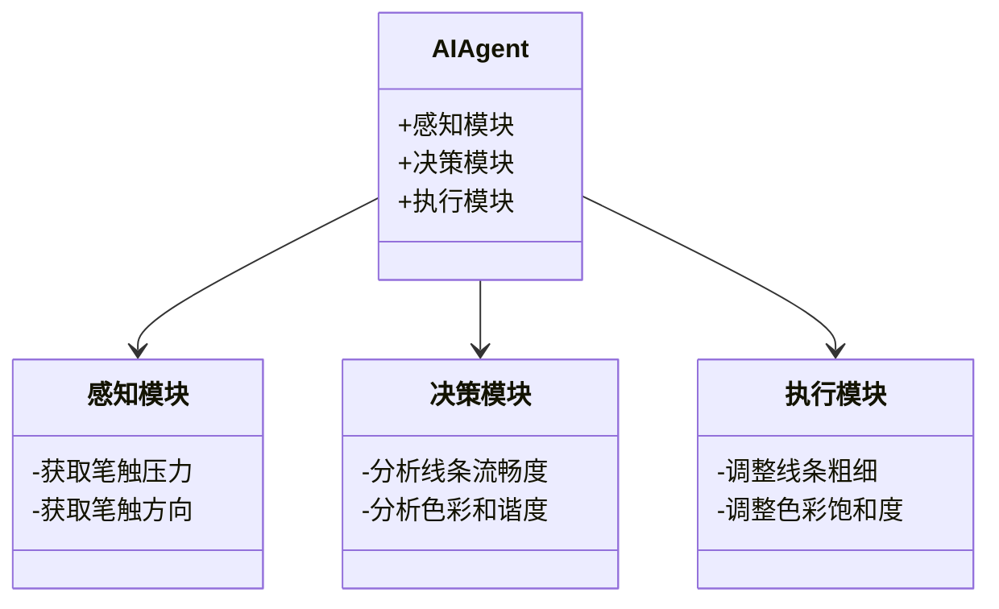
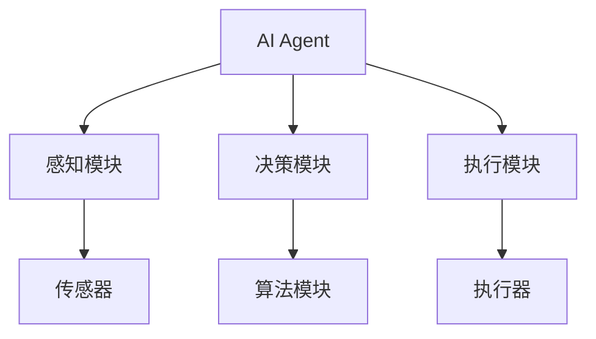
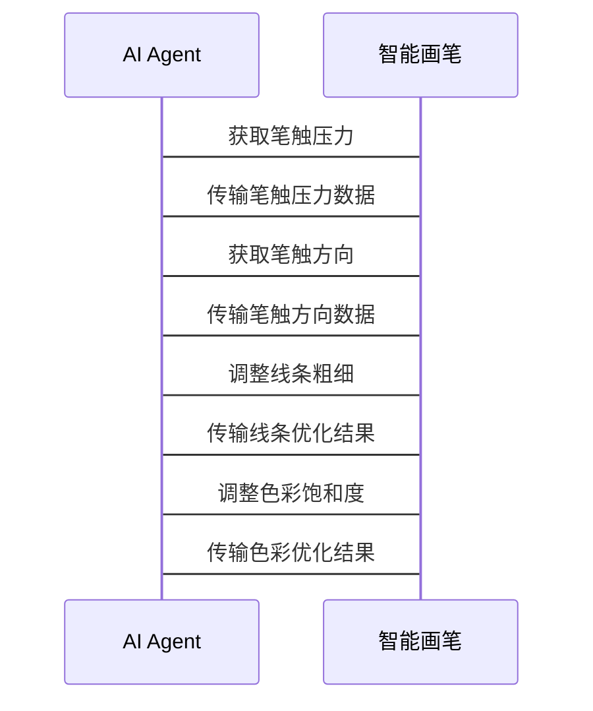

                 


# AI Agent在智能画笔中的绘画技巧指导

## 关键词：
AI Agent, 智能画笔, 绘画技巧, 机器学习, 图像处理

## 摘要：
本文详细探讨了AI Agent在智能画笔中的绘画技巧指导。通过分析AI Agent的核心原理、图像处理技术、绘画技巧实现、系统架构设计以及项目实战，本文为读者提供了从理论到实践的全面指导。文章结合了丰富的技术细节和实际案例，帮助读者深入了解AI Agent在智能画笔中的应用及其绘画技巧的实现过程。

---

## 第一部分: AI Agent与智能画笔的背景介绍

### 第1章: AI Agent的基本概念

#### 1.1 AI Agent的定义与特点
- **1.1.1 AI Agent的定义**  
  AI Agent（人工智能代理）是一种能够感知环境、自主决策并执行任务的智能实体。它通过传感器获取信息，利用算法进行分析和决策，并通过执行器与环境交互。AI Agent的核心目标是通过智能化手段提升人类的创作效率和体验。

- **1.1.2 AI Agent的核心特点**  
  - **自主性**：AI Agent能够自主完成任务，无需人工干预。  
  - **反应性**：能够实时感知环境变化并做出响应。  
  - **学习能力**：通过机器学习算法不断优化自身的绘画技巧和风格。  
  - **适应性**：能够根据用户的反馈调整绘画策略。

- **1.1.3 AI Agent与传统绘画工具的区别**  
  AI Agent不仅能够辅助绘画，还能根据用户的意图生成创意性的绘画内容。与传统绘画工具相比，AI Agent具备智能化和个性化的特点。

---

### 第2章: 智能画笔的发展历程

#### 2.1 智能画笔的起源
- **2.1.1 传统绘画工具的数字化转型**  
  传统绘画工具（如铅笔、油画笔）逐渐向数字化转型，催生了数字化绘画工具（如数位板）。这些工具通过模拟传统绘画工具的触感，为艺术家提供了更便捷的创作方式。

- **2.1.2 初代智能画笔的功能特点**  
  初代智能画笔主要具备以下功能：  
  - 压力敏感度调节线条粗细。  
  - 笔触追踪与记录。  
  - 基于预设模板的绘画辅助。

- **2.1.3 AI技术对智能画笔的革新作用**  
  AI技术的引入，使得智能画笔能够实现以下功能：  
  - 自动优化线条和色彩。  
  - 生成创意性绘画内容。  
  - 实时反馈绘画技巧建议。

---

### 第3章: AI Agent在绘画中的应用与优势

#### 3.1 AI Agent在绘画中的应用场景
- **3.1.1 线条绘制的优化**  
  AI Agent能够通过图像处理技术优化线条的流畅度和一致性。例如，通过边缘检测算法，AI Agent可以自动修正不规则线条。

- **3.1.2 色彩填充的智能辅助**  
  AI Agent能够根据画面的色彩分布，推荐和谐的色彩搭配，并实时调整色彩饱和度和明暗度。

- **3.1.3 笔触的多样化模拟**  
  AI Agent能够模拟不同绘画工具的笔触效果，例如油画笔的厚重感、水彩笔的透明感等。

#### 3.2 AI Agent在绘画中的优势
- **3.2.1 提高绘画效率**  
  AI Agent能够快速生成绘画内容，显著缩短创作时间。

- **3.2.2 增强创作灵感**  
  AI Agent可以根据用户输入的关键词或参考图像，生成创意性绘画内容，激发用户的创作灵感。

- **3.2.3 支持个性化风格**  
  AI Agent能够根据用户的绘画习惯和偏好，定制个性化的绘画风格。

---

## 第二部分: AI Agent的核心原理

### 第4章: AI Agent的核心原理

#### 4.1 AI Agent的基本工作原理
- **4.1.1 感知阶段**  
  AI Agent通过传感器获取绘画环境中的信息，例如笔触压力、绘画速度和绘画方向。

- **4.1.2 决策阶段**  
  基于感知到的信息，AI Agent利用机器学习算法进行分析和决策。例如，AI Agent可以通过图像分割技术识别绘画区域的边缘和颜色分布。

- **4.1.3 执行阶段**  
  根据决策结果，AI Agent通过执行器（如数字绘画设备）调整绘画参数，例如线条粗细、色彩饱和度等。

---

### 第5章: 智能画笔中的图像处理技术

#### 5.1 图像分割技术
- **5.1.1 图像分割的基本原理**  
  图像分割是将图像划分为多个区域的过程。AI Agent通过图像分割技术，可以识别绘画区域的边缘和颜色分布。

- **5.1.2 基于深度学习的图像分割算法**  
  常见的图像分割算法包括U-Net和FCN（Fully Convolutional Networks）。这些算法通过卷积神经网络（CNN）对图像进行特征提取和分割。

- **5.1.3 图像分割在绘画中的应用**  
  图像分割技术可以用于识别绘画区域的边缘和颜色分布，从而优化线条和色彩。

#### 5.2 边缘检测技术
- **5.2.1 边缘检测的基本方法**  
  边缘检测是图像处理中的基础技术，用于识别图像中的边缘。常见的边缘检测算法包括Canny边缘检测和Sobel边缘检测。

- **5.2.2 基于深度学习的边缘检测算法**  
  基于深度学习的边缘检测算法（如DeepLab和Mask R-CNN）能够实现高精度的边缘检测。

- **5.2.3 边缘检测在绘画中的应用**  
  边缘检测技术可以用于优化线条的流畅度和一致性。

---

### 第6章: AI Agent的绘画技巧实现

#### 6.1 线条绘制的实现
- **6.1.1 线条检测算法**  
  AI Agent可以通过边缘检测算法识别绘画区域的线条。

- **6.1.2 线条优化算法**  
  线条优化算法（如中值滤波和高斯滤波）可以用于平滑线条并消除抖动。

- **6.1.3 线条生成算法**  
  基于生成对抗网络（GAN）的线条生成算法可以模拟不同绘画工具的笔触效果。

#### 6.2 色彩填充的实现
- **6.2.1 色彩检测算法**  
  AI Agent可以通过色彩空间转换技术（如RGB到HSV）检测绘画区域的颜色分布。

- **6.2.2 色彩填充算法**  
  色彩填充算法（如泊松溶解算法）可以用于生成和谐的色彩搭配。

- **6.2.3 色彩优化算法**  
  色彩优化算法（如颜色平滑化算法）可以用于调整色彩饱和度和明暗度。

#### 6.3 笔触模拟的实现
- **6.3.1 笔触检测算法**  
  AI Agent可以通过图像处理技术检测绘画区域的笔触。

- **6.3.2 笔触模拟算法**  
  基于物理模拟的笔触模拟算法可以模拟不同绘画工具的笔触效果，例如油画笔的厚重感和水彩笔的透明感。

---

## 第三部分: AI Agent在智能画笔中的系统架构与设计

### 第7章: 系统架构设计

#### 7.1 问题场景介绍
- AI Agent需要在智能画笔中实现以下功能：  
  - 实时感知笔触压力和方向。  
  - 自动优化线条和色彩。  
  - 生成创意性绘画内容。

#### 7.2 系统功能设计
- **领域模型设计**  
  下图展示了AI Agent在智能画笔中的领域模型，包括感知模块、决策模块和执行模块。



#### 7.3 系统架构设计
- 下图展示了AI Agent在智能画笔中的系统架构。



#### 7.4 系统接口设计
- AI Agent与智能画笔的接口设计如下：  
  - 输入接口：笔触压力、笔触方向。  
  - 输出接口：线条粗细调整、色彩饱和度调整。

#### 7.5 系统交互设计
- 下图展示了AI Agent与智能画笔的交互流程。



---

## 第四部分: 项目实战

### 第8章: 项目实战

#### 8.1 环境搭建
- **开发环境**：Python 3.8及以上版本，PyTorch 1.9及以上版本，Jupyter Notebook。  
- **硬件要求**：NVIDIA GPU（支持CUDA加速）。

#### 8.2 核心代码实现
- **线条优化算法实现**  
  以下代码展示了基于中值滤波的线条优化算法：

```python
import numpy as np
import cv2

def optimize_lines(image, kernel_size=3):
    # 将图像转换为灰度图
    gray = cv2.cvtColor(image, cv2.COLOR_BGR2GRAY)
    # 使用中值滤波优化线条
    optimized_gray = cv2.medianBlur(gray, kernel_size)
    # 将优化后的灰度图转换为彩色图
    optimized_image = cv2.cvtColor(optimized_gray, cv2.COLOR_GRAY2BGR)
    return optimized_image
```

- **色彩优化算法实现**  
  以下代码展示了基于泊松溶解的色彩优化算法：

```python
import numpy as np
import cv2

def optimize_colors(image):
    # 将图像转换为HSV色彩空间
    hsv = cv2.cvtColor(image, cv2.COLOR_BGR2HSV)
    # 优化色彩饱和度和明暗度
    hsv[:, :, 1] = cv2.equalizeHist(hsv[:, :, 1])
    hsv[:, :, 2] = cv2.equalizeHist(hsv[:, :, 2])
    # 将图像转换为BGR色彩空间
    optimized_image = cv2.cvtColor(hsv, cv2.COLOR_HSV2BGR)
    return optimized_image
```

#### 8.3 实际案例分析
- **案例1**：线条优化  
  输入：原始线条存在抖动和不规则。  
  输出：优化后的线条流畅且一致。

- **案例2**：色彩优化  
  输入：色彩饱和度低，明暗不协调。  
  输出：优化后的色彩饱和度高，明暗协调。

---

## 第五部分: 总结与展望

### 第9章: 总结与展望

#### 9.1 总结
- 本文详细探讨了AI Agent在智能画笔中的绘画技巧指导。通过分析AI Agent的核心原理、图像处理技术、绘画技巧实现、系统架构设计以及项目实战，本文为读者提供了从理论到实践的全面指导。

#### 9.2 展望
- 未来，AI Agent在智能画笔中的应用将更加广泛。随着深度学习技术的不断进步，AI Agent将能够实现更加复杂的绘画技巧，例如实时风格迁移和个性化绘画风格定制。

---

## 作者：
AI天才研究院/AI Genius Institute & 禅与计算机程序设计艺术/Zen And The Art of Computer Programming

