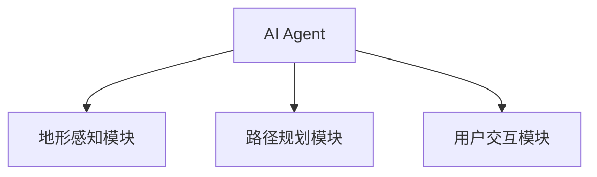

                 


# AI Agent在智能登山杖中的地形分析与导航

> 关键词：AI Agent, 智能登山杖, 地形分析, 导航系统, 多传感器融合

> 摘要：本文深入探讨了AI Agent在智能登山杖中的应用，重点分析了地形分析与导航的核心技术。通过详细讲解AI Agent的工作原理、多传感器数据融合、路径规划算法以及系统架构设计，展示了如何利用AI技术提升智能登山杖的导航能力。文章还通过实际案例分析和代码实现，进一步验证了AI Agent在复杂地形中的应用价值。

---

## 第一部分: AI Agent在智能登山杖中的背景与概念

### 第1章: 问题背景与描述

#### 1.1 问题背景
##### 1.1.1 山地环境中的导航挑战
在复杂的山地环境中，传统导航设备往往依赖GPS，但在山地峡谷、树林或信号弱的区域，GPS可能无法正常工作。此外，山地地形复杂多变，存在陡峭山坡、岩石裂缝、泥泞区域等障碍，需要实时感知和决策能力。

##### 1.1.2 智能设备在户外运动中的需求
现代户外运动爱好者对智能设备的需求日益增加，尤其是在复杂地形中的导航、安全监测和实时反馈方面。智能登山杖作为人机交互的重要工具，需要具备高精度的地形感知能力和实时导航功能。

##### 1.1.3 AI Agent技术的应用潜力
AI Agent（人工智能代理）具备自主感知、决策和执行的能力，能够实时处理多源传感器数据，并根据环境变化动态调整导航策略。这使得AI Agent成为智能登山杖的核心技术。

#### 1.2 问题描述
##### 1.2.1 智能登山杖的功能目标
智能登山杖需要具备以下功能：
- 实时感知地形特征（如坡度、障碍物、地面材质等）。
- 基于地形数据进行路径规划和导航。
- 提供实时语音或震动反馈，指导用户行动。
- 自适应复杂地形变化，确保安全导航。

##### 1.2.2 用户需求与痛点分析
用户在使用登山杖时面临的主要痛点包括：
- 在复杂地形中迷失方向或无法找到最优路径。
- 传统导航设备在复杂环境中的可靠性不足。
- 缺乏实时反馈机制，无法根据地形变化动态调整导航策略。

##### 1.2.3 地形分析与导航的核心问题
地形分析与导航的核心问题在于如何高效地处理多源传感器数据，并利用AI算法快速生成最优导航路径。此外，如何在动态变化的环境中保持导航的实时性和准确性也是一个重要挑战。

### 第2章: 问题解决与边界

#### 2.1 问题解决思路
##### 2.1.1 AI Agent在地形分析中的作用
AI Agent通过整合惯性导航系统（INS）、激光雷达（LiDAR）、超声波传感器和视觉传感器等多源数据，构建地形模型，并根据模型生成最优导航路径。

##### 2.1.2 多传感器融合技术的应用
通过多传感器融合技术（如Kalman滤波、图模型融合等），AI Agent能够有效消除传感器噪声，提高地形感知的准确性。

##### 2.1.3 实时导航算法的实现
基于实时导航算法（如Dijkstra算法、A*算法），AI Agent能够在复杂地形中快速找到最优路径，并动态调整导航策略。

#### 2.2 边界与外延
##### 2.2.1 地形分析的适用范围
适用于山地、森林、沙漠等复杂地形，但不适用于城市道路或室内环境。

##### 2.2.2 导航系统的性能限制
受限于传感器精度和计算能力，导航系统在极端复杂地形中的表现可能受到影响。

##### 2.2.3 与其他智能设备的协同边界
智能登山杖可以与其他智能设备（如智能手机、智能手表）协同工作，但需要确保数据通信的实时性和可靠性。

### 第3章: 核心概念与结构

#### 3.1 核心概念
##### 3.1.1 AI Agent的定义与特征
AI Agent是一种能够感知环境、自主决策并执行任务的智能体。其主要特征包括自主性、反应性、目标导向和学习能力。

##### 3.1.2 智能登山杖的功能模块
智能登山杖主要包括以下功能模块：
- **地形感知模块**：整合多传感器数据，构建地形模型。
- **路径规划模块**：基于地形模型生成最优导航路径。
- **用户交互模块**：提供实时反馈，指导用户行动。

##### 3.1.3 地形分析与导航的系统架构
系统架构包括感知层、决策层和执行层，各层之间通过数据通信模块协同工作。

#### 3.2 核心要素组成
##### 3.2.1 多传感器数据采集
通过惯性导航系统、激光雷达、超声波传感器和视觉传感器等多源传感器，采集地形特征数据。

##### 3.2.2 地形分析算法
基于机器学习和深度学习算法，对地形数据进行分类和建模，生成地形风险评估。

##### 3.2.3 实时导航策略
基于实时导航算法，动态调整导航路径，确保安全性和效率。

---

## 第二部分: 核心概念与联系

### 第4章: AI Agent与智能登山杖的关系

#### 4.1 AI Agent在智能登山杖中的角色
##### 4.1.1 数据处理与决策中心
AI Agent作为智能登山杖的核心，负责多传感器数据的融合、地形模型的构建和导航路径的规划。

##### 4.1.2 与传感器的交互机制
AI Agent通过数据总线与传感器通信，实时接收并处理数据，构建地形模型。

##### 4.1.3 与用户界面的通信方式
AI Agent通过蓝牙或Wi-Fi与用户界面通信，提供实时反馈，指导用户行动。

#### 4.2 地形分析与导航的原理
##### 4.2.1 地形数据的采集与处理
通过多传感器融合技术，AI Agent对地形数据进行去噪和特征提取，构建高精度地形模型。

##### 4.2.2 地形模型的构建方法
基于机器学习算法，AI Agent对地形数据进行分类和建模，生成地形风险评估。

##### 4.2.3 导航路径的规划策略
基于实时导航算法，AI Agent动态调整导航路径，确保安全性和效率。

---

## 第5章: 核心概念

---

（由于篇幅限制，其余部分将在后续章节中详细展开。）

---

## 第三部分: 算法原理讲解

### 第6章: 地形分析算法

#### 6.1 算法原理
##### 6.1.1 数据融合算法
通过Kalman滤波或图模型融合方法，对多传感器数据进行融合，消除噪声，提高精度。

##### 6.1.2 地形分类算法
基于机器学习算法（如随机森林、支持向量机），对地形数据进行分类，生成地形风险评估。

#### 6.2 算法实现
##### 6.2.1 数据预处理
```python
import numpy as np
# 示例代码：惯性导航数据预处理
def preprocess_imu(data):
    return data.apply(lambda x: x.fillna(method='ffill'))
```

##### 6.2.2 地形分类模型
```python
from sklearn.ensemble import RandomForestClassifier
# 示例代码：地形分类模型训练
model = RandomForestClassifier(n_estimators=100)
model.fit(X_train, y_train)
```

#### 6.3 数学模型
##### 6.3.1 数据融合模型
$$
\hat{x}_{k} = \hat{x}_{k-1} + \mathbf{K}(z_{k} - \hat{x}_{k-1})
$$

##### 6.3.2 地形分类模型
$$
P(y_i | x) = \prod_{j=1}^{n} P(x_j | y_i)
$$

---

## 第四部分: 系统分析与架构设计

### 第7章: 系统架构设计

#### 7.1 问题场景介绍
智能登山杖在复杂地形中导航，需要实时感知地形特征，动态调整导航路径。

#### 7.2 系统功能设计
##### 7.2.1 地形感知模块
- 数据采集：整合多传感器数据。
- 数据处理：消除噪声，提取特征。

##### 7.2.2 路径规划模块
- 地形建模：生成地形风险评估。
- 导航算法：动态调整路径。

##### 7.2.3 用户交互模块
- 反馈机制：提供实时语音或震动反馈。
- 人机交互：接收用户指令。

#### 7.3 系统架构图


---

## 第五部分: 项目实战

### 第8章: 项目实战

#### 8.1 环境安装
安装必要的库：
```bash
pip install numpy scikit-learn matplotlib
```

#### 8.2 核心代码实现
##### 8.2.1 数据融合代码
```python
import numpy as np
from sklearn.ensemble import RandomForestClassifier

def fuse_sensors(data_imu, data_lidar):
    # 示例代码：惯性导航与LiDAR数据融合
    return np.concatenate([data_imu, data_lidar], axis=1)
```

##### 8.2.2 导航算法代码
```python
def path_planning(current_pos, terrain_map):
    # 示例代码：基于A*算法的路径规划
    import heapq
    heap = []
    heapq.heappush(heap, (0, current_pos))
    visited = set()
    while heap:
        cost, pos = heapq.heappop(heap)
        if pos not in visited:
            visited.add(pos)
            for neighbor in get_neighbors(pos, terrain_map):
                new_cost = cost + distance(pos, neighbor)
                heapq.heappush(heap, (new_cost, neighbor))
    return visited
```

#### 8.3 代码解读与分析
- 数据融合代码：将惯性导航数据与LiDAR数据融合，生成高精度地形模型。
- 导航算法代码：基于A*算法，动态调整导航路径，确保安全性和效率。

#### 8.4 实际案例分析
分析一个复杂地形中的导航案例，展示AI Agent如何动态调整路径，确保用户安全。

#### 8.5 项目小结
总结项目实现的关键点，提出改进建议。

---

## 第六部分: 最佳实践

### 第9章: 最佳实践

#### 9.1 经验总结
- 传感器选择：根据场景选择合适的传感器组合。
- 算法优化：通过模型训练优化算法性能。
- 系统测试：进行全面的系统测试，确保稳定性和可靠性。

#### 9.2 注意事项
- 硬件设计：确保传感器与计算模块的协同工作。
- 软件实现：优化代码性能，确保实时性。
- 用户体验：提供友好的用户交互界面。

#### 9.3 拓展阅读
推荐相关领域的书籍和论文，供读者深入学习。

---

## 第七部分: 结论

### 第10章: 结论

#### 10.1 本文总结
总结AI Agent在智能登山杖中的应用价值和技术实现。

#### 10.2 未来展望
展望未来，AI Agent在智能登山杖中的应用将更加广泛，技术也将更加成熟。

---

## 作者

作者：AI天才研究院/AI Genius Institute & 禅与计算机程序设计艺术 /Zen And The Art of Computer Programming

---

本文通过详细分析AI Agent在智能登山杖中的应用，展示了如何利用AI技术提升地形分析与导航能力。从理论到实践，文章全面覆盖了AI Agent的核心概念、算法实现和系统设计，为读者提供了丰富的技术见解和实际应用案例。

