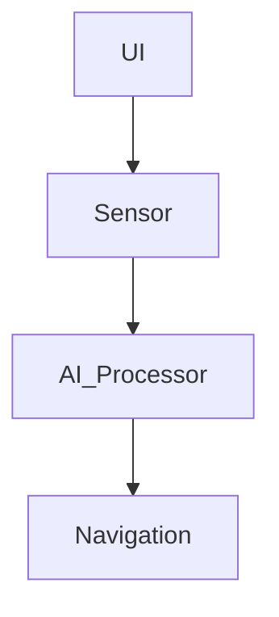
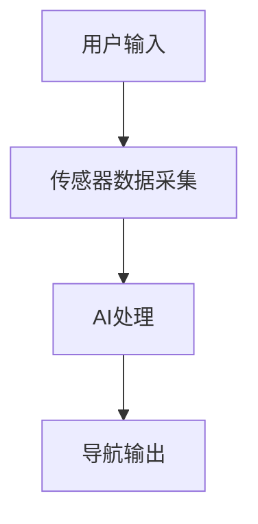
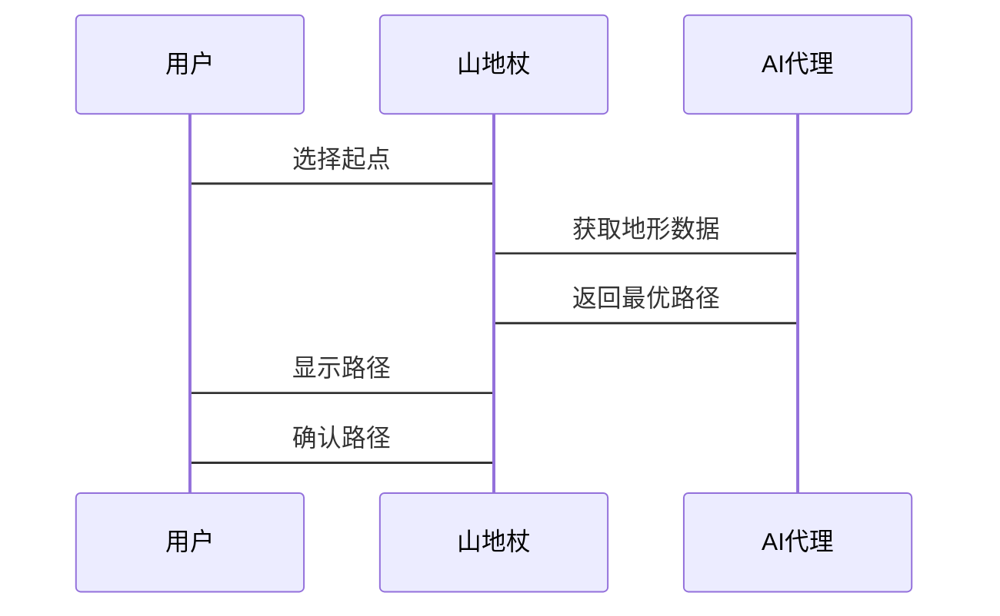

                 


# AI Agent在智能登山杖中的地形适应指导

**关键词：** AI Agent, 智能登山杖, 地形适应, 路径规划, 机器学习, 安全导航

**摘要：** 本文探讨了AI Agent在智能登山杖中的应用，重点分析其如何通过感知、决策和执行机制实现地形适应，提高登山的安全性和效率。文章详细介绍了AI Agent的核心概念、算法原理、系统架构，并通过案例分析展示了其实现过程。

---

## 正文

### 第一部分：背景介绍

#### 第1章：问题背景与描述

##### 1.1 问题背景
- **登山运动的挑战**：地形复杂、天气多变、潜在危险多。
- **现有登山杖的局限性**：无法提供实时导航或危险预警。
- **AI技术的潜力**：通过感知和决策提升装备智能化。

##### 1.2 问题描述
- **核心问题**：如何实时分析地形并提供最优路径。
- **用户需求**：安全、高效、个性化的导航。
- **现有解决方案不足**：传统导航系统依赖GPS，无法应对复杂地形。

##### 1.3 问题解决思路
- **引入AI Agent**：利用AI进行实时分析和决策。
- **AI Agent的作用**：感知环境、优化路径、提供反馈。
- **技术实现路径**：传感器数据采集、AI算法处理、用户反馈。

##### 1.4 边界与外延
- **场景边界**：限定在复杂地形和中等难度登山。
- **功能边界**：仅提供导航建议，不直接控制设备。
- **技术边界**：基于现有传感器和AI算法。

##### 1.5 核心要素组成
- **AI Agent**：感知、决策、执行。
- **智能登山杖**：传感器、计算模块、用户界面。
- **地形数据**：GPS、倾斜度、障碍物。

### 第2章：核心概念与联系

#### 2.1 AI Agent的定义与原理
- **基本概念**：AI Agent是能够感知环境并自主决策的实体。
- **核心原理**：通过传感器数据和算法模型，生成行动计划。
- **分类**：基于智能水平，分为简单反射和复杂推理。

#### 2.2 智能登山杖的功能解析
- **定义**：集成AI技术，具备环境感知和决策能力的登山杖。
- **功能模块**：传感器数据采集、路径规划、危险预警。
- **技术特点**：轻便、低功耗、实时响应。

#### 2.3 AI Agent与智能登山杖的关系
- **功能角度**：AI Agent作为核心，驱动登山杖的各项功能。
- **技术角度**：AI算法处理数据，指导杖的动作和反馈。
- **用户需求角度**：提供直观、安全的导航体验。

#### 2.4 核心概念对比表
| **属性**      | **AI Agent**             | **传统导航系统**          |
|----------------|--------------------------|---------------------------|
| **感知能力**   | 强，实时环境数据         | 依赖GPS，无实时反馈       |
| **决策能力**   | 高度智能，路径优化       | 预设路径，无法实时调整     |
| **交互方式**   | 双向反馈，动态调整       | 单向输出，用户被动接收     |

#### 2.5 ER实体关系图
```mermaid
erDiagram
    user o-|{拥有}| mountain_stick
    mountain_stick o-|{配备}| ai_agent
    ai_agent o-|{处理}| terrain_data
```

### 第3章：算法原理

#### 3.1 AI Agent的感知机制
- **传感器数据**：GPS、加速度计、陀螺仪。
- **数据融合**：通过加权融合算法，提升感知精度。
- **数学模型**：卡尔曼滤波用于数据融合。

#### 3.2 决策机制
- **路径规划算法**：Dijkstra算法优化路径。
- **地形识别模型**：支持向量机分类地形类型。
- **公式示例**：Dijkstra算法用于计算最短路径：
  $$
  \text{distance}(A, B) = \text{min}( \text{weight}(A, C) + \text{distance}(C, B) )
  $$

#### 3.3 执行机制
- **反馈机制**：实时调整路径，根据用户反馈优化。
- **路径优化算法**：A*算法动态调整路线。
- **公式示例**：A*算法中的启发式函数：
  $$
  \text{f(n)} = \text{g(n)} + \text{h(n)}
  $$

### 第4章：系统分析与架构设计

#### 4.1 系统架构设计
- **模块划分**：传感器模块、AI处理模块、用户交互模块。
- **架构图**：


#### 4.2 功能设计
- **领域模型**：用户、传感器、AI处理。
- **功能流程图**：


#### 4.3 接口设计
- **传感器接口**：SPI/I2C通信。
- **用户界面**：蓝牙连接手机App。

#### 4.4 交互流程图


### 第5章：项目实战

#### 5.1 环境安装
- **开发环境**：Python 3.8+, PyTorch 1.9+。
- **硬件要求**：Raspberry Pi 4, MPU6050传感器。

#### 5.2 核心代码实现
- **传感器数据采集**：
  ```python
  import board
  import busio
  from adafruit_mpu6050 import MPU6050

  i2c = busio.I2C(board.SCL, board.SDA)
  mpu = MPU6050(i2c)
  ```

- **路径规划算法**：
  ```python
  def dijkstra(start, end, graph):
      import heapq
      dist = {node: float('infinity') for node in graph}
      dist[start] = 0
      heap = [(0, start)]
      while heap:
          current_dist, current_node = heapq.heappop(heap)
          if current_node == end:
              break
          for neighbor, weight in graph[current_node].items():
              if dist[neighbor] > current_dist + weight:
                  dist[neighbor] = current_dist + weight
                  heapq.heappush(heap, (dist[neighbor], neighbor))
      return dist[end]
  ```

#### 5.3 案例分析
- **案例选择**：复杂地形下的路径优化。
- **数据分析**：比较传统路径与AI优化路径的效率。
- **结果展示**：路径对比图和性能数据表。

#### 5.4 项目总结
- **成功经验**：AI Agent显著提高导航效率。
- **问题与不足**：传感器精度和算法响应时间需优化。
- **未来改进方向**：引入更复杂的AI模型，如深度学习。

### 第6章：最佳实践

#### 6.1 小结
- **核心要点**：AI Agent提升登山杖的智能化水平。
- **关键成功因素**：高效算法和精准传感器。

#### 6.2 注意事项
- **数据隐私**：妥善处理用户位置数据。
- **设备维护**：定期校准传感器，确保准确性。
- **环境适应性**：考虑极端天气和复杂地形的影响。

#### 6.3 拓展阅读
- **推荐书籍**：《人工智能：一种现代方法》。
- **推荐博客**：深入探讨AI在户外装备中的应用。
- **在线资源**：相关技术文档和开源项目。

---

### 结语
AI Agent在智能登山杖中的应用展示了科技与运动的完美结合，不仅提升了安全性，还为登山者提供了更高效的体验。随着技术的进步，未来的智能登山杖将更加智能化，成为户外运动的得力助手。

---

**作者：AI天才研究院 & 禅与计算机程序设计艺术**

