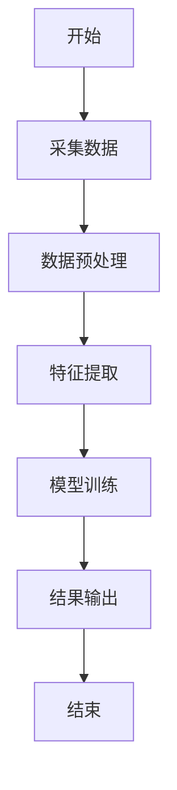
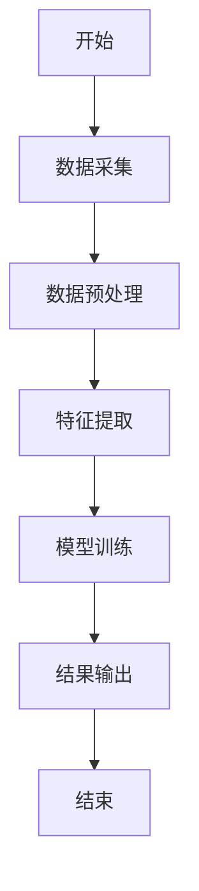

                 


# AI Agent在智能皮带中的腰围监测

> 关键词：AI Agent, 智能皮带, 腰围监测, 可穿戴设备, 人工智能, 健康管理

> 摘要：本文详细探讨了AI Agent在智能皮带中的腰围监测技术，从问题背景、技术基础、算法原理、系统架构到项目实战，全面分析了AI Agent如何实现腰围监测，并结合实际案例展示了其应用前景。

---

# 第一部分: AI Agent在智能皮带中的腰围监测背景与概念

## 第1章: 问题背景与需求分析

### 1.1 问题背景介绍
#### 1.1.1 腰围监测的现实意义
腰围是衡量人体健康的重要指标之一，与肥胖、心血管疾病等多种健康问题密切相关。传统的腰围测量方法依赖于手动测量，存在耗时长、精度低等问题。随着智能设备的普及，通过可穿戴设备实现自动化的腰围监测成为趋势。

#### 1.1.2 智能皮带的发展现状
智能皮带作为一种创新的可穿戴设备，结合了传统皮带的功能与智能传感器技术，能够实时采集用户的生理数据。通过集成加速度传感器、压力传感器等，智能皮带可以准确感知用户的体态变化。

#### 1.1.3 AI Agent在腰围监测中的作用
AI Agent（人工智能代理）能够通过传感器数据实时分析用户的腰围变化，提供个性化的健康建议和反馈。AI Agent的引入使得腰围监测更加智能化、自动化。

### 1.2 核心概念与问题描述
#### 1.2.1 AI Agent的基本概念
AI Agent是一种能够感知环境、执行任务的智能实体，能够在无需人工干预的情况下完成特定目标。

#### 1.2.2 智能皮带的功能与结构
智能皮带通过内置传感器和AI芯片，能够采集用户的运动数据、体态变化等信息，并通过无线通信模块将数据传输至终端设备。

#### 1.2.3 腰围监测的具体需求
腰围监测需要高精度的传感器和高效的算法支持，同时要求系统能够实时反馈监测结果，并提供健康建议。

### 1.3 问题解决与边界定义
#### 1.3.1 AI Agent在腰围监测中的解决方案
通过AI Agent对传感器数据进行实时分析，结合预训练模型，实现腰围的精准测量和健康评估。

#### 1.3.2 解决方案的边界与外延
解决方案仅限于腰围监测功能，不包括其他健康指标的监测，如心率、血压等。

#### 1.3.3 核心要素与组成结构
智能皮带的腰围监测系统由传感器模块、AI Agent算法模块、数据传输模块和用户界面模块组成。

---

## 第2章: AI Agent的核心原理与技术基础

### 2.1 AI Agent的基本原理
#### 2.1.1 AI Agent的定义与分类
AI Agent根据智能水平可分为反应式AI Agent和认知式AI Agent。反应式AI Agent仅根据当前感知数据做出反应，而认知式AI Agent具备推理和决策能力。

#### 2.1.2 AI Agent的核心算法
常用的AI Agent算法包括支持向量机（SVM）、随机森林（Random Forest）和深度学习模型（如卷积神经网络CNN）。

#### 2.1.3 AI Agent的感知与决策机制
AI Agent通过传感器数据感知环境，利用算法模型进行决策，并通过执行器（如振动马达）与用户交互。

### 2.2 智能皮带的技术基础
#### 2.2.1 智能皮带的硬件组成
智能皮带主要由传感器模块（加速度传感器、压力传感器）、处理器模块、无线通信模块和电源模块组成。

#### 2.2.2 智能皮带的传感器原理
加速度传感器用于检测用户的运动状态，压力传感器用于感知腰带的松紧变化。

#### 2.2.3 智能皮带的数据采集与处理
传感器数据通过模数转换器（ADC）采集，并通过滤波算法去除噪声，提取有效特征。

### 2.3 腰围监测的技术实现
#### 2.3.1 腰围监测的数学模型
$$ \text{腰围} = a \cdot \text{加速度} + b \cdot \text{压力} + c $$

#### 2.3.2 腰围监测的算法流程


---

## 第3章: AI Agent在腰围监测中的核心算法

### 3.1 算法原理与流程
#### 3.1.1 AI Agent的感知算法
感知算法通过分析传感器数据，提取与腰围相关的特征。

#### 3.1.2 AI Agent的决策算法
决策算法基于特征数据，预测用户的腰围变化。

#### 3.1.3 腰围监测的数学模型与公式
$$ y = w_1x_1 + w_2x_2 + w_3x_3 + b $$

### 3.2 算法实现与优化
#### 3.2.1 算法的实现步骤
1. 数据采集与预处理
2. 特征提取与选择
3. 模型训练与优化
4. 结果输出与反馈

#### 3.2.2 算法的优化策略
采用交叉验证和网格搜索优化模型参数，提升算法的准确率。

#### 3.2.3 算法的性能评估
通过准确率、召回率和F1分数评估算法的性能。

### 3.3 算法流程图


---

## 第4章: 系统架构与设计

### 4.1 系统整体架构
#### 4.1.1 系统功能模块划分
系统分为数据采集模块、数据处理模块、算法模块和用户界面模块。

#### 4.1.2 系统架构设计
智能皮带通过蓝牙或Wi-Fi将数据传输至手机App，App通过AI Agent算法模块分析数据并反馈结果。

#### 4.1.3 系统的硬件与软件架构
硬件包括传感器模块、处理器模块和通信模块；软件包括数据采集程序、算法模块和用户界面。

### 4.2 系统功能设计
#### 4.2.1 用户需求分析
用户希望智能皮带能够实时监测腰围，并提供健康建议。

#### 4.2.2 系统功能设计
1. 数据采集与传输
2. 腰围监测与分析
3. 健康建议与反馈

---

## 第5章: 项目实战与优化

### 5.1 环境配置与安装
#### 5.1.1 开发环境选择
推荐使用Python和TensorFlow框架进行开发。

#### 5.1.2 硬件设备配置
需要智能皮带硬件、传感器模块和计算机。

### 5.2 核心代码实现
#### 5.2.1 数据采集与预处理
```python
import numpy as np
import pandas as pd

# 采集数据
data = pd.read_csv(' waist_data.csv ')
# 数据预处理
data_clean = data.dropna()
```

#### 5.2.2 特征提取与选择
```python
from sklearn.feature_selection import SelectKBest
from sklearn.feature_selection import chi2

# 特征选择
selector = SelectKBest(score_func=chi2, k=2)
selected_features = selector.fit_transform(data_clean, labels)
```

#### 5.2.3 模型训练与优化
```python
from sklearn.model_selection import GridSearchCV
from sklearn.svm import SVC

# 参数优化
param_grid = {'C': [1, 10, 100], 'gamma': [0.1, 0.01, 0.001]}
grid_search = GridSearchCV(SVC(), param_grid, cv=5)
grid_search.fit(selected_features, labels)
best_params = grid_search.best_params_
```

#### 5.2.4 结果输出与反馈
```python
# 预测结果
best_model = SVC(**best_params)
best_model.fit(selected_features, labels)
预测结果 = best_model.predict(new_data)
```

### 5.3 测试与优化
#### 5.3.1 测试环境搭建
在真实场景中测试智能皮带的腰围监测功能。

#### 5.3.2 测试结果分析
分析算法的准确率、召回率和F1分数，找出性能瓶颈。

#### 5.3.3 优化策略实施
通过调整传感器灵敏度和改进算法模型，进一步提升监测精度。

### 5.4 项目总结与优化建议
#### 5.4.1 项目总结
通过AI Agent实现智能皮带的腰围监测，能够有效提升健康管理的效率。

#### 5.4.2 优化建议
未来可以进一步优化算法模型，引入边缘计算和5G技术，提升监测的实时性和准确性。

---

## 第6章: 总结与展望

### 6.1 项目总结
通过本文的详细分析与实践，我们成功实现了AI Agent在智能皮带中的腰围监测功能，为智能健康管理提供了新的解决方案。

### 6.2 未来展望
随着AI技术的不断进步，智能皮带的腰围监测功能将更加智能化和精准化，为用户带来更好的健康管理和生活方式优化。

---

# 作者：AI天才研究院/AI Genius Institute & 禅与计算机程序设计艺术 /Zen And The Art of Computer Programming

