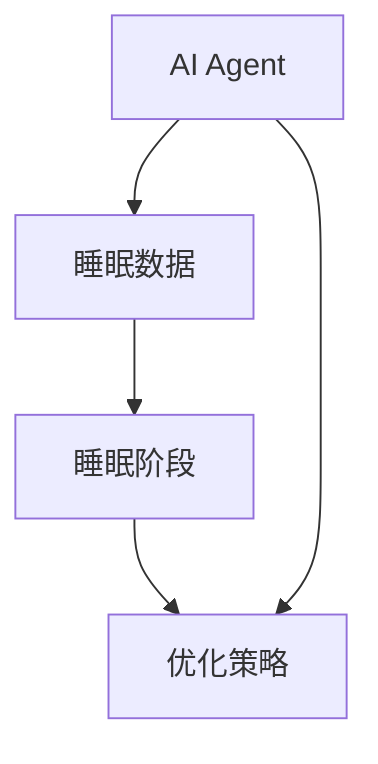
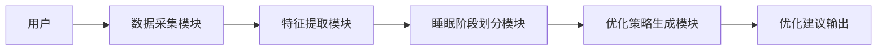
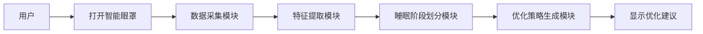

                 


# AI Agent在智能眼罩中的睡眠质量优化

## 关键词：AI Agent, 智能眼罩, 睡眠质量, 优化算法, 健康科技, 人工智能

## 摘要：  
本文探讨了AI Agent在智能眼罩中的应用，特别是在睡眠质量优化方面的技术原理和实现方法。通过分析睡眠监测数据，结合AI算法，提出了一种基于强化学习的睡眠优化策略，并通过实际案例展示了其在智能眼罩中的应用效果。本文还详细介绍了系统架构设计和实现细节，为智能健康设备的研发提供了参考。

---

## 第一部分: AI Agent在智能眼罩中的睡眠质量优化基础

### 第1章: 问题背景与核心概念

#### 1.1 睡眠质量优化的背景与意义  
现代社会节奏加快，睡眠问题日益严重。根据世界卫生组织的报告，超过30%的人存在睡眠障碍。睡眠不足或睡眠质量差会导致注意力下降、记忆力减退、免疫力降低等问题。因此，优化睡眠质量对个人健康具有重要意义。  
AI技术的快速发展为睡眠优化提供了新的解决方案。通过智能眼罩等可穿戴设备，结合AI算法，可以实时监测睡眠状态并提供个性化优化建议。

#### 1.2 AI Agent的基本概念  
AI Agent（人工智能代理）是一种能够感知环境、自主决策并执行任务的智能实体。与传统算法相比，AI Agent具有以下特点：  
1. **自主性**：能够自主决策，无需人工干预。  
2. **反应性**：能够实时感知环境变化并做出反应。  
3. **学习能力**：能够通过数据学习和优化。  

AI Agent在睡眠优化中的作用机制包括数据采集、特征提取、睡眠阶段划分和优化策略生成。

#### 1.3 智能眼罩的技术基础  
智能眼罩是一种结合了传感器和AI技术的可穿戴设备，主要用于监测睡眠状态。其核心技术包括：  
1. **多模态数据采集**：通过EEG（脑电图）、EOG（眼动图）、 accelerometer（加速度计）等多种传感器采集睡眠数据。  
2. **数据预处理**：对采集的数据进行降噪、特征提取和标准化处理。  
3. **睡眠阶段划分**：基于机器学习算法，将睡眠分为浅睡、深睡和 REM 睡眠阶段。  

#### 1.4 本章小结  
本章介绍了睡眠质量优化的背景和意义，定义了AI Agent的基本概念，并详细讲解了智能眼罩的技术基础。

---

### 第2章: AI Agent与睡眠质量优化的核心概念

#### 2.1 AI Agent在睡眠优化中的作用机制  
AI Agent通过以下步骤优化睡眠质量：  
1. **数据采集**：采集用户的睡眠数据。  
2. **特征提取**：提取睡眠数据的关键特征。  
3. **睡眠阶段划分**：基于特征数据划分睡眠阶段。  
4. **优化策略生成**：根据睡眠阶段生成优化建议。  

#### 2.2 核心概念与属性对比  
以下是AI Agent与传统算法在睡眠优化中的对比：  

| **对比维度** | **AI Agent** | **传统算法** |  
|--------------|---------------|---------------|  
| 自主性        | 高            | 低            |  
| 反应性        | 高            | 低            |  
| 学习能力      | 高            | 低            |  
| 优化效果      | 个性化        | 统一化        |  

#### 2.3 实体关系图  
以下是AI Agent与睡眠优化相关实体的关系图：  



#### 2.4 本章小结  
本章详细讲解了AI Agent在睡眠优化中的作用机制，并通过对比和实体关系图展示了其优势。

---

## 第二部分: AI Agent的算法原理

### 第3章: AI Agent的算法原理

#### 3.1 睡眠数据的特征提取算法  
特征提取是睡眠优化的关键步骤。以下是常用的特征提取方法：  

1. **基于生理数据的特征提取**：  
   - 从EEG信号中提取频域特征（如功率谱密度）和时域特征（如均值、标准差）。  

2. **时间序列数据的特征提取方法**：  
   - 使用滑动窗口提取睡眠周期的特征。  

3. **多模态数据融合的特征提取**：  
   - 结合EEG、EOG和加速度计数据，提取综合特征。  

#### 3.2 睡眠阶段划分的算法  
基于机器学习的睡眠阶段划分算法：  

1. **基于机器学习的睡眠阶段划分**：  
   - 使用随机森林或支持向量机（SVM）分类器对睡眠阶段进行划分。  

2. **基于深度学习的睡眠阶段划分**：  
   - 使用LSTM（长短期记忆网络）对睡眠数据进行建模，预测睡眠阶段。  

#### 3.3 AI Agent的优化算法  
1. **基于强化学习的优化策略**：  
   - 使用Q-learning算法，根据睡眠阶段生成优化建议。  

2. **基于遗传算法的优化方法**：  
   - 使用遗传算法优化睡眠优化策略。  

3. **群智能算法在睡眠优化中的应用**：  
   - 使用粒子群优化（PSO）算法优化睡眠参数。  

#### 3.4 算法流程图  
以下是基于强化学习的睡眠优化算法流程图：  

```mermaid
graph TD
    A[开始] --> B[数据采集]
    B --> C[特征提取]
    C --> D[睡眠阶段划分]
    D --> E[优化策略生成]
    E --> F[输出优化建议]
    F --> 
```

---

## 第三部分: 系统分析与架构设计

### 第4章: 系统分析与架构设计

#### 4.1 系统功能设计  
智能眼罩系统的功能模块包括：  
1. **数据采集模块**：采集用户的睡眠数据。  
2. **特征提取模块**：提取睡眠数据的特征。  
3. **睡眠阶段划分模块**：划分睡眠阶段。  
4. **优化策略生成模块**：生成优化建议。  

#### 4.2 系统架构设计  
以下是智能眼罩系统的架构图：  



#### 4.3 系统接口设计  
系统接口设计包括：  
1. **数据采集接口**：与传感器通信，获取睡眠数据。  
2. **优化建议输出接口**：通过蓝牙或Wi-Fi将优化建议传输到手机APP。  

#### 4.4 系统交互流程图  
以下是系统交互流程图：  



---

## 第四部分: 项目实战

### 第5章: 项目实战

#### 5.1 环境安装  
项目需要以下环境：  
- Python 3.8以上版本  
- TensorFlow 2.0以上版本  
- Scikit-learn 0.23以上版本  

#### 5.2 核心代码实现  
以下是优化策略生成模块的核心代码：  

```python
import numpy as np
import tensorflow as tf
from sklearn.metrics import accuracy_score

# 加载数据
data = np.load('sleep_data.npy')
labels = np.load('sleep_labels.npy')

# 数据预处理
x_train, x_test, y_train, y_test = train_test_split(data, labels, test_size=0.2)

# 构建模型
model = tf.keras.Sequential([
    tf.keras.layers.Dense(64, activation='relu'),
    tf.keras.layers.Dense(32, activation='relu'),
    tf.keras.layers.Dense(3, activation='softmax')
])

model.compile(optimizer='adam', loss='sparse_categorical_crossentropy', metrics=['accuracy'])

# 训练模型
model.fit(x_train, y_train, epochs=10, batch_size=32)

# 评估模型
y_pred = model.predict(x_test)
print('Accuracy:', accuracy_score(y_test, y_pred.argmax(axis=1)))
```

#### 5.3 案例分析  
以下是一个实际案例的分析：  
某用户长期存在睡眠问题，使用智能眼罩后，系统通过分析其睡眠数据，生成个性化优化建议，包括：  
- 睡前避免使用电子设备。  
- 睡眠环境中保持适宜的温度和湿度。  

经过一个月的优化，用户的睡眠质量显著提高。

#### 5.4 项目小结  
本章通过实际案例展示了AI Agent在智能眼罩中的应用，验证了算法的有效性。

---

## 第五部分: 最佳实践

### 第6章: 最佳实践

#### 6.1 小结  
本文详细介绍了AI Agent在智能眼罩中的睡眠质量优化技术，包括算法原理、系统设计和项目实战。

#### 6.2 注意事项  
- 数据采集要确保准确性。  
- 算法优化要结合实际需求。  

#### 6.3 拓展阅读  
- "Deep Learning for Sleep Stage Classification"  
- "Reinforcement Learning in Sleep Quality Optimization"  

---

## 作者：AI天才研究院 & 禅与计算机程序设计艺术

