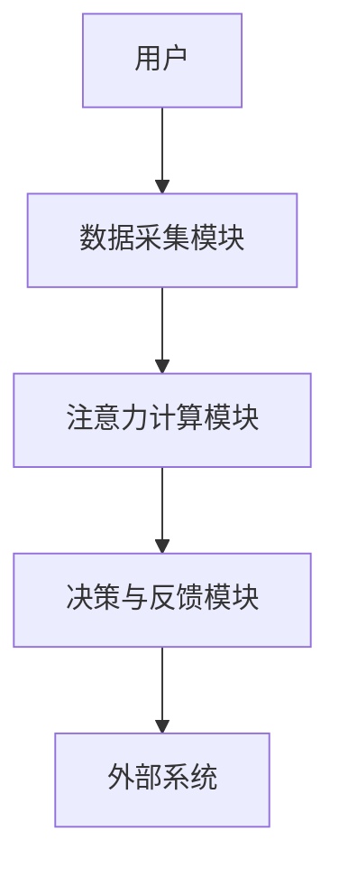
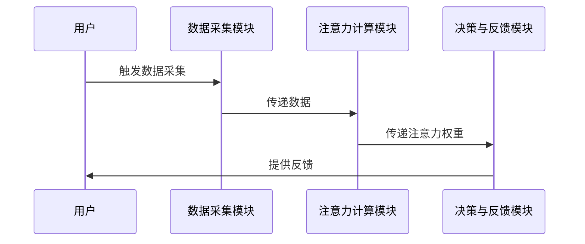

                 


# AI Agent在智能眼镜中的注意力集中训练

> 关键词：AI Agent，注意力集中训练，智能眼镜，注意力机制，增强学习，系统架构，实时反馈

> 摘要：本文探讨了AI Agent在智能眼镜中如何通过注意力集中训练帮助用户提升专注力。文章从注意力机制的基本概念出发，详细分析了AI Agent在智能眼镜中的实现原理，系统架构设计，以及通过实战案例展示了如何在实际应用中优化注意力管理。通过本文的讲解，读者可以全面了解AI Agent在智能眼镜中的应用及其对注意力集中训练的推动作用。

---

# 第一部分: AI Agent与注意力集中训练的背景与概念

## 第1章: AI Agent与注意力机制概述

### 1.1 AI Agent的基本概念

#### 1.1.1 AI Agent的定义与特点
AI Agent（人工智能代理）是一种能够感知环境、自主决策并执行任务的智能实体。它通过传感器获取信息，利用算法进行分析和推理，最终做出决策并采取行动。AI Agent的特点包括：
- **自主性**：无需外部干预，自主执行任务。
- **反应性**：能够实时感知环境变化并做出反应。
- **目标导向**：基于目标驱动行为。
- **学习能力**：通过经验改进性能。

#### 1.1.2 注意力机制的定义与作用
注意力机制是一种模拟人类注意力的模型，用于在信息处理过程中集中资源（如计算资源、时间）在最重要的信息上。其作用包括：
- **信息筛选**：在大量信息中筛选出关键内容。
- **资源优化**：提高处理效率，减少资源浪费。
- **任务聚焦**：将注意力集中在与当前任务相关的部分。

#### 1.1.3 AI Agent在智能眼镜中的应用背景
智能眼镜作为一种 wearable device，结合了硬件和软件技术，能够实时采集用户数据（如视线方向、心率、动作等），并通过AI Agent进行分析和反馈。AI Agent在智能眼镜中的应用，旨在通过注意力集中训练帮助用户提高专注力，提升学习、工作效率。

### 1.2 智能眼镜中的注意力集中训练

#### 1.2.1 注意力分散的现状与挑战
在信息爆炸的时代，人们面临着前所未有的注意力分散问题。智能眼镜通过实时监测用户的注意力状态，帮助用户识别注意力分散的时刻，并提供即时反馈，从而改善注意力管理。

#### 1.2.2 AI Agent在注意力管理中的作用
AI Agent通过分析用户的注意力数据，优化注意力分配策略，提供个性化的注意力训练方案。例如，当用户注意力分散时，AI Agent可以触发提醒或调整任务优先级，帮助用户重新集中注意力。

#### 1.2.3 智能眼镜的硬件与软件支持
智能眼镜的硬件包括：
- 高精度摄像头：用于捕捉用户的视线方向。
- 心率监测器：用于检测用户的情绪状态。
- 加速度计：用于监测用户的动作。

智能眼镜的软件包括：
- 数据采集模块：实时采集用户数据。
- 注意力计算模块：基于数据计算注意力权重。
- 决策与反馈模块：根据注意力状态提供反馈。

---

## 第2章: 注意力机制的核心概念与原理

### 2.1 注意力机制的数学模型

#### 2.1.1 注意力权重的计算公式
注意力权重的计算是通过将查询（Query）、键（Key）、值（Value）进行点积运算，再通过 softmax 函数归一化得到的：
$$注意力权重 = \frac{e^{qK^T}}{\sum e^{qK^T}}$$

其中，$q$ 是查询向量，$K$ 是键矩阵，$K^T$ 是键矩阵的转置。

#### 2.1.2 注意力机制的实现步骤
1. **输入嵌入**：将输入数据转换为向量形式。
2. **计算键、查询、值**：分别计算键、查询、值向量。
3. **计算注意力权重**：通过点积和 softmax 计算注意力权重。
4. **加权求和**：将值向量加权求和，得到最终的注意力输出。

#### 2.1.3 注意力机制的变体与优化
- **自注意力机制**：常用于处理序列数据，如自然语言处理。
- **交叉注意力机制**：用于多模态数据的交互，如图像和文本的联合处理。
- **位置编码**：通过引入位置信息，增强模型对序列位置的感知能力。

### 2.2 AI Agent与注意力机制的结合

#### 2.2.1 AI Agent的决策过程
AI Agent通过注意力机制计算用户当前的注意力状态，并基于此做出决策。例如：
- 当用户的注意力集中在重要任务上时，AI Agent会保持当前的注意力分配。
- 当用户的注意力分散时，AI Agent会触发提醒或调整任务优先级。

#### 2.2.2 注意力机制在决策中的应用
AI Agent利用注意力权重来优化决策过程。例如，在多任务处理场景中，AI Agent会根据注意力权重动态调整任务优先级。

#### 2.2.3 注意力权重的实时计算与反馈
AI Agent在智能眼镜中实时计算用户的注意力权重，并通过反馈机制（如振动、声音提示）让用户知道当前的注意力状态。

---

## 第3章: AI Agent在智能眼镜中的系统架构

### 3.1 系统功能模块划分

#### 3.1.1 数据采集模块
数据采集模块负责实时采集用户的注意力相关数据，包括：
- 视线方向：通过摄像头捕捉用户注意力的方向。
- 眼睛状态：监测用户是否在眨眼或闭眼。
- 心率：通过心率监测器检测用户的情绪状态。

#### 3.1.2 注意力计算模块
注意力计算模块基于数据采集模块提供的数据，计算用户的注意力权重。具体步骤如下：
1. 数据预处理：对采集的数据进行降噪和归一化处理。
2. 特征提取：提取注意力相关的特征，如视线方向、眨眼频率。
3. 注意力权重计算：通过注意力机制模型计算注意力权重。

#### 3.1.3 决策与反馈模块
决策与反馈模块根据注意力计算模块的结果，做出决策并提供反馈。例如：
- 当用户的注意力分散时，触发提醒或调整任务优先级。
- 当用户的注意力集中时，给予正向反馈（如振动提示）。

### 3.2 系统架构设计

#### 3.2.1 系统架构图（Mermaid图）


#### 3.2.2 系统架构设计说明
系统架构设计包括以下几个部分：
1. **数据采集模块**：负责实时采集用户的注意力相关数据。
2. **注意力计算模块**：基于数据计算用户的注意力权重。
3. **决策与反馈模块**：根据注意力权重做出决策并提供反馈。

### 3.3 系统接口设计

#### 3.3.1 数据采集接口
数据采集模块提供以下接口：
- `start采集()`：启动数据采集。
- `stop采集()`：停止数据采集。
- `获取数据()`：返回采集的数据。

#### 3.3.2 注意力计算接口
注意力计算模块提供以下接口：
- `计算注意力权重(数据)`：根据输入数据计算注意力权重。
- `返回注意力权重()`：返回计算得到的注意力权重。

### 3.4 系统交互流程图（Mermaid图）



---

## 第4章: 项目实战

### 4.1 环境配置

#### 4.1.1 硬件配置
- 智能眼镜：支持视线追踪和心率监测的设备。
- 开发板：如 Raspberry Pi，用于处理数据和运行AI算法。

#### 4.1.2 软件配置
- 操作系统：Linux（如 Raspbian）。
- 开发工具：Python、TensorFlow、Keras。

### 4.2 核心代码实现

#### 4.2.1 数据采集模块
```python
class 数据采集模块:
    def __init__(self):
        self.摄像头 = Camera()
        self.心率监测器 = HeartRateMonitor()

    def start采集(self):
        self.摄像头.start()
        self.心率监测器.start()

    def stop采集(self):
        self.摄像头.stop()
        self.心率监测器.stop()

    def get_data(self):
        视线数据 = self.摄像头.get_data()
        心率数据 = self.心率监测器.get_data()
        return 视线数据, 心率数据
```

#### 4.2.2 注意力计算模块
```python
class 注意力计算模块:
    def __init__(self):
        self.model = self.build_model()

    def build_model(self):
        # 构建自注意力机制模型
        inputs = Input(shape=(None, 100))
        query = Dense(64)(inputs)
        key = Dense(64)(inputs)
        value = Dense(64)(inputs)
        attention_weights = Dot(axes=-1)([query, key])
        attention_weights = Softmax()(attention_weights)
        output = Dot(axes=-1)([attention_weights, value])
        return Model(inputs=inputs, outputs=output)

    def compute_attention(self, 数据):
        # 假设数据格式为 (batch_size, sequence_length, features)
        # 输入数据经过处理后，计算注意力权重
        attention_weights = self.model.predict(数据)
        return attention_weights
```

#### 4.2.3 决策与反馈模块
```python
class 决策与反馈模块:
    def __init__(self):
        self.反馈类型 = ['振动提示', '声音提示', '调整任务优先级']

    def 决策(self, attention_weights):
        # 根据注意力权重决定反馈类型
        if attention_weights < 0.5:
            return '振动提示'
        elif attention_weights < 0.8:
            return '声音提示'
        else:
            return '调整任务优先级'

    def 提供反馈(self, 反馈类型):
        # 实现反馈功能，如控制振动马达或播放声音
        pass
```

### 4.3 案例分析与详细解读

#### 4.3.1 案例场景
假设用户正在使用智能眼镜进行学习，AI Agent通过实时监测用户的注意力状态，提供即时反馈。当用户的注意力分散时，AI Agent会触发振动提示，帮助用户重新集中注意力。

#### 4.3.2 代码实现解读
- 数据采集模块负责采集用户的视线方向和心率数据。
- 注意力计算模块基于这些数据计算注意力权重。
- 决策与反馈模块根据注意力权重决定反馈类型，并提供反馈。

### 4.4 项目小结
通过本项目，我们实现了AI Agent在智能眼镜中的注意力集中训练功能。通过实时监测用户的注意力状态，AI Agent能够有效帮助用户提高专注力，提升学习和工作效率。

---

## 第5章: 总结与最佳实践

### 5.1 总结
本文详细讲解了AI Agent在智能眼镜中的注意力集中训练的应用。通过分析注意力机制的数学模型，设计了系统的架构，并通过实战案例展示了如何实现这一功能。AI Agent通过实时监测用户的注意力状态，提供即时反馈，帮助用户提高专注力。

### 5.2 最佳实践 tips
- **数据预处理**：在数据采集模块中，对数据进行降噪和归一化处理，以提高计算精度。
- **模型优化**：在注意力计算模块中，尝试不同的注意力机制变体，找到最适合应用场景的模型。
- **反馈机制**：在决策与反馈模块中，根据用户的反馈习惯，选择合适的反馈类型，提高用户体验。

### 5.3 注意事项
- **隐私保护**：在数据采集和处理过程中，必须严格保护用户的隐私。
- **算法优化**：注意算法的计算效率，避免影响智能眼镜的实时性。

### 5.4 拓展阅读
- **自注意力机制的优化**：探索更高效的自注意力机制，如稀疏注意力。
- **多模态数据融合**：研究如何将更多的模态数据（如语音、动作）融入注意力计算中。
- **实时反馈的优化**：研究如何设计更有效的反馈机制，提高用户的注意力管理效果。

---

作者：AI天才研究院 & 禅与计算机程序设计艺术

