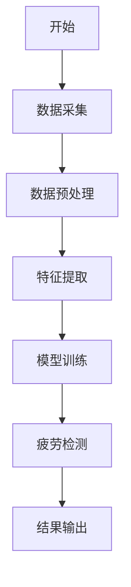
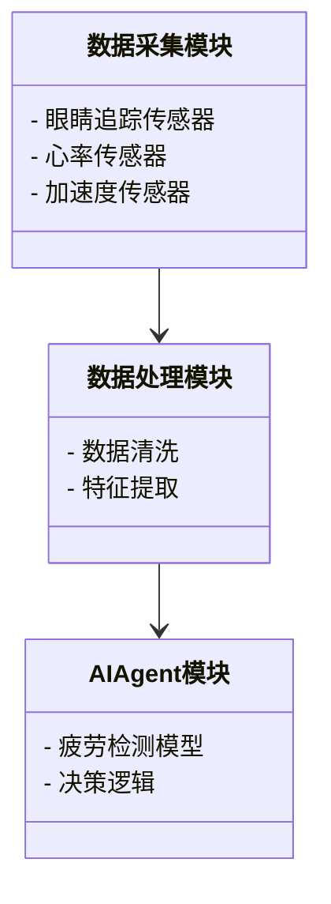
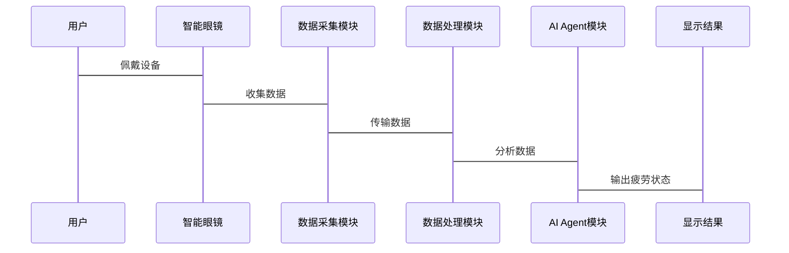

                 

# 目录大纲

---

# AI Agent在智能眼镜中的疲劳度检测

## 关键词

- AI Agent
- 智能眼镜
- 疲劳检测
- 多模态数据
- 机器学习

## 摘要

本文详细探讨AI Agent在智能眼镜中的疲劳度检测技术，结合计算机视觉、机器学习和生理数据，提出了一种基于多模态数据的疲劳检测算法，通过系统架构设计和项目实战，展示了该技术的实际应用和优化方向。

---

## 第1章 背景介绍

### 1.1 问题背景

- 疲劳的危害与影响
- 智能眼镜在疲劳检测中的独特优势
- AI Agent在实时监测中的关键作用

### 1.2 问题描述

- 疲劳的定义与分类
- 智能眼镜中的疲劳检测场景
- 检测中的技术挑战

### 1.3 问题解决

- AI Agent的核心作用
- 多模态数据的融合方法
- 疲劳检测的实时性与准确性

### 1.4 边界与外延

- 疲劳检测的适用范围
- 与其它健康监测系统的区别
- 潜在的应用场景

---

## 第2章 AI Agent与智能眼镜的核心概念

### 2.1 AI Agent的定义与特点

- AI Agent的基本定义
- AI Agent的核心特点
- 在智能眼镜中的具体应用

### 2.2 智能眼镜的功能与技术

- 主要功能模块
- 关键技术分析
- 数据采集方式

### 2.3 两者的结合

- AI Agent在智能眼镜中的角色
- 交互方式探讨
- 疲劳检测的具体应用

---

## 第3章 疲劳度检测的核心算法原理

### 3.1 算法原理概述

- 疲劳检测的基本原理
- AI Agent在算法中的作用
- 算法的优缺点分析

### 3.2 算法流程图

### 3.3 基于眼动追踪的模型

- 算法步骤
- 代码示例
- 数学模型

### 3.4 基于生理数据的分类算法

- 算法步骤
- 代码示例
- 数学模型

---

## 第4章 系统架构设计

### 4.1 问题场景介绍

- 疲劳检测的应用场景
- 智能眼镜的使用环境

### 4.2 项目介绍

- 项目目标
- 项目范围
- 项目约束

### 4.3 系统功能设计

### 4.4 系统架构设计

### 4.5 系统接口设计

- 接口定义
- 数据格式
- 交互流程

### 4.6 系统交互设计

---

## 第5章 项目实战

### 5.1 环境配置

- 开发工具安装
- 数据集获取

### 5.2 系统核心实现

- 数据预处理代码
- 模型训练代码
- 结果分析代码

### 5.3 代码应用解读

- 代码功能分析
- 代码优化建议

### 5.4 实际案例分析

- 数据分析
- 结果展示
- 案例总结

---

## 第6章 总结与展望

### 6.1 总结

- 项目成果
- 技术优势
- 实用价值

### 6.2 未来展望

- 技术改进方向
- 应用场景拓展
- 研究热点预测

### 6.3 最佳实践 Tips

- 开发建议
- 使用建议
- 注意事项

### 6.4 小结

- 项目回顾
- 未来规划
- 持续学习的重要性

---

## 作者

**作者：AI天才研究院/AI Genius Institute & 禅与计算机程序设计艺术 /Zen And The Art of Computer Programming**

