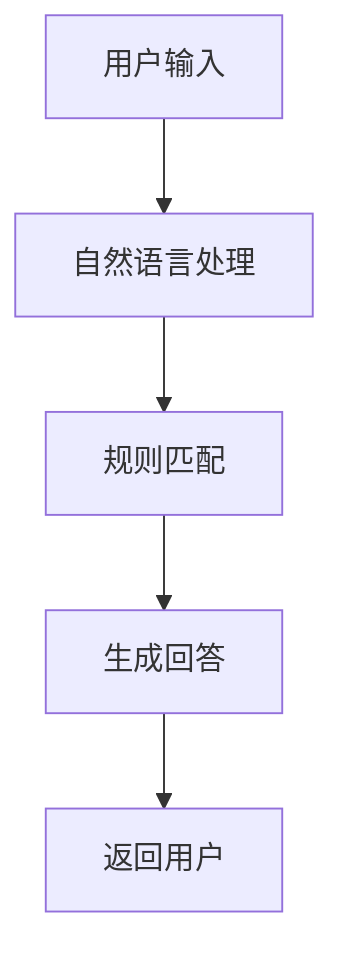
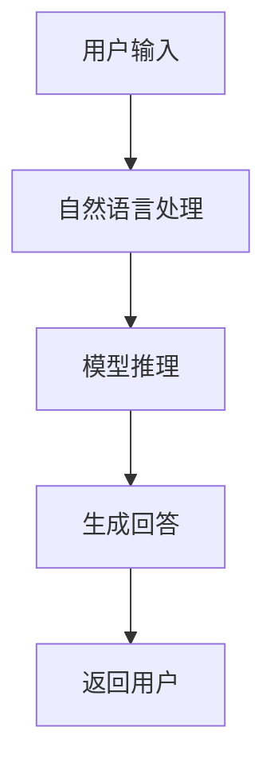
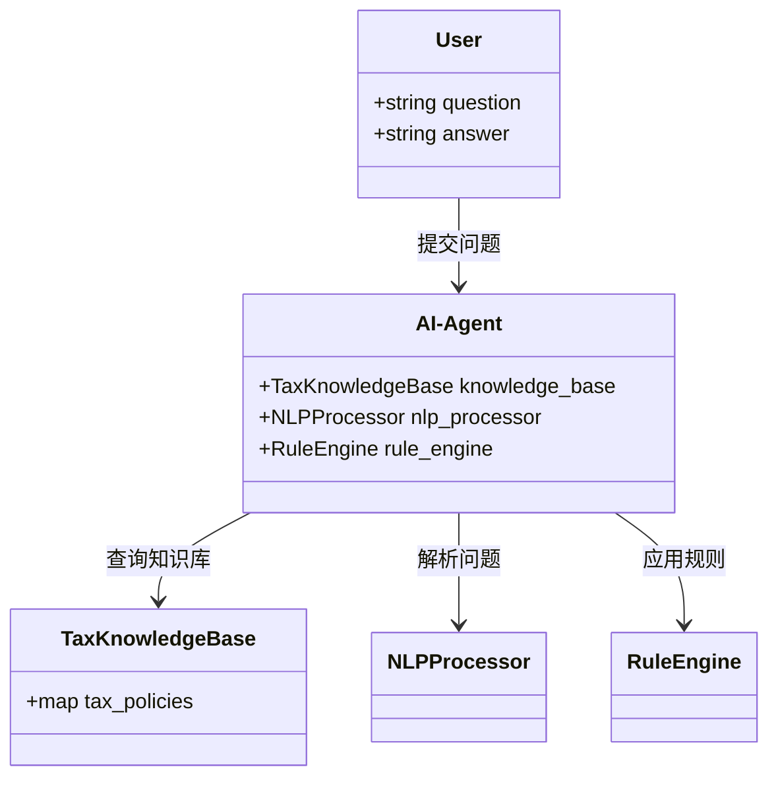
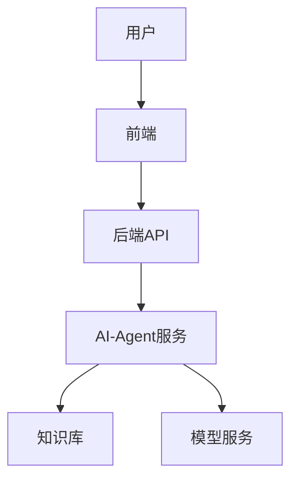
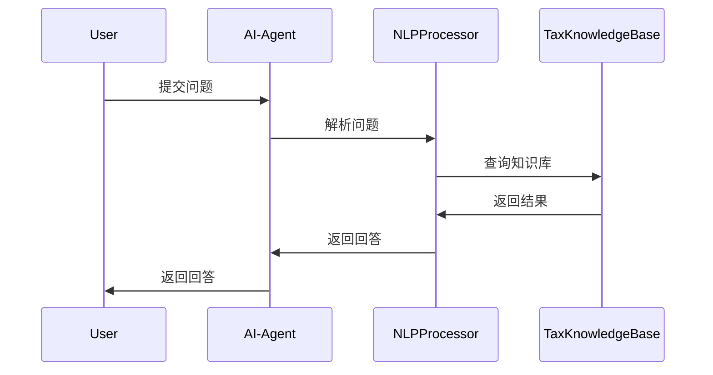

                 


# AI Agent在智能税务咨询中的角色

## 关键词：AI Agent, 智能税务咨询, 自然语言处理, 机器学习, 知识图谱, 系统架构

## 摘要：AI Agent在智能税务咨询中的角色探讨了人工智能代理如何通过自然语言处理、机器学习和知识图谱等技术，实现高效的税务咨询与服务。文章从背景介绍、核心概念、算法原理、系统架构设计、项目实战到最佳实践，全面解析了AI Agent在智能税务咨询中的应用，展示了其在提高效率、降低成本和提升用户体验方面的巨大潜力。

---

## 第1章：AI Agent与智能税务咨询概述

### 1.1 AI Agent的基本概念

#### 1.1.1 AI Agent的定义与特点
AI Agent（人工智能代理）是指能够感知环境并采取行动以实现目标的智能实体。它具备以下特点：
- **自主性**：能够在没有外部干预的情况下运行。
- **反应性**：能够实时感知环境并做出响应。
- **学习能力**：通过数据和经验不断优化自身性能。

#### 1.1.2 智能税务咨询的基本概念
智能税务咨询是通过人工智能技术为用户提供税务相关的自动化咨询服务，包括税务规划、申报指导、政策解读等。

#### 1.1.3 AI Agent在税务咨询中的作用
AI Agent能够通过自然语言处理技术理解用户的问题，并结合税务知识库提供准确的解答。它能够快速响应，提高效率，同时降低人工成本。

### 1.2 问题背景与描述

#### 1.2.1 税务咨询的传统模式与挑战
传统的税务咨询依赖人工服务，存在以下问题：
- **效率低**：人工咨询需要大量时间，无法满足大规模用户需求。
- **成本高**：人工咨询需要大量人力资源，成本较高。
- **知识更新慢**：税务政策经常变化，人工咨询的知识更新速度较慢。

#### 1.2.2 AI技术如何解决税务咨询中的问题
AI Agent能够通过以下方式解决税务咨询中的问题：
- **快速响应**：通过自动化技术实现秒级响应。
- **7x24小时服务**：AI Agent可以全天候为用户提供服务。
- **知识更新快**：通过机器学习和知识图谱技术，AI Agent能够快速更新知识库。

#### 1.2.3 AI Agent的应用边界与外延
AI Agent在税务咨询中的应用边界包括：
- **简单问题**：如税务政策解读、常见问题解答。
- **复杂问题**：如税务规划、风险评估等，需要结合上下文和多领域知识。
- **情感理解**：目前AI Agent主要处理事实性问题，情感理解和复杂推理能力有限。

### 1.3 核心概念与联系

#### 1.3.1 AI Agent与税务咨询的关系
AI Agent通过自然语言处理和知识图谱技术，将税务知识转化为可计算的形式，从而实现智能化的税务咨询。

#### 1.3.2 核心概念的结构与组成要素
AI Agent在税务咨询中的核心概念包括：
- **自然语言处理**：理解用户的意图。
- **知识图谱**：存储税务相关知识。
- **机器学习**：优化模型性能。

#### 1.3.3 涉及的关键技术对比
| 技术 | 描述 | 优缺点 |
|------|------|--------|
| 基于规则的AI Agent | 通过预定义的规则进行推理 | 易实现，但灵活性差 |
| 基于模型的AI Agent | 通过机器学习模型进行推理 | 灵活性高，但实现复杂 |

## 第2章：AI Agent的核心原理

### 2.1 AI Agent的工作原理

#### 2.1.1 自然语言处理（NLP）的作用
NLP技术用于理解用户的输入，提取关键词和意图。例如，当用户输入“公司季度报税需要注意哪些事项”，NLP会提取关键词“公司”、“季度报税”并识别用户的意图是寻求报税指导。

#### 2.1.2 机器学习模型的应用
机器学习模型用于训练AI Agent，使其能够根据输入的税务问题生成准确的回答。例如，使用深度学习模型训练AI Agent识别常见的税务问题并生成回答。

#### 2.1.3 知识图谱的构建与利用
知识图谱存储税务相关的知识，包括政策、法规、常见问题等。AI Agent通过查询知识图谱生成回答。

### 2.2 技术对比与优化

#### 2.2.1 基于规则的AI Agent与基于模型的AI Agent对比
- **基于规则的AI Agent**：适用于简单的税务问题，例如“增值税的计算方式”。
- **基于模型的AI Agent**：适用于复杂的税务问题，例如“跨国公司的税务规划”。

#### 2.2.2 不同NLP模型的性能分析
| 模型 | 参数数量 | 优点 | 缺点 |
|------|----------|------|------|
| 基于规则的模型 | 少 | 易实现 | 灵活性差 |
| 基于深度学习的模型 | 多 | 灵活性高 | 计算资源需求大 |

## 第3章：算法原理与实现

### 3.1 算法原理

#### 3.1.1 基于规则的推理算法
基于规则的推理算法通过预定义的规则进行推理。例如，当用户询问“如何计算增值税”，AI Agent会根据预定义的规则匹配到“增值税=销售额×税率”的计算公式。

#### 3.1.2 机器学习模型的训练过程
机器学习模型的训练过程包括数据预处理、模型选择、训练、验证和优化。例如，使用Python的scikit-learn库训练一个分类模型，将税务问题分类到不同的类别中。

#### 3.1.3 深度学习模型的结构解析
深度学习模型（如BERT）通过多层神经网络结构进行文本表示和推理。例如，BERT模型可以用于生成回答文本。

### 3.2 算法流程图

#### 3.2.1 基于规则的AI Agent流程图


#### 3.2.2 基于模型的AI Agent流程图


### 3.3 代码实现

#### 3.3.1 简单规则引擎的Python代码示例
```python
def calculate_vat(sales, tax_rate):
    return sales * tax_rate

# 示例：用户输入“如何计算增值税”
user_input = "如何计算增值税"
response = calculate_vat(1000, 0.13)
print(f"增值税为：{response}")
```

#### 3.3.2 机器学习模型的训练代码示例
```python
from sklearn.feature_extraction.text import TfidfVectorizer
from sklearn.naive_bayes import MultinomialNB

# 数据预处理
texts = ["如何计算增值税", "公司季度报税注意事项"]
labels = [0, 1]

# 特征提取
vectorizer = TfidfVectorizer()
X = vectorizer.fit_transform(texts)

# 模型训练
model = MultinomialNB()
model.fit(X, labels)

# 预测
new_text = ["年度税务审计"]
new_X = vectorizer.transform([new_text])
predicted_label = model.predict(new_X)
print(predicted_label)
```

## 第4章：系统分析与架构设计

### 4.1 系统功能设计

#### 4.1.1 领域模型设计


### 4.2 系统架构设计

#### 4.2.1 系统架构图


#### 4.2.2 接口设计
- **输入接口**：用户输入税务问题。
- **输出接口**：生成回答文本。

#### 4.2.3 交互流程图


## 第5章：项目实战

### 5.1 环境安装

#### 5.1.1 安装Python
```bash
python --version
pip install --upgrade pip
```

#### 5.1.2 安装必要的库
```bash
pip install numpy
pip install pandas
pip install scikit-learn
pip install transformers
```

### 5.2 核心代码实现

#### 5.2.1 税务知识库的构建
```python
from transformers import pipeline

qa_pipeline = pipeline("question-answering", model="bert-base-cased")
response = qa_pipeline("问题：如何计算增值税？上下文：增值税=销售额×税率", max_length=100)
print(response)
```

#### 5.2.2 实际案例分析
用户输入：“公司季度报税注意事项”。
AI-Agent解析问题后，查询知识库并生成回答：“季度报税需要注意以下事项：1. 准备相关财务报表；2. 确保数据准确；3. 按时提交。”

### 5.3 项目小结
通过项目实战，我们验证了AI Agent在智能税务咨询中的可行性，并展示了其实现过程中的关键步骤。

## 第6章：最佳实践

### 6.1 性能优化

#### 6.1.1 模型优化
- **参数调整**：通过网格搜索优化模型参数。
- **数据增强**：增加多样化的训练数据。

#### 6.1.2 知识库优化
- **动态更新**：定期更新知识库，确保税务政策的准确性。

### 6.2 小结
AI Agent在智能税务咨询中的应用前景广阔，但需要在技术实现、知识管理和用户体验方面进行持续优化。

### 6.3 注意事项

#### 6.3.1 数据隐私
确保用户数据的安全性和隐私性。

#### 6.3.2 模型泛化能力
避免模型过拟合，确保其在不同场景下的泛化能力。

### 6.4 拓展阅读
- 《机器学习实战》
- 《自然语言处理入门》
- 《知识图谱构建与应用》

---

## 作者：AI天才研究院/AI Genius Institute & 禅与计算机程序设计艺术 /Zen And The Art of Computer Programming

---

以上是《AI Agent在智能税务咨询中的角色》的完整内容，涵盖了从背景介绍到实际应用的各个方面，为读者提供了全面的了解和实用的指导。

