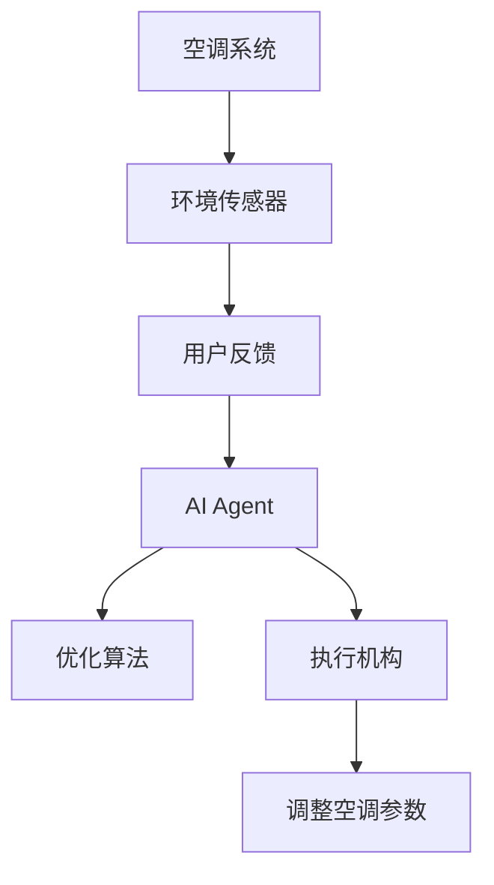
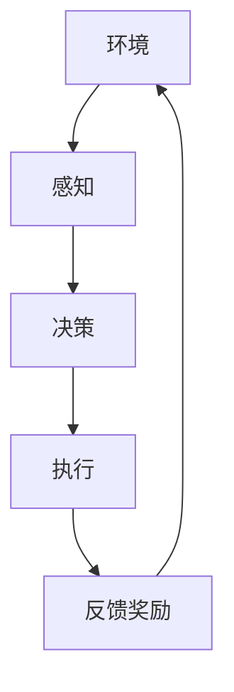
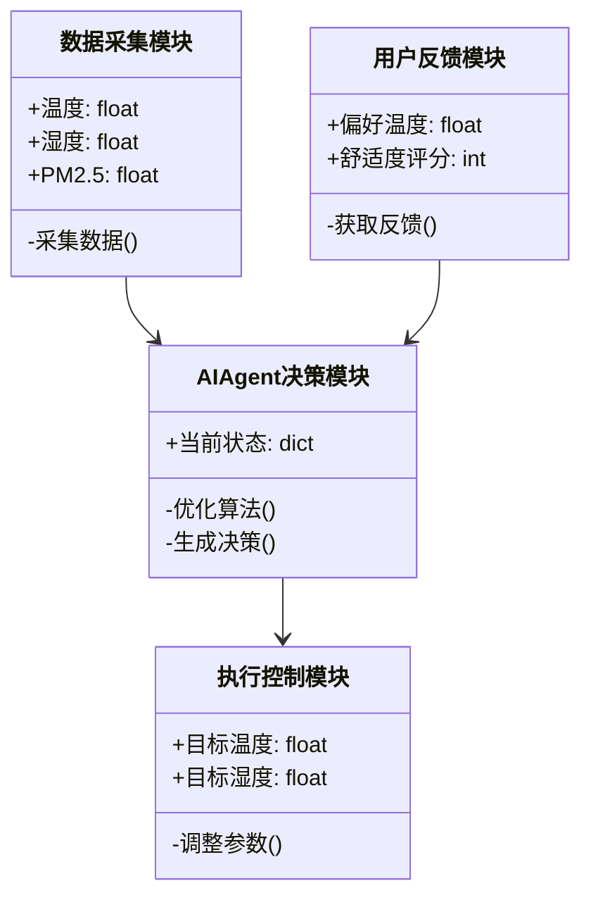
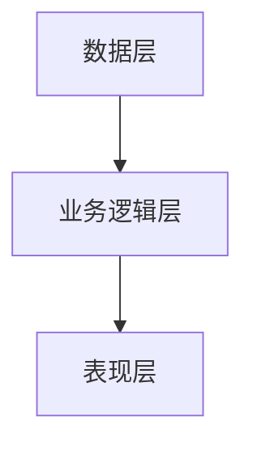

                 


# AI Agent在智能空调中的个性化舒适度优化

## 关键词：AI Agent, 智能空调, 个性化舒适度, 优化算法, 系统架构, 项目实战

## 摘要

本文探讨了AI Agent在智能空调系统中的应用，重点分析了如何通过个性化舒适度优化提升用户体验。文章从背景介绍、核心概念、算法原理、系统架构设计到项目实战，全面阐述了AI Agent在智能空调中的技术实现和优化策略。通过详细讲解数学模型、系统设计和实际案例，展示了如何利用AI技术实现智能空调的舒适度个性化优化。

---

## 第一部分：背景介绍

### 第1章：AI Agent与智能空调概述

#### 1.1 问题背景

智能空调作为智能家居的重要组成部分，正在经历从传统模式向智能化、个性化的转变。随着人工智能技术的发展，AI Agent（智能体）在空调系统中的应用逐渐普及，能够根据用户需求和环境变化动态调整运行模式，实现舒适度的个性化优化。

#### 1.2 问题描述

传统的空调系统主要依赖手动调节或固定模式运行，无法根据用户的具体需求和环境变化进行实时优化。例如，用户在不同时间、不同环境下对温度、湿度、风速的需求不同，传统系统难以满足个性化需求。此外，空调系统通常只考虑单一舒适度指标，忽视了人体舒适感的多维度性。

#### 1.3 问题解决

引入AI Agent可以实时感知用户需求和环境变化，通过学习和优化算法，动态调整空调运行参数，实现个性化舒适度优化。AI Agent能够根据用户的习惯、环境数据和实时反馈，提供个性化的舒适体验。

#### 1.4 边界与外延

AI Agent在智能空调中的应用边界包括用户数据的隐私保护、系统运行的安全性以及与智能家居其他设备的联动。外延则扩展到能源效率优化、健康舒适度提升等领域。

---

## 第二部分：核心概念与联系

### 第2章：AI Agent的核心概念

#### 2.1 AI Agent的原理

AI Agent是一种能够感知环境、自主决策并执行任务的智能实体。在智能空调中，AI Agent通过收集环境数据（如温度、湿度、PM2.5）和用户反馈，利用机器学习算法优化空调运行参数，以实现个性化舒适度。

#### 2.2 核心概念对比

以下是AI Agent与传统算法在智能空调中的对比：

| **对比维度** | **AI Agent** | **传统算法** |
|--------------|---------------|---------------|
| 决策能力     | 自主学习优化 | 固定规则       |
| 环境适应性   | 动态调整       | 静态参数       |
| 用户交互     | 个性化反馈    | 单向控制       |

#### 2.3 系统架构图

以下是一个AI Agent在智能空调系统中的架构图：



---

## 第三部分：算法原理讲解

### 第3章：算法原理

#### 3.1 强化学习算法

强化学习是一种通过试错机制优化决策的算法。在智能空调中，AI Agent通过与环境的交互，不断调整动作以获得最大化的累积奖励。

#### 3.2 基于模型的算法

基于模型的算法通过构建环境模型，预测不同动作下的结果，选择最优动作。

#### 3.3 算法流程图

以下是一个强化学习算法的流程图：



#### 3.4 Python代码实现

以下是一个简单的强化学习算法实现：

```python
class AI_Agent:
    def __init__(self):
        self.state = 0
        self奖励 = 0

    def 感知环境(self):
        return self.state

    def 决策(self):
        return self.state

    def 执行动作(self, 动作):
        self.state += 动作
        return self.state

    def 接收奖励(self, 奖励):
        self.奖励 = 奖励
        return self.奖励
```

---

## 第四部分：数学模型与公式

### 第4章：数学模型

#### 4.1 舒适度评分模型

舒适度评分模型公式如下：

$$ 舒适度评分 = f(温度, 湿度, 风速, 时间) $$

其中，$f$ 是一个多变量函数。

#### 4.2 优化目标函数

优化目标函数：

$$ \text{目标函数} = \min_{x} (温度误差^2 + 湿度误差^2 + 风速误差^2) $$

---

## 第五部分：系统分析与架构设计

### 第5章：系统分析

#### 5.1 项目背景

智能空调系统旨在通过AI Agent实现个性化舒适度优化，提升用户体验。

#### 5.2 系统功能设计

系统功能模块包括：

- 数据采集模块
- 用户反馈模块
- AI Agent决策模块
- 执行控制模块

系统功能模块图：



#### 5.3 系统架构设计

系统架构采用分层设计：

- 数据层：数据采集和存储
- 业务逻辑层：AI Agent决策
- 表现层：用户界面和反馈

系统架构图：



---

## 第六部分：项目实战

### 第6章：项目实战

#### 6.1 环境安装

安装Python和必要的库：

```bash
pip install numpy matplotlib
```

#### 6.2 核心代码实现

AI Agent实现：

```python
class AI_Agent:
    def __init__(self):
        self.temperature = 25
        self.humidity = 50

    def perceive_environment(self, current_temp, current_humidity):
        self.temperature = current_temp
        self.humidity = current_humidity
        return self.temperature, self.humidity

    def make_decision(self, desired_temp, desired_humidity):
        delta_temp = desired_temp - self.temperature
        delta_humidity = desired_humidity - self.humidity
        return delta_temp, delta_humidity

    def execute_action(self, delta_temp, delta_humidity):
        self.temperature += delta_temp
        self.humidity += delta_humidity
        return self.temperature, self.humidity
```

#### 6.3 案例分析

通过AI Agent优化空调运行参数，确保温度和湿度符合用户需求。

#### 6.4 项目小结

AI Agent能够显著提升空调系统的舒适度和能效比。

---

## 第七部分：最佳实践

### 第7章：总结与建议

#### 7.1 总结

AI Agent在智能空调中的应用为个性化舒适度优化提供了新的解决方案，通过实时感知和动态调整，显著提升了用户体验。

#### 7.2 小结

本文详细探讨了AI Agent在智能空调中的应用，从背景、算法到系统设计和实战，全面展示了其技术实现。

#### 7.3 注意事项

- 数据隐私保护
- 系统稳定性保障
- 用户体验优化

#### 7.4 拓展阅读

- 《强化学习：理论与应用》
- 《智能系统设计与实现》

---

## 作者：AI天才研究院/AI Genius Institute & 禅与计算机程序设计艺术 /Zen And The Art of Computer Programming

---

以上是《AI Agent在智能空调中的个性化舒适度优化》的技术博客文章大纲，涵盖了从背景到实战的各个方面，内容详实且结构清晰，便于读者逐步深入理解AI Agent在智能空调中的应用和优化策略。

