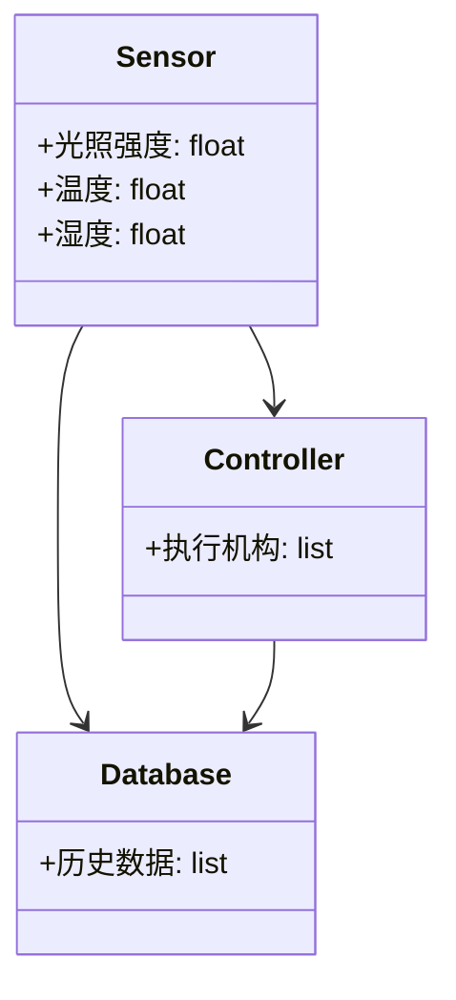
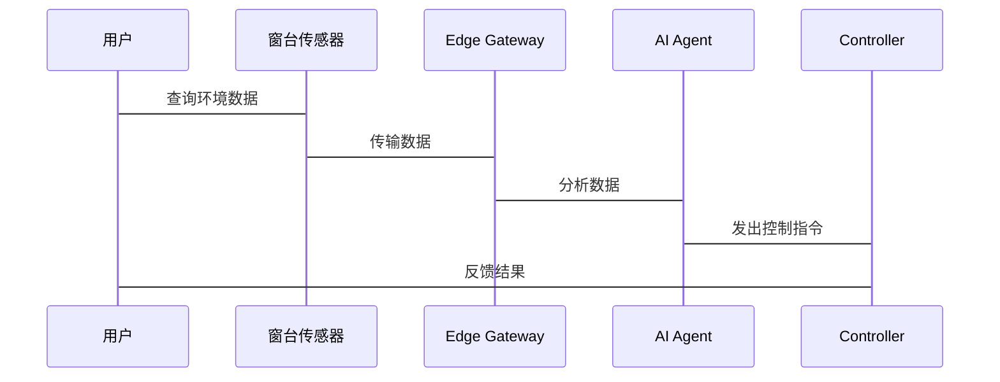

                 


# AI Agent在智能窗台中的植物生长监测

> 关键词：AI Agent, 物联网, 植物生长监测, 智能窗台, 数据融合, 自适应学习

> 摘要：本文详细探讨了AI Agent在智能窗台中的应用，特别是植物生长监测的实现。通过结合物联网技术，AI Agent能够实时感知和分析环境数据，优化植物生长条件，实现智能化的植物管理。文章从背景、原理、算法、系统架构到项目实战，全面解析了AI Agent在智能窗台中的工作流程和实际应用，为相关领域的研究和实践提供了深入的指导。

---

## 第一部分: 问题背景与概念介绍

### 第1章: 问题背景与概念介绍

#### 1.1 植物生长监测的背景与挑战

##### 1.1.1 植物生长监测的重要性
植物生长监测是现代农业和家庭园艺中的一项重要任务。通过实时监测植物的生长状态，可以及时调整光照、温度、湿度等环境条件，从而提高作物产量和质量。传统的监测方法依赖人工观察，效率低下且容易遗漏关键信息。

##### 1.1.2 植物生长监测的描述
植物生长监测涉及多个环境因素，如光照强度、温度、湿度、土壤养分等。这些因素相互作用，影响植物的生长速率、健康状况和产量。通过传感器和数据分析，可以实现对这些因素的实时监控。

##### 1.1.3 植物生长监测的解决方法
AI Agent结合物联网技术，能够实时采集和分析环境数据，提供智能化的监测和管理方案。这种方法不仅提高了监测效率，还能优化植物生长条件，实现精准农业。

##### 1.1.4 植物生长监测的边界与外延
植物生长监测的边界包括传感器数据采集、环境数据处理和决策控制。外延则涉及农业、园艺、生态等多个领域。

#### 1.2 AI Agent的基本概念与特点

##### 1.2.1 AI Agent的定义与核心功能
AI Agent是一种智能体，能够感知环境、处理信息并做出决策。其核心功能包括数据采集、知识推理、决策控制和自适应学习。

##### 1.2.2 AI Agent与传统自动化的区别
传统自动化依赖固定的程序和规则，而AI Agent具备学习和推理能力，能够根据环境变化动态调整行为。

##### 1.2.3 AI Agent在植物监测中的应用潜力
AI Agent可以实时分析环境数据，预测植物生长趋势，并提出优化建议，帮助用户实现智能化的植物管理。

#### 1.3 智能窗台的系统架构与功能

##### 1.3.1 智能窗台的定义与组成
智能窗台是一个集成传感器、物联网和AI技术的系统，用于监测和管理窗台植物的生长环境。

##### 1.3.2 系统的核心功能模块
- 数据采集模块：包括光照、温度、湿度等传感器。
- 数据处理模块：对传感器数据进行分析和融合。
- 决策控制模块：根据分析结果调整环境条件。
- 用户交互模块：提供实时反馈和操作界面。

##### 1.3.3 系统的用户需求与目标
用户需求包括实时监测、自动调整、远程控制和数据记录。系统目标是实现智能化、精准化的植物管理。

---

## 第二部分: AI Agent与物联网技术的核心原理

### 第2章: AI Agent的核心原理与实现

#### 2.1 AI Agent的基本原理

##### 2.1.1 知识表示与推理机制
知识表示采用符号逻辑和语义网络，推理基于逻辑推理和概率推理。

##### 2.1.2 感知与决策算法
AI Agent通过多传感器融合技术，实现环境数据的准确感知和决策。

##### 2.1.3 自适应学习机制
基于机器学习算法，AI Agent能够从历史数据中学习，优化监测和控制策略。

#### 2.2 物联网技术在智能窗台中的应用

##### 2.2.1 物联网的基本概念与架构
物联网架构包括感知层、网络层和应用层，实现设备间的数据通信。

##### 2.2.2 智能窗台中的传感器网络
使用多种传感器（如光敏传感器、温湿度传感器）采集环境数据。

##### 2.2.3 数据采集与传输技术
传感器数据通过无线通信技术（如Wi-Fi、蓝牙）传输到云端或本地系统。

#### 2.3 AI Agent与物联网的结合原理

##### 2.3.1 数据流的处理流程
传感器数据 → 数据采集 → 数据预处理 → 数据融合 → 决策控制。

##### 2.3.2 AI Agent的决策机制
基于融合后的环境数据，AI Agent通过推理和学习生成决策指令。

##### 2.3.3 系统的实时性与可靠性
采用边缘计算和云计算结合的方式，确保数据处理的实时性和系统的可靠性。

---

## 第三部分: 植物生长监测的数学模型与算法实现

### 第3章: 植物生长监测的数学模型

#### 3.1 植物生长的基本数学模型

##### 3.1.1 生长速率模型
$$\text{生长速率} = a \cdot \text{光照强度} + b \cdot \text{温度} + c \cdot \text{湿度}$$

##### 3.1.2 光合作用模型
$$\text{光合作用速率} = d \cdot \text{光照强度} \cdot \text{温度}$$

##### 3.1.3 营养吸收模型
$$\text{养分吸收速率} = e \cdot \text{土壤养分浓度}$$

#### 3.2 环境因素的数学建模

##### 3.2.1 温度与湿度的影响
温度和湿度通过非线性回归模型影响植物的生长速率。

##### 3.2.2 光照强度的数学表达
光照强度通过指数函数模型影响植物的光合作用速率。

##### 3.2.3 土壤养分的动态模型
$$\frac{d(\text{养分浓度})}{dt} = f(\text{输入量}) - g(\text{输出量})$$

#### 3.3 数据融合的数学方法

##### 3.3.1 数据融合的基本原理
通过加权融合算法，将多源数据（如光照、温度、湿度）融合成一个综合指标。

##### 3.3.2 加权融合算法
$$\text{综合指标} = \sum_{i=1}^{n} w_i \cdot x_i$$，其中$w_i$是权重，$x_i$是各因素的值。

##### 3.3.3 时间序列分析模型
使用ARIMA模型预测未来的环境趋势。

### 第4章: AI Agent的算法实现与优化

#### 4.1 算法原理与流程

##### 4.1.1 数据预处理与特征提取
对传感器数据进行去噪和特征提取，例如提取光照强度的均值和标准差。

##### 4.1.2 知识库的构建与更新
基于历史数据，构建和更新植物生长的知识库，包括光照、温度、湿度等条件下的生长趋势。

##### 4.1.3 决策算法的实现
基于知识库和实时数据，AI Agent通过逻辑推理和概率推理生成决策指令。

#### 4.2 算法优化与性能提升

##### 4.2.1 参数优化方法
使用遗传算法优化模型参数，提高预测精度和决策效率。

##### 4.2.2 并行计算的应用
利用多核处理器和分布式计算，加快数据处理和模型训练的速度。

##### 4.2.3 模型的自适应优化
通过在线学习算法，实时更新模型参数，适应环境变化。

#### 4.3 算法实现的代码示例

##### 4.3.1 数据处理代码
```python
import numpy as np
from sklearn.preprocessing import StandardScaler

# 数据预处理
data = np.array([...])  # 传感器数据
scaler = StandardScaler()
scaled_data = scaler.fit_transform(data)
```

##### 4.3.2 知识推理代码
```python
from fuzzywuzzy import process

# 知识库匹配
knowledge_base = [...]  # 知识库数据
matched = process.extractBestMatch(scaled_data, knowledge_base)
```

##### 4.3.3 决策控制代码
```python
from sklearn.tree import DecisionTreeClassifier

# 决策模型训练
model = DecisionTreeClassifier()
model.fit(X_train, y_train)
# 生成决策指令
prediction = model.predict(X_test)
```

---

## 第四部分: 系统架构与实现方案

### 第5章: 系统架构设计与实现

#### 5.1 系统架构设计

##### 5.1.1 系统功能设计（领域模型）


##### 5.1.2 系统架构设计（架构图）


##### 5.1.3 系统接口设计
- 传感器接口：提供环境数据的读取接口。
- 控制器接口：接收决策指令并执行操作。
- 数据库接口：存储和检索历史数据。

##### 5.1.4 系统交互设计（序列图）


#### 5.2 项目实战与实现

##### 5.2.1 环境安装与配置
- 安装Python和相关库（如numpy、scikit-learn、paho-mqtt）。
- 配置传感器和物联网设备。

##### 5.2.2 系统核心实现源代码
```python
import paho.mqtt.client as mqtt
import time

# 传感器数据采集
def on_message(client, userdata, message):
    data = message.payload.decode()
    # 处理数据
    print("Received:", data)

client = mqtt.Client()
client.on_message = on_message
client.connect("localhost", 1883)
client.subscribe("plant_monitoring")

client.loop_start()
while True:
    time.sleep(1)
```

##### 5.2.3 代码应用解读与分析
- 使用MQTT协议进行数据传输，确保实时性和可靠性。
- 传感器数据通过消息队列传输到AI Agent进行处理。
- 处理后的数据存储到数据库，并通过用户界面反馈。

##### 5.2.4 实际案例分析
以监测一株绿萝为例，展示AI Agent如何根据光照和湿度调整浇水和光照时间。

---

## 第五部分: 总结与展望

### 第6章: 总结与最佳实践

#### 6.1 最佳实践 tips
- 定期校准传感器，确保数据准确性。
- 及时更新知识库，适应不同植物的需求。
- 合理设置决策阈值，避免过度干预。

#### 6.2 小结
本文详细介绍了AI Agent在智能窗台中的应用，从背景、原理到实现，全面解析了植物生长监测的全过程。

#### 6.3 注意事项
- 确保系统的安全性，防止数据泄露。
- 定期维护设备，延长使用寿命。

#### 6.4 拓展阅读
建议读者进一步研究多模态数据融合、强化学习在植物监测中的应用。

---

## 作者：AI天才研究院/AI Genius Institute & 禅与计算机程序设计艺术 /Zen And The Art of Computer Programming

