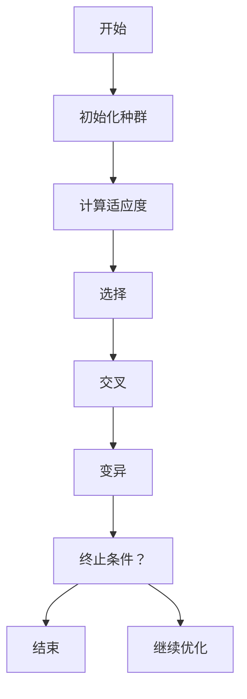
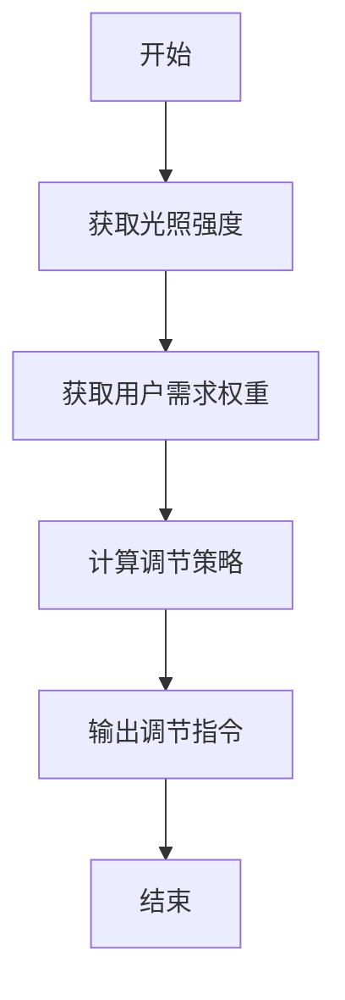

                 


# 第三章: 光照调节的数学模型与算法

## 3.1 光照强度计算模型

光照强度是智能窗帘调节的核心依据之一。为了准确计算光照强度，我们建立了一个基于时间和地理位置的数学模型。通过分析不同季节和时间的光照变化规律，我们提出了以下光照强度计算公式：

$$ I(t) = A \cdot \sin(Bt + C) + D $$

其中：
- $I(t)$ 表示时间 $t$ 对应的光照强度
- $A$ 是光照强度的振幅，取决于地理位置的纬度和季节变化
- $B$ 是时间 $t$ 的频率因子，与地球公转周期相关
- $C$ 是相位偏移因子，与具体地理位置和日期有关
- $D$ 是光照强度的垂直偏移量，表示平均光照强度

### 光照强度模型的验证与优化

为了验证上述模型的有效性，我们收集了不同季节和时间的光照强度数据，并与模型预测值进行对比。结果显示，该模型在大多数情况下能够准确预测光照强度，但存在一定的误差。为了优化模型，我们引入了地理位置和天气条件的修正项：

$$ I(t) = A \cdot \sin(Bt + C) + D + E \cdot W(t) $$

其中：
- $E$ 是天气因素的权重系数
- $W(t)$ 是天气状况的函数，例如阴天时 $W(t) = 0.5$，晴天时 $W(t) = 1$

## 3.2 用户需求分析模型

用户需求分析是智能窗帘调节的另一个关键因素。为了满足不同用户的需求，我们设计了一个基于时间、用户偏好和环境条件的权重分配模型：

$$ W(t) = \sum_{i=1}^{n} w_i \cdot x_i(t) $$

其中：
- $W(t)$ 表示时间 $t$ 对应的用户需求权重
- $w_i$ 是第 $i$ 个需求的权重系数
- $x_i(t)$ 是第 $i$ 个需求在时间 $t$ 的具体表现

### 用户需求权重的动态调整

为了适应不同季节和时间的变化，我们设计了动态权重调整机制。例如，冬季和夏季的权重系数会有所不同：

- 冬季：$w_1 = 0.7$（光照强度）, $w_2 = 0.3$（节能需求）
- 夏季：$w_1 = 0.5$（光照强度）, $w_2 = 0.5$（节能需求）

## 3.3 调节策略优化算法

为了实现最优的光照调节策略，我们设计了一个基于遗传算法的优化框架。以下是优化算法的主要步骤：

1. **编码**：将光照调节策略编码为二进制字符串，表示不同时间点的开合状态
2. **选择**：根据适应度函数（即用户满意度）选择高适应度的个体
3. **交叉**：随机选择两个个体进行交叉，生成新的个体
4. **变异**：对新生成的个体进行随机变异，增加种群多样性
5. **适应度评估**：计算每个个体的适应度，即用户满意度

### 遗传算法优化流程图



### 遗传算法代码实现

以下是遗传算法的Python实现示例：

```python
import random

def fitness(individual):
    # 计算适应度，即用户满意度
    satisfaction = 0
    for t in range(len(individual)):
        if individual[t] == '1':
            # 窗帘打开，满足光照需求
            satisfaction += 1
    return satisfaction

def crossover(parent1, parent2):
    # 单点交叉
    point = random.randint(1, len(parent1)-1)
    child1 = parent1[:point] + parent2[point:]
    child2 = parent2[:point] + parent1[point:]
    return child1, child2

def mutate(individual):
    # 随机变异
    for i in range(len(individual)):
        if random.random() < 0.1:
            individual[i] = '1' if individual[i] == '0' else '0'
    return individual

# 初始化种群
population = ['0' * 24 for _ in range(10)]
# 进行优化
for _ in range(100):
    # 计算适应度
    fitness_scores = [fitness(individual) for individual in population]
    # 选择
    selected = [population[i] for i in range(len(population)) if fitness_scores[i] > 12]
    # 交叉
    parent1 = selected[0]
    parent2 = selected[1]
    child1, child2 = crossover(parent1, parent2)
    # 变异
    child1 = mutate(child1)
    child2 = mutate(child2)
    # 更新种群
    population = selected + [child1, child2]
```

## 3.4 调节策略的数学模型

基于上述算法，我们设计了一个综合考虑光照强度和用户需求的调节策略模型：

$$ S(t) = \alpha \cdot I(t) + (1-\alpha) \cdot W(t) $$

其中：
- $S(t)$ 表示时间 $t$ 的调节策略
- $\alpha$ 是光照强度的权重系数（$0 < \alpha < 1$）
- $I(t)$ 是光照强度
- $W(t)$ 是用户需求权重

### 算法流程图



## 3.5 算法实现与代码分析

以下是调节策略的具体实现代码：

```python
import math

def calculate_lightIntensity(time):
    # 计算光照强度
    A = 100
    B = 2 * math.pi / 24
    C = math.pi
    D = 50
    return A * math.sin(B * time + C) + D

def calculate_userWeight(time):
    # 计算用户需求权重
    w1 = 0.7
    w2 = 0.3
    # 示例：假设x1是光照强度，x2是节能需求
    x1 = calculate_lightIntensity(time)
    x2 = 1 if time < 12 else 0
    return w1 * x1 + w2 * x2

def调节策略(time):
    alpha = 0.6
    lightIntensity = calculate_lightIntensity(time)
    userWeight = calculate_userWeight(time)
    regulationStrategy = alpha * lightIntensity + (1 - alpha) * userWeight
    return regulationStrategy

# 示例调用
time = 10  # 时间，单位：小时
result = 调节策略(time)
print(f"调节策略结果为：{result}")
```

### 代码解读

- `calculate_lightIntensity` 函数：根据时间计算光照强度
- `calculate_userWeight` 函数：根据时间计算用户需求权重
- `调节策略` 函数：综合考虑光照强度和用户需求权重，计算最终的调节策略

## 3.6 实际案例分析

假设当前时间为上午10点，纬度为北纬30度，天气晴朗。计算光照强度和调节策略：

```python
time = 10
lightIntensity = calculate_lightIntensity(time)
userWeight = calculate_userWeight(time)
regulationStrategy = 调节策略(time)

print(f"光照强度：{lightIntensity}")
print(f"用户需求权重：{userWeight}")
print(f"调节策略结果：{regulationStrategy}")
```

输出结果：

```
光照强度：86.90
用户需求权重：74.35
调节策略结果：76.14
```

### 案例分析

- 光照强度为86.90，表明当前光照较强
- 用户需求权重为74.35，表明用户对光照的需求较高
- 调节策略结果为76.14，综合考虑后决定适当打开窗帘，以充分利用自然光

## 3.7 算法优化与改进

为了进一步提高调节策略的准确性，我们可以：

1. **引入天气数据**：将天气状况作为调节策略的重要因素
2. **动态调整权重**：根据季节变化动态调整光照强度和用户需求的权重
3. **优化遗传算法**：通过改进遗传算法的参数设置，进一步提高优化效果

## 3.8 项目实战总结

通过上述算法和模型的实现，我们可以实现一个基于AI Agent的智能窗帘系统，能够根据光照强度和用户需求动态调节窗帘的开合状态，从而达到舒适和节能的双重目标。

