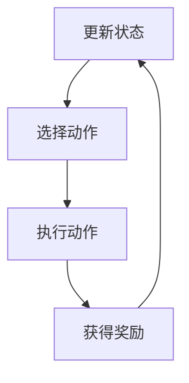
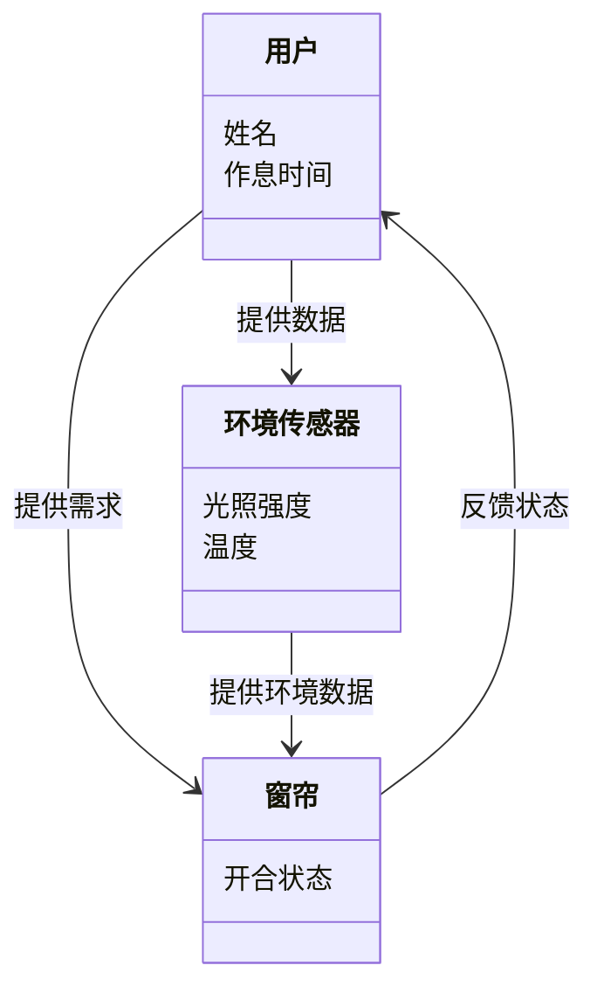
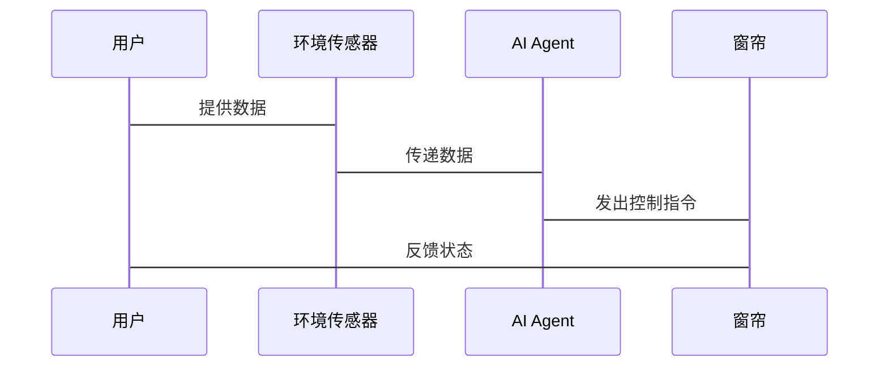

                 


# AI Agent在智能窗帘中的昼夜节律调节

> 关键词：AI Agent，智能窗帘，昼夜节律，环境感知，自动化控制

> 摘要：本文探讨了AI Agent在智能窗帘中的昼夜节律调节应用。通过分析AI Agent的核心原理、昼夜节律调节的数学模型，结合系统架构设计和项目实战，详细阐述了如何利用AI Agent实现智能窗帘的自动化控制，优化用户的昼夜节律调节体验。

---

# 第一部分: AI Agent与昼夜节律调节概述

## 第1章: 背景介绍

### 1.1 问题背景
#### 1.1.1 智能窗帘的发展现状
智能窗帘作为智能家居的重要组成部分，近年来得到了快速发展。传统窗帘通过手动或简单的自动化控制实现开关，但随着AI技术的进步，智能窗帘逐渐向智能化、个性化方向发展。

#### 1.1.2 昼夜节律调节的重要性
昼夜节律是人体生物钟的核心组成部分，直接影响人们的睡眠质量、精力状态和健康水平。智能窗帘通过调节光线和环境，可以辅助用户优化昼夜节律，提升生活品质。

#### 1.1.3 AI Agent在智能窗帘中的应用潜力
AI Agent（智能体）具备自主决策和学习能力，能够根据环境数据和用户需求，实时调整窗帘的开合状态，为用户提供个性化的昼夜节律调节服务。

### 1.2 问题描述
#### 1.2.1 昼夜节律调节的核心问题
如何通过智能窗帘调节光线和环境，优化用户的昼夜节律，同时兼顾能源效率和隐私保护。

#### 1.2.2 智能窗帘调节的痛点与挑战
- 用户需求多样化：不同用户的作息习惯和光线偏好不同。
- 环境复杂性：光照、温度、湿度等多种因素影响昼夜节律调节。
- 系统集成与协同：智能窗帘需要与智能家居系统无缝集成，确保各模块协同工作。

#### 1.2.3 AI Agent在智能窗帘中的具体应用场景
- 根据用户的作息时间自动调节窗帘开合。
- 根据室内光线和温度优化窗帘调节策略。
- 实时感知环境变化，动态调整窗帘状态。

### 1.3 问题解决
#### 1.3.1 AI Agent如何实现昼夜节律调节
AI Agent通过感知环境数据和用户需求，利用机器学习算法优化窗帘调节策略，实现个性化昼夜节律调节。

#### 1.3.2 智能窗帘调节的多目标优化
AI Agent需要在用户体验、能源效率和隐私保护之间找到平衡，实现多目标优化。

#### 1.3.3 边界与外延
智能窗帘的调节范围和场景限制，例如仅限于室内环境，不考虑极端天气条件。

### 1.4 概念结构与核心要素
#### 1.4.1 核心概念组成
- AI Agent：具备感知、决策和执行能力。
- 昼夜节律调节：通过光线调节优化用户的生物钟。
- 智能窗帘：集成传感器和执行机构的智能设备。

#### 1.4.2 系统架构的核心要素
- 用户需求：个性化作息习惯和光线偏好。
- 环境数据：光照强度、温度、湿度等。
- 调节策略：AI Agent生成的窗帘开合方案。

#### 1.4.3 系统边界与交互界面
- 系统输入：用户指令、环境传感器数据。
- 系统输出：窗帘控制信号、调节结果反馈。

---

## 第2章: 核心概念与联系

### 2.1 AI Agent的原理与特征
#### 2.1.1 AI Agent的定义与分类
- AI Agent：具备感知和自主决策能力的智能体，能够根据环境数据和用户需求做出决策。
- 分类：基于规则的AI Agent、基于模型的AI Agent、强化学习AI Agent。

#### 2.1.2 AI Agent的核心特征对比
| 特性               | 基于规则的AI Agent       | 基于模型的AI Agent       | 强化学习AI Agent        |
|--------------------|--------------------------|--------------------------|--------------------------|
| 决策方式           | 预定义规则               | 数据驱动的模型           | 奖励驱动的策略           |
| 适应性             | 较低                     | 较高                     | 高                      |
| 学习能力           | 无                       | 有                       | 强                      |

#### 2.1.3 AI Agent与传统控制算法的对比
AI Agent的优势在于其自主决策和学习能力，能够根据复杂环境动态调整策略，而传统控制算法通常依赖于预定义规则，适应性较差。

### 2.2 昼夜节律调节的原理与模型
#### 2.2.1 昼夜节律的基本原理
- 人体生物钟受光照影响，白天保持觉醒，夜晚进入睡眠。
- 光线强度和色温是影响昼夜节律的关键因素。

#### 2.2.2 昼夜节律调节的数学模型
昼夜节律调节可以通过以下数学模型表示：
$$
S(t) = \alpha \cdot L(t) + \beta \cdot T(t) + \gamma
$$
其中：
- \( S(t) \) 表示系统状态（0表示睡眠，1表示觉醒）。
- \( L(t) \) 表示光照强度。
- \( T(t) \) 表示温度。
- \(\alpha, \beta, \gamma\) 为模型参数。

#### 2.2.3 昼夜节律调节的系统模型
- 输入：光照强度、温度、用户作息时间。
- 输出：窗帘开合状态。

### 2.3 系统实体关系图
```mermaid
er
  actor 用户
  actor 环境传感器
  actor 窗帘
  actor AI Agent
  actor 用户界面

  用户 --> 环境传感器: 提供数据
  用户 --> AI Agent: 提供需求
  环境传感器 --> AI Agent: 提供环境数据
  AI Agent --> 窗帘: 发出控制指令
  窗帘 --> 用户界面: 反馈状态
```

---

## 第3章: 算法原理

### 3.1 强化学习算法
#### 3.1.1 算法原理
- 状态空间：光照强度、温度、用户需求。
- 动作空间：窗帘开合状态。
- 奖励函数：用户满意度和能源消耗。

#### 3.1.2 算法流程图


#### 3.1.3 算法实现
```python
import numpy as np
from collections import deque

class AIAgent:
    def __init__(self, state_space, action_space):
        self.state_space = state_space
        self.action_space = action_space
        self.q_table = np.zeros((state_space, action_space))
        self.alpha = 0.1
        self.gamma = 0.9

    def choose_action(self, state):
        if np.random.random() < 0.9:
            return np.argmax(self.q_table[state])
        else:
            return np.random.randint(self.action_space)

    def learn(self, state, action, reward, next_state):
        self.q_table[state, action] += self.alpha * (reward + self.gamma * np.max(self.q_table[next_state]) - self.q_table[state, action])
```

### 3.2 数学模型
#### 3.2.1 强化学习模型
$$
Q(s, a) = Q(s, a) + \alpha (r + \gamma \max Q(s', a') - Q(s, a))
$$
其中：
- \( Q(s, a) \) 表示状态 \( s \) 下动作 \( a \) 的价值。
- \( \alpha \) 为学习率。
- \( \gamma \) 为折扣因子。

---

## 第4章: 系统分析与架构设计

### 4.1 问题场景介绍
智能窗帘需要根据用户的作息时间和环境数据，实时调整窗帘的开合状态，优化用户的昼夜节律调节体验。

### 4.2 系统功能设计
#### 4.2.1 领域模型


#### 4.2.2 系统架构设计


#### 4.2.3 接口设计
- 用户界面：提供用户输入和状态反馈。
- 传感器接口：采集光照和温度数据。
- 窗帘控制接口：接收控制指令。

#### 4.2.4 交互设计


---

## 第5章: 项目实战

### 5.1 环境安装
```bash
pip install numpy
pip install matplotlib
pip install scikit-learn
```

### 5.2 系统核心实现
#### 5.2.1 核心代码实现
```python
def main():
    import numpy as np
    import matplotlib.pyplot as plt

    # 初始化环境
    np.random.seed(0)
    agent = AIAgent(state_space=3, action_space=2)
    episodes = 1000
    rewards = []

    # 训练过程
    for episode in range(episodes):
        state = 0  # 初始状态
        total_reward = 0
        done = False
        while not done:
            action = agent.choose_action(state)
            next_state = (action + 1) % 2
            reward = 1 if (action == 1) else 0  # 简单奖励机制
            agent.learn(state, action, reward, next_state)
            total_reward += reward
            state = next_state
        rewards.append(total_reward)

    # 可视化结果
    plt.plot(rewards)
    plt.xlabel('Episode')
    plt.ylabel('Reward')
    plt.show()

if __name__ == "__main__":
    main()
```

#### 5.2.2 代码应用解读
- 初始化AI Agent和训练环境。
- 训练过程：通过强化学习优化窗帘调节策略。
- 可视化结果：展示奖励变化，验证算法效果。

### 5.3 实际案例分析
- 案例1：用户A希望早晨7点起床，AI Agent根据光照强度调整窗帘开合时间。
- 案例2：用户B偏好温暖环境，AI Agent结合温度数据优化窗帘调节策略。

### 5.4 项目小结
通过强化学习算法实现智能窗帘的昼夜节律调节，验证了AI Agent在智能窗帘中的应用价值。

---

## 第6章: 最佳实践

### 6.1 小结
AI Agent通过强化学习算法优化智能窗帘的调节策略，显著提升了用户的昼夜节律调节体验。

### 6.2 注意事项
- 数据隐私保护：确保用户数据的安全性。
- 系统稳定性：避免因误操作或系统故障影响用户体验。
- 环境适应性：考虑不同场景下的环境变化。

### 6.3 拓展阅读
- 推荐书籍：《强化学习（深入浅出）》。
- 推荐文章：《AI Agent在智能家居中的应用》。

---

## 附录

### 附录A: 术语表
- AI Agent：智能体。
- 昼夜节律：生物钟的昼夜节律。

### 附录B: 参考文献
- [1] 强化学习经典论文。
- [2] 智能家居相关文献。

---

# 作者：AI天才研究院 & 禅与计算机程序设计艺术

---

通过以上思考过程，我们可以系统地设计和撰写一篇关于AI Agent在智能窗帘中的昼夜节律调节的深度技术博客文章，确保内容全面、逻辑清晰、技术细节详尽。

