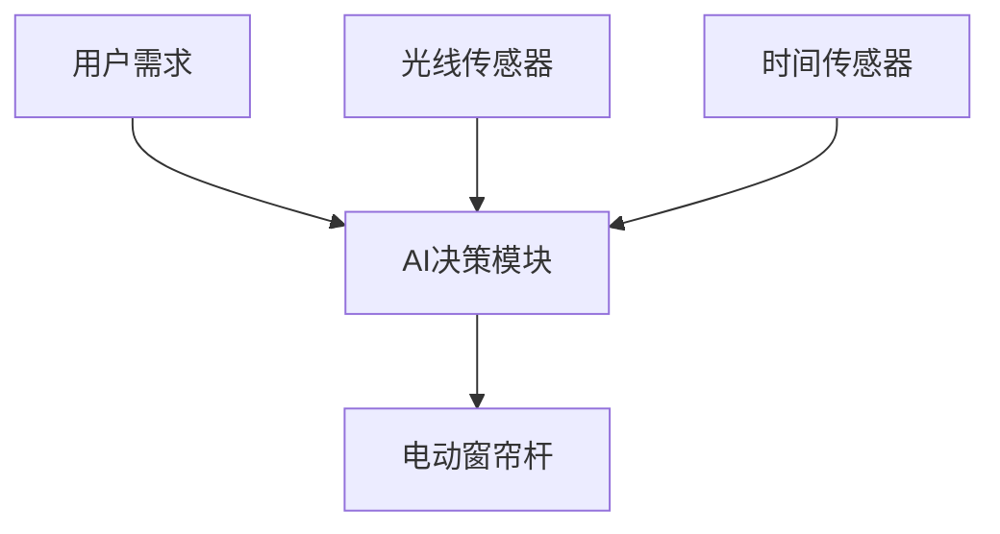

                 


# AI Agent在智能窗帘杆中的日光治疗功能

> 关键词：AI Agent，智能窗帘杆，日光治疗，系统架构，算法原理

> 摘要：本文详细探讨了AI Agent在智能窗帘杆中的日光治疗功能的设计与实现。首先介绍了问题背景和需求分析，然后从核心概念、算法原理、系统架构等角度进行了深入分析，并通过项目实战展示了AI Agent在智能窗帘杆中的实际应用。最后给出了最佳实践和系统优化的建议。

---

## 第一部分：背景介绍

### 第1章：问题背景

#### 1.1 智能窗帘杆的发展现状
- 智能窗帘杆从手动控制到自动化控制的演变
- 当前市场主流的日光治疗功能的实现方式
- AI技术在智能家居领域的广泛应用

#### 1.2 日光治疗功能的必要性
- 人体生物钟与自然光的关系
- 日光治疗在改善睡眠和情绪中的作用
- 城市化进程加速背景下，室内光照不足的问题

#### 1.3 AI Agent在智能窗帘杆中的作用
- AI Agent如何优化日光治疗功能
- AI Agent通过环境感知和智能决策提升用户体验
- AI Agent在窗帘杆日光治疗功能中的核心地位

---

## 第2章：核心概念与联系

### 2.1 AI Agent的基本原理
- AI Agent的定义与特点
  - 状态感知：通过传感器获取环境数据
  - 行为决策：基于数据进行智能决策
  - 交互执行：通过执行机构完成操作
- AI Agent的核心算法：强化学习与决策树

### 2.2 日光治疗功能的系统架构
- 日光治疗功能的系统组成
  - 光线传感器
  - 时间控制器
  - 用户需求分析模块
  - AI决策模块
- AI Agent与日光治疗功能的交互关系
  - 数据流分析
  - 信息处理流程
  - 决策结果输出

### 2.3 核心概念的联系
- AI Agent与日光治疗功能的关系
  - 数据依赖性
  - 行为一致性
  - 目标协同性
- 日光治疗功能与智能窗帘杆的关系
  - 硬件支持
  - 软件控制
  - 用户体验

---

## 第3章：算法原理讲解

### 3.1 AI Agent的核心算法
- 状态空间与动作空间
  - 状态表示：光照强度、时间、用户需求
  - 动作表示：窗帘开合程度
- AI Agent的决策机制
  - 强化学习算法：Q-learning
  - 决策树算法：ID3
- 算法的数学模型与公式
  - Q-learning算法的数学表达式：
    $$ Q(s, a) = (1 - \alpha) Q(s, a) + \alpha (r + \max_{a'} Q(s', a')) $$
  - ID3算法的决策树构建过程

### 3.2 算法实现的详细步骤
- 状态的表示与转换
  - 状态编码：将光照强度、时间、用户需求转化为数值表示
  - 状态转移：根据环境变化更新状态
- 动作的选择与执行
  - 动作选择：基于当前状态选择最优动作
  - 动作执行：通过窗帘杆执行机构完成操作
- 算法的优化与改进
  - 离线训练与在线更新的结合
  - 状态转移概率的动态调整

---

## 第4章：系统分析与架构设计

### 4.1 系统架构设计
- 系统组成模块
  - 数据采集模块：光线传感器、时间传感器
  - AI决策模块：强化学习算法、决策树算法
  - 执行机构：电动窗帘杆
- 系统架构图（Mermaid）



### 4.2 接口设计
- 系统接口定义
  - 用户需求接口：获取用户的日光治疗需求
  - 光线传感器接口：获取当前光照强度
  - 时间传感器接口：获取当前时间
  - 窗帘杆控制接口：控制窗帘的开合程度

### 4.3 交互流程
- 用户需求传递
- 环境数据采集
- AI决策过程
- 执行机构响应

---

## 第5章：项目实战

### 5.1 环境安装
- 系统环境配置
  - Python 3.8及以上版本
  - NumPy、Pandas、Scikit-learn库
- 开发工具安装
  - Jupyter Notebook
  - Mermaid工具

### 5.2 核心代码实现
- 窗帘杆日光治疗功能的核心代码
  ```python
  import numpy as np
  from sklearn.tree import DecisionTreeClassifier
  from collections import defaultdict

  class AIAgent:
      def __init__(self):
          self.model = DecisionTreeClassifier()
          self.states = defaultdict(list)
          self.rewards = defaultdict(list)

      def perceive(self, light, time):
          # 状态表示：光照强度和时间
          state = (light, time)
          return state

      def decide(self, state):
          # 基于决策树的决策
          prediction = self.model.predict([[state[0], state[1]]])
          return prediction[0]

      def learn(self, state, action, reward):
          # 强化学习更新
          self.states[state].append(action)
          self.rewards[state].append(reward)
  ```

### 5.3 案例分析
- 典型案例分析
  - 用户需求分析
  - 环境数据采集
  - AI决策过程
  - 系统响应与结果

### 5.4 项目小结
- 项目实现的关键点
  - 算法选择与实现
  - 系统架构设计
  - 环境数据采集与处理
  - 系统优化与调试

---

## 第6章：最佳实践

### 6.1 小结
- 本文总结了AI Agent在智能窗帘杆中的日光治疗功能的设计与实现过程
- 突出了AI Agent在优化日光治疗功能中的重要作用
- 展望了智能窗帘杆日光治疗功能的未来发展方向

### 6.2 注意事项
- 数据隐私保护
- 系统稳定性与可靠性
- 环境数据的准确性与实时性
- 用户需求的多样性与个性化

### 6.3 拓展阅读
- AI Agent在智能家居中的其他应用
- 强化学习在环境感知中的应用
- 决策树算法在智能控制中的优化

---

## 作者：AI天才研究院 & 禅与计算机程序设计艺术

---

通过以上思考，我们逐步构建了《AI Agent在智能窗帘杆中的日光治疗功能》的技术博客文章。希望这篇文章能够为读者提供清晰的思路和深入的见解，帮助他们在实际项目中更好地应用AI技术优化智能窗帘杆的日光治疗功能。

