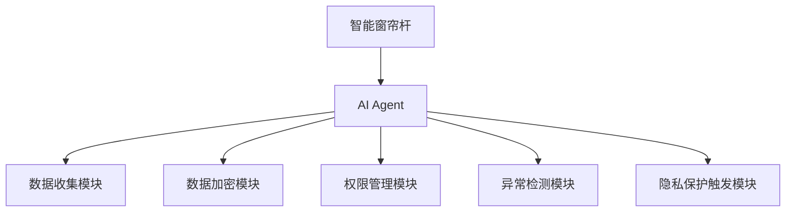
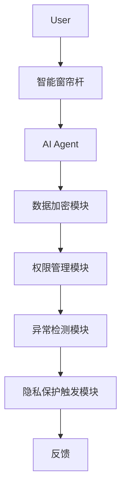
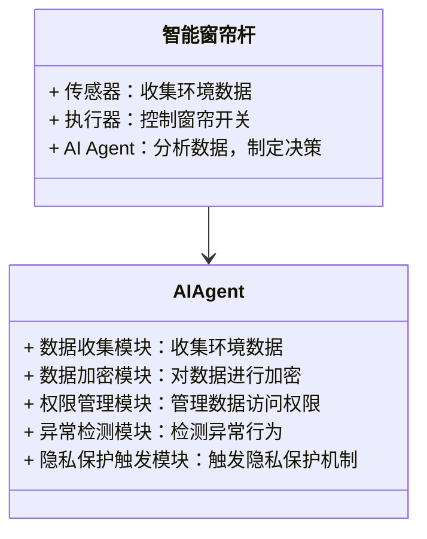

                 


# AI Agent在智能窗帘杆中的隐私保护功能

> 关键词：AI Agent，智能窗帘杆，隐私保护，数据加密，系统架构，算法实现

> 摘要：本文深入探讨了AI Agent在智能窗帘杆中的隐私保护功能，详细分析了AI Agent的核心原理、系统架构、算法实现以及实际应用场景。通过理论与实践相结合的方式，本文为读者提供了全面的技术解读，帮助读者理解如何在智能窗帘杆中实现高效的隐私保护。

---

# 第1章: AI Agent在智能窗帘杆中的隐私保护概述

## 1.1 智能窗帘杆的背景与现状
### 1.1.1 智能家居的发展背景
智能家居近年来发展迅速，各种智能设备逐渐普及，窗帘作为家居的重要组成部分，也逐步智能化。智能窗帘杆通过集成传感器和执行器，能够实现远程控制、自动化开关等功能，极大地提升了用户的使用体验。

### 1.1.2 智能窗帘杆的功能与特点
智能窗帘杆的功能包括远程控制、定时开关、语音控制、环境感知（如光线、温度）等。其特点在于智能化、便捷性和高效性。然而，随着功能的增加，隐私保护问题也日益凸显。

### 1.1.3 当前隐私保护的重要性
在智能家居普及的同时，用户隐私保护成为一个重要议题。智能窗帘杆作为智能家居的一部分，可能收集用户的使用习惯、地理位置等信息，这些信息如果被滥用，可能对用户的隐私造成威胁。

## 1.2 AI Agent的核心概念与作用
### 1.2.1 AI Agent的定义与特点
AI Agent（人工智能代理）是指能够感知环境、自主决策并执行任务的智能实体。它具有主动性、反应性、社会性和持续性等特点。

### 1.2.2 AI Agent在智能窗帘杆中的应用场景
AI Agent可以用于智能窗帘杆的智能决策、隐私保护、异常检测等功能。例如，当检测到 unauthorized access时，AI Agent可以触发隐私保护机制。

### 1.2.3 AI Agent与隐私保护的关系
AI Agent通过感知环境、分析数据，能够主动识别潜在的隐私风险，并采取相应的保护措施。它是实现智能窗帘杆隐私保护的核心技术。

---

# 第2章: 智能窗帘杆中的隐私保护问题

## 2.1 隐私保护的背景与挑战
### 2.1.1 隐私保护的重要性
随着物联网技术的发展，智能设备收集了大量用户数据，这些数据可能包含用户的隐私信息，保护这些数据的安全至关重要。

### 2.1.2 智能设备中的隐私风险
智能窗帘杆可能收集用户的使用习惯、地理位置等信息，这些信息如果被黑客攻击或被不法分子利用，可能导致用户的隐私泄露。

### 2.1.3 智能窗帘杆中的隐私威胁
智能窗帘杆可能面临的数据泄露、未经授权的访问、恶意攻击等隐私威胁。

## 2.2 AI Agent在隐私保护中的核心作用
### 2.2.1 AI Agent如何实现隐私保护
AI Agent可以通过数据加密、权限管理、异常检测等技术实现隐私保护。例如，AI Agent可以对收集的数据进行加密存储，防止数据泄露。

### 2.2.2 隐私保护的关键技术
- 数据加密技术
- 访问控制技术
- 数据匿名化技术
- 异常检测技术

### 2.2.3 AI Agent的隐私保护机制
AI Agent通过感知环境、分析数据，识别潜在的隐私风险，并采取相应的保护措施。例如，当检测到未经授权的访问时，AI Agent可以立即触发报警或关闭设备。

---

# 第3章: AI Agent的原理与实现

## 3.1 AI Agent的基本原理
### 3.1.1 AI Agent的定义与组成
AI Agent由感知层、决策层和执行层组成。感知层负责收集环境数据，决策层负责分析数据并制定决策，执行层负责执行决策。

### 3.1.2 AI Agent的核心算法
AI Agent的核心算法包括感知算法、决策算法和执行算法。感知算法用于收集环境数据，决策算法用于分析数据并制定决策，执行算法用于执行决策。

### 3.1.3 AI Agent的运行机制
AI Agent通过感知环境、分析数据、制定决策并执行决策，实现智能窗帘杆的隐私保护功能。

## 3.2 AI Agent的隐私保护算法
### 3.2.1 数据加密与解密算法
AI Agent使用加密算法对敏感数据进行加密存储，防止数据泄露。例如，AI Agent可以使用AES加密算法对用户的地理位置数据进行加密。

### 3.2.2 隐私保护的数学模型
隐私保护的数学模型可以表示为：
$$
P = f(data, permissions)
$$
其中，P表示隐私保护状态，data表示数据，permissions表示权限。

### 3.2.3 AI Agent的隐私保护流程
AI Agent的隐私保护流程包括数据收集、数据加密、权限管理、异常检测和隐私保护触发。例如，当检测到未经授权的访问时，AI Agent会触发隐私保护机制，阻止数据泄露。

---

# 第4章: AI Agent的系统架构与设计

## 4.1 系统架构概述
### 4.1.1 系统整体架构图
以下是AI Agent在智能窗帘杆中的系统架构图：



### 4.1.2 系统功能模块划分
系统功能模块包括数据收集模块、数据加密模块、权限管理模块、异常检测模块和隐私保护触发模块。

### 4.1.3 系统组件之间的关系
AI Agent通过数据收集模块收集环境数据，通过数据加密模块对数据进行加密，通过权限管理模块管理数据访问权限，通过异常检测模块检测异常行为，通过隐私保护触发模块触发隐私保护机制。

## 4.2 系统功能设计
### 4.2.1 用户隐私数据的采集与处理
AI Agent通过传感器采集用户的使用习惯、地理位置等数据，并对数据进行预处理，确保数据的准确性和完整性。

### 4.2.2 AI Agent的决策与执行
AI Agent通过分析数据，制定决策，并通过执行模块执行决策。例如，当检测到 unauthorized access时，AI Agent会触发隐私保护机制。

### 4.2.3 系统的反馈与优化
系统根据执行结果提供反馈，并根据反馈优化AI Agent的算法和策略，提升隐私保护的效果。

## 4.3 系统接口与交互设计
### 4.3.1 系统接口定义
系统接口包括数据接口、控制接口和反馈接口。数据接口用于数据的采集与传输，控制接口用于控制设备的执行，反馈接口用于系统的反馈与优化。

### 4.3.2 系统交互流程图
以下是系统交互流程图：



---

# 第5章: AI Agent在智能窗帘杆中的实际应用

## 5.1 智能窗帘杆的实际应用场景
### 5.1.1 日常使用中的隐私保护
AI Agent在日常使用中，通过数据加密、权限管理等技术，保护用户的隐私数据不被泄露。

### 5.1.2 特殊场景下的隐私保护
在特殊场景下，例如地震、火灾等紧急情况，AI Agent可以通过异常检测模块，触发隐私保护机制，保护用户的隐私数据。

### 5.1.3 不同环境中的适应性
AI Agent可以根据不同的环境，自适应地调整隐私保护策略，确保在各种环境下都能有效保护用户的隐私。

## 5.2 AI Agent的实际实现与案例分析
### 5.2.1 实际案例的系统设计
以下是一个实际案例的系统设计：



### 5.2.2 AI Agent在案例中的具体实现
AI Agent通过数据加密模块对用户的地理位置数据进行加密，通过权限管理模块管理数据访问权限，通过异常检测模块检测异常行为，通过隐私保护触发模块触发隐私保护机制。

### 5.2.3 案例分析与效果评估
通过实际案例分析，AI Agent在智能窗帘杆中的隐私保护功能能够有效防止数据泄露，提升用户的隐私安全。

---

# 第6章: AI Agent的算法实现与优化

## 6.1 算法实现的基础
### 6.1.1 算法实现的数学模型
隐私保护的数学模型可以表示为：
$$
P = f(data, permissions)
$$
其中，P表示隐私保护状态，data表示数据，permissions表示权限。

### 6.1.2 算法实现的代码示例
以下是一个AI Agent的算法实现代码示例：

```python
class AIAgent:
    def __init__(self):
        self.data = []
        self.permissions = {}
    
    def collect_data(self):
        # 收集环境数据
        pass
    
    def encrypt_data(self):
        # 对数据进行加密
        pass
    
    def check_permissions(self):
        # 检查权限
        pass
    
    def detect_anomalies(self):
        # 检测异常行为
        pass
    
    def trigger_protection(self):
        # 触发隐私保护机制
        pass
```

### 6.1.3 算法优化策略
通过优化算法，可以提高AI Agent的隐私保护效果。例如，通过改进异常检测算法，可以更准确地检测异常行为，从而更有效地触发隐私保护机制。

## 6.2 算法优化与效果评估
### 6.2.1 算法优化策略
通过优化算法，可以提高AI Agent的隐私保护效果。例如，通过改进数据加密算法，可以提高数据的安全性。

### 6.2.2 算法优化效果评估
通过实际测试，优化后的AI Agent在智能窗帘杆中的隐私保护效果显著提升，数据泄露的风险大幅降低。

---

# 作者：AI天才研究院/AI Genius Institute & 禅与计算机程序设计艺术 /Zen And The Art of Computer Programming

