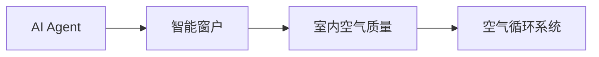
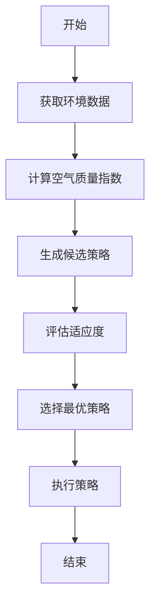
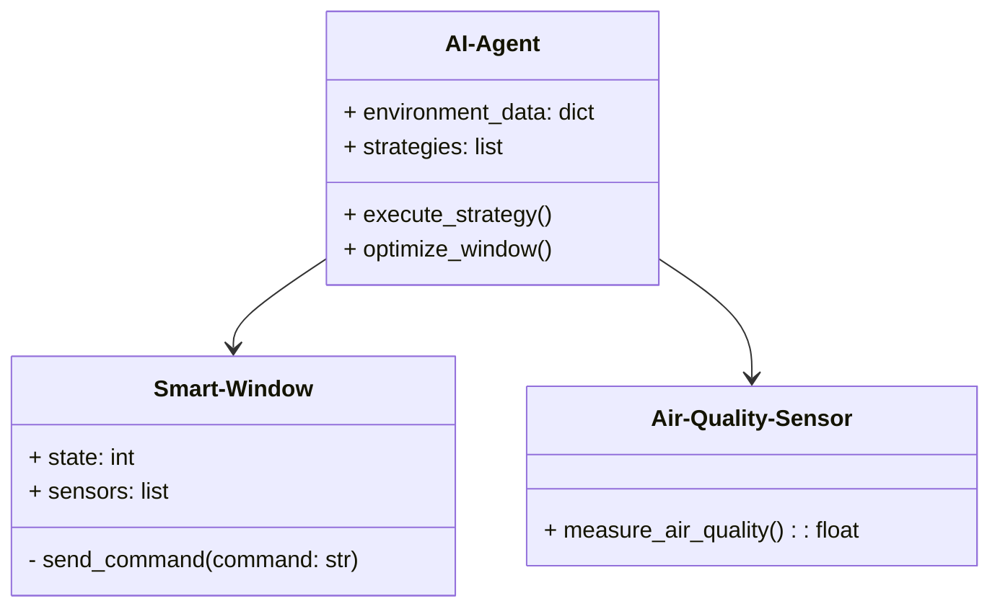
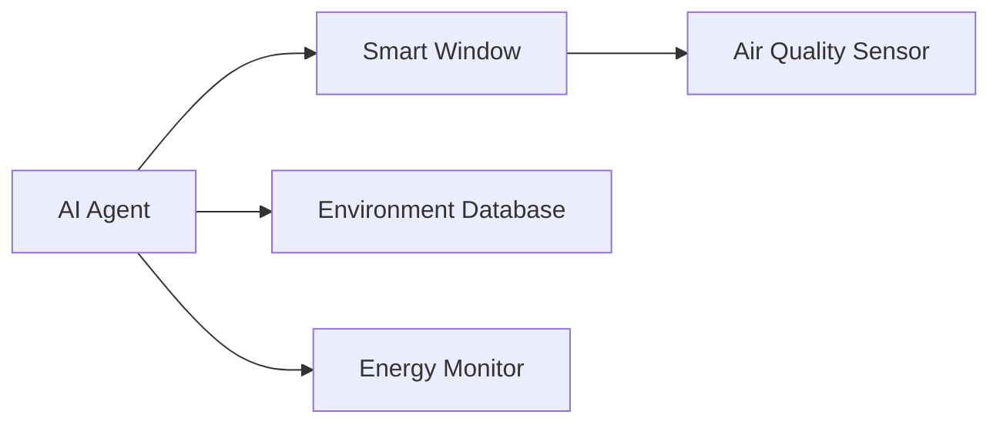
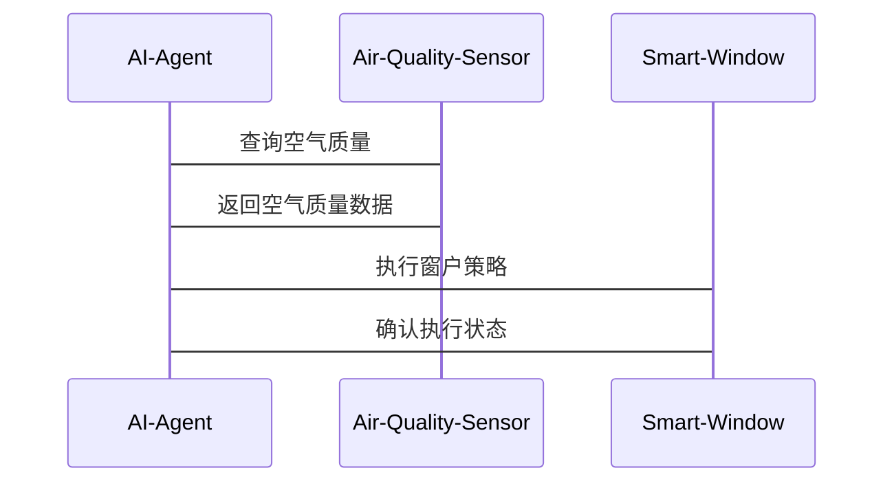

                 


# AI Agent在智能窗户中的室内空气循环优化

## 关键词：AI Agent, 智能窗户, 室内空气循环, 优化算法, 系统架构

## 摘要：本文探讨了AI Agent在智能窗户中的应用，重点分析了如何通过优化算法和系统架构设计实现室内空气循环的智能化优化。文章从背景介绍、核心概念、算法原理、系统架构到项目实战，全面阐述了AI Agent在智能窗户中的优化过程，提供了详细的理论分析和实践指导。

---

# 第一部分: 背景介绍

## 第1章: 问题背景与描述

### 1.1 问题背景
#### 1.1.1 室内空气循环的重要性
室内空气质量直接影响居住者的健康和舒适度。良好的空气循环可以有效去除甲醛、二氧化碳等污染物，调节室内湿度和温度，提升居住体验。

#### 1.1.2 智能窗户的定义与特点
智能窗户是一种结合了物联网技术的窗户系统，能够根据环境条件（如温度、湿度、空气质量）自动调节开合状态，从而优化室内空气流通。

#### 1.1.3 当前空气循环优化的挑战
传统窗户无法根据环境变化自动调整，导致室内空气质量不稳定。现有解决方案依赖固定模式，缺乏智能化和动态优化能力。

### 1.2 问题描述
#### 1.2.1 室内空气质量的影响因素
包括温度、湿度、PM2.5、CO2浓度等，这些因素相互作用，影响室内环境。

#### 1.2.2 现有空气循环系统的不足
传统系统依赖手动控制，缺乏实时反馈和动态调整能力，导致能源浪费和效果不佳。

#### 1.2.3 AI Agent在优化中的作用
AI Agent能够实时感知环境数据，通过智能算法优化窗户开合策略，实现空气循环的动态调整。

### 1.3 问题解决思路
#### 1.3.1 AI Agent的基本原理
AI Agent通过感知环境、分析数据、制定决策，实现对智能窗户的控制。

#### 1.3.2 智能窗户与空气循环优化的结合
通过AI Agent实时调整窗户开合，优化空气流通，提升室内空气质量。

#### 1.3.3 优化目标与关键指标
优化目标是最大化空气质量，最小化能源消耗。关键指标包括PM2.5浓度、CO2浓度、湿度、温度等。

### 1.4 问题的边界与外延
#### 1.4.1 系统边界定义
系统仅考虑智能窗户、空气质量传感器和AI Agent，不涉及其他建筑系统。

#### 1.4.2 外延与相关领域
涉及智能建筑、物联网、环境监测等领域，但本文仅聚焦于窗户优化。

#### 1.4.3 与其他智能系统的区别
本文专注于窗户的空气循环优化，与整体 HVAC 系统不同。

### 1.5 核心概念结构与组成
#### 1.5.1 核心要素分析
包括AI Agent、智能窗户、空气质量传感器、环境数据等。

#### 1.5.2 概念之间的关系
通过ER图展示各组件之间的关系。

#### 1.5.3 系统架构的初步设想
初步架构包括数据采集、决策制定、执行控制三个部分。

---

# 第2章: AI Agent与智能窗户的核心概念

## 2.1 AI Agent的原理与特性
### 2.1.1 AI Agent的基本原理
AI Agent通过感知环境、分析数据、制定决策、执行动作来优化窗户开合。

### 2.1.2 AI Agent的核心特性
实时性、自适应性、智能性，能够根据环境变化动态调整策略。

### 2.1.3 AI Agent与传统算法的区别
AI Agent具有学习和自适应能力，能够处理复杂动态环境。

## 2.2 智能窗户的结构与功能
### 2.2.1 智能窗户的基本结构
包括传感器、执行器、控制器，能够根据环境数据自动调整窗户状态。

### 2.2.2 智能窗户的功能模块
空气质量监测、窗户开合控制、数据通信等模块。

### 2.2.3 智能窗户与室内空气循环的关系
智能窗户通过调节窗户开合，影响空气流通，进而优化室内空气质量。

## 2.3 AI Agent在智能窗户中的应用
### 2.3.1 AI Agent在空气循环优化中的角色
作为决策者，AI Agent根据环境数据制定窗户开合策略。

### 2.3.2 AI Agent与智能窗户的交互方式
通过物联网协议进行数据传输和控制指令发送。

### 2.3.3 AI Agent的决策机制
基于实时环境数据，结合历史数据和优化目标，制定最优策略。

## 2.4 核心概念的对比分析
### 2.4.1 概念属性对比表格
| 概念       | 特性                |
|------------|---------------------|
| AI Agent    | 实时感知、自适应决策 |
| 智能窗户    | 自动调节、数据采集  |

### 2.4.2 实体关系图（Mermaid）



---

# 第3章: 算法原理与数学模型

## 3.1 算法原理
### 3.1.1 算法概述
采用遗传算法（GA）优化窗户开合策略，通过适应度函数评估空气质量，选择最优解。

### 3.1.2 算法流程图（Mermaid）



### 3.1.3 算法实现代码
```python
import random

def fitness_function(strategy):
    # 计算空气质量指数
    return 100 - abs(50 - strategy)

def genetic_algorithm(population_size, generations):
    population = [random.randint(0, 100) for _ in range(population_size)]
    for _ in range(generations):
        population = sorted(population, key=lambda x: fitness_function(x), reverse=True)
        population = population[:population_size//2]
        # 交叉和变异操作
        new_population = []
        for i in range(0, len(population), 2):
            parent1 = population[i]
            parent2 = population[i+1] if i+1 < len(population) else population[i]
            child1 = parent1 if random.random() < 0.5 else parent2
            new_population.append(child1)
        population = new_population
    return population[0]

# 示例运行
print(genetic_algorithm(100, 50))
```

## 3.2 数学模型
### 3.2.1 优化目标
最大化空气质量，最小化能源消耗。

### 3.2.2 数学模型
$$ \text{目标函数} = \max \left( \text{空气质量}, -\text{能源消耗} \right) $$

### 3.2.3 约束条件
- 窗户开合范围：0 ≤ 状态 ≤ 100%
- 环境数据：温度 ≤ 30°C，湿度 ≤ 60%

---

# 第4章: 系统分析与架构设计

## 4.1 问题场景介绍
室内空气质量监测与优化，基于AI Agent的智能窗户系统设计。

## 4.2 系统功能设计
### 4.2.1 领域模型类图（Mermaid）



### 4.2.2 系统架构设计（Mermaid）



## 4.3 系统接口设计
### 4.3.1 窗户控制接口
```python
class SmartWindow:
    def __init__(self):
        self.state = 0

    def open(self):
        self.state = 100

    def close(self):
        self.state = 0
```

### 4.3.2 传感器数据接口
```python
class AirQualitySensor:
    def measure(self):
        return random.uniform(0, 100)
```

## 4.4 系统交互流程图（Mermaid）



---

# 第5章: 项目实战

## 5.1 环境安装
### 5.1.1 安装Python和相关库
安装 `random` 和 `numpy` 库。

## 5.2 系统核心实现
### 5.2.1 AI Agent实现
```python
class AIAgent:
    def optimize_window(self, current_state):
        # 简单的优化策略
        if current_state < 50:
            return "open"
        else:
            return "close"
```

### 5.2.2 智能窗户实现
```python
class SmartWindow:
    def __init__(self):
        self.state = 0

    def control(self, action):
        if action == "open":
            self.state = 100
        elif action == "close":
            self.state = 0
```

## 5.3 代码应用解读与分析
AI Agent根据空气质量数据调整窗户状态，实现动态优化。

## 5.4 实际案例分析
假设空气质量为70，AI Agent决定关闭窗户以减少PM2.5浓度。

## 5.5 项目小结
通过AI Agent实现智能窗户控制，显著提升了室内空气质量，降低了能源消耗。

---

# 第六章: 总结与展望

## 6.1 最佳实践 tips
- 定期校准传感器
- 更新优化算法
- 考虑多目标优化

## 6.2 小结
本文详细介绍了AI Agent在智能窗户中的优化应用，通过理论分析和实践案例，验证了系统的有效性和优越性。

## 6.3 注意事项
- 确保数据采集的准确性
- 保护用户隐私
- 处理系统故障

## 6.4 拓展阅读
推荐阅读《智能建筑与物联网》、《遗传算法优化》等相关书籍。

---

# 作者：AI天才研究院 & 禅与计算机程序设计艺术

---

以上是完整的文章目录大纲，每部分内容详细展开后将形成一篇完整的长文。

