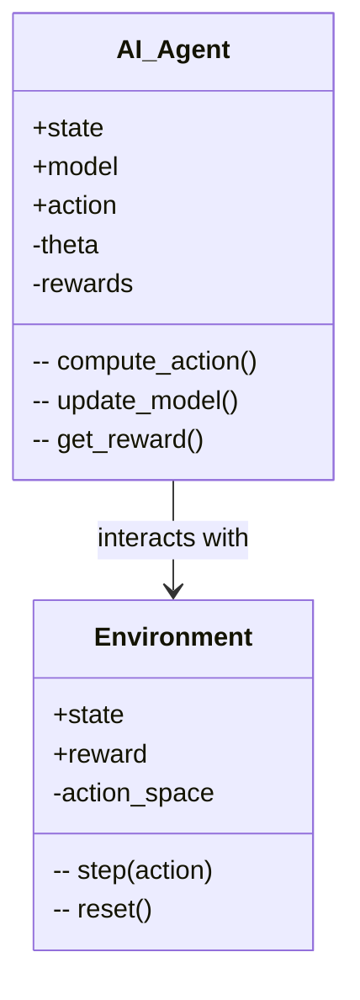
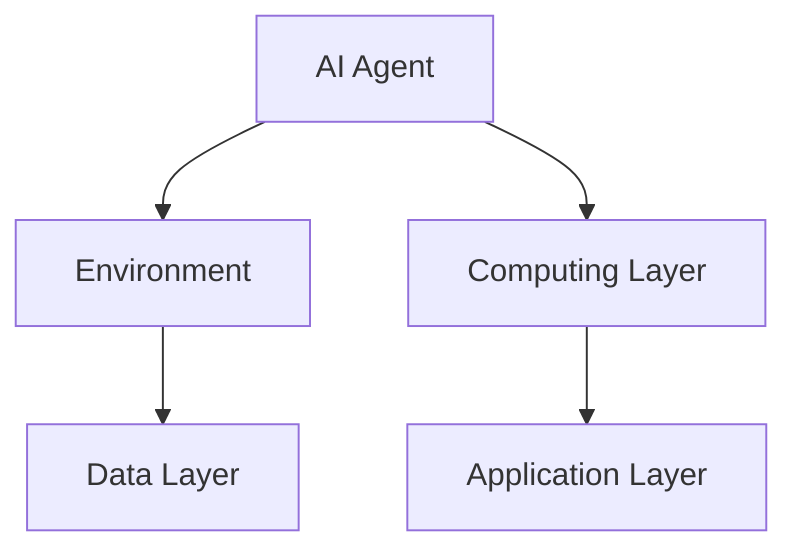

                 


# AI Agent在智能网络安全中的应用

> 关键词：AI Agent，智能网络安全，机器学习，网络安全，人工智能

> 摘要：本文探讨AI Agent在智能网络安全中的应用，从基本概念、算法原理到系统架构和项目实战，全面分析AI Agent在网络安全中的角色与价值，提供深度的技术见解。

---

# 目录大纲

1. **AI Agent与智能网络安全概述**
   - 1.1 AI Agent的基本概念与网络安全背景
   - 1.2 AI Agent在网络安全中的应用背景
   - 1.3 AI Agent的核心技术与原理

2. **AI Agent的核心算法与数学模型**
   - 2.1 AI Agent的核心算法原理
   - 2.2 AI Agent的数学模型与公式
   - 2.3 AI Agent算法的实现与应用

3. **AI Agent在智能网络安全中的系统架构**
   - 3.1 系统分析与架构设计方案
   - 3.2 系统功能设计与实现
   - 3.3 系统接口与交互设计

4. **AI Agent的项目实战**
   - 4.1 项目背景与目标
   - 4.2 核心代码实现
   - 4.3 系统功能与案例分析

5. **AI Agent的最佳实践与未来发展**
   - 5.1 实践中的注意事项
   - 5.2 未来的发展方向

---

# 第一部分: AI Agent与智能网络安全概述

## 1.1 AI Agent的基本概念与网络安全背景

### 1.1.1 AI Agent的基本定义
AI Agent（人工智能代理）是一种能够感知环境、自主决策并执行任务的智能实体。在网络安全领域，AI Agent通常用于实时监控、威胁检测和自动响应。

**AI Agent的核心特征：**
- **自主性**：能够独立决策和行动。
- **反应性**：能够实时感知环境变化并调整行为。
- **主动性**：主动执行任务，而非被动响应。

### 1.1.2 AI Agent在网络安全中的应用背景
随着网络攻击的复杂化，传统安全技术（如防火墙、入侵检测系统）已难以应对新型威胁。AI Agent通过结合机器学习和强化学习，能够实现更智能的安全防护。

**AI Agent与传统安全技术的区别：**
| 特性         | 传统安全技术                | AI Agent                         |
|--------------|-----------------------------|----------------------------------|
| 智能性       | 基于规则和模式匹配          | 基于机器学习和自主决策          |
| 灵活性       | 固定规则，难以适应变化      | 能够自适应环境变化                |
| 响应速度     | 依赖预设规则，响应较慢      | 实时感知与响应，速度快            |

---

## 1.2 AI Agent在网络安全中的应用背景

### 1.2.1 网络安全的智能化需求
传统安全技术在应对零日攻击、高级持续性威胁（APT）等方面表现乏力。AI Agent通过智能化手段，能够更有效地识别和应对复杂威胁。

**AI Agent在网络安全中的角色定位：**
- **主动防御者**：实时监控网络流量，主动识别潜在威胁。
- **威胁猎手**：通过强化学习，识别异常行为并发起反制措施。
- **安全策略优化者**：根据实时数据调整安全策略，提高防护效果。

---

## 1.3 AI Agent的核心技术与原理

### 1.3.1 AI Agent的核心技术原理
AI Agent在网络安全中的核心技术包括感知、决策和执行机制。

- **感知机制**：通过收集网络流量、日志等数据，识别异常行为。
- **决策机制**：基于机器学习模型，评估威胁严重性并制定应对策略。
- **执行机制**：根据决策结果，执行隔离、封锁等安全措施。

---

# 第二部分: AI Agent的核心算法与数学模型

## 2.1 AI Agent的核心算法原理

### 2.1.1 强化学习算法
强化学习是一种通过试错机制优化决策的算法。在网络安全中，AI Agent可以通过强化学习，学会在不同场景下做出最优的防御决策。

**强化学习流程：**
1. **状态识别**：识别当前网络状态（如是否存在可疑连接）。
2. **动作选择**：基于当前状态，选择一个动作（如允许或阻止连接）。
3. **奖励机制**：根据动作结果，给予奖励或惩罚。
4. **策略优化**：根据奖励调整策略，提升决策准确性。

**强化学习的数学模型：**
$$ R = r_1 + \gamma r_2 + \gamma^2 r_3 + \dots $$
其中，$R$ 是总奖励，$r_i$ 是每个动作的奖励，$\gamma$ 是折扣因子。

---

## 2.2 AI Agent的数学模型与公式

### 2.2.1 概率模型
在网络安全中，AI Agent可以使用概率模型来评估某个行为是正常还是异常。例如，使用贝叶斯定理计算某个行为是恶意的概率。

**贝叶斯定理公式：**
$$ P(A|B) = \frac{P(B|A) \cdot P(A)}{P(B)} $$

其中：
- $P(A|B)$ 是在B条件下A发生的概率。
- $P(B|A)$ 是在A条件下B发生的概率。
- $P(A)$ 是A发生的先验概率。
- $P(B)$ 是B发生的总概率。

---

## 2.3 AI Agent算法的实现与应用

### 2.3.1 代码实现
以下是一个简单的强化学习算法实现示例：

```python
import numpy as np
import gym

# 初始化环境
env = gym.make('CartPole-v0')
env.seed(42)

# 初始化策略参数
theta = np.random.randn(4, 1)

# 张量计算函数
def compute_action(state, theta):
    z = np.dot(state, theta)
    action = 1 if z > 0 else 0
    return action

# 强化学习训练循环
for episode in range(1000):
    state = env.reset()
    total_reward = 0
    done = False
    while not done:
        action = compute_action(state, theta)
        next_state, reward, done, _ = env.step(action)
        total_reward += reward
        # 更新策略参数（示例中未实现）
        # theta = theta + learning_rate * gradient
    print(f"Episode {episode}, Total Reward: {total_reward}")
```

---

# 第三部分: AI Agent在智能网络安全中的系统架构

## 3.1 系统分析与架构设计方案

### 3.1.1 网络安全场景介绍
假设我们设计一个基于AI Agent的入侵检测系统（IDS），用于实时监测网络流量，识别潜在攻击。

### 3.1.2 系统功能设计
- **数据采集**：收集网络流量、日志等数据。
- **威胁检测**：使用机器学习模型识别异常行为。
- **自动响应**：根据检测结果，执行隔离、封锁等措施。

**系统功能设计类图：**


### 3.1.3 系统架构设计
- **数据层**：存储网络流量数据。
- **计算层**：运行机器学习模型。
- **应用层**：提供用户界面和API。

**系统架构图：**


---

## 3.2 系统功能设计与实现

### 3.2.1 核心功能实现
- **数据预处理**：清洗和归一化网络数据。
- **模型训练**：使用神经网络训练威胁检测模型。
- **实时监控**：部署AI Agent进行实时检测。

**数据预处理代码示例：**
```python
import pandas as pd

# 加载数据
data = pd.read_csv('network_traffic.csv')

# 数据清洗
data = data.dropna()
data = data.drop_duplicates()

# 数据归一化
from sklearn.preprocessing import StandardScaler
scaler = StandardScaler()
scaled_data = scaler.fit_transform(data)
```

---

## 3.3 系统接口与交互设计

### 3.3.1 接口设计
- **API接口**：提供RESTful API，供其他系统调用。
- **用户界面**：提供可视化界面，供管理员查看检测结果。

**API接口设计示例：**
```python
from flask import Flask

app = Flask(__name__)

@app.route('/detect', methods=['POST'])
def detect():
    # 获取请求数据
    data = request.json
    # 调用AI Agent进行检测
    result = ai_agent.detect(data)
    return jsonify(result)
```

---

# 第四部分: AI Agent的项目实战

## 4.1 项目背景与目标

### 4.1.1 项目背景
设计一个基于AI Agent的入侵检测系统，用于实时监测企业网络，识别并应对潜在攻击。

### 4.1.2 项目目标
- 实现实时网络流量监控。
- 自动识别异常流量。
- 自动响应并阻止潜在攻击。

---

## 4.2 核心代码实现

### 4.2.1 数据采集与预处理
```python
import socket
import struct

# 数据采集代码（示例）
def collect_network_data():
    s = socket.socket(socket.AF_PACKET, socket.SOCK_RAW, socket.IPPROTO_IP)
    s.bind(('192.168.1.100', 0))
    while True:
        raw_data, addr = s.recvfrom(65535)
        # 数据预处理
        packet = struct.unpack('!BBH', raw_data[:4])
        print(f"Recv: {packet}")
```

---

## 4.3 系统功能与案例分析

### 4.3.1 功能实现
- **数据采集**：实时采集网络流量数据。
- **威胁检测**：使用训练好的模型检测异常流量。
- **自动响应**：根据检测结果，执行隔离操作。

### 4.3.2 案例分析
假设检测到一个可疑的外发流量，AI Agent会触发以下步骤：
1. **识别异常**：检测到大量数据包被发送到未知IP地址。
2. **决策**：判断该行为为潜在威胁。
3. **响应**：自动封锁该IP地址，并向管理员发出警报。

---

# 第五部分: AI Agent的最佳实践与未来发展

## 5.1 实践中的注意事项

### 5.1.1 数据隐私与安全
在实际应用中，需要确保数据的隐私性和安全性，避免数据泄露。

### 5.1.2 模型更新与维护
定期更新AI Agent的模型，以应对新的威胁和攻击手法。

---

## 5.2 未来的发展方向

### 5.2.1 更智能的AI Agent
随着技术进步，未来的AI Agent将更加智能，能够自主学习和进化。

### 5.2.2 多领域协同防御
AI Agent将与其他安全技术协同工作，形成多层次的防御体系。

---

# 结语

AI Agent在智能网络安全中的应用前景广阔，它能够显著提升网络安全防护能力。通过不断优化算法和系统架构，AI Agent将成为未来网络安全的重要支柱。

---

**作者：AI天才研究院 & 禅与计算机程序设计艺术**

