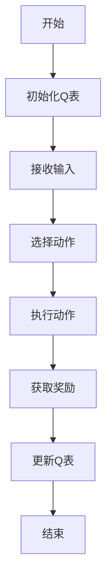
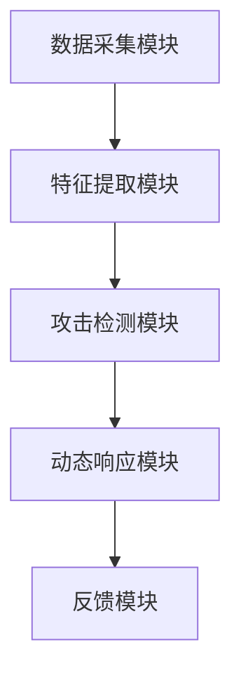

                 


# AI Agent在智能网络攻击检测中的角色

> 关键词：AI Agent，智能网络攻击检测，强化学习，图神经网络，知识图谱，网络安全

> 摘要：  
本文深入探讨了AI Agent在智能网络攻击检测中的角色，从背景介绍、核心概念到算法原理、系统架构，再到项目实战和最佳实践，全面解析AI Agent如何通过感知、决策和执行三个阶段实现智能化的网络攻击检测。文章详细分析了基于强化学习、图神经网络和知识图谱的攻击检测算法，并通过实际案例展示了AI Agent在网络安全中的应用价值。

---

# 第一部分：AI Agent与网络攻击检测概述

## 第1章：AI Agent与网络攻击检测概述

### 1.1 AI Agent的基本概念

#### 1.1.1 AI Agent的定义与特点
AI Agent（人工智能代理）是一种能够感知环境、自主决策并执行任务的智能实体。它具有以下特点：
- **自主性**：无需人工干预，能够自主完成任务。
- **反应性**：能够实时感知环境变化并做出反应。
- **学习能力**：通过数据和经验不断优化自身性能。
- **可扩展性**：能够适应不同的应用场景和复杂度。

#### 1.1.2 AI Agent的核心原理
AI Agent的核心原理包括：
1. **感知层**：通过传感器或数据采集模块获取环境信息。
2. **决策层**：基于感知到的信息，利用机器学习算法进行分析和决策。
3. **执行层**：根据决策结果执行具体操作或反馈。

#### 1.1.3 AI Agent与传统网络攻击检测的区别
传统的网络攻击检测方法通常依赖于预定义的规则或特征匹配，而AI Agent通过机器学习和大数据分析，能够实现动态适应和自我优化。

| **传统网络攻击检测** | **AI Agent网络攻击检测** |
|-----------------------|--------------------------|
| 基于规则匹配         | 基于机器学习模型       |
| 静态规则，难以应对新攻击模式 | 动态学习，适应新攻击模式 |
| 需要人工干预         | 自主决策和执行         |

---

### 1.2 网络攻击检测的背景与挑战

#### 1.2.1 网络攻击的现状与趋势
随着网络技术的快速发展，网络攻击手段日益复杂，攻击者利用零日漏洞、钓鱼攻击等手段进行攻击。传统的防御手段已难以应对日益复杂的网络威胁。

#### 1.2.2 传统网络攻击检测方法的局限性
传统的网络攻击检测方法存在以下问题：
- **误报率高**：基于规则的检测方法容易产生大量误报。
- **漏报率高**：难以检测未知的新型攻击手段。
- **响应速度慢**：需要人工干预，无法实现快速响应。

#### 1.2.3 AI Agent在网络安全中的优势
AI Agent通过以下方式弥补了传统方法的不足：
- **动态适应性**：能够实时分析网络流量，快速识别异常行为。
- **自我学习能力**：通过不断学习新的攻击模式，优化检测算法。
- **自动化响应**：能够自主决策并执行防御措施，减少人工干预。

---

### 1.3 AI Agent在智能网络攻击检测中的角色

#### 1.3.1 AI Agent作为主动防御者的角色
AI Agent能够实时监控网络流量，识别潜在的攻击行为，并在攻击发生前采取预防措施。

#### 1.3.2 AI Agent作为智能决策支持者的角色
AI Agent能够通过分析历史数据和当前网络状态，为安全管理员提供决策支持，帮助其制定更有效的防御策略。

#### 1.3.3 AI Agent作为动态适应者的角色
AI Agent能够根据网络环境的变化，动态调整自身的检测策略，适应新的攻击手段。

---

## 第2章：AI Agent的核心概念与原理

### 2.1 AI Agent的核心概念

#### 2.1.1 感知层：数据采集与特征提取
AI Agent通过网络流量分析、日志分析等方式采集数据，并提取关键特征（如流量模式、行为模式等）。

#### 2.1.2 决策层：基于AI的攻击判定
AI Agent利用机器学习算法（如随机森林、支持向量机等）对提取的特征进行分类，判断是否存在网络攻击。

#### 2.1.3 执行层：动态响应与反馈
AI Agent根据决策结果执行相应的操作（如封锁可疑IP、发送警报等），并根据反馈优化自身算法。

---

### 2.2 AI Agent的核心原理

#### 2.2.1 基于强化学习的攻击检测算法
强化学习是一种通过试错机制优化决策的算法。在攻击检测中，AI Agent可以通过强化学习不断优化其检测策略。

#### 2.2.2 基于图神经网络的攻击关联分析
图神经网络能够处理复杂的网络结构，帮助AI Agent识别跨设备的攻击关联性。

#### 2.2.3 基于知识图谱的攻击模式识别
知识图谱是一种结构化的知识表示方式，能够帮助AI Agent识别复杂的攻击模式。

---

### 2.3 AI Agent的系统架构

#### 2.3.1 分层架构设计
AI Agent的系统架构通常分为感知层、决策层和执行层。

#### 2.3.2 组件间的交互机制
感知层负责数据采集，决策层负责分析和决策，执行层负责执行操作。

#### 2.3.3 系统的可扩展性与灵活性
AI Agent的系统架构需要具备良好的扩展性和灵活性，以适应不同的网络环境和攻击手段。

---

## 第3章：AI Agent的算法原理与数学模型

### 3.1 基于强化学习的攻击检测算法

#### 3.1.1 强化学习的基本原理
强化学习通过试错机制优化决策，适用于动态变化的网络环境。

#### 3.1.2 Q-learning算法在攻击检测中的应用
Q-learning算法通过不断更新Q值，优化攻击检测的决策策略。

#### 3.1.3 算法实现的数学模型
$$ Q(s, a) = Q(s, a) + \alpha \cdot (r + \gamma \cdot \max Q(s', a') - Q(s, a)) $$

#### 3.1.4 算法流程图


---

### 3.2 基于图神经网络的攻击关联分析

#### 3.2.1 图神经网络的基本原理
图神经网络能够处理图结构数据，适用于分析网络中的关联性。

#### 3.2.2 图嵌入与节点表示学习
通过图嵌入技术，将网络中的节点（如IP地址、用户）映射到低维空间，便于后续分析。

#### 3.2.3 攻击关联分析的数学模型
$$ \text{概率相似性} = \frac{\sum_{i=1}^{n} w_{i} \cdot x_{i}}{\sum_{i=1}^{n} w_{i}} $$

---

### 3.3 基于知识图谱的攻击模式识别

#### 3.3.1 知识图谱的构建与表示
通过知识图谱构建网络攻击的知识库，帮助AI Agent识别复杂的攻击模式。

#### 3.3.2 基于图匹配的攻击模式识别
通过图匹配算法，识别网络中的异常行为模式。

---

## 第4章：AI Agent的系统架构与实现

### 4.1 问题场景介绍
假设我们有一个企业网络，需要实时检测网络中的攻击行为。

### 4.2 系统功能设计

#### 4.2.1 数据采集模块
- 负责采集网络流量数据、日志数据等。

#### 4.2.2 特征提取模块
- 提取关键特征（如流量模式、行为模式等）。

#### 4.2.3 攻击检测模块
- 利用机器学习算法进行攻击检测。

#### 4.2.4 动态响应模块
- 根据检测结果执行防御操作。

### 4.3 系统架构设计


---

## 第5章：项目实战与应用

### 5.1 环境安装
- 安装Python、TensorFlow、Keras等开发工具。

### 5.2 核心代码实现
```python
import tensorflow as tf
from tensorflow.keras import layers

model = tf.keras.Sequential([
    layers.Dense(64, activation='relu'),
    layers.Dense(1, activation='sigmoid')
])

model.compile(optimizer='adam', loss='binary_crossentropy', metrics=['accuracy'])
```

### 5.3 实际案例分析
- 通过实际网络流量数据，训练AI Agent进行攻击检测。

### 5.4 项目总结
通过本项目，我们验证了AI Agent在智能网络攻击检测中的有效性。

---

## 第6章：最佳实践与小结

### 6.1 小结
AI Agent通过感知、决策和执行三个阶段，实现了智能化的网络攻击检测。

### 6.2 注意事项
- 数据质量对AI Agent的性能影响较大，需要确保数据的完整性和准确性。
- 需要定期更新AI模型，以应对新的攻击手段。

### 6.3 拓展阅读
- 推荐阅读《机器学习实战》和《深度学习》等书籍，深入了解AI Agent的实现细节。

---

作者：AI天才研究院/AI Genius Institute & 禅与计算机程序设计艺术 /Zen And The Art of Computer Programming

