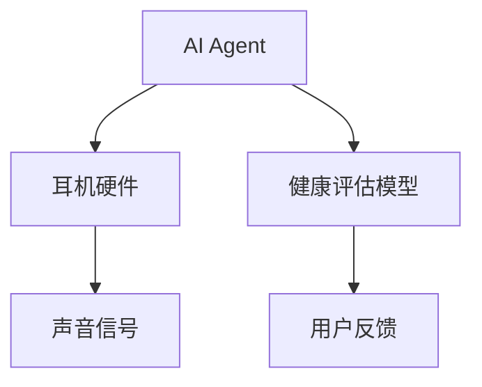
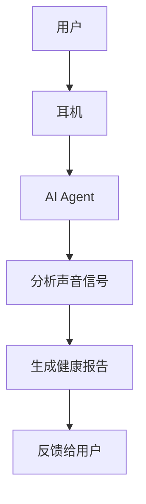
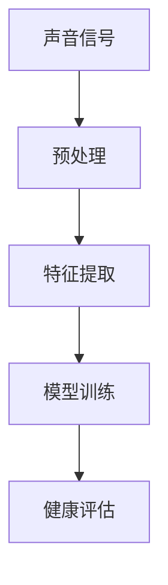
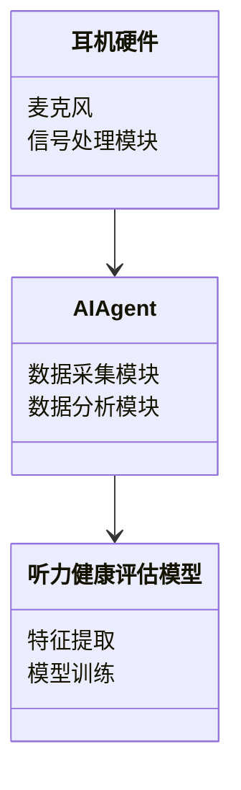
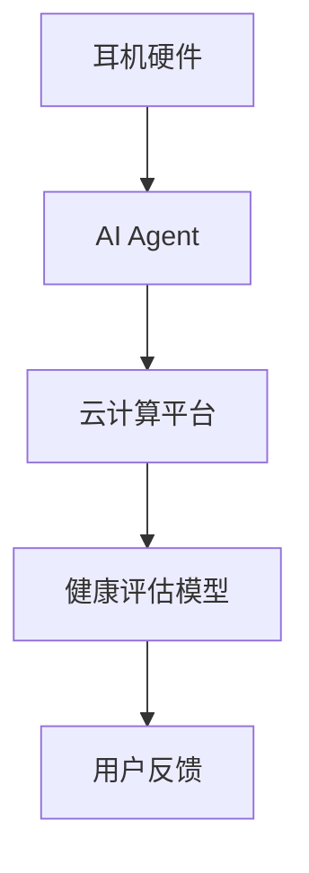

                 


# AI Agent在智能耳机中的听力健康管理

## 关键词：AI Agent，智能耳机，听力健康，健康管理，声音信号处理

## 摘要：
随着智能耳机的普及，AI Agent（人工智能代理）在听力健康管理中的应用逐渐成为研究热点。本文详细探讨了AI Agent在智能耳机中的应用，从背景介绍、核心概念、算法原理到系统架构，再到项目实战和最佳实践，全面解析了AI Agent如何助力智能耳机实现高效的听力健康管理。通过本文，读者可以深入了解AI Agent在智能耳机中的工作原理及其在实际应用中的潜力。

---

## 第1章：背景介绍

### 1.1 听力健康的重要性
听力健康是人类日常生活中不可或缺的一部分。随着年龄增长、环境噪音污染以及生活习惯的影响，听力损失问题日益突出。研究表明，早期发现和干预是延缓听力损失的关键。

#### 1.1.1 听力健康的基本概念
听力健康是指听觉系统能够正常接收和处理声音信号的能力。健康的听力系统能够分辨不同频率和强度的声音，并准确理解语言。

#### 1.1.2 听力健康问题的现状
全球约有10亿人面临听力损失的风险。由于现代社会噪音污染的加剧和人们生活习惯的改变，听力健康问题越来越受到关注。

#### 1.1.3 听力健康对生活质量的影响
听力损失不仅影响个人的沟通能力，还可能导致社交孤立、心理健康问题以及生活质量的下降。

### 1.2 AI Agent的基本概念
AI Agent是一种能够感知环境、自主决策并执行任务的智能实体。在智能耳机中，AI Agent可以通过实时分析声音信号，为用户提供个性化的听力健康管理。

#### 1.2.1 AI Agent的定义
AI Agent是具有感知、推理、学习和执行能力的智能系统，能够在特定任务中模拟人类的决策过程。

#### 1.2.2 AI Agent的核心功能
- 感知：通过传感器或数据接口获取环境信息。
- 推理：基于获取的信息进行分析和判断。
- 决策：根据推理结果制定行动方案。
- 执行：通过特定的接口或设备执行决策。

#### 1.2.3 AI Agent在智能耳机中的应用潜力
AI Agent可以实时分析耳机采集的声音信号，识别潜在的听力问题，并提供个性化的健康建议。

### 1.3 听力健康管理的智能化需求
传统听力健康管理方法存在效率低、成本高等问题。AI Agent的引入为智能耳机提供了新的解决方案。

#### 1.3.1 传统听力健康管理的局限性
- 资源消耗大：需要专业设备和人员。
- 及时性差：无法实时监测听力变化。
- 个性化不足：难以根据个体差异提供定制化服务。

#### 1.3.2 智能耳机在听力健康管理中的优势
- 实时监测：智能耳机可以实时采集和分析声音信号。
- 便捷性：用户可以随时随地进行听力监测。
- 个性化：基于AI技术提供定制化的健康管理方案。

#### 1.3.3 AI Agent在智能耳机中的角色定位
AI Agent作为智能耳机的核心模块，负责数据处理、问题识别和决策支持，为用户提供智能化的听力健康管理服务。

---

## 第2章：AI Agent在智能耳机中的核心概念与联系

### 2.1 AI Agent的核心原理
AI Agent在智能耳机中的工作原理包括声音信号处理、特征提取、模型训练和实时反馈等环节。

#### 2.1.1 AI Agent的基本工作原理
AI Agent通过传感器获取声音信号，利用算法进行分析和处理，识别潜在的听力问题，并提供相应的建议或调整耳机参数。

#### 2.1.2 AI Agent在听力健康管理中的具体实现
- 数据采集：通过麦克风采集环境声音。
- 特征提取：提取声音信号的特征，如频率、振幅等。
- 模型训练：利用机器学习算法训练听力健康评估模型。
- 实时反馈：根据分析结果实时调整耳机设置。

#### 2.1.3 AI Agent与智能耳机的结合方式
AI Agent可以嵌入智能耳机的芯片或通过云端服务进行数据处理，实现无缝集成。

### 2.2 听力健康管理的关键技术
实现高效的听力健康管理需要多种关键技术的支持。

#### 2.2.1 声音信号处理技术
声音信号处理技术包括降噪、滤波和特征提取等，用于提高声音信号的质量和准确性。

#### 2.2.2 听力损失检测算法
基于机器学习的算法可以有效识别听力损失的早期症状。

#### 2.2.3 听力健康评估模型
通过数学模型和机器学习算法，建立个性化的听力健康评估模型。

### 2.3 AI Agent与智能耳机的系统架构
系统架构设计是实现AI Agent在智能耳机中应用的关键。

#### 2.3.1 系统整体架构图


#### 2.3.2 AI Agent与耳机硬件的交互流程


#### 2.3.3 系统功能模块划分
- 数据采集模块：负责采集声音信号。
- 数据处理模块：进行特征提取和降噪处理。
- 模型训练模块：建立听力健康评估模型。
- 用户反馈模块：提供实时反馈和建议。

---

## 第3章：AI Agent的算法原理

### 3.1 听力信号处理算法
处理声音信号是AI Agent的核心任务之一。

#### 3.1.1 声音信号的采集与预处理
声音信号的采集需要高灵敏度的麦克风，预处理包括降噪和增益调整。

#### 3.1.2 声音特征提取方法
常用的声音特征包括频率、幅度、时域特征和频域特征。

#### 3.1.3 基于机器学习的声音分类算法
使用支持向量机（SVM）或随机森林（Random Forest）等算法进行声音分类。

### 3.2 听力损失检测算法
通过算法识别潜在的听力损失症状。

#### 3.2.1 基于规则的听力损失检测
根据预设的阈值判断听力损失的严重程度。

#### 3.2.2 基于机器学习的听力损失检测
利用训练好的模型进行分类和预测。

#### 3.2.3 基于深度学习的听力损失检测
使用卷积神经网络（CNN）进行声音信号的特征提取和分类。

### 3.3 听力健康评估模型
通过数学模型和机器学习算法，建立个性化的听力健康评估模型。

#### 3.3.1 模型的输入与输出
- 输入：声音信号特征。
- 输出：听力健康评估结果。

#### 3.3.2 模型的训练与优化
使用训练数据进行模型训练，并通过交叉验证进行优化。

#### 3.3.3 模型的评估与验证
通过准确率、召回率和F1分数等指标评估模型的性能。

### 3.4 算法流程图


---

## 第4章：系统分析与架构设计方案

### 4.1 问题场景介绍
在智能耳机中实现听力健康管理需要解决声音信号处理、模型训练和实时反馈等技术问题。

### 4.2 项目介绍
本项目旨在开发一个基于AI Agent的智能耳机系统，实现实时听力健康管理。

#### 4.2.1 系统功能设计
- 数据采集：通过麦克风采集声音信号。
- 数据处理：进行降噪和特征提取。
- 模型训练：建立听力健康评估模型。
- 用户反馈：提供实时反馈和建议。

#### 4.2.2 领域模型类图


#### 4.2.3 系统架构图


#### 4.2.4 系统接口设计
- 耳机与AI Agent之间的接口：负责数据传输和指令执行。
- AI Agent与云计算平台之间的接口：负责模型训练和数据存储。

#### 4.2.5 系统交互流程图


---

## 第5章：项目实战

### 5.1 环境安装
需要安装Python、NumPy、scikit-learn和TensorFlow等库。

#### 5.1.1 安装Python和相关库
```bash
pip install python numpy scikit-learn tensorflow
```

### 5.2 系统核心实现
实现AI Agent的核心功能，包括数据采集、特征提取和模型训练。

#### 5.2.1 数据采集代码
```python
import numpy as np

def collect_audio_data():
    # 采集声音信号
    data = np.random.randn(1000)
    return data

audio_data = collect_audio_data()
```

#### 5.2.2 特征提取代码
```python
from sklearn.decomposition import PCA

def extract_features(data):
    pca = PCA(n_components=3)
    features = pca.fit_transform(data.reshape(-1, 1))
    return features

features = extract_features(audio_data)
```

#### 5.2.3 模型训练代码
```python
from sklearn.svm import SVC

def train_model(features, labels):
    model = SVC()
    model.fit(features, labels)
    return model

# 假设labels为健康状态标签
labels = np.random.randint(2, size=len(features))
model = train_model(features, labels)
```

### 5.3 案例分析与解读
通过具体案例分析AI Agent在智能耳机中的实际应用效果。

#### 5.3.1 案例分析
假设一名用户长时间使用耳机，AI Agent可以实时监测其听力状态，提醒用户调整音量或休息。

#### 5.3.2 代码应用解读
通过上述代码实现AI Agent的核心功能，展示如何利用Python和机器学习库进行听力健康管理。

### 5.4 项目小结
总结项目实现的关键点和实际应用价值。

---

## 第6章：最佳实践与总结

### 6.1 小结
本文详细探讨了AI Agent在智能耳机中的应用，从理论到实践，全面解析了AI Agent在听力健康管理中的潜力和实现方法。

### 6.2 注意事项
- 数据隐私保护：确保用户数据的安全和隐私。
- 系统稳定性：保证AI Agent的稳定运行，避免影响用户体验。
- 模型优化：持续优化模型性能，提高检测准确率。

### 6.3 拓展阅读
- 推荐阅读《机器学习实战》和《深度学习入门》等书籍。
- 关注AI在医疗健康领域的最新研究和应用。

---

## 作者：AI天才研究院/AI Genius Institute & 禅与计算机程序设计艺术 /Zen And The Art of Computer Programming

---

通过本文的详细分析，读者可以深入了解AI Agent在智能耳机中的应用，掌握其实现原理和实际操作方法，为未来的智能耳机开发提供有价值的参考。

