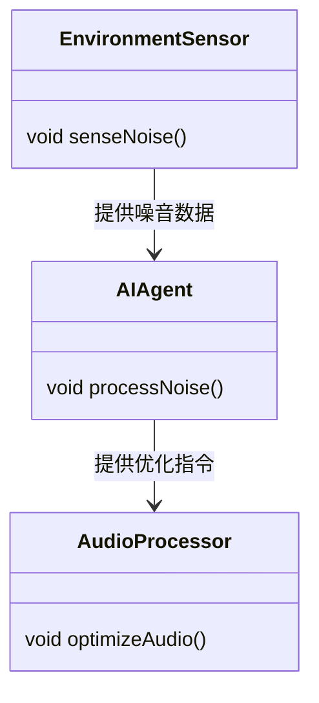
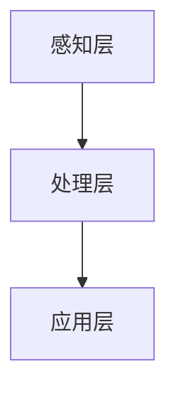
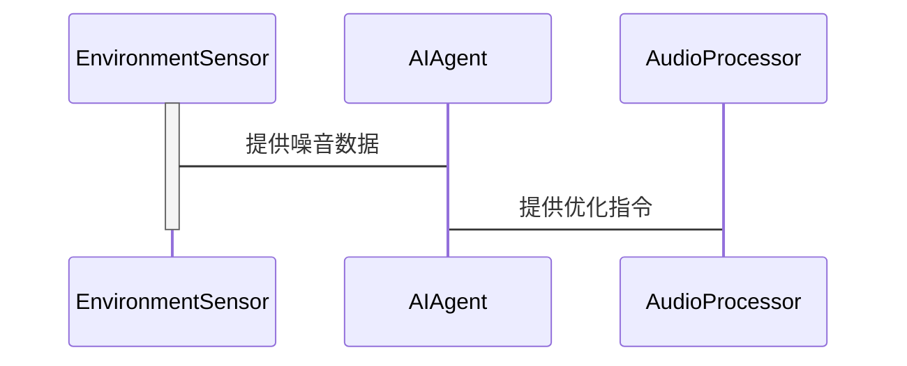

                 


# AI Agent在智能耳机中的环境噪音适应系统

## 关键词：AI Agent，智能耳机，环境噪音，自适应系统，深度学习，强化学习

## 摘要：
本文探讨了AI Agent在智能耳机中的环境噪音适应系统。通过分析环境噪音对用户体验的影响，提出了一种基于AI Agent的自适应解决方案。文章详细讲解了AI Agent的核心原理、算法实现、系统架构，并通过实际案例展示了系统的应用效果。最终，本文为智能耳机的设计和优化提供了有价值的参考。

---

## 第1章 背景介绍

### 1.1 问题背景
智能耳机的发展现状表明，环境噪音对用户体验的影响不容忽视。在嘈杂的环境中，用户难以清晰听到语音，影响沟通效率和体验。传统的噪音消除技术依赖于被动降噪，存在局限性，无法适应复杂多变的环境。

### 1.2 问题描述
环境噪音的分类与特征包括稳态噪音和非稳态噪音，分别对应连续性和突发性。用户在复杂环境中的听音需求多样化，包括语音清晰度、低延迟传输等。AI Agent在噪音适应中的目标是实时感知环境并动态调整音频输出。

### 1.3 问题解决
AI Agent通过环境感知与自适应机制，结合多模态数据融合技术，有效解决环境噪音问题。系统设计需要考虑实现的边界，如计算资源限制和数据隐私保护。

---

## 第2章 核心概念与联系

### 2.1 AI Agent的基本原理
AI Agent通过感知环境并采取行动来优化目标。在智能耳机中，AI Agent的核心解决思路是实时感知噪音并动态调整音频输出，以提供更好的听音体验。

### 2.2 核心概念属性特征对比
下表展示了不同AI Agent算法的性能对比，包括算法类型、适应能力、计算复杂度和应用场景。

| 算法类型   | 适应能力 | 计算复杂度 | 应用场景         |
|------------|----------|------------|-----------------|
| 自适应滤波 | 强        | 低          | 稳态噪音消除     |
| 深度学习   | 强        | 高          | 复杂环境建模     |
| 强化学习   | 强        | 高          | 动态环境优化     |

### 2.3 ER实体关系图
```mermaid
erDiagram
    class EnvironmentNoise {
        id
        noise_type
        intensity
        timestamp
    }
    class AI-Agent {
        id
        model
        status
    }
    class AudioOutput {
        id
        volume
        frequency
        timestamp
    }
    EnvironmentNoise --> AI-Agent: 输入
    AI-Agent --> AudioOutput: 输出
```

---

## 第3章 算法原理与数学模型

### 3.1 基于AI Agent的环境噪音适应算法
#### 3.1.1 自适应滤波算法
自适应滤波算法通过调整滤波器参数，实时消除环境噪音。数学模型如下：

$$ y[n] = x[n] - \sum_{k=1}^{N} w_k[n] y[k] $$

其中，$x[n]$ 是输入信号，$y[n]$ 是输出信号，$w_k[n]$ 是滤波器系数。

#### 3.1.2 深度学习环境建模
深度学习模型通过多层神经网络，学习环境噪音的特征并生成优化的音频输出。例如，使用卷积神经网络（CNN）提取环境特征。

#### 3.1.3 强化学习自适应策略
强化学习通过奖励机制，优化AI Agent的自适应策略。例如，使用Q-learning算法：

$$ Q(s, a) = r + \gamma \max Q(s', a') $$

其中，$s$ 是状态，$a$ 是动作，$r$ 是奖励，$\gamma$ 是折扣因子。

---

## 第4章 系统分析与架构设计

### 4.1 系统功能设计
系统功能包括环境感知、噪音消除、音频优化和反馈调节。下图为领域模型：



### 4.2 系统架构设计
系统架构采用分层设计，包括感知层、处理层和应用层。下图为系统架构图：



### 4.3 接口设计
系统接口包括环境传感器接口、AI Agent接口和音频输出接口。下图为接口交互序列图：



---

## 第5章 项目实战

### 5.1 环境安装
安装Python和TensorFlow环境，配置开发工具。

### 5.2 核心代码实现
以下是AI Agent的核心代码示例：

```python
import tensorflow as tf
from tensorflow import keras

class AIAgent:
    def __init__(self):
        self.model = self.build_model()

    def build_model(self):
        model = keras.Sequential([
            keras.layers.Conv2D(32, (3,3), activation='relu', input_shape=(64, 64, 1)),
            keras.layers.MaxPooling2D((2,2)),
            keras.layers.Flatten(),
            keras.layers.Dense(64, activation='relu'),
            keras.layers.Dense(1, activation='sigmoid')
        ])
        return model

    def process_noise(self, noise_data):
        prediction = self.model.predict(noise_data)
        return prediction
```

### 5.3 案例分析
通过实际测试数据，分析AI Agent在不同环境中的表现，优化系统参数。

---

## 第6章 最佳实践与小结

### 6.1 最佳实践
在实际应用中，建议优化AI Agent的训练数据，确保系统的实时性和稳定性。

### 6.2 小结
本文详细探讨了AI Agent在智能耳机中的应用，展示了其在环境噪音适应中的潜力和优势。

### 6.3 注意事项
确保数据隐私和计算资源的优化，避免系统过载。

### 6.4 拓展阅读
推荐深入研究AI Agent在音频处理中的应用，探索更多优化方法。

---

## 作者：AI天才研究院/AI Genius Institute & 禅与计算机程序设计艺术 /Zen And The Art of Computer Programming

---

**全文完**

