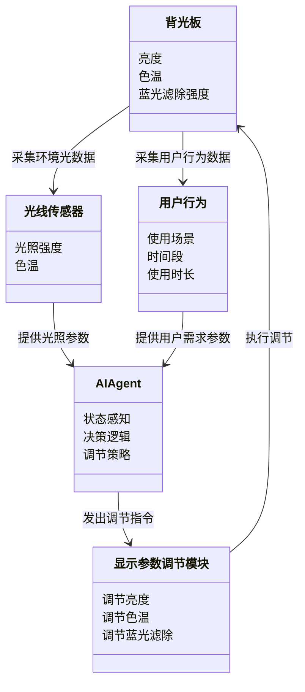
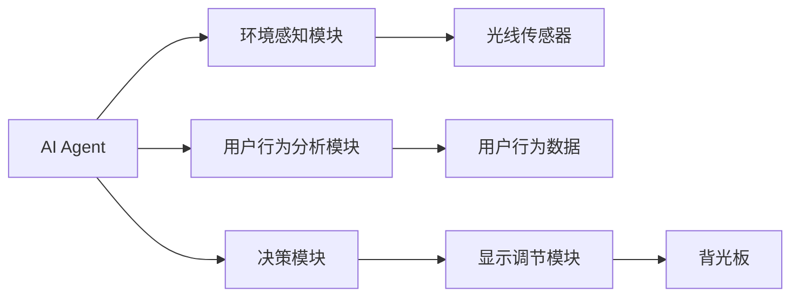
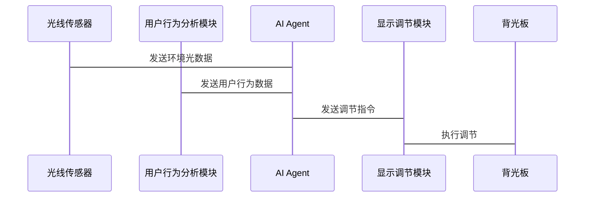

                 


好的，我将按照您的要求完成《AI Agent在智能背光板中的护眼模式调节》这篇文章的后续部分。我将按照目录大纲逐步展开，确保每个部分都详细具体，并且符合技术博客的专业性和可读性要求。

# AI Agent在智能背光板中的护眼模式调节

> 关键词：AI Agent, 智能背光板, 护眼模式, 亮度调节, 色温调节, 蓝光滤除, 动态调节

> 摘要：本文探讨AI Agent在智能背光板护眼模式调节中的应用，分析其算法原理、系统架构和实现细节。通过结合AI Agent的感知与决策能力，提出了一种动态调节护眼模式的方法，实现了智能、个性化的护眼体验。

---

## 第4章: 系统分析

### 4.1 问题场景介绍

护眼模式调节的核心问题是基于环境光线和用户需求，动态调整背光板的亮度、色温和蓝光滤除强度。AI Agent需要实时感知环境光线变化，并结合用户使用场景（如阅读、工作、娱乐等）进行智能调节。关键挑战包括：

- 环境光线变化的实时感知与建模
- 用户需求的动态识别与预测
- 多目标优化下的调节策略设计
- 系统实时性和功耗优化的平衡

### 4.2 系统功能设计

为了实现AI Agent驱动的护眼模式调节，系统需要以下核心功能模块：

1. **环境光线感知模块**：通过光线传感器实时采集环境光照强度和色温信息。
2. **用户行为识别模块**：基于用户操作数据（如屏幕亮度调整频率、使用时长等）识别用户的使用场景。
3. **AI Agent决策模块**：基于环境数据和用户需求，动态计算最优的亮度、色温和蓝光滤除参数。
4. **显示参数调节模块**：根据AI Agent的决策结果调整背光板的显示参数。

### 4.3 系统架构设计

#### 领域模型（领域模型图）



#### 系统架构图



#### 接口设计与交互流程



---

## 第5章: 项目实战

### 5.1 环境安装与配置

#### 5.1.1 硬件设备
- 背光板：支持亮度、色温调节的智能背光板。
- 光线传感器：用于采集环境光照强度和色温。
- 控制模块：用于接收AI Agent的调节指令并执行。

#### 5.1.2 软件工具
- Python编程环境：用于AI Agent算法实现。
- OpenCV：用于图像处理和光线分析。
- TensorFlow/PyTorch：用于机器学习模型训练。
- MQTT：用于设备间通信。

### 5.2 核心代码实现

#### 5.2.1 AI Agent算法实现（基于强化学习的Q-learning）

```python
import numpy as np

class AI-Agent:
    def __init__(self, state_dim, action_dim):
        self.state_dim = state_dim
        self.action_dim = action_dim
        self.Q = np.zeros((state_dim, action_dim))
    
    def perceive(self, state):
        # 状态感知：将环境光数据和用户行为数据转换为状态向量
        return state
    
    def decide(self, state):
        # 决策：基于Q-learning算法选择动作
        if np.random.rand() < 0.1:  # 探索
            return np.random.randint(self.action_dim)
        else:  # 利用
            return np.argmax(self.Q[state])
    
    def learn(self, state, action, reward):
        # 学习：更新Q值
        self.Q[state, action] = reward + 0.9 * np.max(self.Q[state])
```

#### 5.2.2 护眼模式调节实现

```python
import RPi.GPIO as GPIO  # 假设背光板使用GPIO控制
import time

class backlight_controller:
    def __init__(self):
        self.pwm = None
    
    def initialize(self, pin):
        GPIO.setmode(GPIO.BCM)
        self.pwm = GPIO.PWM(pin, 100)
        self.pwm.start(0)
    
    def set_brightness(self, brightness):
        self.pwm.ChangeDutyCycle(brightness)
    
    def cleanup(self):
        self.pwm.stop()
        GPIO.cleanup()

# 示例：基于AI Agent的亮度调节
agent = AI-Agent(state_dim=3, action_dim=5)
backlight = backlight_controller()
backlight.initialize(18)  # 假设使用GPIO 18控制背光

while True:
    state = agent.perceive([light_intensity, color_temp, usage_scenario])
    action = agent.decide(state)
    backlight.set_brightness(agent.mapping(action))  # 映射动作到亮度值
    agent.learn(state, action, reward)  # 奖励由用户反馈或系统评估提供
```

### 5.3 实际案例分析

#### 5.3.1 案例1：夜晚阅读场景
- 环境光强度：低
- 环境色温：冷
- 用户场景：阅读
- AI Agent决策：降低亮度，增加蓝光滤除，调整色温为暖色。

#### 5.3.2 案例2：白天办公场景
- 环境光强度：高
- 环境色温：暖
- 用户场景：办公
- AI Agent决策：提高亮度，减少蓝光滤除，调整色温为中性。

### 5.4 项目小结

通过实际案例可以看出，基于AI Agent的护眼模式调节能够根据环境光线和用户需求动态调整显示参数，有效减少蓝光对眼睛的伤害，提供更舒适的视觉体验。同时，AI Agent的自适应学习能力使得系统能够不断优化调节策略，进一步提升护眼效果。

---

## 第6章: 最佳实践

### 6.1 小结

本文详细探讨了AI Agent在智能背光板护眼模式调节中的应用，从算法原理到系统实现，提出了一个完整的解决方案。通过结合AI Agent的感知与决策能力，实现了动态、智能的护眼模式调节。

### 6.2 注意事项

1. **环境光照采集的准确性**：光线传感器的精度直接影响AI Agent的决策，需定期校准。
2. **用户行为数据的隐私保护**：在采集用户行为数据时，需确保用户隐私不被泄露。
3. **系统实时性的优化**：在高频率的环境光变化场景中，需优化算法的运行效率。
4. **硬件与软件的协同优化**：背光板的硬件响应速度和软件控制精度需要协同优化。

### 6.3 拓展阅读

- **相关技术**：探索更先进的AI算法（如强化学习、深度学习）在护眼模式调节中的应用。
- **领域研究**：关注计算机视觉和人机交互领域的最新研究，进一步提升护眼模式调节的效果。
- **实际应用**：将本文的方法扩展到更多智能设备中，如智能手机、平板电脑等。

---

## 附录

### 附录A: 术语表

- **AI Agent**：人工智能代理，能够感知环境并自主决策的智能体。
- **护眼模式**：通过调节屏幕亮度、色温等参数，减少蓝光对眼睛伤害的显示模式。
- **动态调节**：根据环境和用户需求实时调整显示参数。

### 附录B: 参考文献

1. Russell, S., & Norvig, P. (2010). Artificial Intelligence: A Modern Approach.
2. LeCun, Y., Bengio, Y., & Hinton, G. (2015). Deep learning.
3. Sutton, R. S., & Barto, A. G. (2018). Reinforcement learning: An introduction.

---

作者：AI天才研究院 & 禅与计算机程序设计艺术

