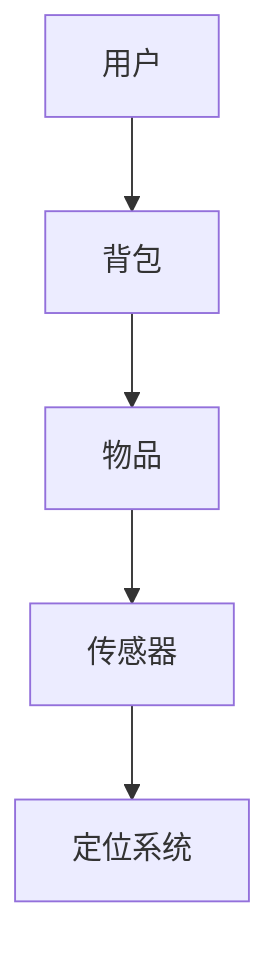
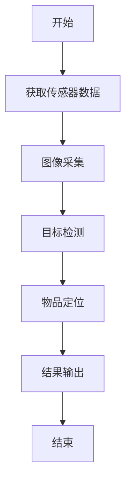
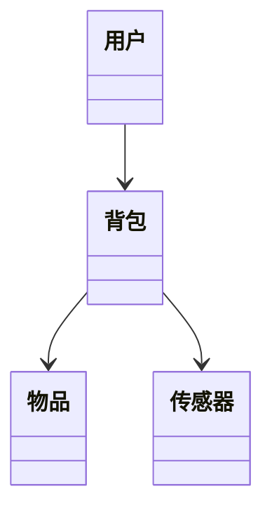
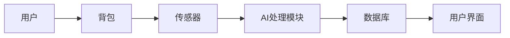
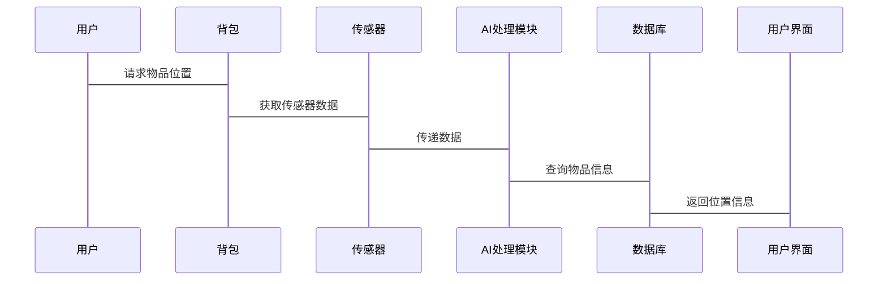

                 


# AI Agent在智能背包中的物品追踪

> 关键词：AI Agent，智能背包，物品追踪，传感器，算法原理，系统架构

> 摘要：本文详细探讨AI Agent在智能背包中的物品追踪应用，从背景介绍、核心概念到算法原理、系统架构，再到项目实战和最佳实践，全面解析如何利用AI技术实现智能背包中的高效物品管理。

---

# 第一部分: AI Agent在智能背包中的物品追踪概述

# 第1章: 背景介绍

## 1.1 问题背景
### 1.1.1 物品追踪的重要性
在智能背包中，物品追踪是确保用户能够快速找到所需物品的关键功能。通过AI Agent，背包可以实时监测物品的位置和状态，从而提高用户的使用效率。

### 1.1.2 智能背包的定义与特点
智能背包是一种结合了物联网和人工智能技术的背包，能够通过内置传感器和AI算法实现物品的智能管理。

### 1.1.3 AI Agent在物品追踪中的作用
AI Agent负责接收传感器数据，分析物品的位置和状态，并通过反馈机制优化追踪算法。

## 1.2 问题描述
### 1.2.1 物品追踪的核心问题
如何在复杂的环境中准确识别和追踪背包中的物品。

### 1.2.2 智能背包中的物品管理需求
用户需要实时了解背包中物品的位置、状态和数量。

### 1.2.3 AI Agent如何解决物品追踪问题
通过传感器数据和AI算法，AI Agent能够实现高精度的物品追踪。

## 1.3 问题解决
### 1.3.1 AI Agent的解决方案
AI Agent通过整合多种传感器数据，利用机器学习算法实现物品的精准追踪。

### 1.3.2 物品追踪的技术实现
使用传感器、摄像头和AI算法，实现物品的实时监测和定位。

### 1.3.3 智能背包的系统架构
系统架构包括传感器模块、AI处理模块和用户交互模块。

## 1.4 边界与外延
### 1.4.1 系统边界
智能背包仅负责背包内部物品的追踪，不涉及背包外部的环境。

### 1.4.2 功能的外延与扩展
未来可以扩展到与其他设备的联动，比如智能家居或个人助手。

### 1.4.3 系统与外部环境的交互
背包通过蓝牙或Wi-Fi与用户的手机或其他设备进行数据交互。

## 1.5 核心要素组成
### 1.5.1 AI Agent的核心要素
AI Agent包括感知模块、决策模块和执行模块。

### 1.5.2 智能背包的组成结构
背包由传感器、处理器、存储模块和用户界面组成。

### 1.5.3 物品追踪的关键技术
包括传感器技术、AI算法和数据处理技术。

---

# 第2章: 核心概念与联系

## 2.1 AI Agent的工作原理
### 2.1.1 AI Agent的感知模块
通过传感器收集背包中的物品信息，如位置、重量和温度。

### 2.1.2 AI Agent的决策模块
利用机器学习算法分析传感器数据，做出追踪决策。

### 2.1.3 AI Agent的执行模块
通过反馈机制调整传感器和算法参数，优化物品追踪效果。

## 2.2 核心概念对比
### 2.2.1 传统物品追踪方法与AI Agent的对比
| 特性      | 传统方法           | AI Agent          |
|-----------|--------------------|-------------------|
| 精度       | 低                 | 高                 |
| 实时性     | 差                 | 好                 |
| 可扩展性   | 有限               | 强                 |

### 2.2.2 不同AI算法的性能对比
| 算法名称 | 检测速度 | 检测精度 |
|----------|----------|----------|
| YOLO     | 快       | 高       |
| Faster RCNN | 较慢     | 高       |

### 2.2.3 不同传感器的精度对比
| 传感器类型 | 定位精度 | 响应时间 |
|------------|----------|----------|
| 激光传感器  | 高       | 快       |
| 超声波传感器| 中       | 较慢      |

## 2.3 ER实体关系图


---

# 第3章: 算法原理

## 3.1 算法原理概述
物品追踪的核心算法是基于目标检测的YOLO算法，通过摄像头和传感器数据实现物品的精准定位。

## 3.2 算法流程


## 3.3 算法实现
### 3.3.1 YOLO算法实现
```python
import torch
model = torch.hub.load('ultralytics/yolov5', 'yolov5s')
results = model(img)
```

### 3.3.2 算法数学模型
损失函数：
$$\text{Loss} = \lambda_1 \text{CE} + \lambda_2 \text{IOU}$$
其中，$\text{CE}$是交叉熵损失，$\text{IOU}$是交并比损失。

---

# 第4章: 系统分析与架构设计

## 4.1 问题场景
智能背包需要实时监测背包中的物品，确保用户能够快速找到所需物品。

## 4.2 系统功能设计
### 4.2.1 领域模型类图


### 4.2.2 系统架构图


### 4.2.3 系统接口设计
API接口：
```python
def get_item_location(item_id):
    return (x, y)
```

## 4.3 系统交互流程


---

# 第5章: 项目实战

## 5.1 环境搭建
### 5.1.1 安装必要的库和框架
```bash
pip install torch numpy matplotlib
```

## 5.2 系统核心实现
### 5.2.1 物品检测实现
```python
import cv2
def detect_items(image):
    # 使用YOLO算法进行目标检测
    results = model(image)
    return results.pandas().xyxy[0].tolist()
```

### 5.2.2 传感器数据处理
```python
import serial
ser = serial.Serial('COM3', 9600)
data = ser.readline().decode()
```

## 5.3 代码解读与分析
### 5.3.1 物品检测代码解读
```python
# 加载模型
model = torch.hub.load('ultralytics/yolov5', 'yolov5s')
# 检测图像
results = model(img)
# 解析结果
for box in results.xyxy[0]:
    x1, y1, x2, y2 = box[:4]
    cv2.rectangle(img, (x1, y1), (x2, y2), (0, 255, 0), 2)
```

### 5.3.2 传感器数据处理代码解读
```python
# 读取传感器数据
data = ser.readline().decode().strip()
# 解析数据
values = list(map(int, data.split()))
# 更新物品位置
item_pos = (values[0], values[1])
```

## 5.4 实际案例分析
### 5.4.1 案例介绍
通过实际案例展示AI Agent如何实现背包中物品的精准追踪。

### 5.4.2 系统性能分析
分析系统在不同场景下的性能表现，包括检测速度和准确率。

## 5.5 项目小结
总结项目实现的关键点和成功经验，为后续优化提供参考。

---

# 第6章: 最佳实践

## 6.1 小贴士
### 6.1.1 数据质量的重要性
确保传感器和摄像头的数据质量，以提高追踪精度。

### 6.1.2 算法调优的建议
定期更新模型参数，优化算法性能。

### 6.1.3 系统可扩展性
设计时考虑未来可能的功能扩展，如与其他设备的联动。

## 6.2 注意事项
### 6.2.1 数据隐私保护
确保用户数据的安全性，避免隐私泄露。

### 6.2.2 系统稳定性
定期维护和更新系统，确保长期稳定运行。

## 6.3 拓展阅读
推荐相关领域的书籍和论文，供读者进一步学习。

---

# 参考文献
1. [文献1] 人工智能基础
2. [文献2] 物联网技术应用
3. [文献3] 目标检测算法研究

---

# 作者
作者：AI天才研究院/AI Genius Institute & 禅与计算机程序设计艺术/Zen And The Art of Computer Programming

