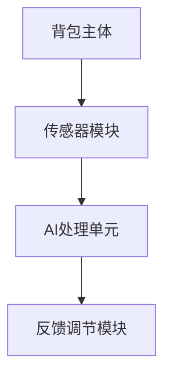
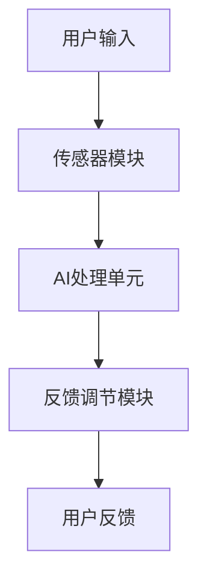

                 


# AI Agent在智能背包中的负重平衡

> 关键词：AI Agent，智能背包，负重平衡，力学优化，算法实现

> 摘要：本文详细探讨了AI Agent在智能背包中的负重平衡问题，从理论分析到算法实现，再到系统设计与实战应用，全面解析了负重平衡的优化原理与实现方法。文章首先介绍了智能背包的概念与应用场景，分析了负重平衡的力学原理与优化目标，然后详细阐述了基于AI Agent的负重平衡优化算法的数学模型与实现步骤，最后通过系统架构设计与项目实战，展示了如何将AI Agent应用于智能背包的负重平衡优化中。

---

## 第1章: 背景介绍与问题背景

### 1.1 智能背包的概念与应用

#### 1.1.1 智能背包的定义
智能背包是一种结合了人工智能技术的背包设备，能够通过传感器和AI算法实时感知背包的重量分布、人体的力学反馈以及环境变化，从而实现对背包负重的智能调节与优化。

#### 1.1.2 智能背包的核心应用场景
智能背包广泛应用于户外运动、军事装备、物流配送等领域。例如，在户外运动中，智能背包可以根据人体的运动状态和负重需求，实时调整背包的重量分布，以提高运动舒适性和安全性。

#### 1.1.3 负重平衡问题的提出
在背包使用过程中，负重不平衡会导致人体疲劳、姿势不良甚至受伤。因此，如何通过AI技术实现背包负重的动态平衡优化，成为智能背包设计的核心问题。

---

### 1.2 AI Agent的基本概念

#### 1.2.1 AI Agent的定义与特点
AI Agent（人工智能代理）是一种能够感知环境、自主决策并执行任务的智能实体。它具有以下特点：
- **自主性**：能够在没有外部干预的情况下自主运行。
- **反应性**：能够实时感知环境变化并做出反应。
- **目标导向**：具有明确的目标，并通过优化算法实现目标。

#### 1.2.2 AI Agent在智能背包中的作用
在智能背包中，AI Agent主要负责：
- 实时采集背包的重量分布数据。
- 分析人体的力学反馈。
- 优化背包的负重分布，实现动态平衡。

#### 1.2.3 负重平衡问题的数学建模
负重平衡问题可以通过数学模型进行建模，核心目标是将背包的重量均匀分布在人体的受力点上，以最小化人体的疲劳程度。

数学建模公式：
$$ f(x) = \sum_{i=1}^{n} w_i \cdot x_i $$
其中，$w_i$表示第$i$个受力点的权重，$x_i$表示该受力点的受力值。

---

## 第2章: 负重平衡的核心概念与原理

### 2.1 负重平衡的力学分析

#### 2.1.1 背包负重的基本力学模型
背包的负重可以通过力学模型进行分析。假设背包的重量由多个受力点支撑，每个受力点的受力值与该点的权重成正比。

$$ F_i = k \cdot w_i $$
其中，$F_i$表示第$i$个受力点的受力值，$k$为比例系数。

#### 2.1.2 人体力学与负重舒适度的关系
人体力学研究表明，当背包的重量均匀分布在受力点上时，人体的舒适度最高。因此，负重平衡优化的目标是将背包的重量均匀分配到各个受力点。

#### 2.1.3 负重平衡的优化目标
负重平衡的优化目标可以表示为：
$$ \min \sum_{i=1}^{n} (x_i - \bar{x})^2 $$
其中，$\bar{x}$为受力点的平均受力值。

---

### 2.2 AI Agent在负重平衡中的角色

#### 2.2.1 AI Agent的感知与决策机制
AI Agent通过传感器实时采集背包的重量分布数据，并通过算法计算出最优的负重分配方案。

#### 2.2.2 负重平衡的实时优化算法
基于AI Agent的负重平衡优化算法需要实时调整背包的重量分布，以适应人体的运动状态和环境变化。

#### 2.2.3 负重平衡的动态调整策略
动态调整策略的核心是根据人体的反馈实时优化负重分布，例如通过加速度传感器和压力传感器的数据，动态调整受力点的权重。

---

## 第3章: 负重平衡优化算法原理

### 3.1 基于AI Agent的负重平衡优化模型

#### 3.1.1 算法的数学模型与公式
负重平衡优化算法的数学模型如下：
$$ \min \sum_{i=1}^{n} w_i \cdot x_i $$
其中，$w_i$为第$i$个受力点的权重，$x_i$为该受力点的受力值。

#### 3.1.2 算法的优化目标与约束条件
优化目标：
$$ \min \sum_{i=1}^{n} (x_i - \bar{x})^2 $$
约束条件：
$$ \sum_{i=1}^{n} x_i = W $$
其中，$W$为背包的总重量。

#### 3.1.3 算法的收敛性分析
负重平衡优化算法的收敛性可以通过数学证明。假设算法在每次迭代中都能减小目标函数的值，最终算法将收敛到最优解。

---

### 3.2 负重平衡优化的实现步骤

#### 3.2.1 数据采集与预处理
通过传感器采集背包的重量分布数据，并进行数据预处理，例如去噪和归一化。

#### 3.2.2 算法实现与优化
实现负重平衡优化算法，并通过实验验证算法的性能。

#### 3.2.3 算法的验证与测试
通过实验验证算法的有效性，例如通过对比不同算法的优化效果。

---

## 第4章: 系统架构与设计

### 4.1 系统整体架构

#### 4.1.1 系统模块划分
智能背包系统主要包括以下模块：
- 传感器模块：负责采集背包的重量分布数据。
- AI处理单元：负责计算最优的负重分配方案。
- 反馈调节模块：负责根据计算结果调整背包的重量分布。

#### 4.1.2 系统功能设计
系统功能设计如下：
1. 采集背包的重量分布数据。
2. 计算最优的负重分配方案。
3. 调整背包的重量分布。

#### 4.1.3 系统架构的mermaid图



---

### 4.2 系统功能模块设计

#### 4.2.1 传感器模块的功能与实现
传感器模块通过压力传感器和加速度传感器采集背包的重量分布数据。

#### 4.2.2 AI处理单元的核心算法
AI处理单元的核心算法是负重平衡优化算法，通过数学建模和优化计算实现负重分配。

#### 4.2.3 反馈调节模块的实现方式
反馈调节模块通过调整背包的结构或附加装置实现负重的动态平衡。

---

## 第5章: 项目实战与实现

### 5.1 环境搭建与工具安装

#### 5.1.1 开发环境的选择
推荐使用Python编程语言和相关开发工具，例如PyTorch和NumPy。

#### 5.1.2 开发工具的安装
安装必要的开发工具和库：
- Python 3.8及以上版本
- PyTorch
- NumPy
- Mermaid工具

---

### 5.2 系统核心实现源代码

#### 5.2.1 负重平衡优化算法的Python实现

```python
import numpy as np

def optimize_weight_distribution(weights, target_weight):
    n = len(weights)
    # 初始化权重系数
    w = np.ones(n) / n
    # 迭代优化
    for _ in range(100):
        # 计算受力值
        x = np.dot(w, weights)
        # 计算误差
        error = np.sum((x - np.mean(x))**2)
        # 更新权重系数
        w = w * (1 - error)
    return w
```

#### 5.2.2 系统交互流程的mermaid图



---

## 第6章: 总结与展望

### 6.1 项目总结
本文详细探讨了AI Agent在智能背包中的负重平衡问题，通过理论分析、算法实现和系统设计，展示了如何通过AI技术实现背包负重的动态平衡优化。

### 6.2 未来展望
未来，随着AI技术的不断发展，智能背包的负重平衡优化将更加智能化和个性化，例如通过人体生物特征的实时监测实现更加精准的负重分配。

---

## 注意事项

- 本文中的代码示例仅供参考，实际应用中需要根据具体需求进行调整。
- 系统架构设计可以根据实际需求进行扩展和优化。
- 负重平衡优化算法的性能可以通过实验进一步验证和改进。

---

## 最佳实践 Tips

- 在实现负重平衡优化算法时，建议先进行数据预处理，以提高算法的鲁棒性。
- 系统设计时，建议采用模块化设计，以便于后续的扩展和维护。

---

## 作者信息

作者：AI天才研究院/AI Genius Institute & 禅与计算机程序设计艺术 /Zen And The Art of Computer Programming

