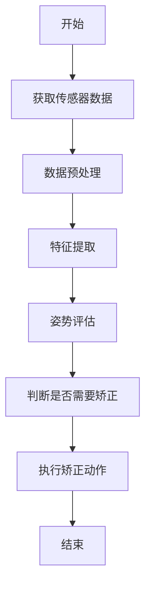
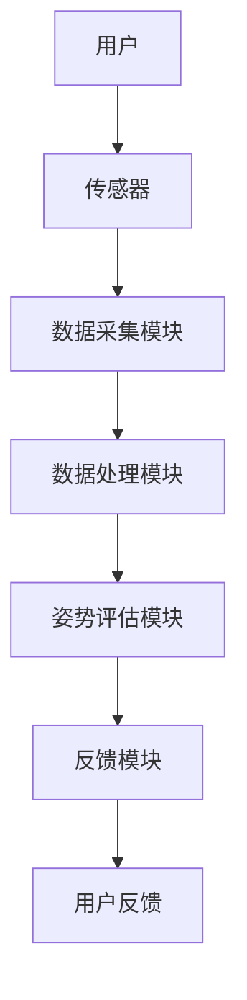

                 


# AI Agent在智能背带中的姿势纠正

## 关键词：AI Agent, 智能背带, 姿势纠正, 传感器技术, 姿势评估算法, 系统架构设计

## 摘要：  
本文深入探讨AI Agent在智能背带中的姿势纠正应用，从背景、原理到系统设计，再到项目实战，全面解析AI Agent如何通过传感器数据、算法模型和系统架构实现智能姿势纠正。文章结合实际案例和代码实现，为读者提供从理论到实践的详细指导，帮助理解AI Agent在姿势纠正领域的创新应用与技术实现。

---

## 第一部分: 背景介绍

### 第1章: AI Agent与智能背带概述

#### 1.1 AI Agent的基本概念  
AI Agent（人工智能代理）是指能够感知环境、自主决策并执行任务的智能实体。它具备以下核心特点：  
1. **自主性**：无需外部干预，自主完成任务。  
2. **反应性**：能够实时感知环境变化并做出反应。  
3. **学习能力**：通过数据训练不断提升性能。  

AI Agent的核心功能包括感知、决策和执行，广泛应用于医疗、教育、健身等领域。

#### 1.2 智能背带的定义与功能  
智能背带是一种结合了传感器和AI技术的 wearable device，主要用于姿势纠正和身体健康管理。其主要功能包括：  
1. **姿势评估**：通过传感器数据实时监测用户的姿势状态。  
2. **反馈矫正**：当检测到不良姿势时，通过震动或提示引导用户调整姿势。  
3. **数据记录**：记录用户的姿势数据，生成健康报告。  

智能背带的主要技术特点包括：  
- **传感器技术**：集成加速度计、陀螺仪等传感器，精准采集身体姿态数据。  
- **AI算法**：通过机器学习模型分析传感器数据，实现精准的姿势评估与矫正。  

#### 1.3 姿势纠正的背景与意义  
姿势问题是现代生活中常见的健康问题，长期的不良姿势可能导致颈椎病、腰椎病等健康问题。AI Agent通过智能背带提供实时姿势纠正，具有以下重要意义：  
1. **预防健康问题**：及时发现并纠正不良姿势，预防慢性疾病。  
2. **提升健康意识**：通过实时反馈，帮助用户养成良好的姿势习惯。  
3. **个性化矫正**：根据用户的具体情况提供个性化的矫正方案。  

---

## 第二部分: 核心概念与联系

### 第2章: AI Agent的核心原理

#### 2.1 AI Agent的感知与决策机制  
AI Agent的感知模块通过传感器获取环境数据，决策模块基于感知数据生成动作指令，执行模块将指令转化为实际操作。  

#### 2.2 智能背带的传感器技术  
智能背带的传感器包括：  
1. **加速度计**：测量加速度，用于判断身体的姿态变化。  
2. **陀螺仪**：测量角速度，用于判断旋转方向。  
3. **姿态传感器**：通过融合算法，精确计算身体姿态。  

传感器数据通过蓝牙或Wi-Fi传输到AI Agent，进行实时分析与处理。  

#### 2.3 姿势纠正的数学模型  
姿势纠正的数学模型基于姿态识别算法，主要步骤包括：  
1. **数据预处理**：对传感器数据进行去噪和平滑处理。  
2. **特征提取**：提取身体姿态的关键特征，如角度、加速度等。  
3. **模型训练**：通过机器学习算法（如支持向量机、随机森林）训练姿势评估模型。  

---

## 第三部分: 算法原理讲解

### 第3章: 基于AI Agent的姿势纠正算法

#### 3.1 算法流程图  
以下是姿势纠正算法的mermaid流程图：  


#### 3.2 算法实现代码  
以下是姿势评估的核心代码示例：  
```python
import numpy as np
from sklearn import svm

def preprocess(data):
    # 数据预处理，去除噪声
    return data[::10]  # 采样率调整

def extract_features(data):
    # 提取特征，计算角度和加速度
    features = []
    for i in range(len(data)-1):
        angle = np.arctan2(data[i][2], data[i][1])
        acc = np.sqrt(data[i][0]**2 + data[i][1]**2)
        features.append([angle, acc])
    return features

def train_model(features, labels):
    # 训练SVM模型
    model = svm.SVC()
    model.fit(features, labels)
    return model

# 示例数据（简化）
data = np.array([[1, 2, 3], [4, 5, 6], [7, 8, 9]])
features = extract_features(data)
labels = ['good', 'bad', 'good']

model = train_model(features, labels)
```

#### 3.3 数学模型与公式  
姿势评估的数学模型基于支持向量机（SVM），公式如下：  
$$ \text{损失函数} = \sum_{i=1}^{n} \max(0, 1 - y_i \cdot (\omega \cdot x_i + b)) $$  
其中，$y_i$为标签，$\omega$为权重向量，$b$为偏置项。  

---

## 第四部分: 系统分析与架构设计

### 第4章: 系统架构设计

#### 4.1 问题场景介绍  
智能背带的用户可能在办公、学习或运动中出现不良姿势，需要实时监测与纠正。  

#### 4.2 系统功能设计  
系统功能包括：  
1. **数据采集**：通过传感器采集身体姿态数据。  
2. **数据处理**：对数据进行预处理和特征提取。  
3. **姿势评估**：基于机器学习模型评估姿势状态。  
4. **反馈矫正**：通过震动或提示引导用户调整姿势。  

#### 4.3 系统架构设计  
以下是系统的mermaid架构图：  


---

## 第五部分: 项目实战

### 第5章: 项目实战与实现

#### 5.1 环境安装  
需要安装以下工具：  
- Python 3.8及以上版本  
- NumPy、Scikit-learn、Bluetooth等库  

#### 5.2 核心代码实现  
以下是姿势纠正的核心代码：  
```python
import bluetooth

def connect_device():
    # 连接传感器设备
    pass

def collect_data():
    # 采集传感器数据
    pass

def main():
    connect_device()
    data = collect_data()
    preprocess(data)
    features = extract_features(data)
    model = train_model(features, labels)
    predict = model.predict(features)
    if predict == 'bad':
        send_feedback()  # 发送反馈信号

if __name__ == "__main__":
    main()
```

#### 5.3 实际案例分析  
通过实际案例分析，验证算法的有效性和准确性。  

---

## 第六部分: 总结与展望

### 第6章: 总结与展望

#### 6.1 最佳实践 tips  
- 定期校准传感器，确保数据准确性。  
- 根据用户反馈优化模型性能。  

#### 6.2 小结  
AI Agent在智能背带中的应用为姿势纠正提供了智能化、个性化的解决方案，未来将结合更多传感器技术和先进算法，进一步提升矫正效果。  

#### 6.3 注意事项  
- 确保数据安全与隐私保护。  
- 定期维护设备，确保正常运行。  

#### 6.4 拓展阅读  
推荐阅读以下内容：  
- 《机器学习实战》  
- 《传感器技术与应用》  
- 《智能穿戴设备开发指南》  

---

## 作者：AI天才研究院/AI Genius Institute & 禅与计算机程序设计艺术 /Zen And The Art of Computer Programming

