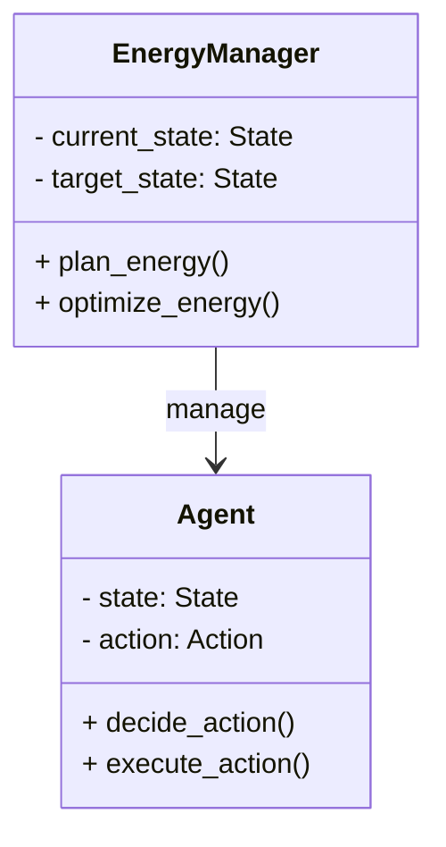

                 


# AI Agent在智能能源管理中的实践

> 关键词：AI Agent, 智能能源管理, 多智能体协作, 强化学习, 能源优化

> 摘要：本文详细探讨了AI Agent在智能能源管理中的应用，从基本概念到算法实现，再到系统设计和项目实战，全面分析了AI Agent在能源管理中的潜力和实际应用效果。通过具体案例和详细的技术分析，展示了如何利用AI技术提升能源管理效率，降低成本，实现可持续发展。

---

# 第一部分：AI Agent与智能能源管理概述

## 第1章：AI Agent与智能能源管理概述

### 1.1 AI Agent的基本概念

#### 1.1.1 AI Agent的定义与特点
AI Agent（人工智能代理）是指在计算机系统中，能够感知环境、自主决策并执行任务的智能实体。AI Agent具有以下特点：
- **自主性**：能够在没有外部干预的情况下自主运行。
- **反应性**：能够实时感知环境变化并做出响应。
- **目标导向**：通过设定目标来驱动行为。
- **学习能力**：能够通过经验优化自身的决策能力。

#### 1.1.2 AI Agent在能源管理中的应用背景
随着能源需求的增长和环境问题的加剧，传统的能源管理模式已经难以满足高效、环保的要求。AI Agent的引入为智能能源管理提供了新的可能性，特别是在能源消耗预测、设备优化控制和能源调度等领域。

#### 1.1.3 智能能源管理的核心目标与挑战
智能能源管理的核心目标是通过智能化手段实现能源的高效利用和优化配置。然而，这一过程面临以下挑战：
- **数据复杂性**：能源系统涉及大量异构数据，包括电力、热力、燃气等多种能源形式。
- **实时性要求**：能源管理需要实时响应，对系统的实时性要求极高。
- **多智能体协作**：能源系统通常涉及多个智能体的协作，需要解决通信与协调问题。

---

### 1.2 智能能源管理的现状与挑战

#### 1.2.1 当前能源管理的主要问题
传统能源管理主要依赖人工操作和固定规则，存在以下问题：
- **效率低下**：人工操作难以应对复杂多变的能源需求。
- **资源浪费**：由于缺乏实时优化，能源利用效率不高。
- **响应延迟**：面对突发情况时，响应速度较慢，可能导致能源浪费或供应不足。

#### 1.2.2 AI技术在能源管理中的优势
AI技术的应用为能源管理带来了显著优势：
- **实时优化**：通过AI算法实现能源消耗的实时预测和优化。
- **自主决策**：AI Agent能够根据实时数据自主调整能源分配策略。
- **多智能体协作**：通过多智能体协作，实现能源系统的协同优化。

#### 1.2.3 智能能源管理的未来发展趋势
未来，智能能源管理将朝着以下方向发展：
- **智能化**：进一步提升AI Agent的自主决策能力。
- **协同化**：加强多智能体协作，实现更高效的能源管理。
- **绿色化**：推动可再生能源的广泛应用，实现低碳目标。

---

## 第2章：AI Agent的核心原理

### 2.1 AI Agent的感知与决策机制

#### 2.1.1 感知层：数据采集与特征提取
感知层负责采集环境中的数据，并进行特征提取。常见的数据来源包括：
- **传感器数据**：如温度、湿度、电力消耗等。
- **历史数据**：包括过去一段时间的能源消耗记录。
- **外部数据**：如天气预报、电价波动等。

特征提取的目标是从原始数据中提取有用的信息，例如：
- **时间序列特征**：如周期性、趋势等。
- **波动特征**：如峰值、谷值等。

#### 2.1.2 决策层：策略制定与优化算法
决策层负责制定能源管理策略，常用的算法包括：
- **强化学习**：通过试错的方式优化策略。
- **监督学习**：基于历史数据进行预测和分类。
- **贪心算法**：在每一步选择局部最优解。

#### 2.1.3 执行层：动作输出与反馈机制
执行层负责根据决策层的指令输出具体的动作，例如：
- **调整电力分配**：根据预测结果调整各设备的电力供应。
- **启动备用电源**：在电力不足时启动备用电源。

反馈机制用于将执行结果反馈给感知层，形成闭环系统。

### 2.2 多智能体协作与能源管理

#### 2.2.1 多智能体系统的基本概念
多智能体系统由多个相互协作的智能体组成，每个智能体负责特定的任务，共同完成复杂的任务。

#### 2.2.2 多智能体协作在能源管理中的应用
在能源管理中，多智能体协作可以用于：
- **分布式能源管理**：多个智能体分别管理不同的区域或设备。
- **协同优化**：通过协作实现全局最优。

#### 2.2.3 多智能体协作的通信与协调机制
多智能体协作需要解决以下问题：
- **通信机制**：智能体之间如何交换信息。
- **协调机制**：如何避免冲突，实现协同决策。

### 2.3 AI Agent的数学模型与算法

#### 2.3.1 强化学习算法的基本原理
强化学习通过试错的方式优化策略，核心要素包括：
- **状态空间**：环境的状态表示。
- **动作空间**：智能体可以执行的动作。
- **奖励函数**：对智能体行为的评价。

#### 2.3.2 Q-learning算法在能源管理中的应用
Q-learning算法是一种常用的强化学习算法，适用于离散动作空间的问题。

**算法步骤**：
1. 初始化Q表为零。
2. 在每一步选择动作并执行。
3. 根据奖励更新Q值：$$ Q(s,a) = Q(s,a) + \alpha (r + \gamma \max Q(s',a')) $$
4. 重复直到收敛。

#### 2.3.3 多智能体协作算法的实现
多智能体协作算法需要解决多个智能体之间的协调问题，常用的方法包括：
- **分布式强化学习**：每个智能体独立学习，通过共享参数实现协作。
- **集中式强化学习**：通过一个中心智能体协调多个智能体的行为。

---

## 第3章：AI Agent的算法实现

### 3.1 强化学习算法的实现

#### 3.1.1 Q-learning算法的实现流程
1. 初始化Q表。
2. 与环境交互，收集状态和奖励。
3. 更新Q表。
4. 重复直到收敛。

#### 3.1.2 算法实现的代码示例
```python
import numpy as np

class QLearning:
    def __init__(self, state_space, action_space, alpha=0.1, gamma=0.9):
        self.q_table = np.zeros(state_space)
        self.alpha = alpha
        self.gamma = gamma

    def choose_action(self, state):
        return np.argmax(self.q_table[state])

    def update_q(self, state, action, reward, next_state):
        self.q_table[state][action] += self.alpha * (reward + self.gamma * np.max(self.q_table[next_state]) - self.q_table[state][action])
```

#### 3.1.3 算法实现的优化与改进
- **探索与利用平衡**：通过设置探索率（epsilon）控制随机选择动作的概率。
- **经验回放**：将历史经验存储起来，随机采样以提高学习效率。

### 3.2 多智能体协作算法的实现

#### 3.2.1 多智能体协作的基本算法
多智能体协作算法需要解决多个智能体之间的通信与协调问题，常用的方法包括：
- **分布式算法**：每个智能体独立学习，通过共享参数实现协作。
- **集中式算法**：通过一个中心智能体协调多个智能体的行为。

#### 3.2.2 多智能体协作的实现代码
```python
import numpy as np

class MultiAgent:
    def __init__(self, num_agents, state_space, action_space, alpha=0.1, gamma=0.9):
        self.agents = [QLearning(state_space, action_space, alpha, gamma) for _ in range(num_agents)]
        self.alpha = alpha
        self.gamma = gamma

    def choose_actions(self, states):
        return [agent.choose_action(state) for agent, state in zip(self.agents, states)]

    def update_Qs(self, states, actions, rewards, next_states):
        for i in range(len(self.agents)):
            self.agents[i].update_q(states[i], actions[i], rewards[i], next_states[i])
```

#### 3.2.3 多智能体协作的通信机制设计
- **直接通信**：智能体之间直接交换信息。
- **间接通信**：通过共享变量或中间节点进行通信。

### 3.3 算法实现的数学模型与公式

#### 3.3.1 Q-learning算法的数学模型
Q-learning算法的核心公式为：
$$ Q(s,a) = Q(s,a) + \alpha (r + \gamma \max Q(s',a') - Q(s,a)) $$

#### 3.3.2 多智能体协作的数学模型
在多智能体协作中，每个智能体的Q值更新公式为：
$$ Q_i(s,a) = Q_i(s,a) + \alpha (r_i + \gamma \max Q_j(s',a') - Q_i(s,a)) $$

---

## 第4章：系统分析与架构设计

### 4.1 系统功能设计

#### 4.1.1 领域模型设计
领域模型是系统功能设计的核心，通常用mermaid类图表示。



#### 4.1.2 系统架构设计
系统架构通常分为感知层、决策层和执行层。


---

## 第5章：项目实战

### 5.1 环境安装
需要安装以下环境：
- Python 3.8+
- numpy, pandas, scikit-learn
- mermaid图生成工具

### 5.2 核心代码实现

#### 5.2.1 环境数据采集与处理
```python
import pandas as pd

data = pd.read_csv('energy.csv')
data['date'] = pd.to_datetime(data['date'])
data.set_index('date', inplace=True)
```

#### 5.2.2 能源消耗预测
```python
from sklearn.model

