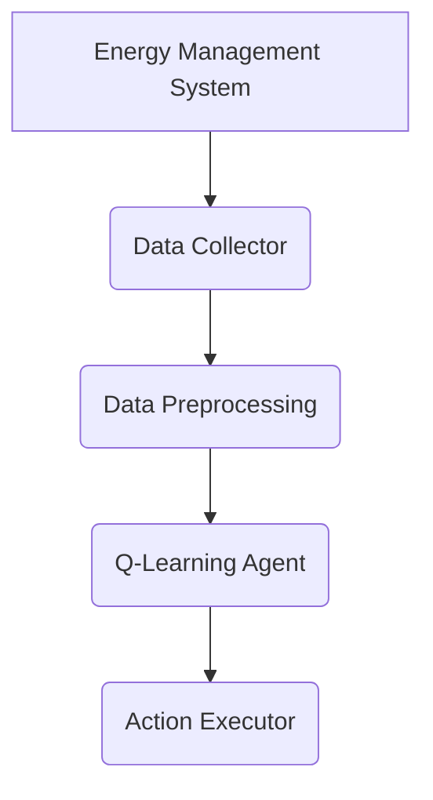

                 


# AI Agent在智能能源管理中的应用

> 关键词：AI Agent，智能能源管理，能源优化，强化学习，图神经网络，智能电网

> 摘要：本文探讨了AI Agent在智能能源管理中的应用，详细分析了AI Agent的基本概念、核心原理、系统架构以及实际应用场景。通过强化学习和图神经网络等技术，AI Agent能够实现能源系统的智能感知、决策与优化，从而提高能源利用效率，降低运营成本，并支持多能源系统的协同管理。

---

## 第一部分: AI Agent与智能能源管理基础

### 第1章: AI Agent与智能能源管理概述

#### 1.1 AI Agent的基本概念

##### 1.1.1 什么是AI Agent
AI Agent（人工智能代理）是指能够感知环境、做出决策并执行动作的智能实体。它可以是一个软件程序、一个机器人，或者是嵌入在系统中的算法。AI Agent的核心目标是通过自主学习和优化，实现特定任务的高效完成。

##### 1.1.2 AI Agent的核心特征
- **自主性**：能够在没有外部干预的情况下自主运行。
- **反应性**：能够实时感知环境变化并做出响应。
- **目标导向**：通过设定目标来指导行为和决策。
- **学习能力**：能够通过数据和经验不断优化自身的性能。

##### 1.1.3 AI Agent与传统能源管理的区别
传统的能源管理通常依赖于人工操作和固定的规则，而AI Agent能够通过数据驱动的方式，实时优化能源的使用和分配。AI Agent的引入使得能源管理系统更加智能化、自动化和高效。

---

#### 1.2 智能能源管理的背景与需求

##### 1.2.1 能源管理的定义与目标
能源管理是指通过技术手段对能源的生成、传输、分配和使用进行监控和优化，以实现能源的高效利用和成本的最小化。其目标包括减少能源浪费、降低运营成本、提高能源系统的可靠性和稳定性。

##### 1.2.2 智能能源管理的兴起
随着全球能源需求的增长和环境问题的加剧，智能能源管理逐渐成为解决能源问题的重要手段。通过引入人工智能、大数据和物联网等技术，智能能源管理能够实现能源系统的智能化运行。

##### 1.2.3 当前能源管理的挑战与痛点
- **能源浪费**：传统能源管理方式效率低下，导致能源浪费。
- **复杂性**：能源系统涉及多种能源形式和复杂的网络结构。
- **实时性**：需要快速响应能源需求的变化和突发事件。

---

#### 1.3 AI Agent在智能能源管理中的作用

##### 1.3.1 提高能源利用效率
AI Agent能够通过实时数据分析和优化算法，实现能源的高效利用，减少浪费。

##### 1.3.2 实现智能决策与优化
AI Agent能够基于实时数据和历史数据，做出最优的能源分配和调度决策。

##### 1.3.3 支持多能源系统的协同管理
AI Agent能够协调多种能源形式（如风能、太阳能、化石能源等）的协同运行，实现系统的整体优化。

---

## 第二部分: AI Agent的核心原理

### 第2章: AI Agent的感知机制

#### 2.1 数据采集与处理

##### 数据采集
AI Agent通过传感器、物联网设备等采集能源系统的实时数据，包括电压、电流、温度、湿度等。

##### 数据预处理
对采集到的数据进行清洗、归一化处理，确保数据的准确性和一致性。

##### 状态识别与分析
通过机器学习算法（如支持向量机、随机森林）对数据进行分类和聚类分析，识别系统的运行状态。

---

### 第3章: AI Agent的决策机制

#### 3.1 强化学习在AI Agent中的应用

##### 强化学习的基本原理
强化学习是一种通过试错方法来优化决策模型的技术。AI Agent通过与环境的交互，不断尝试不同的动作，以获得最大的奖励。

##### Q-learning算法的实现
```python
import numpy as np

class QLearning:
    def __init__(self, state_space, action_space, alpha=0.1, gamma=0.9):
        self.state_space = state_space
        self.action_space = action_space
        self.alpha = alpha
        self.gamma = gamma
        self.q_table = np.zeros((state_space, action_space))

    def choose_action(self, state):
        return np.argmax(self.q_table[state])

    def update_q_table(self, state, action, reward, next_state):
        self.q_table[state][action] = self.q_table[state][action] * (1 - self.alpha) + self.alpha * (reward + self.gamma * np.max(self.q_table[next_state]))
```

##### 策略梯度方法的应用
策略梯度方法通过优化决策策略的参数，直接最大化奖励函数。其核心思想是通过梯度上升法更新参数。

---

## 第三部分: AI Agent的系统架构与设计

### 第4章: 系统架构设计

#### 4.1 系统功能设计
- **数据采集模块**：负责采集能源系统的实时数据。
- **数据处理模块**：对数据进行清洗和预处理。
- **决策模块**：基于强化学习算法做出最优决策。
- **执行模块**：根据决策结果执行相应的动作。

#### 4.2 系统架构图


---

### 第5章: 项目实战

#### 5.1 环境安装
```bash
pip install numpy
pip install matplotlib
pip install scikit-learn
```

#### 5.2 核心代码实现
```python
import numpy as np
import matplotlib.pyplot as plt
from sklearn.metrics import accuracy_score

# 示例数据
X = np.linspace(-10, 10, 200)
y = 2 * X + 1 + np.random.normal(0, 2, 200)

# 训练模型
from sklearn.linear_model import LinearRegression
model = LinearRegression()
model.fit(X.reshape(-1, 1), y)

# 预测
y_pred = model.predict(X.reshape(-1, 1))

# 可视化
plt.scatter(X, y, color='blue')
plt.plot(X, y_pred, color='red')
plt.xlabel('X')
plt.ylabel('y')
plt.title('Linear Regression Model')
plt.show()

print(f"模型准确率: {accuracy_score(y, y_pred)}")
```

#### 5.3 案例分析
通过上述代码实现一个简单的线性回归模型，可以应用于能源消耗预测。通过训练模型，AI Agent能够预测未来的能源需求，并据此做出优化决策。

---

## 第四部分: 未来展望与挑战

### 第6章: 未来技术趋势

#### 6.1 技术趋势
- **多模态学习**：结合图像、文本等多种数据源，提升AI Agent的感知能力。
- **边缘计算**：通过边缘计算技术，实现能源管理的实时性和高效性。

#### 6.2 挑战与解决方案
- **数据隐私**：通过数据加密和隐私计算技术，保护能源数据的安全。
- **算法优化**：通过分布式计算和并行优化，提升算法的效率和性能。

---

## 作者信息

作者：AI天才研究院 & 禅与计算机程序设计艺术

---

这篇文章详细探讨了AI Agent在智能能源管理中的应用，从基本概念到系统设计，再到实际案例，内容丰富且具有深度。通过本文的分析，读者可以全面了解AI Agent在能源管理中的重要作用和技术实现。

