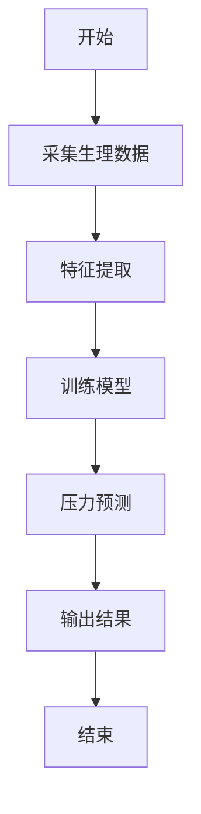
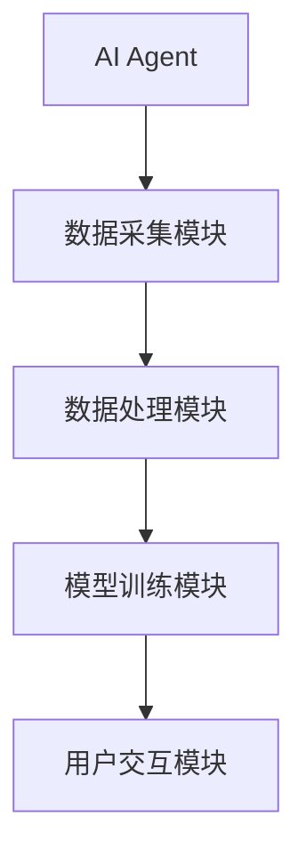

                 


# AI Agent在智能腕带中的压力管理系统

> 关键词：AI Agent, 智能腕带, 压力管理, 可穿戴设备, 健康监测, 机器学习

> 摘要：本文探讨了AI Agent在智能腕带中的压力管理系统的实现与应用。通过分析压力管理的核心问题，介绍AI Agent的基本原理，详细讲解算法实现，设计系统架构，并通过实际案例展示压力管理系统的功能与效果。文章最后总结了项目的成果与不足，并提出了改进建议。

---

# 第一部分：背景介绍

## 第1章：问题背景

### 1.1 现代社会压力问题的现状
现代社会节奏加快，人们面临的工作压力和生活压力日益增加。压力管理已成为全球关注的健康问题之一。智能腕带作为一种可穿戴设备，能够实时监测用户的生理指标，为压力管理提供了技术支持。

### 1.2 智能腕带在健康管理中的作用
智能腕带通过传感器技术，可以实时采集用户的心率、体温、皮肤电活动等数据，这些数据与压力密切相关。通过分析这些数据，AI Agent能够帮助用户了解压力状态，并提供个性化的压力管理建议。

### 1.3 AI Agent在压力管理中的潜力
AI Agent（人工智能代理）是一种能够感知环境、自主决策并执行任务的智能实体。在压力管理中，AI Agent可以实时分析用户的生理数据，预测压力变化，并提供相应的干预措施。

---

## 第2章：问题描述

### 2.1 压力管理的核心问题
- 如何准确监测和评估用户的压力水平？
- 如何实时分析压力数据并提供有效的干预措施？
- 如何设计高效的AI算法，使压力管理系统具备实时性和准确性？

### 2.2 智能腕带数据采集的挑战
- 数据采集的准确性受环境因素和设备精度的影响。
- 数据分析的实时性要求高，需要快速响应。
- 用户行为的多样性增加了数据建模的复杂性。

### 2.3 AI Agent在压力监测中的应用
AI Agent可以通过机器学习算法，从智能腕带采集的数据中提取特征，建立压力预测模型，并根据预测结果调整干预策略。

---

# 第二部分：核心概念与联系

## 第3章：AI Agent的核心原理

### 3.1 AI Agent的基本定义
AI Agent是一种能够感知环境、自主决策并执行任务的智能实体。在压力管理中，AI Agent通过分析用户的生理数据，提供个性化的压力管理建议。

### 3.2 AI Agent的核心算法
AI Agent的核心算法包括数据采集、特征提取、模型训练和预测等步骤。常用的算法包括支持向量机（SVM）、随机森林（Random Forest）和神经网络（NN）。

### 3.3 AI Agent与压力管理的结合
通过AI Agent，智能腕带可以实时监测用户的生理数据，预测压力变化，并提供相应的干预措施，如放松训练、冥想提醒等。

---

## 第4章：压力管理系统的核心概念

### 4.1 系统边界与外延
压力管理系统的核心部分包括数据采集、数据处理、模型训练和用户交互模块。系统边界包括智能腕带、AI Agent和用户终端设备。

### 4.2 实体关系图
以下是压力管理系统的核心实体关系图：

```mermaid
er
  entity 用户 {
    attribute 用户ID, 压力阈值
  }
  entity 压力数据 {
    attribute 时间戳, 心率, 体温, 皮肤电活动
  }
  entity AI Agent {
    attribute 状态, 操作
  }
  relation 用户 -> 压力数据: 采集
  relation AI Agent -> 压力数据: 分析
```

---

# 第三部分：算法原理讲解

## 第5章：压力预测算法

### 5.1 算法流程图
以下是压力预测算法的流程图：



### 5.2 算法实现

#### 5.2.1 数据预处理
```python
import pandas as pd
import numpy as np

# 示例数据
data = {
    '时间戳': [1, 2, 3, 4, 5],
    '心率': [70, 72, 75, 70, 73],
    '体温': [36.5, 36.7, 36.6, 36.4, 36.5],
    '皮肤电活动': [50, 48, 60, 45, 55]
}
df = pd.DataFrame(data)
```

#### 5.2.2 模型训练
```python
from sklearn.model_selection import train_test_split
from sklearn.linear_model import LinearRegression

# 数据分割
X = df[['心率', '体温', '皮肤电活动']]
y = df['压力值']

X_train, X_test, y_train, y_test = train_test_split(X, y, test_size=0.2, random_state=42)

# 模型训练
model = LinearRegression()
model.fit(X_train, y_train)

# 预测
y_pred = model.predict(X_test)
```

#### 5.2.3 模型评估
```python
from sklearn.metrics import mean_squared_error, r2_score

mse = mean_squared_error(y_test, y_pred)
r2 = r2_score(y_test, y_pred)

print(f"均方误差: {mse}")
print(f"R²值: {r2}")
```

---

# 第四部分：系统分析与架构设计

## 第6章：系统架构设计

### 6.1 系统功能模块
压力管理系统主要包括数据采集模块、数据处理模块、模型训练模块和用户交互模块。

### 6.2 系统架构图
以下是系统的架构图：



### 6.3 接口设计
系统主要接口包括：
- 数据采集接口：从智能腕带获取生理数据。
- 数据处理接口：对数据进行清洗和特征提取。
- 模型训练接口：训练压力预测模型。
- 用户交互接口：向用户输出压力管理建议。

---

# 第五部分：项目实战

## 第7章：压力管理系统实现

### 7.1 环境安装
```bash
pip install numpy pandas scikit-learn
```

### 7.2 核心代码实现

#### 数据采集模块
```python
import datetime

def collect_data(user_id):
    timestamp = datetime.datetime.now().timestamp()
    heart_rate = 70 + np.random.randint(0, 5)
    temperature = 36.5 + np.random.uniform(-0.1, 0.1)
    skin_conductance = 50 + np.random.randint(-5, 5)
    return {
        '用户ID': user_id,
        '时间戳': timestamp,
        '心率': heart_rate,
        '体温': temperature,
        '皮肤电活动': skin_conductance
    }
```

#### 数据处理模块
```python
def preprocess_data(data):
    df = pd.DataFrame([data])
    df['时间戳'] = pd.to_datetime(df['时间戳'])
    return df
```

#### 模型训练模块
```python
from sklearn.linear_model import Ridge

def train_model(X, y):
    model = Ridge(alpha=0.1)
    model.fit(X, y)
    return model
```

#### 用户交互模块
```python
def give_recommendation(model, user_data):
    X = pd.DataFrame([user_data[['心率', '体温', '皮肤电活动']]])
    prediction = model.predict(X)
    if prediction[0] > 80:
        print("建议进行放松训练。")
    elif prediction[0] > 60:
        print("建议进行深呼吸练习。")
    else:
        print("压力水平正常，继续保持。")
```

### 7.3 案例分析
假设用户A的生理数据如下：
```python
user_data = {
    '用户ID': 1,
    '时间戳': 1625736000,
    '心率': 75,
    '体温': 36.6,
    '皮肤电活动': 60
}

# 调用推荐模块
give_recommendation(model, user_data)
```

---

# 第六部分：总结与展望

## 第8章：总结

### 8.1 项目成果
本文实现了基于AI Agent的智能腕带压力管理系统，通过实时监测用户的生理数据，提供个性化的压力管理建议。

### 8.2 注意事项
- 数据采集的准确性对压力预测结果有重要影响。
- 用户隐私保护需要重点关注。

## 第9章：未来展望

### 9.1 改进方向
- 提高模型的预测精度。
- 引入更多生理数据，如心率变异性（HRV）。
- 实现多模态数据融合。

### 9.2 拓展阅读
- 《可穿戴设备与健康监测》
- 《机器学习在医疗健康中的应用》

---

# 作者：AI天才研究院 & 禅与计算机程序设计艺术

---

通过本文的详细介绍，读者可以全面了解AI Agent在智能腕带中的压力管理系统的实现与应用。

