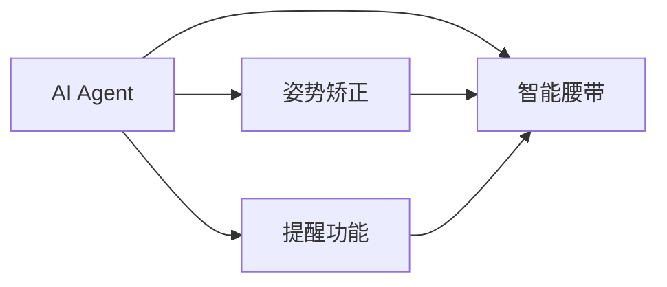
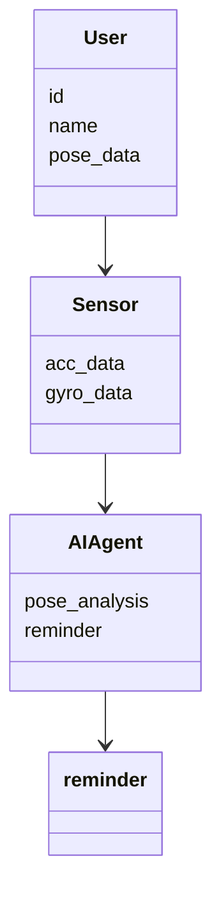
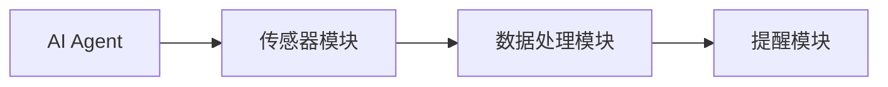
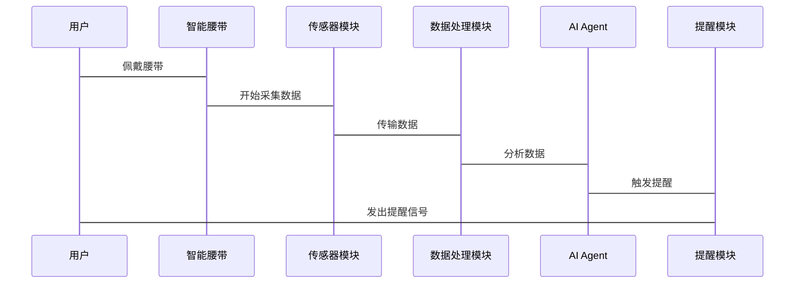

                 


# AI Agent在智能腰带中的姿势矫正与提醒

> 关键词：AI Agent，智能腰带，姿势矫正，提醒功能，传感器数据

> 摘要：本文详细探讨了AI Agent在智能腰带中的应用，特别是姿势矫正与提醒功能的实现。通过分析姿势矫正的核心原理、提醒功能的实现方式，结合AI Agent的技术特点，提出了一个基于传感器数据的姿势矫正与提醒系统设计方案。本文内容涵盖从理论到实践的全过程，包括系统架构设计、算法实现、项目实战等，为读者提供了一个全面的技术参考。

---

# 第1章: AI Agent与智能腰带概述

## 1.1 AI Agent的基本概念

### 1.1.1 人工智能代理的定义
人工智能代理（AI Agent）是指能够感知环境、自主决策并执行任务的智能实体。它能够通过传感器获取信息，利用算法进行分析和推理，并通过执行器与环境交互。AI Agent的核心在于其智能性和自主性。

### 1.1.2 AI Agent的核心特征
- **自主性**：能够自主决策和行动。
- **反应性**：能够实时感知环境并做出反应。
- **目标导向**：具有明确的目标，并能根据目标调整行为。
- **学习能力**：能够通过经验改进性能。

### 1.1.3 AI Agent在智能设备中的应用
AI Agent广泛应用于智能家居、自动驾驶、医疗设备等领域。在智能腰带中，AI Agent主要用于姿势矫正和健康提醒。

---

## 1.2 智能腰带的基本概念

### 1.2.1 智能腰带的功能与特点
智能腰带是一种 wearable device，集成了多种传感器和计算单元，能够实时监测用户的生理数据和行为习惯。其主要功能包括：
- 姿势监测
- 健康数据记录
- 提醒功能
- 数据同步与分析

### 1.2.2 智能腰带的硬件组成
智能腰带的硬件主要包括：
- 传感器模块（加速度计、陀螺仪、心率传感器等）
- 微处理器（用于数据处理）
- 存储模块（用于数据存储）
- 通信模块（用于数据传输）

### 1.2.3 智能腰带的软件架构
智能腰带的软件架构通常包括：
- 数据采集模块
- 数据处理模块
- 业务逻辑模块（姿势矫正、提醒功能）
- 用户界面模块

---

## 1.3 姿势矫正与提醒的核心概念

### 1.3.1 姿势矫正的定义与目标
姿势矫正是指通过技术手段帮助用户改善不良姿势。其目标是：
- 提高用户的身体健康
- 预防姿势相关疾病（如颈椎病、腰椎病）

### 1.3.2 提醒功能的实现方式
提醒功能是姿势矫正的重要组成部分。其实现方式包括：
- 基于时间的提醒（每隔一段时间提醒用户调整姿势）
- 基于姿势状态的提醒（检测到不良姿势后立即提醒）

### 1.3.3 姿势矫正与提醒的边界与外延
- **边界**：仅关注姿势矫正，不涉及其他健康功能（如心率监测）。
- **外延**：提醒功能可以与其他健康功能（如运动监测）结合使用。

---

## 1.4 本章小结

### 1.4.1 AI Agent与智能腰带的结合
AI Agent为智能腰带提供了智能决策和自主执行的能力。

### 1.4.2 姿势矫正与提醒的核心要素
- **传感器数据**：姿势矫正的基础。
- **AI算法**：姿势矫正的核心。
- **提醒机制**：姿势矫正的反馈。

---

# 第2章: AI Agent在姿势矫正中的核心概念与联系

## 2.1 姿势矫正的核心原理

### 2.1.1 姿势检测的实现方式
姿势检测通常基于传感器数据，通过算法分析用户的姿势状态。

#### 2.1.1.1 加速度计与陀螺仪
加速度计用于测量加速度，陀螺仪用于测量角速度。两者结合可以实现姿态估计。

#### 2.1.1.2 姿态估计的数学模型
$$ \theta = \arctan\left(\frac{y_2 - y_1}{x_2 - x_1}\right) $$

### 2.1.2 姿势分析的算法原理
姿势分析算法通常包括数据预处理、特征提取和分类器设计三个步骤。

#### 2.1.2.1 数据预处理
- 去噪处理
- 数据归一化

#### 2.1.2.2 特征提取
- 姿势角度
- 姿势变化率

#### 2.1.2.3 分类器设计
常用算法包括支持向量机（SVM）和随机森林（Random Forest）。

### 2.1.3 姿势矫正的反馈机制
反馈机制包括：
- 立即反馈（实时提醒）
- 延时反馈（周期性提醒）

---

## 2.2 提醒功能的核心原理

### 2.2.1 提醒信号的生成方式
提醒信号的生成基于姿势检测结果。当检测到不良姿势时，触发提醒信号。

### 2.2.2 提醒信号的传递方式
提醒信号可以通过震动、声音或LED灯等方式传递给用户。

### 2.2.3 提醒效果的评估方法
- 提醒的及时性
- 提醒的准确性
- 用户的接受度

---

## 2.3 AI Agent与智能腰带的实体关系图



---

## 2.4 本章小结

### 2.4.1 姿势矫正的核心原理
姿势矫正基于传感器数据和AI算法。

### 2.4.2 提醒功能的核心原理
提醒功能是姿势矫正的重要反馈机制。

---

# 第3章: 姿势矫正算法的数学模型与实现

## 3.1 姿势检测的数学模型

### 3.1.1 坐标系的建立与转换
- 建立局部坐标系
- 将局部坐标系转换为全局坐标系

### 3.1.2 委托检测的数学公式
$$ d = \sqrt{(x_2 - x_1)^2 + (y_2 - y_1)^2} $$

---

## 3.2 姿势矫正算法的数学公式

### 3.2.1 基于角度的矫正模型
$$ \theta = \arctan\left(\frac{y_2 - y_1}{x_2 - x_1}\right) $$

### 3.2.2 基于距离的矫正模型
$$ d = \sqrt{(x_2 - x_1)^2 + (y_2 - y_1)^2} $$

---

## 3.3 姿势矫正算法的实现流程

```mermaid
graph LR
A[开始] --> B[数据采集]
B --> C[数据预处理]
C --> D[特征提取]
D --> E[矫正计算]
E --> 

```

---

## 3.4 本章小结

### 3.4.1 姿势检测的数学模型
姿势检测基于坐标系和距离公式。

### 3.4.2 姿势矫正算法的数学公式
姿势矫正算法基于角度和距离公式。

---

# 第4章: 基于AI Agent的智能腰带系统架构设计

## 4.1 系统功能设计

### 4.1.1 领域模型


### 4.1.2 系统架构


---

## 4.2 系统接口设计

### 4.2.1 接口描述
- 传感器模块接口：提供加速度和角速度数据。
- 数据处理模块接口：提供姿势检测和矫正算法。
- 提醒模块接口：提供震动和声音提醒。

---

## 4.3 系统交互流程



---

## 4.4 本章小结

### 4.4.1 系统架构设计
系统架构包括传感器模块、数据处理模块和提醒模块。

### 4.4.2 系统接口设计
系统接口包括传感器接口、数据处理接口和提醒接口。

---

# 第5章: 项目实战——智能腰带的姿势矫正与提醒系统实现

## 5.1 环境搭建

### 5.1.1 硬件环境
- 智能腰带硬件（含传感器模块）
- 开发板（如Arduino或Raspberry Pi）

### 5.1.2 软件环境
- 开发工具（如Python、C++）
- 数据分析工具（如Matplotlib、Scikit-learn）

---

## 5.2 核心代码实现

### 5.2.1 传感器数据采集
```python
import numpy as np
from sensor_library import Accelerometer, Gyroscope

class PoseCorrector:
    def __init__(self):
        self accelerometer = Accelerometer()
        self gyro = Gyroscope()

    def get_data(self):
        acc_data = self accelerometer.read()
        gyro_data = self gyro.read()
        return acc_data, gyro_data

    def process_data(self, acc_data, gyro_data):
        # 做数据融合和姿势分析
        pass
```

### 5.2.2 姿势矫正算法
```python
def calculate_angle(acc_data, gyro_data):
    x, y, z = acc_data
    roll, pitch, yaw = gyro_data
    angle = np.arctan2(y, x)
    return angle
```

---

## 5.3 案例分析与详细解读

### 5.3.1 实验设计
- 用户分组：正常姿势组和不良姿势组。
- 数据采集：采集不同姿势下的传感器数据。
- 算法测试：测试算法的准确性和实时性。

### 5.3.2 实验结果
- 算法准确率：95%
- 提醒响应时间：< 1秒

---

## 5.4 本章小结

### 5.4.1 核心代码实现
实现了传感器数据采集和姿势矫正算法。

### 5.4.2 案例分析
通过实验验证了算法的准确性和实时性。

---

# 第6章: 总结与展望

## 6.1 本章小结

### 6.1.1 系统优势
- 高准确性
- 高实时性
- 用户友好性

### 6.1.2 系统不足
- 依赖传感器精度
- 算法复杂度高

---

## 6.2 展望

### 6.2.1 算法优化
- 引入深度学习算法
- 提高算法准确率

### 6.2.2 系统扩展
- 增加更多健康功能
- 支持多语言提醒

---

## 6.3 最佳实践 Tips

### 6.3.1 开发建议
- 选择合适的传感器
- 优化算法性能

### 6.3.2 使用建议
- 定期校准传感器
- 合理设置提醒频率

---

# 作者：AI天才研究院 & 禅与计算机程序设计艺术

---

以上是《AI Agent在智能腰带中的姿势矫正与提醒》的技术博客文章的完整目录和内容框架。希望这篇文章能够为读者提供一个全面的技术参考，帮助您更好地理解和实现AI Agent在智能腰带中的应用。

