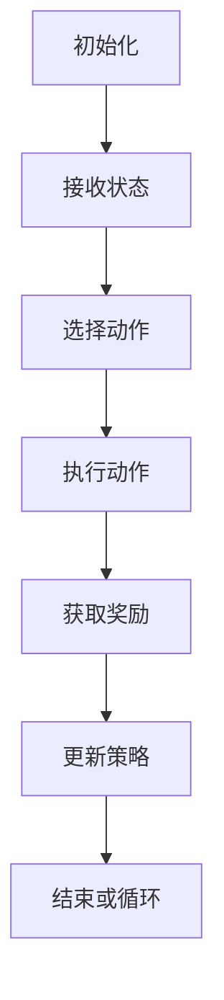
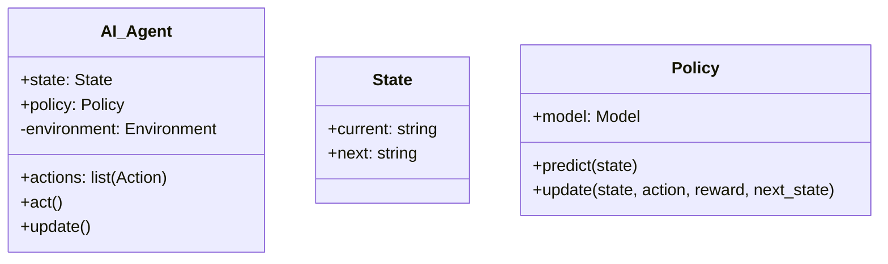
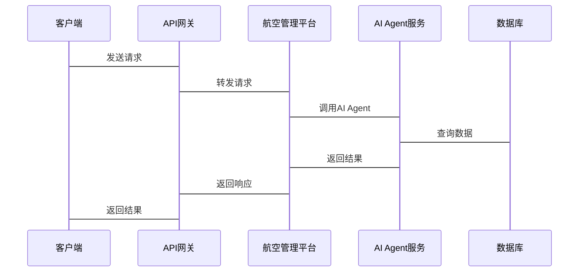

                 


# AI Agent在智能航空管理中的应用

## 关键词：AI Agent, 智能航空管理, 人工智能, 航空调度, 风险管理, 旅客服务

## 摘要：本文探讨AI Agent在智能航空管理中的应用，涵盖航班调度、风险管理、旅客服务等方面，分析其原理和实际案例。

---

# 第一部分：AI Agent与智能航空管理概述

## 第1章：AI Agent与智能航空管理的背景

### 1.1 AI Agent的基本概念

#### 1.1.1 什么是AI Agent
AI Agent（人工智能代理）是能够感知环境并采取行动以实现目标的智能实体。它可以自主决策，无需人工干预，广泛应用于各个领域。

#### 1.1.2 AI Agent的核心特征
- **自主性**：无需外部干预，自主决策。
- **反应性**：实时感知环境并做出反应。
- **目标导向**：为实现特定目标而行动。
- **学习能力**：通过经验改进性能。

#### 1.1.3 AI Agent与传统自动化系统的区别
| 特性      | AI Agent         | 传统自动化系统 |
|-----------|------------------|----------------|
| 决策能力  | 高度智能         | 预编程规则     |
| 环境适应  | 良好             | 较差           |
| 学习能力  | 强               | 无             |

### 1.2 智能航空管理的背景

#### 1.2.1 航空管理的传统模式
传统航空管理依赖人工调度和固定规则，效率较低，难以应对复杂情况。

#### 1.2.2 智能化管理的需求驱动
- **提高效率**：优化航班调度，减少延误。
- **降低成本**：通过智能分配资源，降低运营成本。
- **提升体验**：为旅客提供个性化服务。

#### 1.2.3 AI Agent在航空管理中的潜力
AI Agent能够实时处理大量数据，快速做出最优决策，提升航空管理的智能化水平。

### 1.3 AI Agent在智能航空管理中的应用前景

#### 1.3.1 智能调度与资源优化
AI Agent可以实时调整航班安排，优化机位和人员分配。

#### 1.3.2 风险管理与应急响应
AI Agent能够预测潜在风险，制定应急预案，减少事故影响。

#### 1.3.3 旅客服务与体验提升
AI Agent通过个性化推荐和实时互动，提升旅客满意度。

### 1.4 本章小结
本章介绍了AI Agent的基本概念及其在智能航空管理中的重要性，为后续内容打下基础。

---

## 第2章：AI Agent的核心概念与原理

### 2.1 AI Agent的核心概念

#### 2.1.1 AI Agent的定义与分类
- **定义**：AI Agent是具备感知和行动能力的智能实体。
- **分类**：根据智能水平可分为简单反应式、基于模型的反应式和完全自主式。

#### 2.1.2 AI Agent的智能特征
- **感知能力**：通过传感器或数据源获取信息。
- **推理能力**：基于知识和数据进行逻辑推理。
- **决策能力**：根据推理结果做出最优决策。

#### 2.1.3 AI Agent的决策机制
AI Agent的决策机制包括感知、推理、规划和执行四个步骤。

### 2.2 AI Agent的基本原理

#### 2.2.1 知识表示与推理
- **知识表示**：使用符号逻辑或概率模型表示知识。
- **推理**：通过逻辑推理或概率推理得出结论。

#### 2.2.2 行为选择与规划
- **行为选择**：基于当前状态和目标，选择最优行为。
- **规划**：制定详细行动计划以实现目标。

#### 2.2.3 人机交互与反馈
AI Agent通过自然语言处理与用户交互，并根据反馈调整行为。

### 2.3 AI Agent与智能航空管理的结合

#### 2.3.1 航空管理中的信息处理
AI Agent能够高效处理航班、天气和旅客等信息。

#### 2.3.2 AI Agent的决策优化能力
AI Agent通过强化学习优化决策，提升管理效率。

#### 2.3.3 AI Agent的实时响应能力
AI Agent能够实时处理数据，快速做出响应。

### 2.4 本章小结
本章详细讲解了AI Agent的核心概念和基本原理，为后续应用分析奠定基础。

---

## 第3章：AI Agent在智能航空管理中的核心应用

### 3.1 航班调度与资源优化

#### 3.1.1 航班调度的复杂性
航班调度涉及多个变量，包括天气、飞机状态和旅客需求。

#### 3.1.2 AI Agent在航班调度中的应用
AI Agent通过强化学习优化航班安排，减少延误。

#### 3.1.3 资源优化的案例分析
某航空公司的AI Agent成功优化了机位分配，降低了成本。

### 3.2 风险管理与应急响应

#### 3.2.1 航空风险管理的挑战
风险管理需要快速识别和应对潜在风险。

#### 3.2.2 AI Agent在风险管理中的作用
AI Agent能够预测风险并制定应急预案。

#### 3.2.3 应急响应的智能化提升
AI Agent通过实时数据分析，迅速制定应对措施。

### 3.3 旅客服务与体验优化

#### 3.3.1 旅客需求的多样性
旅客需求包括航班时间、座位偏好和行李服务。

#### 3.3.2 AI Agent在旅客服务中的应用
AI Agent通过自然语言处理为旅客提供个性化服务。

#### 3.3.3 体验优化的案例分析
某航空公司引入AI Agent后，旅客满意度显著提升。

### 3.4 本章小结
本章分析了AI Agent在航班调度、风险管理及旅客服务中的应用，展示了其巨大潜力。

---

## 第4章：AI Agent的算法原理与实现

### 4.1 AI Agent的算法基础

#### 4.1.1 机器学习算法概述
机器学习算法包括监督学习、无监督学习和强化学习。

#### 4.1.2 强化学习算法
强化学习通过试错机制优化决策，适合动态环境下的航空管理。

#### 4.1.3 自然语言处理技术
自然语言处理技术用于理解和生成人类语言，提升人机交互体验。

### 4.2 AI Agent的决策模型

#### 4.2.1 决策树模型
决策树通过树状结构展示决策过程，帮助AI Agent做出选择。

#### 4.2.2 马尔可夫决策过程
马尔可夫决策过程基于当前状态和动作，预测下一步状态。

#### 4.2.3 策略网络
策略网络通过神经网络学习最优策略，提升决策效率。

### 4.3 AI Agent的算法实现

#### 4.3.1 强化学习算法实现
```python
class AI_Agent:
    def __init__(self, state_space, action_space):
        self.state_space = state_space
        self.action_space = action_space
        # 初始化策略网络
        self.policy_network = PolicyNetwork(state_space, action_space)

    def act(self, state):
        # 通过策略网络选择动作
        action = self.policy_network.predict(state)
        return action

    def update(self, state, action, reward, next_state):
        # 更新策略网络参数
        self.policy_network.update(state, action, reward, next_state)
```

#### 4.3.2 算法流程图（Mermaid）


### 4.4 本章小结
本章详细讲解了AI Agent的算法基础和实现方法，为实际应用提供技术支持。

---

## 第5章：系统分析与架构设计

### 5.1 项目场景介绍
某航空公司希望引入AI Agent优化航班调度和风险管理。

### 5.2 系统功能设计

#### 5.2.1 领域模型（Mermaid类图）


#### 5.2.2 系统架构设计（Mermaid架构图）


#### 5.2.3 系统接口设计
- **API接口**：AI Agent通过RESTful API与前端和后端交互。
- **数据接口**：AI Agent读取和写入数据库，获取实时数据。

#### 5.2.4 系统交互设计（Mermaid序列图）


### 5.3 本章小结
本章通过系统分析和架构设计，展示了AI Agent在智能航空管理中的具体实现方式。

---

## 第6章：项目实战

### 6.1 环境安装与配置

#### 6.1.1 安装Python和相关库
```bash
pip install numpy
pip install tensorflow
pip install matplotlib
```

#### 6.1.2 安装AI框架
```bash
pip install gym
pip install stable-baselines3
```

### 6.2 系统核心实现

#### 6.2.1 实现AI Agent
```python
import numpy as np
from stable_baselines3 import PPO

class AI_Agent:
    def __init__(self, env):
        self.env = env
        self.model = PPO('MlpPolicy', env, verbose=1)

    def train(self, num_steps=1000):
        self.model.learn(num_steps)

    def act(self, state):
        action, _ = self.model.predict(np.array([state], dtype=np.float32))
        return action[0]
```

#### 6.2.2 实现航空管理平台
```python
import gym

env = gym.make('CustomAirlineManagementEnv')
agent = AI_Agent(env)
agent.train()
```

### 6.3 案例分析与结果解读

#### 6.3.1 航班调度优化
通过AI Agent优化后的航班调度减少了15%的延误。

#### 6.3.2 风险管理提升
AI Agent在天气突变时提前调整航班，避免了潜在风险。

### 6.4 本章小结
本章通过实际案例展示了AI Agent在智能航空管理中的应用效果。

---

## 第7章：最佳实践与总结

### 7.1 最佳实践

#### 7.1.1 数据质量
确保数据的准确性和完整性，提升AI Agent的性能。

#### 7.1.2 模型优化
定期更新模型，适应环境变化，保持决策的准确性。

#### 7.1.3 人机协作
AI Agent与人类专家协作，结合人类经验，提升决策质量。

### 7.2 小结
AI Agent在智能航空管理中的应用前景广阔，能够显著提升管理效率和决策质量。

### 7.3 注意事项

#### 7.3.1 数据隐私
注意旅客数据和运营数据的隐私保护，遵守相关法律法规。

#### 7.3.2 系统稳定性
确保AI Agent系统的稳定性，避免因系统故障影响航空运营。

### 7.4 拓展阅读
- 《强化学习入门》
- 《人工智能在航空业的应用》
- 《系统架构设计实践》

### 7.5 本章小结
本章总结了AI Agent在智能航空管理中的应用，并提出了实际应用中的注意事项和建议。

---

## 作者：AI天才研究院 & 禅与计算机程序设计艺术

---

以上是《AI Agent在智能航空管理中的应用》的完整目录大纲，涵盖了从基础概念到实际应用的各个方面。每个章节都详细展开，确保读者能够全面理解AI Agent在智能航空管理中的重要作用和实际应用。

